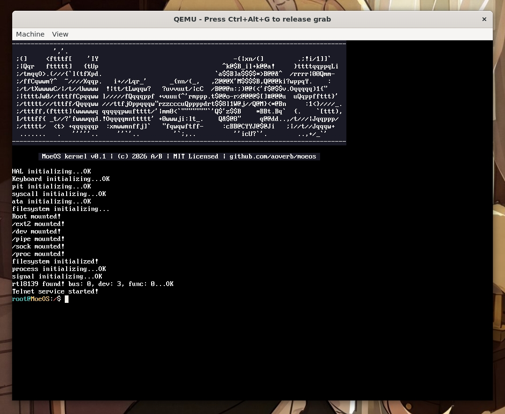
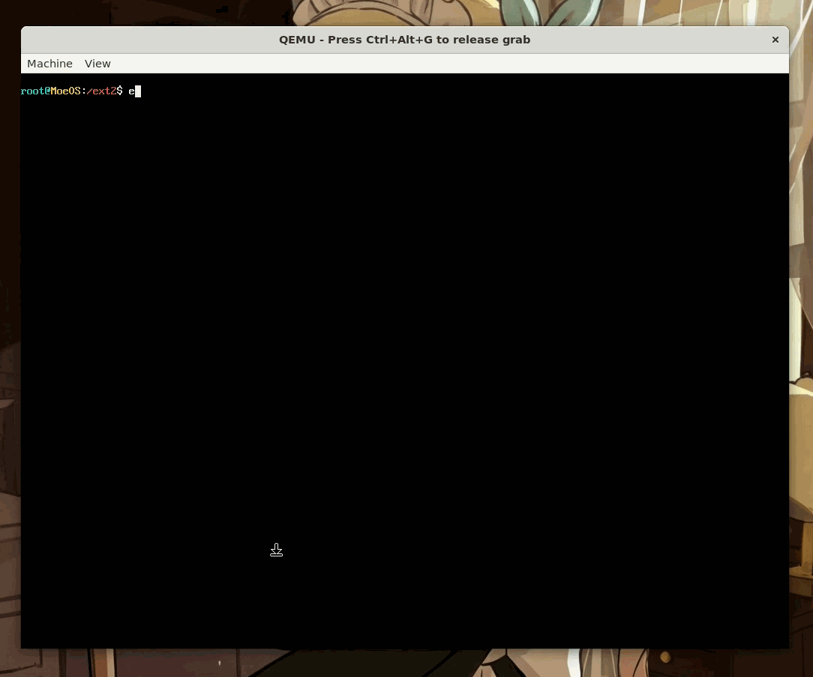
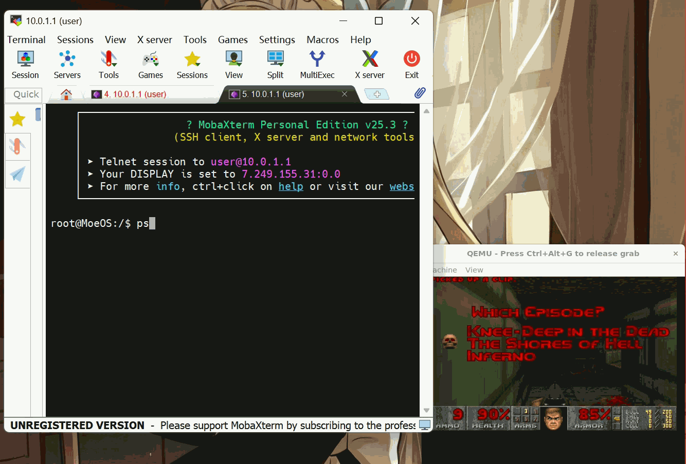
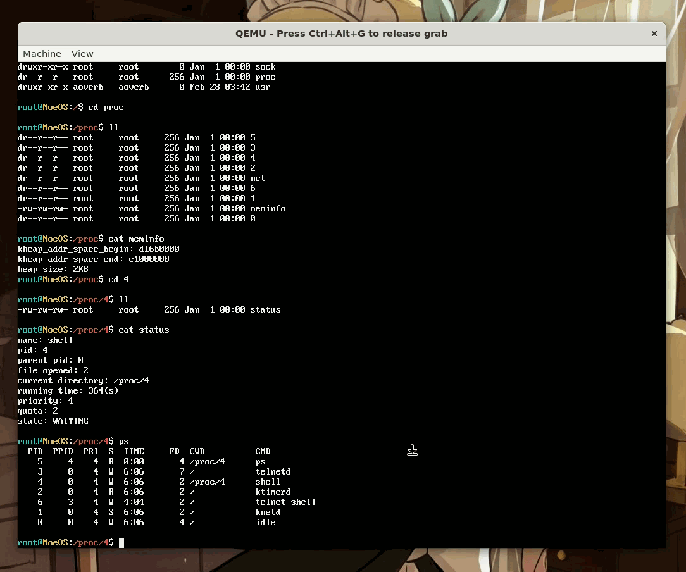

<p align="center">
  
</p>


<h1 align="center">MoeOS</h1>

<p align="center">
  <b>M</b>inimal <b>O</b>pen <b>E</b>xperimental <b>O</b>perating <b>S</b>ystem
</p>

<p align="center">
  A 32-bit hobby operating system built from scratch in C++.
</p>

---

MoeOS 是一个从零开始[^1]构建的教学型操作系统（Hobby OS）项目，使用 C++ 实现，目标是深入理解操作系统的核心原理并将其逐一付诸实践。

### 已实现特性

**内核基础设施**
- 高半区内核（Higher-Half Kernel）
- 物理内存管理器（PMM）、虚拟内存管理器（VMM）、内核堆分配器
- 基于 MLFQ（多级反馈队列）算法的进程调度器
- ELF 可执行文件解析与加载
- 信号（Signals）、管道（Pipes）
- 基础系统调用接口

**驱动程序**
- PS/2 键盘驱动
- PIT 定时器驱动
- RTL8139 网卡驱动
- ATA 块设备驱动
- 图形帧缓冲区（Framebuffer）

**文件系统**
- VFS（虚拟文件系统）抽象层
- Ext2 文件系统读写支持
- TARFS、DevFS、ProcFS、SockFS

**网络**
- 基础 TCP/IP 协议栈
- Telnet 协议支持

**用户态**
- 用户态进程与基础 Libc
- 控制台设备文件化，VT100 终端状态机
- Kilo 文本编辑器移植
- ...And it runs DOOM!

<p align="center">
  
</p>

### 制作记录

整个开发过程通过录屏和 Markdown 笔记进行了完整记录，相关资源正在持续整理中：

- [博客](http://moe.cm/) — 技术笔记与开发日志[^2]
- [GitHub 仓库](https://github.com/aoverb/lolios/tree/main/notes) — 原始开发笔记[^2]
- [Bilibili 主页](https://space.bilibili.com/1506917) — 开发实录与技术讲解视频[^3]

### 截图

#### 启动界面

<p align="center">
  
</p>


#### 管道与文件操作演示

<p align="center">
  
</p>

#### Telnet、进程列表、通过信号杀死进程

<p align="center">
  
</p>

#### ProcFS与PS演示

<p align="center">
  
</p>

#### netstat演示

<p align="center">
  
</p>

### 构建与运行

#### 前置依赖

- `i686-elf` 交叉编译工具链（`i686-elf-gcc`、`i686-elf-g++`、`i686-elf-as`）
- GNU Make
- GRUB 工具（`grub-mkrescue`）及其依赖 `xorriso`
- QEMU（`qemu-system-i386`）

在 Ubuntu/Debian 上安装除交叉编译器以外的依赖：

```bash
sudo apt install qemu-system-x86 grub-pc-bin xorriso make
```

交叉编译器需要手动构建，具体步骤请参考 [OSDev Wiki: GCC Cross-Compiler](https://wiki.osdev.org/GCC_Cross-Compiler)。

#### 构建

```bash
git clone https://github.com/aoverb/moeos.git
cd moeos
./build.sh
```

`build.sh` 将依次执行以下步骤：

1. 编译 Libc（安装头文件与静态库至 `SYSROOT/`）
2. 编译用户态程序（安装至 `SYSROOT/usr/bin/`）
3. 编译内核（生成 `kernel/moeos.kernel`）
4. 将 `SYSROOT` 打包为 ustar 格式的 `sysroot.tar`，作为 GRUB 模块加载
5. 通过 `grub-mkrescue` 生成可引导的 ISO 镜像

#### 运行

构建完成后，`build.sh` 会自动通过 QEMU 启动系统。如需手动运行：

```bash
qemu-system-i386 -cdrom moeos.iso -drive file=disk.img,format=raw \
    -netdev tap,id=net0,ifname=tap0,script=no,downscript=no \
    -device rtl8139,netdev=net0,mac=CA:FE:BA:BE:13:37
```

#### 网络配置（可选）

MoeOS 使用 TAP 网络接口与宿主机通信。如需启用网络功能，需要预先创建 TAP 设备：

```bash
sudo ip tuntap add dev tap0 mode tap user $(whoami)
sudo ip addr add 10.0.1.0/24 dev tap0
sudo ip link set tap0 up
```

#### 磁盘镜像（可选）

Ext2 文件系统需要一个磁盘镜像。可使用以下命令创建：

```bash
dd if=/dev/zero of=disk.img bs=1M count=32
mkfs.ext2 disk.img
```

如不需要持久化存储功能，可在 QEMU 启动参数中移除 `-drive` 选项。

### ⚠️ 注意事项

MoeOS 是一个面向学习的实验性项目，所有硬件交互均基于 QEMU 模拟环境开发与测试，**未在任何真实硬件上验证过**。请勿在物理机上运行本系统，否则可能造成硬件损坏或数据丢失。

### Acknowledgments

This project makes use of the following third-party software:

- **[GNU GRUB](https://www.gnu.org/software/grub/)** — GRand Unified Bootloader, used as an external tool.
  Licensed under the [GNU General Public License v3.0 or later](https://www.gnu.org/licenses/gpl-3.0.html).
  Copyright © Free Software Foundation, Inc.

- **[doomgeneric](https://github.com/ozkl/doomgeneric)** — An easily portable version of DOOM, based on the original id Software source release.
  Licensed under the [GNU General Public License v2.0](https://www.gnu.org/licenses/old-licenses/gpl-2.0.html).
  Original game © id Software. Port by ozkl.

- **[QR-Code-generator](https://github.com/nayuki/QR-Code-generator)** — High-quality QR Code generator library by Project Nayuki.
  Licensed under the [MIT License](https://opensource.org/licenses/MIT).
  Copyright © Project Nayuki.

- **[Kilo](https://github.com/antirez/kilo)** — A small text editor in less than 1000 LOC by Salvatore Sanfilippo (antirez).
  Licensed under the [BSD 2-Clause License](https://opensource.org/licenses/BSD-2-Clause).
  Copyright © 2016 Salvatore Sanfilippo.

---

[^1]: 某种意义上的"从零开始"——Bootloader（GRUB）被视为既有的基础设施，项目的重心在于内核及其上层的全部实现。
[^2]: 正在整理中。
[^3]: 开发过程的录屏剪辑与阶段性技术复盘将陆续发布于此，涵盖从内核引导、驱动开发到网络栈与文件系统实现的各个里程碑。