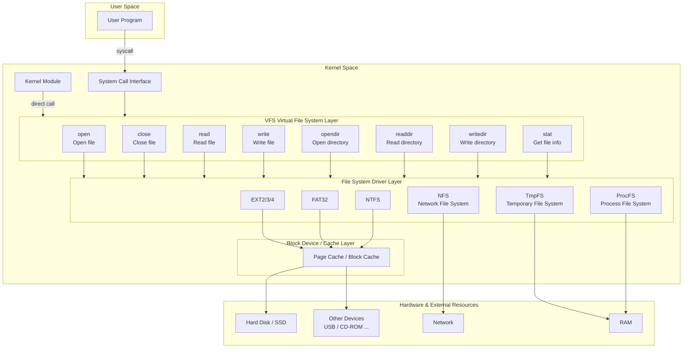

## Homemade OS (15): Virtual File System

In the previous chapter, we implemented the packaging, compilation, and loading of user-mode programs, improved system calls and the libc library and crt0, and migrated the shell to user space. Today, we're going to do something even more exciting: implement a file system based on ustar!

But first, let's solve some leftover issues...

### Tidying Up Loose Ends

There are some TODO items that have been pending for too long. If left unresolved, they'll become increasingly difficult to fix later. Let's tackle them now.

#### Low Address Resource Remapping and Cleanup

Some data left over from our MBI and PMM initialization has been occupying the low address region. It's time to decide their fate.

MBI data is only used during early kernel boot, so we can simply clear it. But the PMM records need to be remapped.

#### PMM Reserve GRUB Module Area

We actually missed something when implementing GRUB module loading earlier — we didn't mark the loaded addresses as reserved memory in the PMM. This time, we'll not only reserve this memory but also copy it out and map it to kernel addresses, freeing up the low address space:

```cpp
void save_module(multiboot_info_t* mbi, saved_module*& saved, uint32_t& mod_count) {
    mod_count = 0;
    saved = nullptr;
    if (mbi->flags & (1 << 3)) {
        multiboot_module_t* mods = (multiboot_module_t*)mbi->mods_addr;
        mod_count = mbi->mods_count;
        saved = (saved_module*)kmalloc(sizeof(saved_module) * mod_count);
        for (uint32_t i = 0; i < mod_count; i++) {
            saved[i].size = mods[i].mod_end - mods[i].mod_start;
            saved[i].data = kmalloc(saved[i].size);
            memcpy(saved[i].data, (void*)mods[i].mod_start, saved[i].size);
        }
    }
}
```

#### PMM Early Allocation Migration

```cpp
void pmm_migrate_to_high() {
    uint32_t total_size = page_limit * sizeof(page_frame);

    // 1. Allocate new space in high address
    page_frame* new_all_pages = (page_frame*)kmalloc(total_size);

    // 2. Copy data
    memcpy(new_all_pages, all_pages, total_size);

    // 3. Calculate offset, fix pointers
    intptr_t delta = (intptr_t)new_all_pages - (intptr_t)all_pages;

    for (uint32_t i = 0; i < page_limit; i++) {
        if (new_all_pages[i].next)
            new_all_pages[i].next = (page_frame*)((uintptr_t)new_all_pages[i].next + delta);
        if (new_all_pages[i].prev)
            new_all_pages[i].prev = (page_frame*)((uintptr_t)new_all_pages[i].prev + delta);
    }

    for (uint32_t i = 0; i < MAX_ORDER; i++) {
        if (free_area[i])
            free_area[i] = (page_frame*)((uintptr_t)free_area[i] + delta);
    }

    // 4. Switch
    page_frame* old_all_pages = all_pages;
    all_pages = new_all_pages;

    // Don't reclaim old physical pages, just ignore them
}
```

Our `all_pages` initially borrowed a portion of PMM's available addresses to record available pages, with pointers hanging off `free_area`. Since `all_pages` is essentially an array, we allocate a contiguous block in the high address region, copy the data over, and update all recorded addresses by adding the offset. As for the small block of physical addresses initially borrowed, since the reclamation logic is complex (lazy), we'll just ignore it.

#### Kernel Global Constructor Invocation

Our kernel hasn't been calling the `_init` global constructor function provided by crt. This hasn't been a problem because we haven't needed global constructors. But we should fix this.

To call this function, we need to follow the exact linking order:

`crti crtbegin our .o files (including lib) crtend crtn`

This is because `crtbegin` inserts code to call the `.ctor` section, and `crtend` declares a sentinel marking the end of the `.ctor` section. Our global constructors are also placed in the `.ctor` section and are traversed by the `_init` function. If we splice anything after the `.ctor` sentinel, `_init` won't call our constructors. These two files are platform-independent and provided by the compiler. As for `crti` and `crtn`, they are platform-dependent (depending on how you pass arguments and where you place the return address). They define the function's prologue (handling parameter stack frames) and epilogue (ret), and are part of the `_init` function, so we need to implement them ourselves. But it's simple.

`crti.s`:

```assembly
.section .init
.global _init
_init:
    push %ebp
    mov %esp, %ebp
    /* gcc inserts constructor calls in between */

.section .fini
.global _fini
_fini:
    push %ebp
    mov %esp, %ebp
```

`crtn.s`:

```assembly
.section .init
    pop %ebp
    ret

.section .fini
    pop %ebp
    ret
```

Some might ask: what about crt0? Well, our earlier `boot.s` essentially serves as crt0. But we do need to call the global constructor `_init` function before `call kernel_main` in `_start`:

```assembly
_tokernelmain:
    mov $stack_top, %esp
    push %ebx
    call _init
    call kernel_main
```

Of course, we need to include the new sections in the linker script. There are many unfamiliar sections here, so I called Claude to generate them:

```
...
    .text ALIGN(4K) : AT(ADDR(.text) - 0xC0000000)
    {
        *(.text)
    }

    .init ALIGN(4K) : AT(ADDR(.init) - 0xC0000000)
    {
        *(.init)
    }

    .fini ALIGN(4K) : AT(ADDR(.fini) - 0xC0000000)
    {
        *(.fini)
    }

    .init_array ALIGN(4K) : AT(ADDR(.init_array) - 0xC0000000)
    {
        __init_array_start = .;
        *(.init_array)
        *(SORT(.init_array.*))
        __init_array_end = .;
    }

    .fini_array ALIGN(4K) : AT(ADDR(.fini_array) - 0xC0000000)
    {
        __fini_array_start = .;
        *(.fini_array)
        *(SORT(.fini_array.*))
        __fini_array_end = .;
    }

    .rodata ALIGN(4K) : AT(ADDR(.rodata) - 0xC0000000)
    {
        *(.rodata)
    }
...
```

### File System

A file system is a system for managing and organizing files on a storage device. "Managing" means you can freely put things in or take things out (think of your room — you have the power and ability to freely control everything in it). "Organizing" means the files are arranged on the storage device in a certain way (think of your just-cleaned room — you can easily find things; now think of your messy room — you spend a lot of time searching for items).

#### Drivers

Different devices are suitable for different file systems. Imagine if your room had 50 floors — you'd definitely keep things you frequently use together on the same floor to reduce time going up and down. At that point, you'd be like the driver for that file system, because you know how to manage that room. If someone else came in, they might not even find the stairs... And your room could be even stranger — like a sushi conveyor belt, a treadmill, a vending machine... But you've lived in this room for a long time, so you've developed the ability to handle this complex room.

#### VFS

Sometimes your mom asks you to tidy up — that's a concrete call to the specific file system interface. If you have siblings who are each good at managing their own rooms (whatever form they take), and one day your dad wants all of you to clean your rooms but doesn't know how to communicate with each of you, he can go to your mom, because your mom knows how to communicate with each person to get them to clean their rooms. So we have: dad (the caller seeking help from mom), mom (the VFS that knows how to call the driver), and us and our siblings (various difficult and tricky file system drivers). I hope I've explained this vividly enough :D

#### Architecture

Here's a diagram of the file system architecture:



This diagram has many elements, but the main point I want to convey is simple: a user or kernel program can easily open a file by just calling an interface with a path name. All the dirty work is handled by the VFS (Virtual File System) layer.

Think about how we interact with various storage devices daily: hard drives, USB drives, CDs, cloud storage. Whether we're opening, reading, writing, deleting files, or listing directories, we don't actually care about how files are organized on the device. (Consider: do you ever wonder how files are organized on a storage device? I, at most, was curious about why CDs are read-only, and eventually just concluded it's because lasers burn irreversible pits on the disc surface — a limitation of the storage medium rather than the software layer...)

But sorry — from now on, **we** are the VFS layer. We need to think from the VFS layer's (mom's) perspective. Before that, let's talk about the concept of **mounting**.

#### Mounting

Mounting is like your family winning the lottery and moving to a huge empty lot. You decide to build houses from scratch with your children (remember, you're the mom). Everyone has their own belongings (and their own unique ways of organizing things in their heads). Of course, you can't survive on an empty lot — there's no infrastructure! So you come up with a plan: build a house for each child. The houses can take any creative form (as long as it's convenient for the children to manage them — the nice thing is your children are obedient and will perform whatever operations you want on their rooms). So your three children build four houses, named C:, D:, E:, and F::


You look at their houses and still find them strange, but you don't care — the children have their own world. You only need to focus on the children themselves.

All our houses are built at the ground level, just like Windows mounts all disks at the top level of the directory tree. This is one way of mounting:

For example, `C:/`, `D:/`, `E:/` — these are mount points for different storage devices. This is quite intuitive. When you need to get the file `D:/aa/bb/cc`, you just look at the first character of the path to know which mount point it belongs to and which child to ask to retrieve it.

There's another mounting method used by Linux, where houses are built inside houses. Like `/mnt/c`, `/mnt/c/aa/bb`, `/mnt/c/aa/bb/cc/d`. If I told you these three paths are mount points and asked you who to ask for `/mnt/c/aa/bb/dd`, you'd probably be lost. There's a principle here: we match all mount points against the path as prefixes, checking if the mount point is part of the path. The longest match is the file's corresponding mount point. In the example above, `/mnt/c/aa/bb` is the longest match, so we directly ask the driver (child) corresponding to this mount point (house) for the file `dd` inside the house at mount point `/mnt/c/aa/bb`.

You might wonder: don't we need to go into the `/mnt/c` house (directory) first to get `/mnt/c/aa/bb/dd`? Actually, no — because we know which specific child (driver) `/mnt/c/aa/bb/` belongs to, we can go directly to them. And we don't need to tell them `/mnt/c/aa/bb/` — the house is already built; they only care about the files inside.

After this (hopefully entertaining) introduction, let's look at the code:

```cpp
mounting_point* get_mounting_point(const char* path) {
    mounting_point* best = nullptr;
    uint32_t best_len = 0;

    for (uint32_t i = 0; i < mount_num; i++) {
        const char* mp_path = mount_list[i]->mount_path;
        uint32_t mp_len = strlen(mp_path);

        // Check if path starts with this mount path as prefix
        if (strncmp(path, mp_path, mp_len) == 0) {
            // Ensure it's a complete path boundary match
            // e.g., mount point "/mnt" should not match "/mnt2/file"
            if (mp_len == 1 && mp_path[0] == '/') {
                // Root mount point "/" matches everything
            } else if (path[mp_len] == '/' || path[mp_len] == '\0') {
                // Valid boundary
            } else {
                continue;
            }

            if (mp_len > best_len) {
                best_len = mp_len;
                best = mount_list[i];
            }
        }
    }

    return best;
}
```

This is the algorithm for finding the actual mount point for a file by finding the longest prefix match.

```cpp
typedef struct mounting_point {
	uint32_t index;
    FS_DRIVER driver;
    char mount_path[MAX_PATH_LEN];
    fs_operation* operations;
    void* data;
} mounting_point;
```

This is the structure describing a mount point. `index` is its position in the mount point array, `driver` is the driver managing this mount point (the child), `mount_path` is where this mount point is attached, `operations` is the set of operations that can be performed on the file system at this mount point, and `data` is storage-related data that you don't need to understand — leave it to the driver to parse.

```cpp
struct fs_operation {
    int (*mount)(mounting_point* mp);
    int (*unmount)(mounting_point* mp);
    int (*open)(mounting_point* mp, const char* path, uint8_t mode);
    int (*close)(mounting_point* mp, uint32_t handle_id);
    int (*read)(mounting_point* mp, uint32_t handle_id, char* buffer, uint32_t size);
    int (*write)(mounting_point* mp, uint32_t handle_id, const char* buffer, uint32_t size);
    int (*opendir)(mounting_point* mp, const char* path);
    int (*readdir)(mounting_point* mp, uint32_t handle_id, dirent* out);
    int (*closedir)(mounting_point* mp, uint32_t handle_id);
    int (*stat)(mounting_point* mp, const char* path, file_stat* out);
};
```

`fs_operation` contains a series of function pointers representing the file operation functions for this file system driver. You can define your own operations, as long as your driver implements them and passes the corresponding interface.

So, to perform an operation on a file, the general process is:

1. Determine the file's mount point.
2. After finding the mount point, strip the path prefix to get the actual path within that file system.
3. Use the operations from the mount point, passing the prepared path and mount point information to the driver.

Mounting is about preparing a mount point, recording the mount path for later matching, finding and storing the operations, storing the raw data the driver needs to parse, and calling the driver's mount function. The driver handles the rest.

```cpp
int v_mount(FS_DRIVER driver, const char* mount_path, void* device_data) {
    mount_list[mount_num] = reinterpret_cast<mounting_point*>(kmalloc(sizeof(mounting_point)));
    mount_list[mount_num]->operations = get_fs_operation(driver);
    mount_list[mount_num]->index = mount_num;
    mount_list[mount_num]->driver = driver;
    mount_list[mount_num]->data = device_data;
    strcpy(mount_list[mount_num]->mount_path, mount_path);
    if (!mount_list[mount_num]->operations ||
        mount_list[mount_num]->operations->mount(mount_list[mount_num]) != 0) {
        kfree(mount_list[mount_num]);
        mount_list[mount_num] = nullptr;
        return -1;
    }
    
    return mount_num++;
}
```

- `mounting_point`: Represents a file system mount point
- One driver can correspond to multiple mount points. Drivers should be stateless; mount points are stateful. Drivers manage and update the state of mount points.
- VFS receives a special data structure during mounting, which is passed through to the driver's mount function for parsing. VFS doesn't care about its meaning.

#### Unmounting

```cpp
int v_unmount(const char* mount_path) {
    for (uint32_t i = 0; i < mount_num; i++) {
        if (strcmp(mount_list[i]->mount_path, mount_path) == 0) { // Exact match
            int ret = mount_list[i]->operations->unmount(mount_list[i]);
            if (ret == 0) {
                kfree(mount_list[i]);
                mount_list[i] = nullptr;
            }
            return ret;
        }
    }
    return -1;
}
```

Unmounting essentially clears the information described above and calls the driver's unmount function to complete the remaining operations.

#### Opening a File

Opening a file obtains a handle (an identifier pointing to a data structure that records the current state of file access):

```cpp
int alloc_fd(PCB* proc) {
    for (int i = 0; i < MAX_FD_NUM; i++) {
        if (!proc->fd[i].mp) return i;
    }
    return -1;
}

int v_open(PCB* proc, const char* path, uint8_t mode) {
    mounting_point* mp = get_mounting_point(path);
    if (!mp) return -1;
    uint32_t handle_id = mp->operations->open(mp, get_mounting_relative_path(mp, path), mode);
    if (handle_id == -1) return -1;
    
    int fd_id = alloc_fd(proc);
    if (fd_id == -1) {
        mp->operations->close(mp, handle_id);
        return -1;
    }
    file_description& fd = proc->fd[fd_id];
    strcpy(fd.path, path);
    fd.handle_id = handle_id;
    fd.mp = mp;
    proc->fd_num++;
    return fd_id;
}
```

"Who" are "you"? You are a process. So this identifier needs to be recorded in your PCB's array, and you need to know which file system this identifier belongs to.

Later, you can use this identifier to read and write files:

```cpp
int v_read(PCB* proc, int fd, char* buffer, uint32_t size) {
    if (fd < 0 || fd >= MAX_FD_NUM) return -1;
    mounting_point* mp = proc->fd[fd].mp;
    if (!mp) return -1;
    return mp->operations->read(mp, proc->fd[fd].handle_id, buffer, size);
}

int v_write(PCB* proc, int fd, const char* buffer, uint32_t size) {
    if (fd < 0 || fd >= MAX_FD_NUM) return -1;
    mounting_point* mp = proc->fd[fd].mp;
    if (!mp) return -1;
    return mp->operations->write(mp, proc->fd[fd].handle_id, buffer, size);
}
```

Essentially just doing some validation and delegating the operation to the driver.

```
Warning: Lazy alert
```

---

### Summary

I'm so tired! Implemented VFS! In the next chapter, we'll introduce tarfs and implement our file system based on it.
