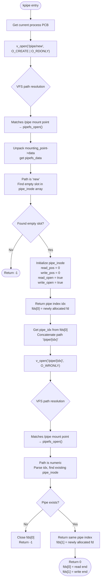

## Homemade Operating System (19): IPC (Inter-Process Communication)

In this section, we'll implement two types of IPC: pipes and signals.

### Pipes

The principle of pipes: a pipe can be seen as a file. From the outside, it's essentially multiple processes opening the same file, so they all hold either the read end or the write end of this file as file descriptors — some read from it, some write to it, or some hold both.

For the internal implementation, the storage form is a circular buffer, along with a lock for pipe access, and reference counts for the read and write ends.

So to implement pipes, we need to:

1. Implement a `pipe` function that returns two file descriptors pointing to the same file representing the pipe;
2. The file descriptor records whether it's the read end or write end, and that the current file type is a pipe;
3. When the file is empty, if a read end tries to read, we need to put the current process into the file's read waiting queue until the write end writes data. Similarly, if the file is full, the process needs to be put into the write waiting queue until there's enough space to write;
4. Regardless of reading or writing, only one process can access the pipe at a time — the read-write lock is unified;
5. The file needs two reference counts to track the current number of read ends and write ends.

### Refactoring VFS and TARFS: Global File Array

Our current fd structure looks like this:

```cpp
struct file_description {
    mounting_point* mp;
    char path[256];
    uint32_t handle_id;
};
```

But pipes need to record file reference counts and add locking for files (actually, all files need this... we were lazy and didn't do it). So we need to add two recording fields:

```c++
    spinlock lock;
    uint32_t readcnt;
    uint32_t writecnt;
```

However, these fields should be bound to the file itself, not to the handle accessing the file (otherwise recording these fields would be meaningless — they need to be shared by all processes opening the file). What if we keep `handle_id` in the `file_handle` which stores the file's raw data?

```cpp
struct file_handle {
    uint32_t inode_no;
    uint32_t offset;
    uint32_t mode;
    uint8_t type;
    uint8_t valid;
};
```

That won't work either — this handle records a single process's access state to a file, so it still can't be shared.


Looking at this, we can see that our previous design had two flaws:

1. We didn't realize that file state is divided into two parts: one part is shared by all processes (lock, read/write counts), and the other part is the handle owned by each process;
2. We placed the management of file handles in the specific driver implementation layer (tarfs in this case), when it should be in the VFS.

Therefore, what we need to do is place the definition and handling of file state in the VFS layer, and add the above public fields to `file_handle`.

To do this, we should unify all file handles into a single array for management — this array becomes our global file array.

```cpp
typedef struct {
    mounting_point* mp;
    uint32_t inode_id;
    uint32_t offset;
    uint32_t mode;
    uint32_t handle_id;
    uint32_t refcnt;
} file_description;
```

Note that for naming consistency, we renamed `file_handle` to `file_description`. Also, in preparation for future `dup` and `fork` (possibly), I also provided a reference count `refcnt`.

The shared file state can be recorded directly in `tar_inode`:

```cpp
struct tar_inode {
    spinlock lock;
    uint32_t readcnt;
    uint32_t writecnt;
    tar_block* block = nullptr;
    std::unordered_map<std::string, inode_id> child_inodes;
};
```

...Actually, I didn't modify `tar_inode`. Instead, I added a global lock to the `tarfs_data` structure:

```cpp
struct tarfs_data {
    void* tar_addr;
    uint32_t tar_size;
    tar_inode* inodes[MAX_INODE_NUM]; 
    uint32_t inode_cnt;
    spinlock lock;
};
```

When we get to implementing pipes, we can add these fields to the inode.

### Console Device File

But before implementing pipes, we need to implement the console device file first (what a hassle!).

The purpose of this is to create the standard input and output file descriptors, so we can later redirect them using pipes.

Read/write test successful!


Now our console has become a device file that can be read and written arbitrarily!

Now, let's make processes open standard input/output by default:


Good news: it works! Bad news: the formatting is off...

```cpp
static int console_read(char* buffer, uint32_t offset, uint32_t size) {
    uint32_t i = 0;
    while (i < size - 1) {
        while (!keyboard_haschar())
            asm volatile("pause");
        char c = keyboard_getchar();

        if (c == '\b') {
            if (i == 0) continue;
            --i;
            terminal_write("\b", 1);   // echo backspace
            continue;
        }

        if (c == '\n') {
            buffer[i++] = '\n';
            terminal_write("\n", 1);   // echo newline
            break;
        }

        if (c >= 32 && c <= 126) {
            buffer[i++] = c;
            terminal_write(&c, 1);     // echo visible characters
        }
    }
    return i;
}
```

The problem of no echo on input: solved at the dev driver level; also `getline` can't just read data, it also needs to recognize newlines, clear non-displayed characters, etc.;

```cpp
void getline(char* buf, uint32_t size) {
#if defined(__is_libk)
    keyboard_flush();
    uint32_t i = 0;

    while (i < size - 1) {
        while (!keyboard_haschar()) {
            asm volatile("pause"); 
        }

        char c = keyboard_getchar();

        if (c == '\b') {
            if (i == 0) continue;
            --i;
            printf("\b");
            continue;
        }

        if (c == '\n') {
            buf[i] = '\0';
            printf("\n");
            return;
        }

        if (c >= 32 && c <= 126) {
            buf[i++] = c;
            printf("%c", c);
        }
    }

    buf[i] = '\0';
#else
    int n = read(0, buf, size - 1);
    if (n < 0) n = 0;
    if (n > 0 && buf[n - 1] == '\n') n--;
    buf[n] = '\0';
#endif
```

The standard output issue was because the length wasn't calculated correctly when writing a single character. Writing it like below fixed it.

```cpp
int putchar(int ic) {
#if defined(__is_libk)
	char c = (char) ic;
	terminal_write(&c, sizeof(c));
#else
	char c = (char) ic;
	char s[2];
	s[0] = c;
	s[1] = '\0';
	write(1, s, 1);
#endif
	return ic;
}
```


Beautiful! Now, we can finally start writing pipes!

### Implementing PipeFS

This is a bit tricky to write. I decided to implement it top-down.

First, use AI to write a shell that supports pipes. Looking at it, the main changes are adding two parameters to our original `exec`, and using a new `pipe` function. Let's compile:


#### Top-level exec Stubbing

First, add parameters to `exec` as a stub, then we'll adapt the function signature and parameter passing:

```cpp
int exec(void* code, uint32_t code_size, int argc, char** argv,
    fd_remap* remaps = nullptr, int remap_cnt = 0);
```


This time even `syscall5` isn't enough.


We've used all six registers.

```cpp
pid_t exec(void* code, uint32_t code_size, uint8_t priority, int argc, char** argv,
    fd_remap* remaps, int remap_cnt) {
    if (!verify_elf(code, code_size)) {
        return 0;
    }
```

#### Top-level pipe Stubbing


Let's implement a `pipe`:

```cpp
static int pipe(int fds[2]) {
    return syscall1((uint32_t)SYSCALL::PIPE, (uint32_t)fds);
}
...
// PIPE(ebx = fds[2])
int sys_pipe(interrupt_frame* reg) {
    int* fds = reinterpret_cast<int*>(reg->ebx);
    return kpipe(fds);
}
```


After stubbing, at least our program can run.

### kpipe

Creating a pipe. The logic is to create two descriptors pointing to the same `pipe_entry`. We embed the pipe data structure directly inside `file_description` (it's not large):

```cpp
struct pipe_entry {
...haven't figured out what to write yet
};

typedef struct {
    mounting_point* mp;
    uint32_t inode_id;
    uint32_t offset;
    uint32_t mode;
    uint32_t handle_id;
    uint32_t refcnt;
    char path[255];

    uint8_t is_pipe;
    uint8_t is_read;
    pipe_entry* pipe;
} file_description;
```

Then there's our `kpipe`, which is quite ugly... I suggest jumping straight to the end.

```cpp
int kpipe(int fds[2]) {
    SpinlockGuard guard(process_list_lock);
    PCB* proc = process_list[cur_process_id];
    SpinlockGuard guard_pcb(proc->plock);
    int read_fd = alloc_fd_for_proc(proc);
    if (read_fd == -1) {
        return -1;
    }
    proc->fd[read_fd] = (file_description*)kmalloc(sizeof(file_description));
    proc->fd_num++;
    int write_fd = alloc_fd_for_proc(proc);
    if (write_fd == -1) {
        kfree(proc->fd[read_fd]);
        proc->fd_num--;
        return -1;
    }
    proc->fd[write_fd] = (file_description*)kmalloc(sizeof(file_description));
    proc->fd_num++;

    int read_handle_id = get_empty_handle();
    if (read_handle_id == -1) {
        kfree(proc->fd[read_fd]);
        kfree(proc->fd[write_fd]);
        proc->fd_num--;
        proc->fd_num--;
        return -1;
    }
    file_handle[read_handle_id] = proc->fd[read_fd];
    file_handle_num++;

    int write_handle_id = get_empty_handle();
    if (write_handle_id == -1) {
        kfree(proc->fd[read_fd]);
        kfree(proc->fd[write_fd]);
        proc->fd_num--;
        proc->fd_num--;
        file_handle[read_handle_id] = nullptr;
        file_handle_num--;
        return -1;
    }
    file_handle[write_handle_id] = proc->fd[write_fd];
    file_handle_num++;
    // ...such dumb code
    file_description*& read_handle = proc->fd[read_fd];
    file_description*& write_handle = proc->fd[write_fd];

    read_handle->handle_id = read_handle_id;
    write_handle->handle_id = write_handle_id;
    read_handle->is_pipe = 1;
    write_handle->is_pipe = 1;
    read_handle->is_read = 1;
    write_handle->is_read = 0;

    read_handle->pipe = write_handle->pipe = (pipe_entry*)kmalloc(sizeof(pipe_entry));

    fds[0] = read_fd;
    fds[1] = write_fd;
    return 0;
}
```

Claude suggested we could implement it simply by coupling pipe logic into `file_description`, making `kpipe` tied to VFS. But that's too crude — we shouldn't do that. Our `kpipe` should use VFS to create pipes and access our PipeFS through VFS. The PipeFS internally implements pipe-related logic. Through VFS, we can operate on pipes. So, we should extract this into a separate PipeFS.



With this approach, our `kpipe` becomes:

```cpp
int kpipe(int fds[2]) {
    PCB* proc = process_list[cur_process_id];

    fds[0] = v_open(proc, "/pipe/new", O_CREATE | O_RDONLY);
    if (fds[0] < 0) return -1;

    int pipe_idx = proc->fd[fds[0]]->inode_id;
    char path[32];
    sprintf(path, "/pipe/%d", pipe_idx);
    fds[1] = v_open(proc, path, O_WRONLY);
    if (fds[1] < 0) {
        v_close(proc, fds[0]);
        return -1;
    }
    return 0;
}
```

Much cleaner! With that done, let's look at how to implement PipeFS:

#### exec Adaptation

The exec adaptation logic is essentially replacing the child process's specified fd with the parent process's fd. However, `remaps` is in user space, so we need to copy it to kernel space first.

#### Final Result


Ah, I see: my program doesn't automatically release handles on exit...

Actually, that's not it — I forgot to change the function signature...


With that, we've successfully implemented pipes top-down!

---

I originally wanted to work on signals, but I'm exhausted from the pipes;

I originally wanted to work on ProcFS, but I've been doing too much FS work lately and I'm getting a bit tired of it.

The next section (Chapter 20) will be something different. Next time, we'll start exploring the network stack, write a network card driver, and implement the `/dev/nic` device file!
