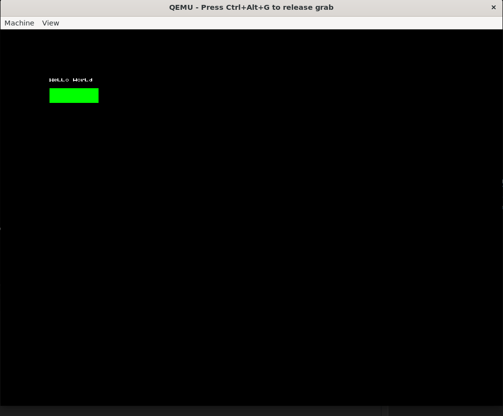
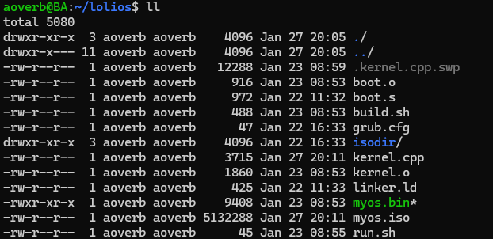
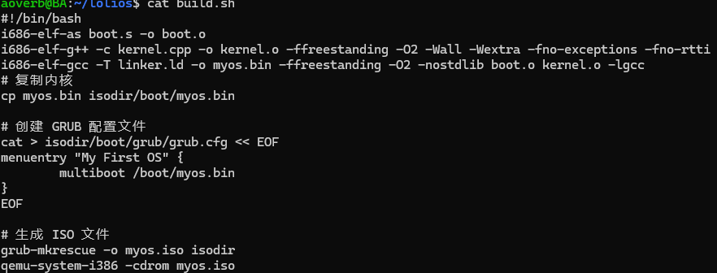
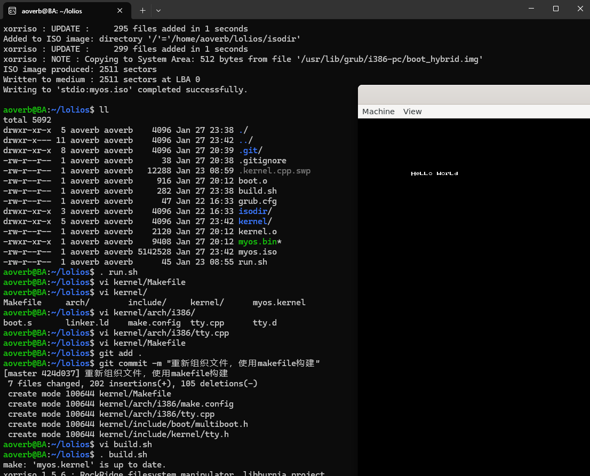

## 自制操作系统（2）：从Bare bone到Meaty skeleton（上）

在上一节，我们利用GRUB来实现了引导程序，并成功在屏幕上输出了Hello world。



虽然代码是用AI写的，但是我们已经把比较繁琐的编译环境配置这项搞定了！~可喜可贺。

可是瞅一眼我们的配置目录，我们会发现这里面堆放的文件很杂乱。



我们应该用某种规则来重新组织下我们的文件，虽然现在的文件不多，但是随着我们逐步完善操作系统，文件数量肯定会越来越多，因此我们要提前做好规划。我们不妨用下面的方式来组织我们的文件：

##  目标结构：Meaty Skeleton 的“四大支柱”

我们要将项目拆分为四个核心逻辑区域。这种结构模仿了类 Unix 系统的组织方式：

| **目录名**     | **身份**       | **职责**                                            |
| -------------- | -------------- | --------------------------------------------------- |
| **`kernel/`**  | **内核心脏**   | 存放所有运行在内核态的代码。                        |
| **`libc/`**    | **通用工具**   | 存放内核和用户态通用的标准函数（如 `string.h`）。   |
| **`include/`** | **全局契约**   | 公共头文件，定义内核与外部的接口。                  |
| **`arch/`**    | **硬件翻译官** | 专门存放与具体 CPU 架构（如 i386, ARM）相关的代码。 |


## 大迁徙

现在，我们要把 Bare Bones 的零件拆散，装进新的骨架里。

### 第一步：安置内核入口

将原先的汇编代码移动到架构目录下，因为它紧紧依赖于 x86 的引导协议。

- **旧位置**：`boot.S`
- **新位置**：`kernel/arch/i386/boot.S`

### 第二步：隔离平台代码

将所有直接操作硬件（比如 VGA 显存）的 C 代码也移入架构目录。

- **旧位置**：`kernel.cpp` 中关于文字输出的部分。
- **新位置**：`kernel/arch/i386/tty.c`

### 第三步：定义内核核心

将平台无关的逻辑留在内核目录。

- **新位置**：`kernel/kernel/kernel.cpp` (这里只写 `kernel_main` 逻辑)。

### 第四步：链接脚本归位

链接脚本描述了内存布局，这是高度依赖架构的。

- **新位置**：`kernel/arch/i386/linker.ld`


以上的步骤，一言以蔽之，我们把架构无关和有关的模块给分开，便于后面管理。

我们用下面的脚本来实现一键迁徙：

```shell
mkdir -p kernel/arch/i386
mkdir -p kernel/kernel
mv boot.s kernel/arch/i386/boot.s
mv kernel.cpp kernel/kernel/kernel.cpp
mv linker.ld kernel/arch/i386/linker.ld
```


### 要点：arch/i386是什么文件夹？

这是我们对应架构具体实现的文件夹。

简单来说，我们现在的arch/i386存放的是i386架构中引导启动系统和VGA输出相关的代码，日后如果我们要迁移到Arm架构，我们则在对应的文件夹实现对应的代码即可，内核的kernel_main并不关心我们是什么架构，调用对应的接口即可。（接口——实现分离）


## 磨刀不误砍柴工：分离显卡驱动

在进行下一步之前，我们除了在文件粒度进行解耦，还要在代码粒度进行解耦。我们现在的文字显示逻辑实际上也是依赖于架构的，因此我们需要把这部分代码分离开。

创建这两个文件：

```
kernel/include/kernel/tty.h
kernel/arch/i386/tty.cpp
```

同样体现的是接口与实现分离。

```cpp
#ifndef _KERNEL_TTY_H
#define _KERNEL_TTY_H

#include <stdint.h>
#include <boot/multiboot.h>

/* 如果是 C++ 环境，告诉编译器这部分按 C 的链接规则处理 */
#ifdef __cplusplus
extern "C" {
#endif

void terminal_initialize(multiboot_info_t* mbi);
void terminal_putpixel(int x, int y, uint32_t color);
void terminal_draw_char(int x, int y, const uint8_t* font_char, uint32_t color);
// 把画矩形的逻辑先去掉，没什么用
#ifdef __cplusplus
}
#endif

#endif
```

tty.cpp则是把原来kernel.cpp的代码实现在内。

另外，我们还需要创建`kernel/include/boot/multiboot.h`，把 `struct multiboot_info_t` 拿出来，因为以后内存管理模块（PMM/VMM）也要用它，不能只给显卡用。

## Makefile

当我们重新组织文件后，新的问题出现了：我们原来的编译脚本没法继续用了！



我们原来的编译脚本太简单了。下一步，我们将引入 **Makefile 自动化体系**，用makefile脚本的力量把这些散落在各处的模块重新串成一个整体。


###  现阶段问题：目录深渊与路径地狱

在 Bare Bones 阶段，你只需要几条像这样的命令：`i686-elf-gcc -c kernel.c ...`。 但现在，你的文件分布是这样的：

- `kernel/arch/i386/boot.S`
- `kernel/arch/i386/tty.c`
- `kernel/kernel/kernel.cpp`

**我们要解决三个核心矛盾：**

1. **查找矛盾**：编译器不知道去哪找不同深度的头文件。
2. **增量矛盾**：我只改了一个 `tty.c`，为什么非要重新编译整个内核？
3. **维护矛盾**：每增加一个功能，我难道都要手动修改编译脚本吗？

要解决这三个矛盾，我们要采用分而治之的思想：

1. 在每个文件夹（结构）下面生成对应的模块文件；
2. 如果结构下面的文件在生成模块之后没有再作更新，我们则不需要重新编译该模块
3. 我们要具备自动扫描项目结构并执行对应生成命令的功能。

而这就是Makefile能为我们带来的。


### 分而治之

我们可以在各个子目录下创建一个makefile，然后在os的根目录用若干脚本来分别保存我们的配置和整体构建逻辑。

------

#### 架构配置 (`kernel/arch/i386/make.config`)

这个文件是“分而治之”的核心。它只负责告诉主 Makefile：在 i386 架构下，多出哪些零件（`.o` 文件）和特殊参数。

**文件：`kernel/arch/i386/make.config`**

Makefile

```makefile
# 定义该架构需要编译的 .o 文件列表
KERNEL_ARCH_OBJS=\
$(ARCHDIR)/boot.o \
$(ARCHDIR)/tty.o
```

------

#### 顶层 Makefile (`kernel/Makefile`)

这是最硬核的部分。它通过“包含”上面的配置文件，实现动态构建。

**文件：`kernel/Makefile`**

```Makefile
# 1. 基础配置
HOSTARCH:=i386
ARCHDIR:=arch/$(HOSTARCH)

# 编译器设置 (假设你已经配置好了 i686-elf-gcc)
CC:=i686-elf-gcc
CXX:=i686-elf-g++
AS = i686-elf-as

# 关键编译参数
# -ffreestanding: 裸机环境，无标准库
# -Iinclude: 告诉编译器，头文件去 kernel/include 目录找，别去系统里找
CFLAGS:=-O2 -g -ffreestanding -Wall -Wextra -Iinclude
CXXFLAGS:=$(CFLAGS) -fno-exceptions -fno-rtti # C++需要禁用异常和RTTI
LDFLAGS:=-ffreestanding -O2 -nostdlib

# 2. 引入架构特有的零件清单
# 这会导入变量 $(KERNEL_ARCH_OBJS)
include $(ARCHDIR)/make.config

# 3. 合并所有零件
# 所有的 .o 文件 = 架构相关的 + 内核核心的
KERNEL_OBJS=\
$(KERNEL_ARCH_OBJS) \
kernel/kernel.o \

# 4. 构建规则

# 目标：最终的内核文件
myos.kernel: $(KERNEL_OBJS) $(ARCHDIR)/linker.ld
        $(CC) -T $(ARCHDIR)/linker.ld -o $@ $(LDFLAGS) $(KERNEL_OBJS) -lgcc

# 自动推导规则：如何从 .c 变成 .o
%.o: %.c
        $(CC) -MD -c $< -o $@ -std=gnu11 $(CFLAGS)

# 自动推导规则：如何从 .cpp 变成 .o
%.o: %.cpp
        $(CXX) -MD -c $< -o $@ -std=gnu++11 $(CXXFLAGS)

# 自动推导规则：如何从 .S 变成 .o
%.o: %.s
        $(AS) --32 -o $@ $<
# 清理
clean:
        rm -f myos.kernel
        rm -f $(KERNEL_OBJS)
        rm -f $(KERNEL_OBJS:.o=.d)
```


### make

这一切都准备好后，我们可以再修改一下build.sh:

```shell
#!/bin/bash
cd kernel
make
cd ..
# 复制内核
cp kernel/myos.kernel isodir/boot/myos.bin

# 创建 GRUB 配置文件
cat > isodir/boot/grub/grub.cfg << EOF
menuentry "My First OS" {
        multiboot /boot/myos.bin
}
EOF

# 生成 ISO 文件
grub-mkrescue -o myos.iso isodir
qemu-system-i386 -cdrom myos.iso
```

然后执行，我们就可以看见构建的过程，并且我们重构后的操作系统也能正常运行了。


