## 自制操作系统（3）：从Bare bone到Meaty skeleton（下）

在上一节，我们重新组织了文件架构，重构了一些代码，并引入了makefile来辅助构建，我们可以用更干净的架构去输出我们的Hello world了。

```cpp
extern "C" void kernel_main(multiboot_info_t* mbi) {
    // 1. 初始化硬件
    terminal_initialize(mbi);

    // 2. 定义颜色
    uint32_t white = 0x00FFFFFF;
    uint32_t green = 0x0000FF00;

    // 3. 业务逻辑：打印字符
    // 现在的代码读起来更像自然语言了
    terminal_draw_char(100, 100, get_font_bitmap('H'), green);
    terminal_draw_char(108, 100, get_font_bitmap('e'), white);
    terminal_draw_char(116, 100, get_font_bitmap('l'), white);
    terminal_draw_char(124, 100, get_font_bitmap('l'), white);
    terminal_draw_char(132, 100, get_font_bitmap('o'), white);
    
    terminal_draw_char(148, 100, get_font_bitmap('W'), green);
    terminal_draw_char(156, 100, get_font_bitmap('o'), white);
    terminal_draw_char(164, 100, get_font_bitmap('r'), white);
    terminal_draw_char(172, 100, get_font_bitmap('l'), white);
    terminal_draw_char(180, 100, get_font_bitmap('d'), white);
}
```


可是看看我们Kernel.cpp的代码...好像还不太对劲？难道每次输出调试信息，我们都需要逐个字符去绘制吗？很明显，我们需要一个更方便的函数。

我们在写用户态程序时，可是用一个`printf`就能输出所有的文字！但是，我们现在还没有`printf`，因为我们还没有自己的标准库，所以我们要自己去实现它。

### Libk

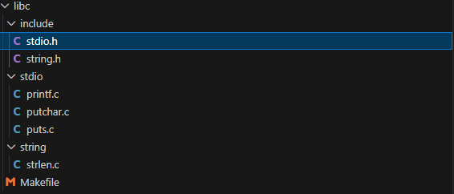

我们新建目录libc，并在其中定义有关控制台输出的若干函数：

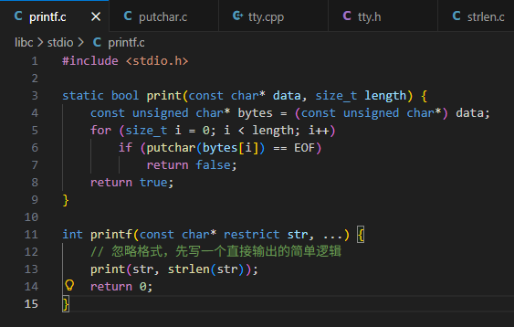

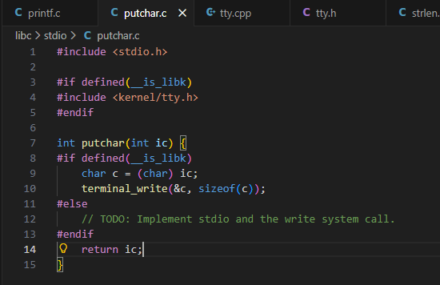

注意到我们新用到了一个函数`terminal_write`，来输出指定的某个字符，但是我们还没有定义这个函数，所以我们还得在tty.h、tty.c分别定义和实现：

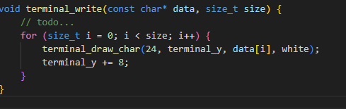

由于这块用到的是像素输出模式，所以处理应该要比这个更复杂一点。我们先打个桩，后面再回头来完善我们的控制台输出逻辑。

把这块做完之后，我们还要完善Makefile，生成libk.a，然后让kernel的makefile能找到这个libk然后链接，这样我们的操作系统就能跑起来了。那么我们先来写libc的Makefile吧。

#### Makefile

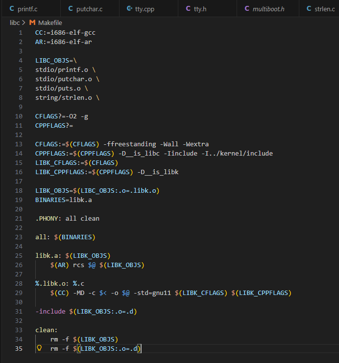

这次尝试着自己写了下makefile，发现还是挺好理解的，总算不用靠AI去生成了。

按着”我们最终的目标是什么？libk.a。libk.a需要什么来组成？用的是什么命令？需要的是各种.o文件，需要用到ar命令来将它们合并起来...“这样的，自顶向下的思路去写就好。

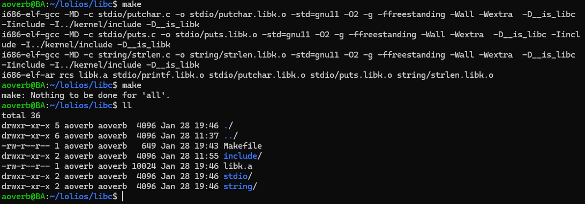

最终，我们终于能够在libc目录生成我们的.a静态库文件了。


但是我们的操作系统还存在一个问题，我们编译时指定头文件使用了`-I`来指向源码目录，但这不符合 Unix 规范。

### Sysroot

Meaty Skeleton 引入了 **Sysroot** 的概念。我们会创建一个名为 `sysroot` 的文件夹，它的内部结构是这样的：

- `sysroot/usr/include`
- `sysroot/usr/lib`

**为什么这么做？** 为了实现**自举（Self-hosting）**的可能。我们把内核和 libc 的头文件“安装”到这个 sysroot 里，编译器在编译后续代码时，会使用 `--sysroot=sysroot` 参数。这样，编译器就会去 `sysroot/usr/include` 找头文件，就像在真实的 Linux 下开发一样。

#### 摆脱-Iinclude

首先，我们不能再在makefile里面用-I参数了，我们统一改用`--sysroot=$(SYSROOT)`：

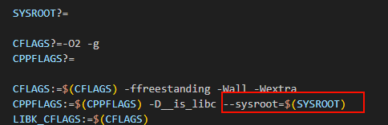

当然我们还需要有人把SYSROOT帮我们传进来。我们在最外层新建一个build_libc.sh：

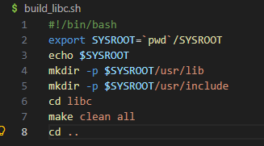

我们来跑跑看。

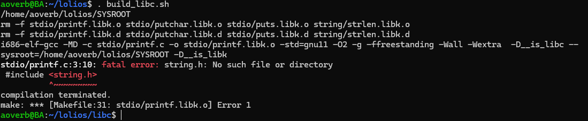

好的，看来在之前我们还得先把头文件给复制到sysroot/usr/include里面。

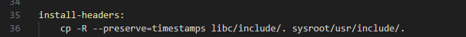

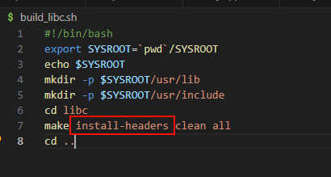

添加了一个新的操作：install-headers。

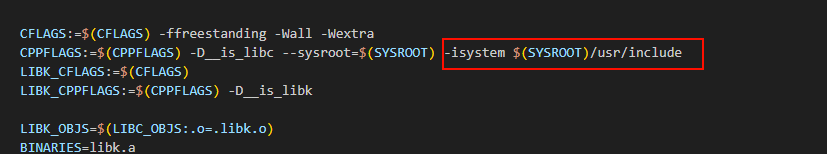

后面还需要再指定一个系统目录。

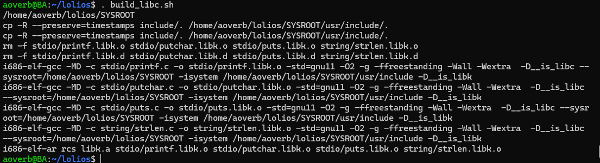

现在我们能在sysroot下面找到头文件构建了。

#### install-libc

接下来我们还需要添加install命令把构建好的libk.a复制到sysroot/usr/lib底下，以供后面kernel构建。

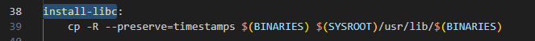

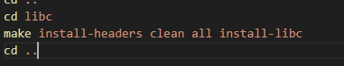

#### Kernel的构建与安装

接下来我们把build_libc.sh的执行合并到build.sh里，同样把kernel的include换成sysroot：

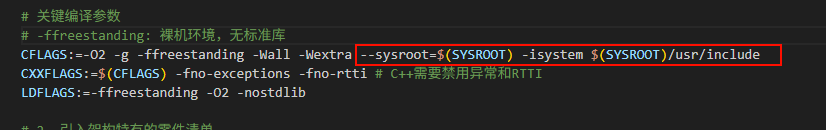

我们来试着运行下build.sh。

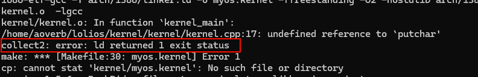

可以看到是链接的时候出了问题，因为我们还没把libk.a添加到链接脚本里面呢。

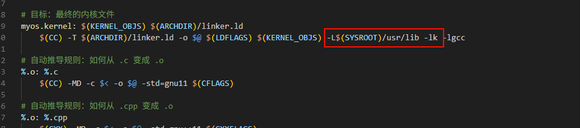

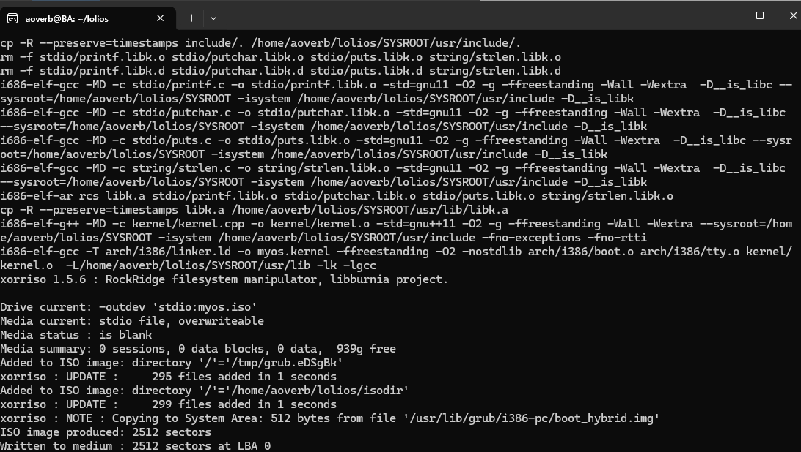

这下正确跑通了。

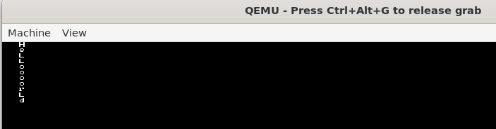

欸等等。。为什么是竖着的？？看来我的printf函数还需要再修改下。

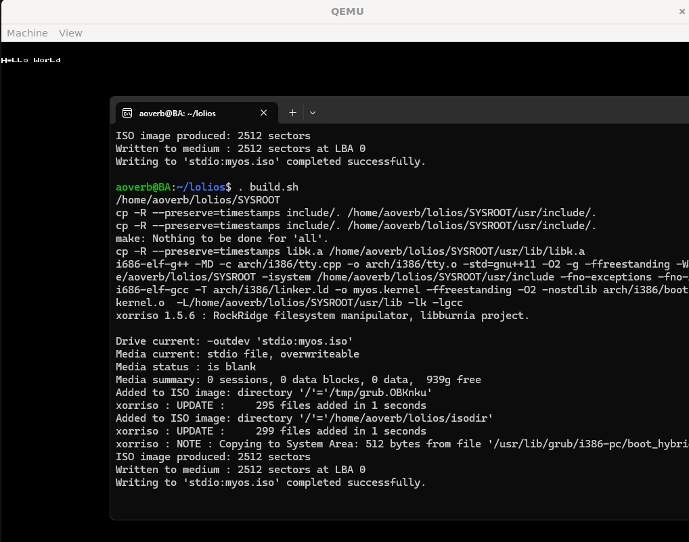

稍微修改了下逻辑，添加了空格的字体，现在能正确输出Hello world了。

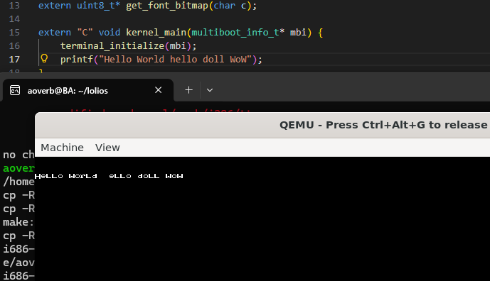

当然我们还能修改一下输出的内容（十分有限...）


---


今天我们终于像模像样地实现了libk，还有依赖sysroot的编译构建，但是我们发现我们能输出的字符由于字体不足，相当有限！下一步，我们将引入正式的字体，来输出更多的字，并完善我们的控制台输出逻辑...