## 自制操作系统（4）：libc完善——控制台逻辑完善更多的输出字体

在上一篇文章我们重构了kernel，创造了一个简陋的libc，并成功地把二者链接了起来。

下面我们来完善这个libc，首先从一些“所见即所得”的东西入手，今天最终的目标是用这个libc来输出一个露米娅的AA（ASCII ART）。

### 字体完善-从8\*8到8\*16

现在8*8的字体有点不够带劲，而且只支持几个简单的字体，我们让AI生成一个更大更完善的字体库，并稍微修改一下我们的终端输出逻辑，具体是，我们检测到当前要输出的是换行符的话，我们重置字符输出的列，并将输出的行+1.（你说这应该是\r\n而不是\n？我觉得像Unix那样简单点要更好）

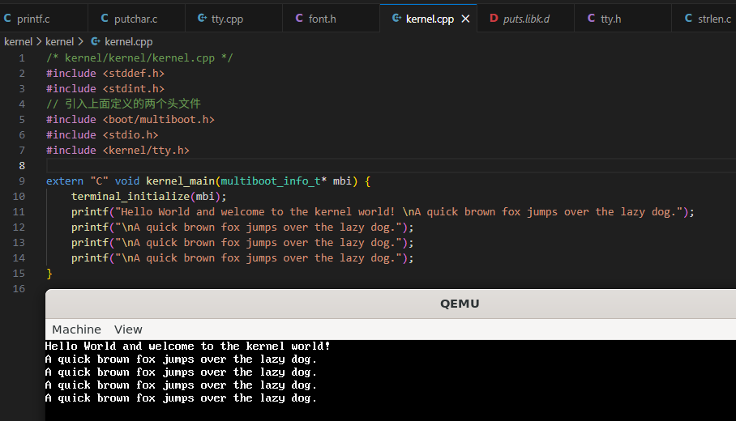

经过简单的输出，我们现在已经能输出足够多的字符了。

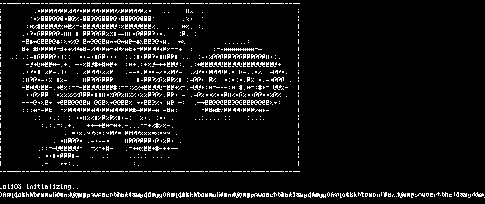

现在我们的控制台已经能正确显示AA了。不过不得不说，我在无聊的事情上浪费了太多的时间了...请大家不要学我。

### 自适配多行输出

现在输出的问题是解决了，但是我们注意到现在还没办法做到自动换行（可以看到，上面的图片里面最后一行的字符都挤在一块了）。我们来解决这个问题。

首先我们要知道现在屏幕分辨率的大小，再用我们的字体大小去分割整个屏幕，这样才能知道显示的边界。

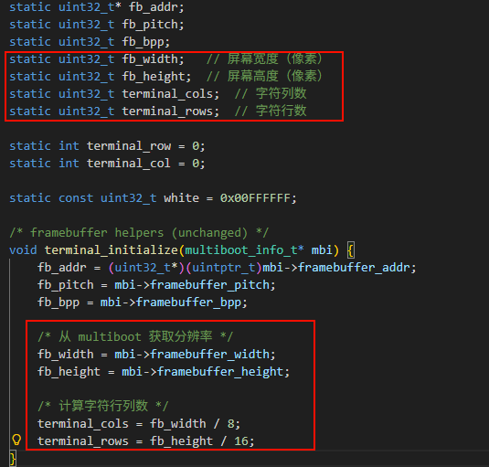

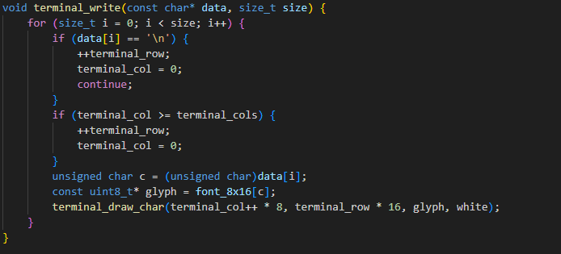

（看到这里我才发现我之前把行列写反了。。惭愧惭愧）

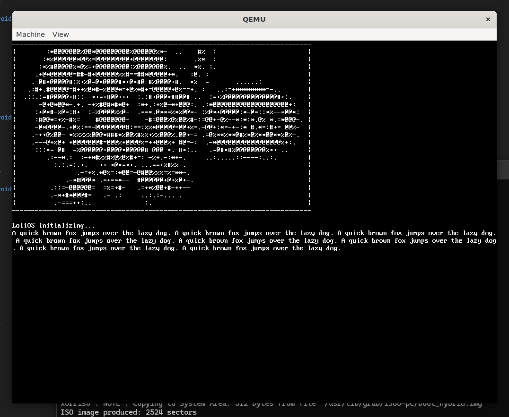

现在可以输出多行了。当然这样是（有点）不符合输出格式的，不过现在这样已经够用了，后面可以再优化一下。

### 滚屏

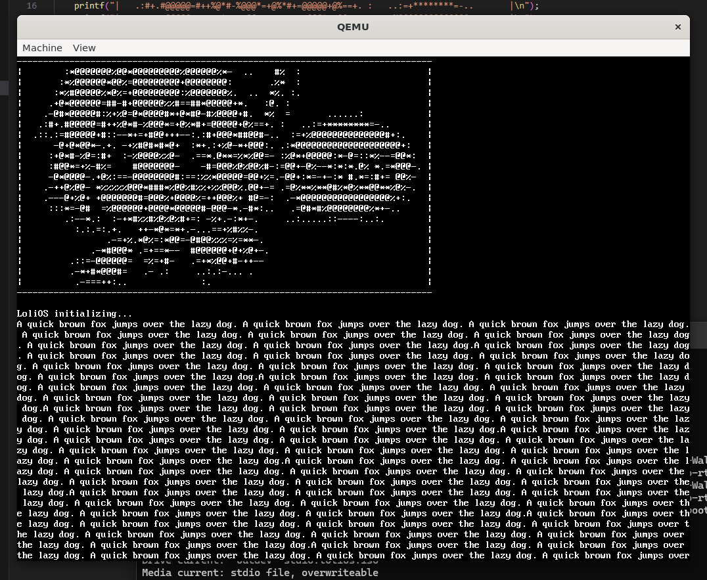

我们再多输出几行，可以发现，屏幕的底部被写满了，后面的信息没办法再显示出来。在标准的终端应该是要可以滚屏的。

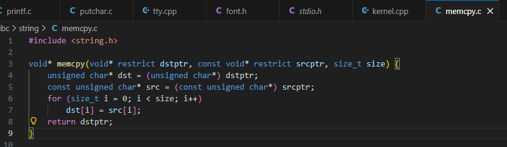

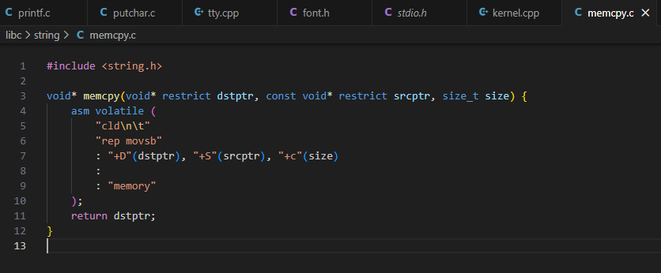

为了滚屏，我们要先实现memcpy，然后利用这个函数，检测到行数超出最大值时，把每一行的内容给复制到上一行即可：

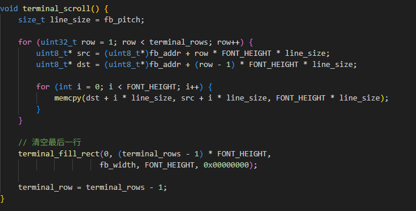

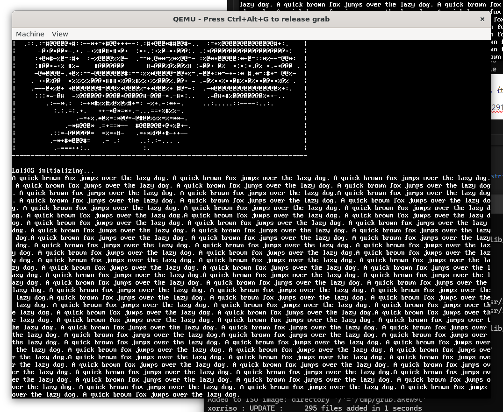

现在我们的系统能实现滚屏了。

### 格式化的Printf

现在我们的控制台输出已经很像样了——除了我们的printf函数并不像一个真正的printf：它不支持格式化输出！

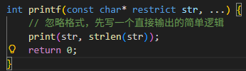

是的，我们直接把所有的东西都丢给print处理了。

我们需要写一个状态机，把第一个参数的%x格式的字符给替换成后面对应的参数。

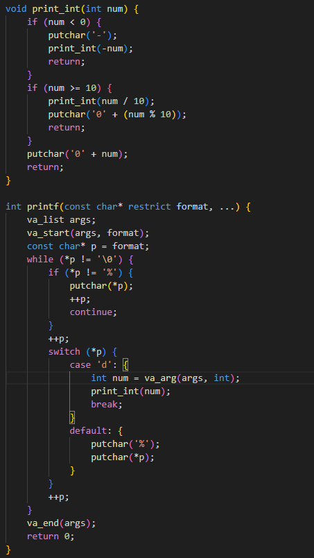

变参这块对我来说是一个比较陌生的点，我也是问了AI才知道它的用法，跟我一样不熟悉的小伙伴也可以找AI问问看。

#### %d

整数的输出个人认为还是有些巧妙的。如果是平常的算法题的话，我肯定会把这个整数放进一个stringstream里面再读取，但是这里没有这么多可供我使用的函数，所以我就用了递归来解决。

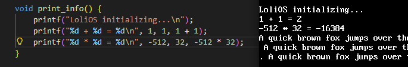

#### %x, %X

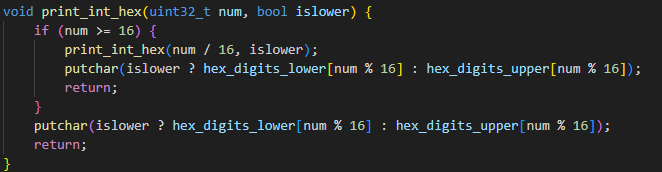

逻辑与十进制差不多，把底数换成16即可。二进制同理。

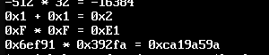

#### %s

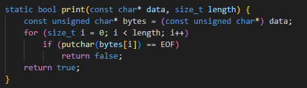

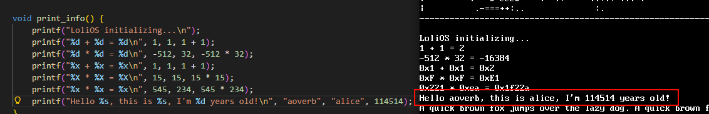

---

那么到这里，我们完善了控制台的显示，包括字体到可显示字符的个数，支持多行输出以及支持滚屏，提供可格式化输出的printf函数等。

下一节我们来看看GDT和LDT。