## 自制操作系统（5）：GDT与IDT

在上一篇文章，我们完善了控制台逻辑，拥有了一套比较可用的控制台输出函数，这为我们后续的调试提供了基础。

现在，我们来稍微给kernel_main加一句代码，来测试一下会发生什么：

```cpp
printf("1 / 0 = %d\n", 1 / 0);
```


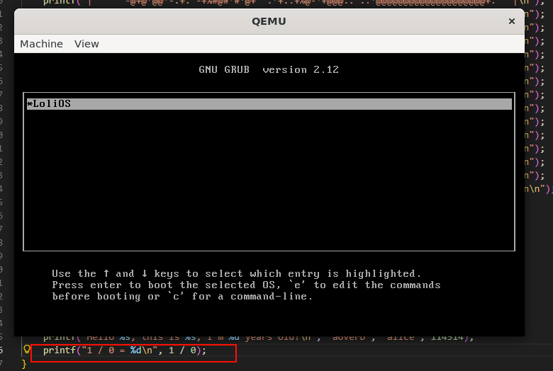

可以看到，我们的系统居然被这个小小的除0打败了，正在不断的重启，没有办法进入系统了！

这很荒谬，但是究其原因，是我们没有正确地设置中断描述符表（IDT），今天我们就来围绕IDT，还有相关的GDT来完善我们的操作系统。


### GDT（全局描述符表）

要设置IDT，我们最好先设置好自己的GDT；

而聊到GDT，我们就不得不聊到分段机制；

#### 分段机制

啥是分段机制呢，简单来说就是，我们通过汇编去写一些指令，访问某些地址时，我们实际上访问的并不是我们写上去的那个地址，那个地址只是一个偏移值，是相对于我们在一个段寄存器设置的基址而言的偏移，比如说，对于下面节选的汇编指令：

```assembly
mov eax, [$0x10]
```

我们并不是把$0x10的内容写进了寄存器eax，对于mov指令，由于这是一段读取数据的指令，我们是通过将数据段寄存器（ds）选择的基址加上这个偏移值（0x10）对应的物理地址的内容读进了eax这个寄存器里面。

比如说，ds里面选择的基址是0x90000000，那我们实际上访问的物理地址（在保护模式下）就是0x90000000 + 0x10 = 0x90000010。

那么，ds寄存器里面是不是就直接存着一个基址呢？在实模式下，的确如此，但我们现在有了GRUB引导的帮助，我们直接到了保护模式，这个ds寄存器存放的是一个段选择子，这个段选择子选择了GDT中的某个段描述符，这个段描述符里面才是我们要相对于偏移的基址...

听起来很乱对不对，因为这并不是两三句话可以说明白的事情，这块还需要读者去扩展阅读一些资料才能澄清。在本文的末尾我会附上一些我个人觉得比较好的参考资料供读者参考。**就目前而言，只要记住我们需要在内存里面设置一个表，并在这个表里面插入一些代表基址的项，供我们的段寄存器去选择即可。**


#### 设置GDT

其实，GRUB在引导的时候已经为我们设置好了GDT，不过因为是GRUB设置的GDT，这么重要的东西必须为我主宰才行，所以我们需要自己去设置GDT，剪断与GRUB的”脐带“，把命运掌握在自己手中才行。这也是为什么要设置IDT，我们最好先设置好自己的GDT。

要设置GDT，我们要告诉CPU，我们的GDT在哪个位置，大小是多少，以及设置我们表里面的内容。

我们先来设置表里面的内容。既然GDT是全局描述符表，那表里面的各个项就是全局描述符（段描述符）了。以下是段描述符的格式：

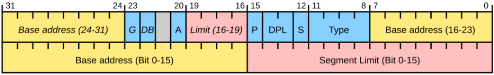

```c
struct gdt_entry_struct {
    uint16_t limit_low;           // 段限长 (0-15位)
    uint16_t base_low;            // 段基址 (0-15位)
    uint8_t  base_middle;         // 段基址 (16-23位)

    /* Access Byte: 定义段的访问权限 (从低位到高位) */
    uint8_t accessed : 1;         // 是否被访问过 (通常设为 0)
    uint8_t read_write : 1;       // 代码段:可读 / 数据段:可写
    uint8_t conforming_expand : 1;// 代码段:一致性 / 数据段:扩展方向
    uint8_t executable : 1;       // 1=代码段, 0=数据段
    uint8_t descriptor_type : 1;  // 1=代码或数据段, 0=系统段(如TSS)
    uint8_t dpl : 2;              // 特权级 (0=内核, 3=用户)
    uint8_t present : 1;          // 段是否存在 (必须为 1)

    /* Flags + Limit High: 混合字节 (从低位到高位) */
    uint8_t limit_high : 4;       // 段限长 (16-19位)
    uint8_t available : 1;        // 留给软件使用 (通常设为 0)
    uint8_t long_mode : 1;        // 1=64位模式 (32位下设为 0)
    uint8_t default_size : 1;     // 1=32位保护模式, 0=16位
    uint8_t granularity : 1;      // 1=4KB单位, 0=1字节单位

    uint8_t  base_high;           // 段基址 (24-31位)
} __attribute__((packed));
```

我们的GDT里面将会有5个这样的项，这五个分别是：零段、内核代码段、内核数据段、用户代码段、用户数据段。


##### HAL

为了方便与具体架构解耦，我们创建一个`hal.h`，在里面定义一个函数`hal_init()`，用于给不同架构去做硬件相关的初始化，在这里，我们就可以在这个函数的实现里面去初始化我们的GDT了。

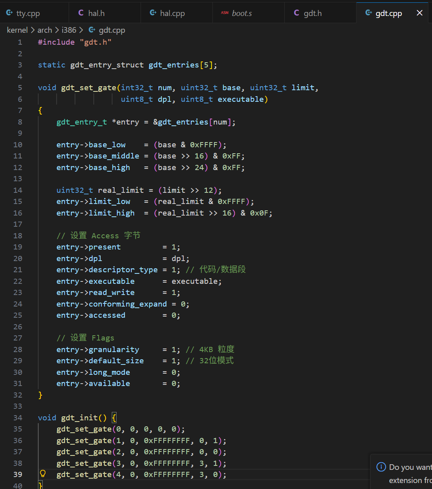

五个段，参考上面的说明设置。顺便说一下，这种设置叫做扁平模式（flat mode），因为我们的基址是0，偏移就相当于是我们的线性地址（线性地址=基址+偏移量）。

有了这些设置之后，我们就可以把这个表的信息交给`gdtr`这个寄存器，让它去加载我们自己定义的GDT了。那是把地址直接赋值给这个寄存器就好了吗？非也，我们要构造一个包含GDT表的基址和大小的结构，再赋值给`gdtr`。这个结构长这样：

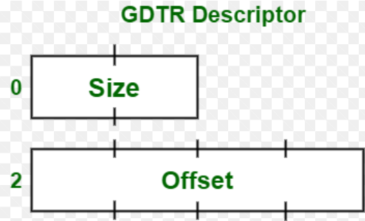

在我们的代码里面长这样：

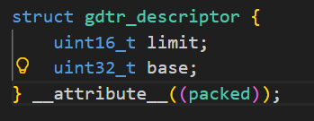

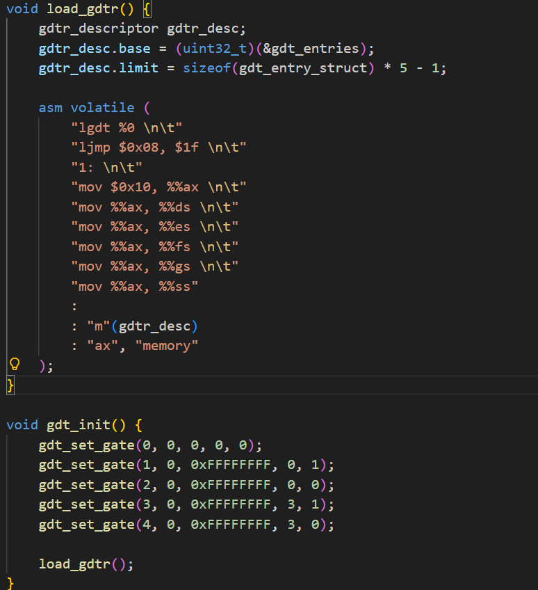

然后再用内联汇编的方式将它加载进来。我其实不会内联汇编，这里是用"默写+理解"的方式写出来的。希望后面能越来越会写。

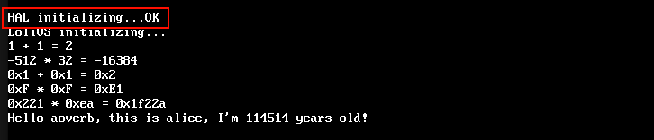

这里我先把除0的语句注释掉，加了点打印，看来GDT是加载进去了。接下来我们来继续设置IDT。

### IDT（中断描述符表）

终于进入正题了，前面准备了这么多就是为了设置IDT。但是，为什么要设置IDT呢？IDT能帮我们算出来1除以0等于几吗？（冷知识：不行）

IDT其实存有一系列”发生某种中断时应该交给哪个函数处理“的项，而这里面的某种中断，包含”除零异常“这种中断。

如果没有设置好异常发生时该怎么处理，CPU就会被水淹没，不知所措...

所以今天的任务就是把这个表，还有除零异常处理的表项设置好！

#### 设置IDT

与我们的GDT类似，IDT也是一个存放多个段描述符的表，所以这里也有一个`idtr`寄存器，我们可以通过这个寄存器告诉CPU我们的IDT在哪。

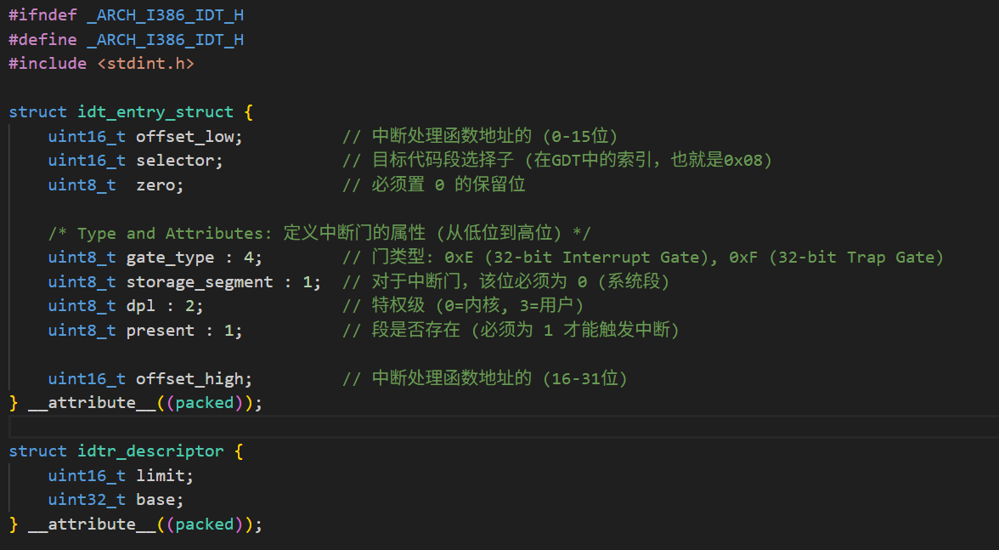

IDT各项的描述如上。后面初始化的过程，跟IDT也挺像的，也是设置好各个表项后，填好IDT表选择子，用`lidt`命令加载到寄存器即可。

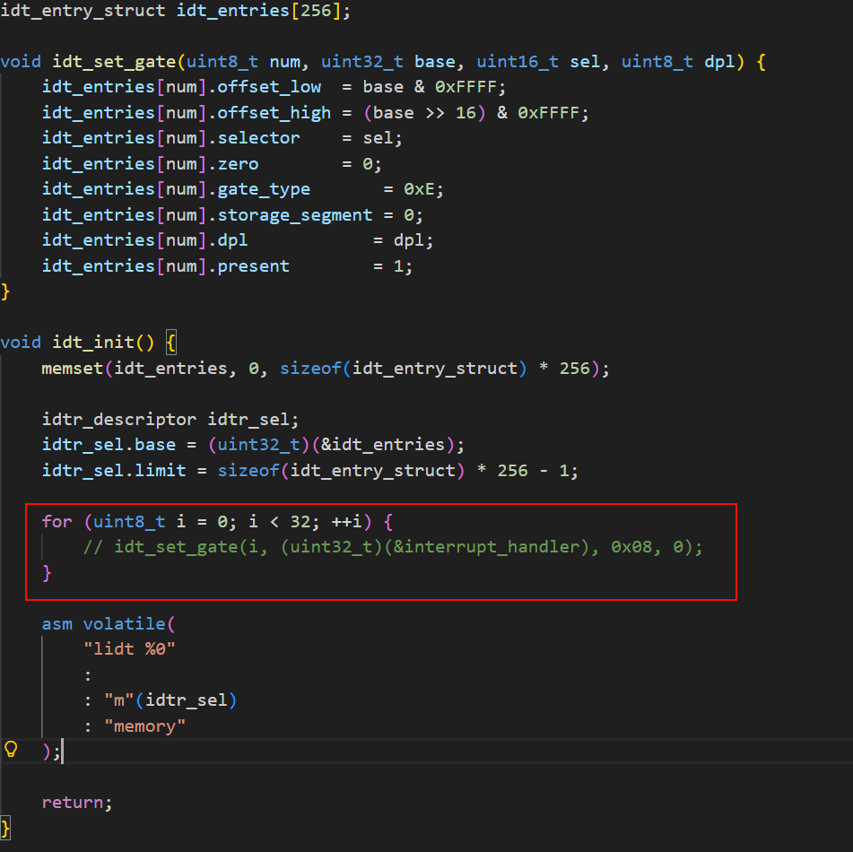

#### 跳板

上面红框这个地方需要讲讲。有人可能会问，这里不就是传个函数指针过去就可以了吗，为什么不直接在这里定义interrupt_handler这个函数然后传过去就好？

中断发生后，CPU会自动压入一些寄存器（EIP等）到栈中，有错误码的话还会把它一同作为参数传给中断处理程序。中断处理程序处理完成后，为了恢复到中断前的状态，我们需要调用`iret`这个指令恢复这些寄存器。但是C函数调用的是`ret`指令返回，所以在这里我们需要一段汇编写的函数作为跳板，来跳到我们的C函数，再由汇编写的函数来恢复现场。

我们可以把所有的中断都跳到我们内部的C函数里面来处理。但是不是所有的中断都带有错误码，所以我们要平衡这两部分的中断，对于没有错误码的中断（比如现在的除0中断），我们补入一个错误码0来消弭这些差距。

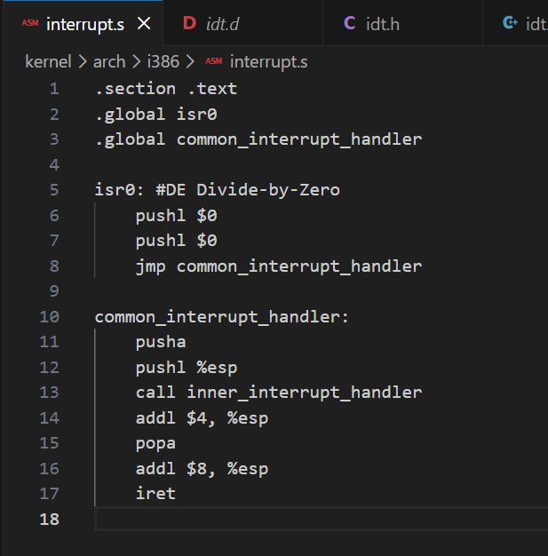

这里我们先定义除0的中断处理例程。

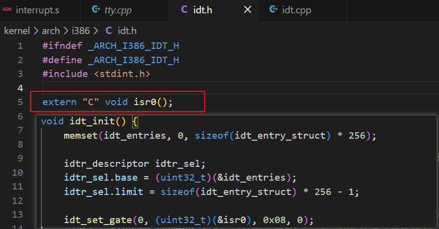

声明来自外部之后我们就可以这么写。

注意上面的汇编代码，我们会把一系列寄存器夹带参数，传给C函数inner_interrupt_handler：

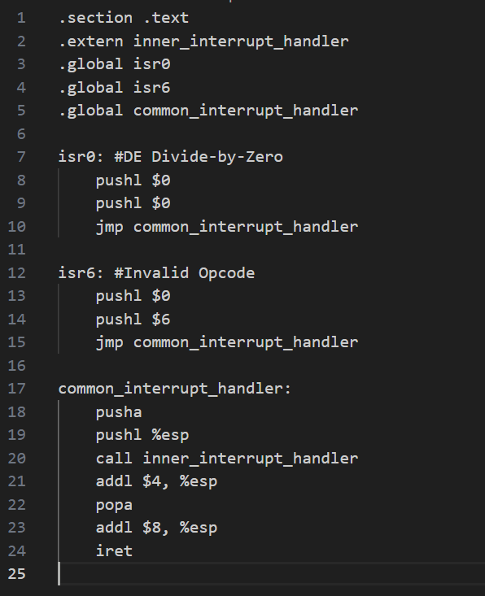

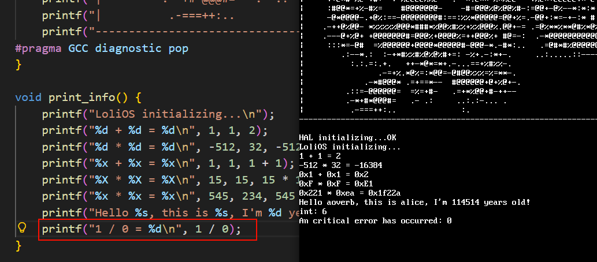

然后就能捕获到异常了。（坑爹啊！不知道是编译器还是什么原因，这里除0触发的中断竟然是6号！）

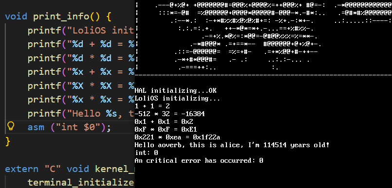

当然直接触发的话也是能捕获到0号异常的。有点无语。

#### 更多的软件中断捕获

前面捕获了0号和6号中断，对于软件中断，我们还需要再捕获其余的30个，它们在汇编的跳板函数都长得很像，所以我们通过宏定义来定义一个模板，后面直接批量生成这些跳板函数，减少出错概率。

#### 设置颜色

后面再给控制台加了个设置文字颜色的逻辑：

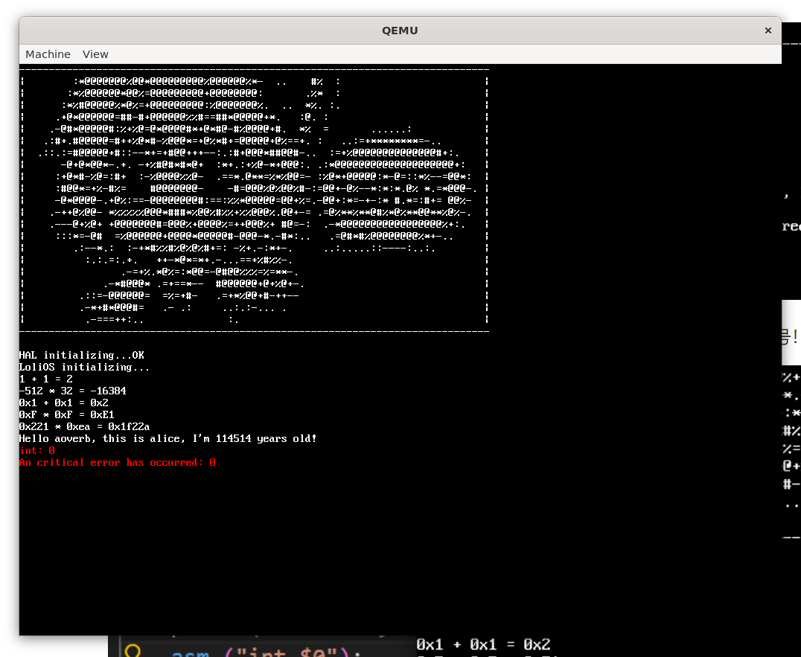

错误可谓是更显眼（吓人）了。

---

今天我们设置了自己的GDT和IDT，具备了一定的中断处理能力。

下一节，我们来看如何处理键盘的中断，并把键盘输入的信息输出到屏幕上。