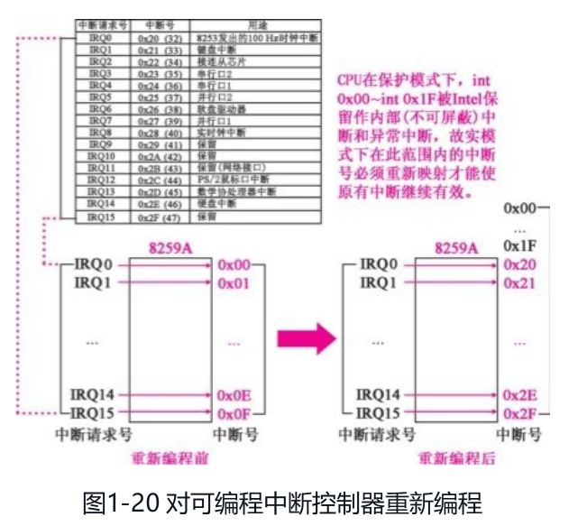
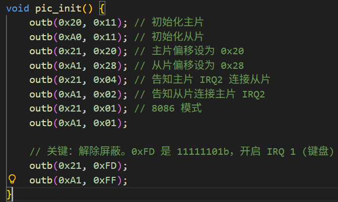
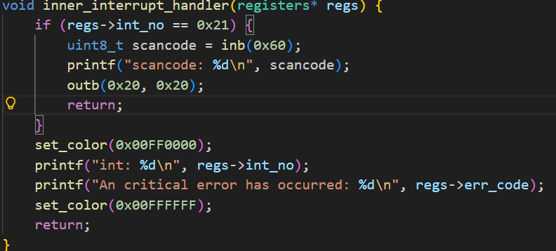
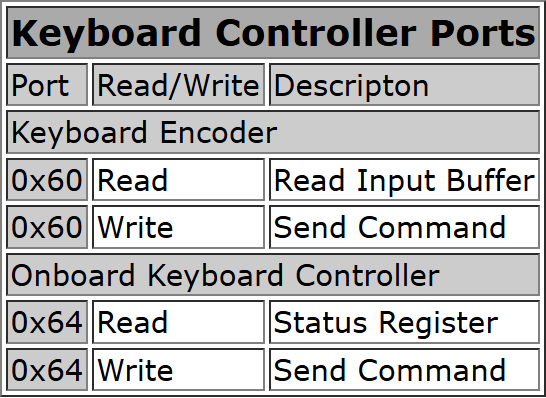
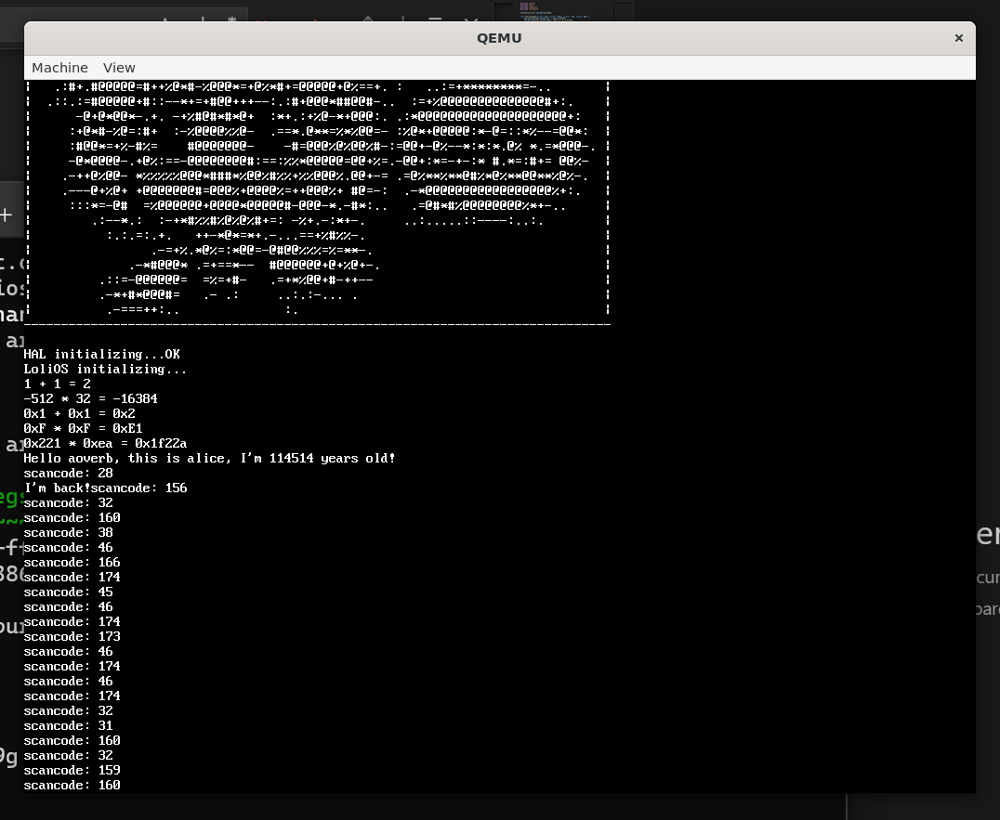
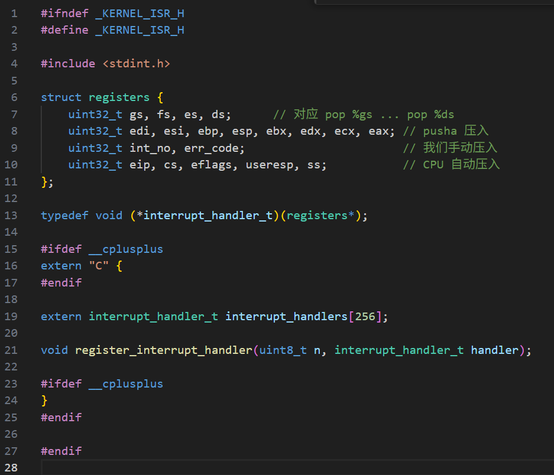
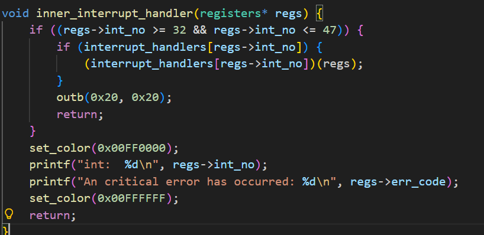
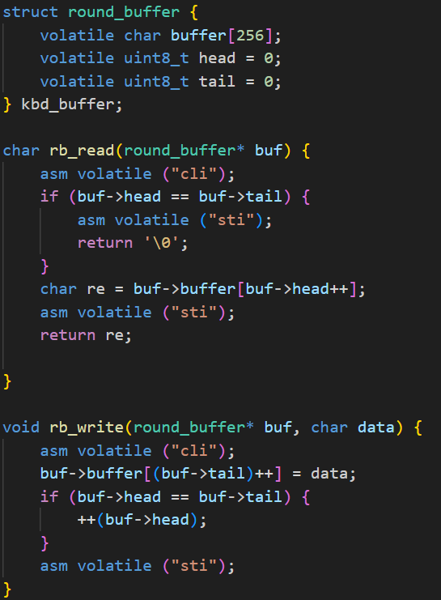
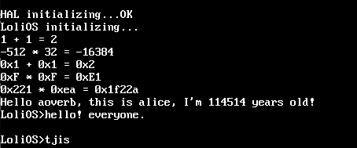
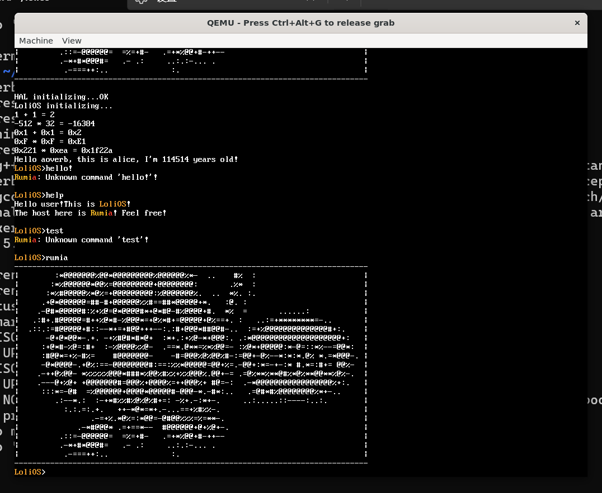

## 自制操作系统（6）：硬件中断与键盘驱动

上一篇文章我们设置了GDT与IDT，现在，我们的系统能处理软件中断了。今天，我们来让我们的操作系统具备处理硬件中断的能力。

### 硬件中断

硬件中断相对于软件中断，顾名思义就是由硬件向CPU发出的中断了，比如说键盘输入、硬盘读取等等，都会向CPU发送中断来告知硬件目前所处的状态以及新发生的一些事件。

但是硬件其实并不直接向CPU发送中断，它们俩的桥梁是一个叫**8259 PIC（可编程中断控制器）** 的芯片。

#### 硬件中断重映射

由于一些早年的不兼容的设计，8259会有默认的，从IRQ到IDT的如下的映射：

**主片 (Master PIC)**：负责 IRQ 0-7。在 IBM PC 默认设置下，它们被映射到IDT 的 **0x08 - 0x0F**。

**从片 (Slave PIC)**：负责 IRQ 8-15。它们被映射到IDT 的**0x70 - 0x77**。



但在上一节我们知道了软件中断又对应到了IDT 的 **0x00 - 0x1F**，软硬中断重叠了！所以我们需要对这部分硬件中断重新编程，重新设置映射。

#### 与硬件对话：I/O 端口

我们要给 PIC 发指令，必须通过 `in` 和 `out` 汇编指令操作 **I/O 端口**。为了方便 C 语言调用，我们需要在 `io.h` 里封装一下：


```c
static inline void outb(uint16_t port, uint8_t val) {
    asm volatile ( "outb %0, %1" : : "a"(val), "Nd"(port) );
}

static inline uint8_t inb(uint16_t port) {
    uint8_t ret;
    asm volatile ( "inb %1, %0" : "=a"(ret) : "Nd"(port) );
    return ret;
}
```

#### PIC初始化



这部分直接复制粘贴的代码，没啥好说的。

#### 设置33号中断处理程序

我们上一篇文章定义的宏就派上用处了，33号中断没有错误码，直接用宏生成即可。



我们通过0x60的IO端口，去读取键盘编码器（Keyboard Encoder）提供给我们的Scancode：



注意到上面的代码，我们在读取端口之后，还得向PIC的端口发送一个0x20（EOI，中断结束）命令，不然PIC会认为CPU还在忙，不会发送下一个中断。

我们在统一的handler里面加上这一段，来看看我们能否触发键盘中断：



能看到我们的scancode了。

### 键盘驱动

既然能获取到键盘向我们系统发送的scancode，下一步我们可以考虑实现我们的键盘驱动。

做一个合格的键盘驱动，我们要隐藏尽可能多的硬件细节（通过接口）。

因此，我们先创建`kernel/driver/keyboard.h`，并定义下面的函数：

```cpp
#ifndef _DRIVER_KEYBOARD_H
#define _DRIVER_KEYBOARD_H


#ifdef __cplusplus
extern "C" {
#endif

void keyboard_init();

char keyboard_getchar();

bool keyboard_haschar();

#ifdef __cplusplus
}
#endif

#endif
```

然后我们来逐个实现。

#### 初始化之前：硬件中断注册

我们先来看看键盘的初始化需要干什么，第一步，肯定是要能让键盘的输入经过我们键盘中断处理程序的处理了。但是我们现在的中断处理程序是写在IDT里面的，我们要把这个处理程序换成我们写在keyboard.c里面的处理程序，就得写一套硬件中断处理程序注册的逻辑，把我们的函数注册进去。

话说回来，我们一直把中断处理的逻辑写在IDT里面，其实是有点耦合的，我们得想办法把这两部分分离开，然后再回头来看怎么注册。

##### 硬件中断注册之前：分离IDT与ISR（中断服务例程）



我们的isr目前只需要一个注册函数，以及共享给需要调用中断函数的变量。

（后面总要把这些都包装成类...）



然后就可以通过范围来判断哪些是硬件中断函数，并将这些调用转发到对应的已注册的函数。

```cpp
void keyboard_init() {
    register_interrupt_handler(33, keyboard_interrupt_handler);
    while (hal_inb(0x64) & 0x01) {
        hal_inb(0x60); // 读走数据，但不做任何处理，直接丢弃
    }
}
```

然后回头看我们的keyboard_init，我们就可以直接注册我们定义的处理函数，并在后面做一些清空键盘缓冲区的处理。

#### 键盘中断处理逻辑

```cpp
void keyboard_interrupt_handler(registers* /* regs */) {
    uint8_t scancode = hal_inb(0x60);
    printf("%d ", scancode);
    return;
}
```

目前的handler逻辑是直接往屏幕输出，以确认我的重构没有问题。但是我们要做的应该是在内部设置一个缓冲区，并把我们获取到的字符写到这个缓冲区里面。

##### 环形缓冲区



当缓冲区写满后，会覆盖最老的数据。

我们可以利用这个缓冲区来把我们的数据写进去。

```cpp
void keyboard_interrupt_handler(registers* /* regs */) {
    uint8_t scancode = hal_inb(0x60);
    if (scancode & KEY_RELEASED_MASK) {
        if ((scancode ^ KEY_RELEASED_MASK) == 0x2A || (scancode ^ KEY_RELEASED_MASK) == 0x36) {
            is_shift_pressed = false;
        }
        return;
    }
    if (scancode == 0x2A || scancode == 0x36) {
        is_shift_pressed = true;
        return;
    }
    rb_write(&kbd_buffer, scancode_to_ascii_table[scancode][is_shift_pressed]);
    return;
}
```

如上面的代码，我们先把scancode转成对应的ascii字符，然后再把这个字符写进缓冲区。

这边还写了个是否按住shift的判断来决定是否要把写入缓冲区的字符转成大写的。

```cpp
void keyboard_flush() {
    rb_flush();
}

char keyboard_getchar() {
    return rb_read(&kbd_buffer);
}

bool keyboard_haschar() {
    return kbd_buffer.head != kbd_buffer.tail;
}
```

剩下的实现也很简单。我们的键盘驱动就这样到了一个还能用的地步了。

### 进一步完善libc库

有了键盘驱动我们就可以完善我们的libc了。

#### getline

在stdio库里面实现一个逐行读取键盘输入的函数getline()：

```cpp
void getline(char* buf, uint32_t size) {
    keyboard_flush();
    uint32_t i = 0;

    while (i < size - 1) {
        while (!keyboard_haschar()) {
            asm volatile("pause"); 
        }

        char c = keyboard_getchar();

        if (c == '\n') {
            buf[i] = '\0';
            printf("\n");
            return;
        }

        if (c >= 32 && c <= 126) {
            buf[i++] = c;
            printf("%c", c);
        }
    }

    buf[i] = '\0';
}
```

然后我们可以在kernel_main用上这个来实现一个玩具shell：

```cpp
extern "C" void kernel_main(multiboot_info_t* mbi) {
    terminal_initialize(mbi);
    print_rumia();

    printf("HAL initializing...");
    hal_init();
    keyboard_init();
    asm volatile ("sti");
    printf("OK\n");

    print_info();

    char input[64];
    while (1) {
        printf("LoliOS>");
        getline(input, 64);
        printf("\n");
    }
}
```



看起来还不错吧？但是我们的输入还不支持退格，我们接下来要支持这一个特性。

#### 退格

我们没有在terminal_write里面写退格支持清除的逻辑，所以我们需要补充一下，具体就是退到上一个然后用一个黑色矩形填充当前格。

```cpp
if (data[i] == '\b') {
    if (terminal_col == 0 && terminal_row == 0) {
        return;
    }
    if (terminal_col == 0) {
        --terminal_row;
        terminal_col = terminal_cols;
    }
    --terminal_col;
    terminal_fill_rect(terminal_col * FONT_WIDTH, 
                      terminal_row * FONT_HEIGHT, 
                      FONT_WIDTH, 
                      FONT_HEIGHT, 
                      0x00000000);
    continue;
}
```

### 玩具Shell演示

我实现了strcmp，于是我就能用下面的代码来实现一个简单的shell了：

```cpp
char input[256];
while (1) {
    print_lolios();
    printf(">");
    getline(input, 256);
    if (strcmp(input, "help") == 0) {
        printf("Hello user!");
        printf("This is ");
        print_lolios();
        printf("!\n");
        printf("The host here is ");
        print_rumia_text();
        printf("! Feel free!\n");
    } else if (strcmp(input, "rumia") == 0) {
        print_rumia();
    } else {
        print_rumia_text();
        printf(": Unknown command '%s'!\n", input);
    }
    printf("\n");
}
```



感觉不错！

### 题外话：一个有趣的点

之前，我想到既然硬件中断也是一种中断，而中断没有设置中断处理函数时，肯定会导致系统重启，那么既然我设置好了IDT和GDT，但又只设置了软件中断的函数，当我进入系统后敲击键盘，系统肯定就会重启的吧。但是令我讶异的是这件事没有发生。我求助了AI，得到的答复是我没有初始化PIC和解除屏蔽，但是我把这一切设置好后，还是什么都没发生。

后面我忽然想到，我的kernel_main在初始化之后就马上返回了，会不会是我的操作系统已经退出了导致的呢，于是我在末尾加了个死循环，后面果然有反应了，我的中断处理程序提示我发生了13号中断，并且这个信息一直在循环打印，13号中断是GPF中断，也就是中断处理程序没有在IDT找到33号键盘中断对应的处理程序时触发的，**iret返回到触发异常的指令,该指令反复触发同样的异常**。

我因为显示是正常的就以为操作系统还在工作，没想到我还是陷入了用户态的思维，却在写着操作系统呢。

---

今天，我们学会了如何设置硬件中断，对硬件中断重映射，读写IO端口，重构了IDT与ISR，编写了硬件中断注册注册逻辑为后面更多的硬件中断提供便利，编写了简单的键盘驱动，以及进一步完善libc库，并以上面所做的工作为基础写了一个简单的shell...真的是不容易！

本来是打算在今天把定时器中断和sleep函数也实现进去的，今天做的事情已经够多了，这个就留在下一篇吧。


参考资料：

https://www.brokenthorn.com/Resources/OSDev19.html - **Operating Systems Development - Keyboard** 讲解键盘来龙去脉的好文章。
