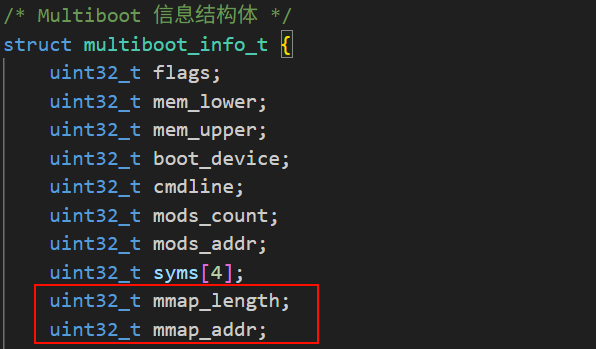
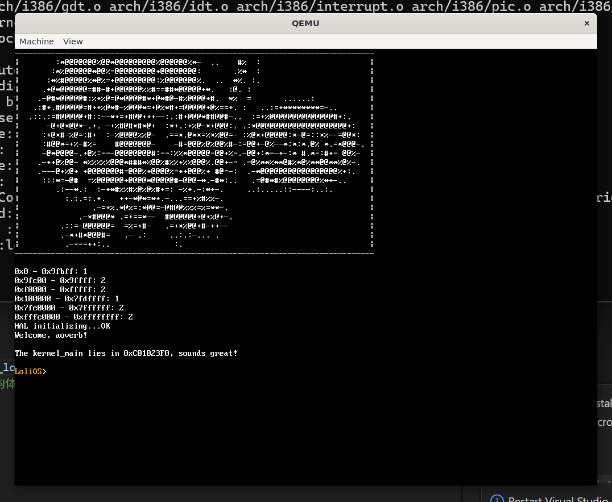
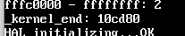

## 自制操作系统（8）：物理内存管理

上一节，我们开启了时钟中断并实现了sleep函数，最重要的是：我们把之前留下来的一个坑——高半区内核，给填上了。但是因为我们过于“硬核”的显存区域映射方式，我们又留下了一个新的坑，不过不用担心，我们接下来将要实现的内存管理，就是可以把这个坑填上的一个特性。

接下来，我们开始涉足内存管理的领域，来谈谈怎么样管理物理内存。

为什么要进行内存管理呢？说白了，我们现在的内存不像以前那样寸土寸金，但是也不是用之不竭的，最好就是无论是内核还是用户进程，需要用到内存的时候，我们能够在内存里面找到一块空闲的地方，然后分配给它；声明用不到的话，我们又能回收掉这段内存，以备不时之需。

内存管理会遇到一些问题和挑战，比如说，我们该用怎么样的算法，才能快速找到一块空闲的内存？还有对于碎片的管理，怎么样尽量避免虽然空闲内存的总和大于我要申请的内存，但是因为这些内存不连续而分配失败的情况（也就是外部碎片）？怎么样避免我获得的内存比我实际上想要的内存要大得多，用不完从而造成了浪费（也就是内部碎片）？

幸而这些问题作为业内的常青课题，有太多的能人志士提出了很多有用的数据结构和算法，其中有很多都经过了时间和实践的考验。而对于我们的操作系统，就现在而言，我们并不需要多复杂的算法，我们先make it right，未来我们再make it nice。

### 巨人的肩膀——Multiboot提供的内存映射表

还记得我们是用Multiboot协议来引导我们的系统的吗？它提供了很多实用的信息，比如说，一份记录着物理内存可用物理地址的映射表。



我们可以用下面的代码去获取可用的内存：

```c++
multiboot_memory_map_t* mmap = (multiboot_memory_map_t*)info->mmap_addr;

while((uint32_t)mmap < info->mmap_addr + info->mmap_length) {
    if (mmap->type == MULTIBOOT_MEMORY_AVAILABLE) {
        // 可用的内存
        // 记录下它的 start 和 end
    }
    // mmap->size: 根据规范，这个字段存储的是“除了 size 字段本身以外，该条目剩余部分的大小”。把size加上就是整个结构体的大小了。Multiboot考虑到未来会在这个结构体的末尾增加新的字段，因此规定要用这种方式去遍历。
    mmap = (multiboot_memory_map_t*)((uint32_t)mmap + mmap->size + sizeof(mmap->size));
}
```

---

#### 注意：已知的缺陷

还记得我们上一节开启了分页吗？我们最开始的分页机制只设置了0x0和0xC0000000开始的4MB大小的到物理地址0x0的映射。

而我们现在在做的事情，是将GRUB根据Multiboot协议传给我们的一个存放multiboot_info结构数组的地址指向的内存映射信息读取出来，但是，**这个地址是一个物理地址，理论上它可以存在于内存的任何地方**，虽然一般而言，会放在低于物理地址1MB以下的地方，但它并不保证这一点。所以，这也是我们未来要解决的一个坑。一个可行的办法是，在开启分页机制前，把这份信息拷贝一份到我们的.bss段。

---

哦对，我们还没有multiboot_memory_map_t这个结构呢。我们把它定义出来，然后先在kernel_main打印看看吧。



但是这里给出的映射里面，标注为Available的区域只是“能用”，并不代表没有被占用，内核代码、页表、栈、Multiboot 结构体本身此时此刻正存放在这块内存里。

我本来是打算把所有内存里面占用的东西都考虑在内，再用修正后的数据去初始化我们的pmm的，但是这种完美主义无疑会拖慢我们的进度，况且这也比较枯燥。我决定我们先暂时把内核程序还有显存（framebuffer）从前面获取的可用内存列表剔除掉，就直接交给pmm。

### 从内存映射表剔除已用区域

那么我们现在需要剔除的区域有两个，一个是内核，另一个是显存。我们先来看看内核。

#### 内核

要剔除内核，需要我们知道内核加载在物理地址的开头和末尾，开头我们自然是知道的，就是1MB的位置；关于末尾，好消息！我们之前已经在linker.ld铺垫好了：

```link
    }
    
    _kernel_end = . - 0xC0000000;
}
```

我们在C代码用这种方式就能引用到了：

```cpp
extern uint64_t _kernel_end;

...
    
    printf("_kernel_end: %lu \n", &_kernel_end);
```



#### 显存

显存的开头末尾可以直接通过mbi获取到。不再赘述。

```cpp
    uint32_t lfb_begin = mbi->framebuffer_addr;
    uint32_t lfb_end = lfb_begin + mbi->framebuffer_width * mbi->framebuffer_height * (mbi->framebuffer_bpp / 8) - 1;

    printf("_lfb: %x - %x\n", lfb_begin, lfb_end);
```

#### 剔除

我们按照上面输出有效地址的方式，来检测每段地址是否有重叠，如果有的话，我们将重叠的部分删去，并按4KB对齐，再对剩下的部分做过滤，并放入一个结构数组：

```cpp
typedef struct pm_entry {
    uint64_t begin, end;
} pm_entry;

typedef struct pm_list {
    pm_entry entries[128];
    uint32_t count;
} pm_list;
```

然后再把这个数组给到pmm_init，我们就可以用以初始化物理内存分配器了。

### 物理内存分配器: buddy system

对于物理内存分配器（PMM）的实现，我们来做一个buddy system.

#### 数据结构
buddy system是这么一套算法：它把你的有效内存分成4KB、8KB、16KB...2^MAX_ORDER * 4KB的各个块，当有人来申请一块内存时，系统会根据请求的大小去找一块刚好足够大的块，返回给用户：

```c
#define MAX_ORDER 12
typedef struct page_frame {
    page_frame *prev, *next;
    size_t order;
    uint8_t allocated;
} page_frame;

page_frame* free_area[MAX_ORDER];
```

分出去的块被称为"页帧"，与虚拟内存概念中的"页"区分开。
可以看到上面的结构体，free_area是一个数组，每个数组成员都存着一个指向page_frame的指针，而page_frame本身是一个链表结构，这差不多就是buddy system的数据结构了：数组+链表。

#### 初始化
在初始化我们应该采用这样的策略：我们观察当前可用内存的开始地址，在满足地址对齐的前提下，切下尽可能大的一块，记录到page_frame内，并添加到free_area指定阶的链表。
```c
typedef struct pm_entry {
    uintptr_t begin, end;
} pm_entry;
typedef struct pm_list {
    pm_entry entries[128];
    uint32_t count;
} pm_list;

void pmm_init(pm_list* pms) {
    for (int i = 0; i < MAX_ORDER; i++) {
        free_area[i] = NULL;
    }
    for (int i = 0; i < pms->count; i++) {
        uintptr_t begin = pms->entries[i].begin;
        uintptr_t end = pms->entries[i].end;
        while (begin < end) {
            size_t order = (begin == 0) ? MAX_ORDER - 1 : __builtin__ctzll(begin) - 12;
            while ((begin + (1UL << (order + 12))) > end) --order; // 12是指page frame size为4096
            page_frame* pf = (page_frame*)begin;
            if (free_area[order]) {
                free_area[order]->prev = pf;
            }
            pf->order = order;
            pf->allocated = 0;
            pf->prev = NULL;
            pf->next = free_area[order];
            free_area[order] = pf;
            begin += 1UL << (order + 12);
        }
    }
}
```
为什么需要地址对齐？因为buddy system后面块的拆分、合并操作需要这个特性，这些特性使得：1、外部碎片少；2、分配算法高效。
初始化的问题：
看上面的这几行代码：
```c
            page_frame* pf = (page_frame*)begin;
            pf->order = order;
            pf->allocated = 0;
            pf->prev = NULL;
            pf->next = free_area[order];
            free_area[order] = pf;
```
我们把分出来的空闲page_frame的元数据直接放在了这片空闲内存，但是这样做有问题：一旦这段内存被借走，里面的数据可就不是我们说了算的了。到时候这段内存被还回来，只有一段开始地址，我们是没办法知道阶数的。所以我们最好是把这样的结构放在一段连续的内存，也就是数组里面。
这样的地址需要多大呢？我们是32位的系统，最大支持4GB的物理寻址。所以我们需要记录4GB/4KB = 2^20 个页帧，每个页帧16字节，也就是需要用到16MB的空间，这16MB的空间从哪来呢？也许，我们也可以从这段空闲空间给切出一段来存我们所有的页帧数据：

```c
void pmm_init(pm_list* pms) {
    for (uint8_t i = 0; i < MAX_ORDER; i++) {
        free_area[i] = 0;
    }

    uintptr_t all_end = 0;
    for (uint8_t i = 0; i < pms->count; i++) {
        if (pms->entries[i].end > all_end) all_end = pms->entries[i].end;
    }
    
    all_pages = 0;
    uint8_t flag = 0;
    uintptr_t all_size = all_end + 1;
    for (uint8_t i = 0; i < pms->count; i++) {
        uint32_t cur_size = pms->entries[i].end - pms->entries[i].begin + 1;
        if (cur_size >= sizeof(page_frame) * (all_size / (1 << 12))) {
            flag = 1;
            all_pages = (page_frame*)(pms->entries[i].begin);
            pms->entries[i].begin += sizeof(page_frame) * (all_size / (1 << 12));
            pms->entries[i].begin = (pms->entries[i].begin + 0xFFF) & ~0xFFF; // 确保地址是4KB对齐的
            break;
        }
    }

    page_limit = (all_size / (1 << 12));
    
    if (!flag) {
        panic("insufficient memory!");
    }
    
    for (uint32_t i = 0; i <= (all_size / (1 << 12)); ++i) {
        all_pages[i].allocated = 1;
    }

    for (uint8_t i = 0; i < pms->count; i++) {
        uintptr_t begin = pms->entries[i].begin;
        uintptr_t end = pms->entries[i].end;
    
        if (end - begin + 1 < (1 << 12)) continue;
        while (begin < end) {
            uint8_t order = (begin == 0) ? MAX_ORDER - 1 : __builtin_ctzll(begin) - 12;
            if (order >= MAX_ORDER) order = MAX_ORDER - 1;
            while ((end - begin + 1 < (1UL << (order + 12)))) --order; // 12是指page frame size为4096
            uintptr_t idx = begin >> 12;
            if (free_area[order]) {
                free_area[order]->prev = &all_pages[idx];
            }
            all_pages[idx].order = order;
            all_pages[idx].allocated = 0;
            all_pages[idx].prev = 0;
            all_pages[idx].next = free_area[order];
            free_area[order] = &all_pages[idx];
            printf("%x order:%d\n", begin, order);
            begin += 1UL << (order + 12);
        }
    }
}
```

于是我们的代码就变成了这样。

#### 分配
初始化好我们的数据结构后，我们就可以来实现分配函数了。
我们的分配函数应该是这样的：调用方从参数输入一个当前需要的内存大小，我们要么申请失败返回空指针，要么申请成功返回一个起始地址的指针。
实现的分配策略应该是，我们先直接在free_area找一块刚好能满足用户申请的大小的页帧块，如果能找到就直接返回，如果没找到，我们就找更大的块，找到之后，把这个大块拆出一份"能满足用户申请的大小的页帧块"的大小，返回给用户，把其余的部分按之前的贪心策略，拆分成若干阶的块，放回各个链表。
我们可以用下面的递归方法去优雅地实现这个函数：

```c
void* pmm_alloc(uint32_t size) {
    if (size < (1 << 12)) {
        size = 1 << 12;
    } else if ((size & (size - 1)) != 0) {
        size = 1UL << (64 - __builtin_clzll(size - 1));
    }
    uint8_t order = __builtin_ctzll(size) - 12;
    if (order >= MAX_ORDER) return 0;
    if (free_area[order]) {
        void* ret = (void*)((free_area[order] - all_pages) << 12);
        free_area[order]->allocated = 1;
        if (free_area[order]->next) {
            free_area[order]->next->prev = 0;
        }
        free_area[order] = free_area[order]->next;
        return ret;
    } else {
        void* cur_ret = pmm_alloc(1 << (order + 12 + 1));
        if (!cur_ret) return 0;
        all_pages[(uintptr_t)cur_ret >> 12].order = order;
        // 只有一半是我们要用到的，另一半我们加入到本阶的free_area里
        uint32_t free_idx = (uint32_t)((uintptr_t)cur_ret + (1 << (order + 12))) >> 12;
        all_pages[free_idx].prev = 0;
        all_pages[free_idx].next = 0;
        all_pages[free_idx].allocated = 0;
        all_pages[free_idx].order = order;
        free_area[order] = &all_pages[free_idx];
        return cur_ret;
    }
}
```

#### 释放
我们还需要一个函数来把用户释放的内存回收掉，而且在回收的时候，我们需要看旁边是否有同样大小的空闲块，如果有，我们需要循环向上合并成更大的空闲块。

先定义接口：

```c
void pmm_free(void* addr);
```

然后我们来看需要怎么做。首先，肯定要把地址变成我们all_pages下的一个索引，我们直接右移12位即可。找到对应的页帧记录后，我们把allocated变成0，但这还不够，我们找只与当前地址的order位相异的那个地址，看是否空闲，如果是，我们把那个块从它所在阶的链表中删除，并把我们当前的阶增加1，直到找不到空闲的块或者是达到了最大阶。代码如下：

```c
uintptr_t get_buddy_index(uintptr_t idx) {
    return (idx ^ (1 << (all_pages[idx].order)));
}

void pmm_free(void* addr) {
    uintptr_t cur_index = (uintptr_t)addr >> 12;
    page_frame* pf = &all_pages[cur_index];
    pf->allocated = 0;
    uint8_t order = pf->order;

    uint32_t buddy_index = get_buddy_index(cur_index);
    while (order < MAX_ORDER - 1 && buddy_index < page_limit && all_pages[buddy_index].order == order &&
        all_pages[buddy_index].allocated == 0) {
        page_frame* buddy_pf = &all_pages[buddy_index];
        if (buddy_pf->prev) buddy_pf->prev->next = buddy_pf->next;
        else free_area[buddy_pf->order] = buddy_pf->next;
        if (buddy_pf->next) buddy_pf->next->prev = buddy_pf->prev;
        
        cur_index &= buddy_index;
        pf = &all_pages[cur_index];
        ++order;
        pf->order = order;
        buddy_index = get_buddy_index(cur_index);
    }
    pf->prev = 0;
    pf->next = free_area[pf->order];
    if (free_area[pf->order]) free_area[pf->order]->prev = pf;
    free_area[pf->order] = pf;
}
```

好，那么让我们运行程序，我测试了两点，一是alloc后再free，free_area结构不变，二是alloc能正确用光整个free_area不报错。

顺带一提，这里我们对all_pages的分配是一个物理地址，因为我们开启了从0地址开始的8MB的恒等映射，所以能正常访问，但凡我们系统的整体运行内存调大一点（现在是128MB），分配的物理地址远一点都会出问题（Page Fault）。我们后面会回头来解决这个问题。

### 杂谈：又一个坑

我发现在切换内核高半区+分页之后，我的程序出现了偶先的三重故障，有时候我在代码里面添加while(1)或者其它代码，这种故障就会消失或出现。后面我发现，是我在写入显存的时候触发了三重故障，之前提到过，对于显存相关的内存地址，我采用了大页去映射，而这一块映射需要先去页目录对应的内存写入描述符，而页目录的地址，我是硬编码在代码里的。

到了后面我才发现，page_directory的地址变了，因为我们的链接文件是这么写的：

```
...
    .text ALIGN(4K) : AT(ADDR(.text) - 0xC0000000)
    {
        *(.text)
    }

    .rodata ALIGN(4K) : AT(ADDR(.rodata) - 0xC0000000)
    {
        *(.rodata)
    }

    .data ALIGN(4K) : AT(ADDR(.data) - 0xC0000000)
    {
        *(.data)
    }
...
```

可以看到，随着代码增长，我们放在.data段的页目录内存位置是有可能发生变动的！

因此就触发了这个诡异的，添加while(1)，会导致三重故障偶现的问题。让我不得不敬畏这种底层编程的精细性。

---

那么费了好大的力气，我们总算是把PMM这块给实现好了，真的是相当多的细节，在实现这个系统的过程中，我学会了很多东西，这也是第一次我们把一个算法给融入到咱们的操作系统中。

本来打算是这一节实现VMM（虚拟内存管理）的，但是本章篇幅太长，我也没想到原来能有那么长（而且调试花费了我很长的一段时间），所以我们就留在下一节讲吧。
