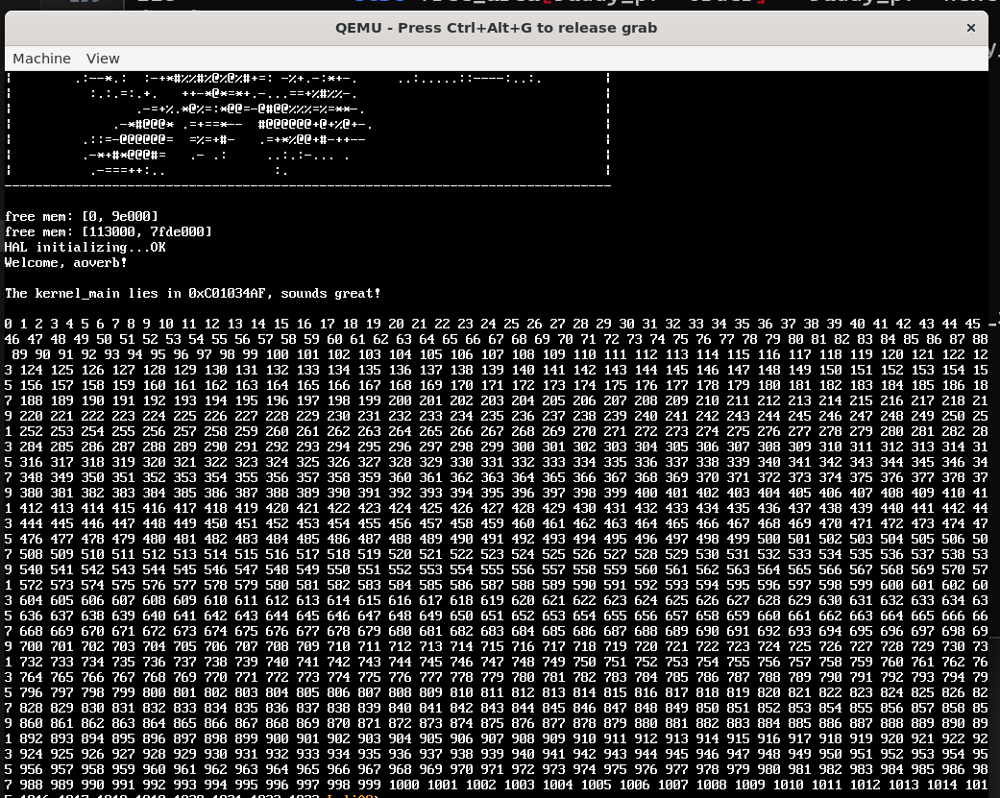
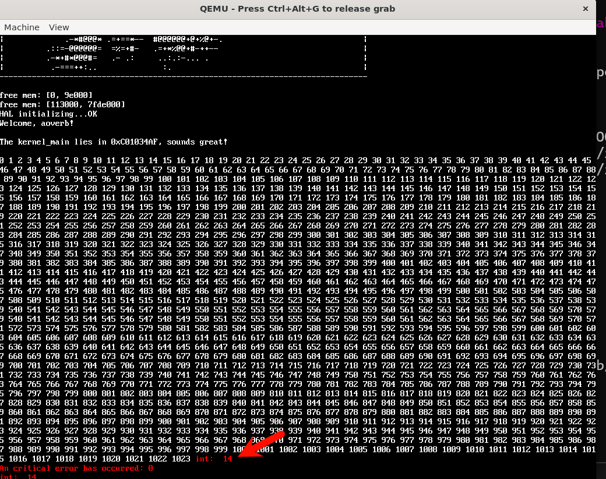
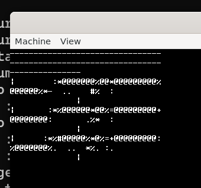
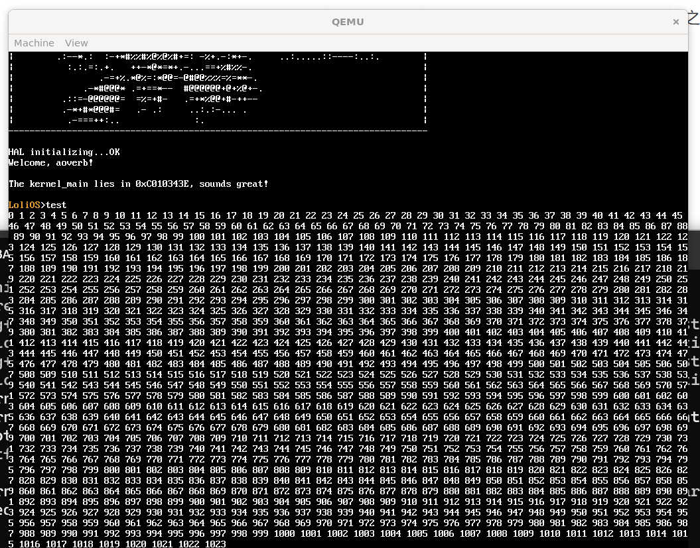

## 自制操作系统（9）：虚拟内存管理

在上一节，咱们实现了用Multiboot协议拿到空闲物理内存的分布，以及用自己实现的物理内存管理器（PMM）对这些空闲内存进行管理。但是现在还有一个问题，我们从PMM拿到的都是物理内存地址，而我们已经开启了分页机制，这使我们面临两个问题：

1、不是所有的空闲内存物理地址，都有对应的页映射。也就是很大一部分物理内存，是没办法通过虚拟地址访问的。

2、即使是那些有对应页映射的物理内存，我们也没办法直接访问，需要将物理内存地址映射到虚拟地址才能使用这些空闲内存，目前我们是采用硬编码的方式（+0xC0000000）；

那么接下来，我们要实现的虚拟内存管理，就能解决这两个问题。

### 基本接口

我们先来定义VMM的核心接口，以上面的问题来看，关键的接口其实就两个：

```cpp
// 将虚拟地址 vaddr 映射到物理地址 paddr，flags 是页表项的属性位
void vmm_map(uintptr_t vaddr, uintptr_t paddr, uint32_t flags);

// 取消虚拟地址 vaddr 的映射
void vmm_unmap(uintptr_t vaddr);
```

### 初步实现

接口需要实现的功能其实也很简单，对于用户给出的虚拟-物理地址映射，我们访问到页目录、页表相应的项，配置好描述符写入即可。但是我们要怎么访问页目录和页表呢？噢对，之前在做内核高半区的时候，我们把0x0和0xC0000000后面8MB的空间都以恒等映射的方式给映射进去了，那我们后面要写PTE、PDE，就只用这后面的物理地址呗，对吗？不对，这样的话，我们相当于有了两套管理物理地址的逻辑（还有之前写的PMM）！而且这样做的话，这后面8MB的物理地址就会突兀地成为了必须特殊对待的部分（就像现在这样），所以我们必须摆脱这种不统一与特殊性。

#### 鸡与蛋

那我们应该怎么做？接受这种特殊性，那么当我们访问8MB之外的物理地址时，用我们的PMM申请一块物理页来存放页表，这块物理页可能是任何一处的物理地址，所以我们得为这块物理页构造虚拟地址，这块物理页在我们设计的8MB之内的话就还好（因为在页表里面有对应的映射），在8MB之外的话，我们就得申请新的物理页去构造虚拟地址。。。死循环了。

那么怎么打破这种死循环呢？在x86上，有一种被称为“递归映射”的技巧就可以解决这个问题。

#### 递归映射

我们先来回顾下MMU是怎么把我们的虚拟地址转成物理地址的。

32位系统上，MMU把32位虚拟地址分成三段，前十位的PDE，10-20位的PTE，21-32位的OFFSET（偏移）。

CR3寄存器存有页目录的物理地址，MMU以PDE为偏移，去找到页目录下对应的页目录项，这个页目录项是一个32位的描述符，存放一个页表的物理地址，跟着这个物理地址再以PTE为偏移找到对应页的物理地址，一个页有4KB大，刚好对应上OFFSET的大小。

那么递归偏移，实际上就是让页目录的某一项指向它自己，通过构造特殊的虚拟地址，最终就可以映射到自己的物理地址。比如说，我们在页目录的第1023项上设置对页目录物理地址的映射，那么我们就可以通过访问虚拟地址0xFFFFF000来访问页目录，为什么？因为这个虚拟地址的PDE和PTE都是1023，MMU通过PDE[1023]找到了页目录的物理地址，就会把内存这里的内容理解成是一个页表，然后根据PTE找还是1023，于是我们还是回到了同一个地方，只不过这次，我们把这块地方理解成了一个页，也就可以用偏移自由去访问了。

有了递归映射，我们来看看怎么去把一个虚拟-物理地址映射写入页目录，首先我们同样把虚拟地址拆成三部分，对于第一部分也就是PDE，我们需要在页目录里面先找到对应的页目录项，以找到它对应的一张页表的虚拟地址，怎么找呢？我们用0xFFC00000 |（PDE << 12）去找就好了，用这个虚拟地址找的话，对于这个虚拟地址的PDE，我们就能以页表的语义去解读CR3里面地址对应的内存数据，再按照我们要插入的虚拟地址的PDE为索引去找就好了，由此我们得到了PDE对应的页目录项指向的页表的物理地址，要精确到页表里面某一个页表项的话，我们就再把上面访问的虚拟地址进化成0xFFC00000 |（PDE << 12）| (PTE << 2)，就能往这个地址写入一个页表项了，这个页表项需要我们在下面构造。

还有一件事：用0xFFC00000 |（PDE << 12）去找，经过MMU转译找不到对应的页表的话会有问题，所以我们需要事先识别，如果这块没有设置页表，我们需要用pmm_alloc分配一块，并设置上去再继续。

代码实现大概如下：

```cpp
static inline void flush_tlb() {
    asm volatile(
        "mov %%cr3, %%eax\n"
        "mov %%eax, %%cr3\n"
        ::: "eax"
    );
}

static inline void invlpg(uintptr_t addr) {
    asm volatile("invlpg (%0)" :: "r"(addr) : "memory");
}

void vmm_init() {
    PDE* pde_list = reinterpret_cast<PDE*>(page_directory);
    pde_list[1023] = {0};
    pde_list[1023].frame = pd_addr >> 12;
    pde_list[1023].read_write = 1;
    pde_list[1023].present = 1;

    flush_tlb();
}

void vmm_map_page(uintptr_t p_addr, uintptr_t v_addr, uint32_t flag) {
    if (p_addr & 0xFFF) panic("p_addr not aligned!");
    if (v_addr & 0xFFF) panic("v_addr not aligned!");
    uintptr_t pde = v_addr >> 22;
    uintptr_t pte = v_addr >> 12 & 0x3FF;
    PDE* pde_list = reinterpret_cast<PDE*>(pd_vaddr);
    if (!pde_list[pde].present) {
        // pmm分配一个物理页，写入对应的PDE
        uint32_t new_pt = reinterpret_cast<uint32_t>(pmm_alloc(1 << 12));
        if (!new_pt) panic("oom when trying to allocate new page for page table");
        pde_list[pde] = {0};
        pde_list[pde].user_super = (flag >> 2) & 1;
        pde_list[pde].frame = new_pt >> 12;
        pde_list[pde].read_write = 1;
        pde_list[pde].present = 1;
        invlpg(0xFFC00000 | pde << 12);

        PTE* pte_list = reinterpret_cast<PTE*>(0xFFC00000 | pde << 12);
        memset(pte_list, 0, sizeof(PTE) * 1024);
    }
    PTE* cur_pte = reinterpret_cast<PTE*>(0xFFC00000 | pde << 12 | pte << 2);
    if (cur_pte->present) panic("v_addr mapping already exist!");
    *cur_pte = {0};
    
    cur_pte->read_write = (flag >> 1) & 1;
    cur_pte->user_super = (flag >> 2) & 1;
    cur_pte->present = 1;
    cur_pte->frame = p_addr >> 12;

    invlpg(v_addr);
}
```

#### PDE PTE

```cpp
// Page Table Entry (4KB page)
typedef struct PTE {
    uint32_t present        : 1;  // P
    uint32_t read_write     : 1;  // R/W
    uint32_t user_super     : 1;  // U/S
    uint32_t write_through  : 1;  // PWT
    uint32_t cache_disable  : 1;  // PCD
    uint32_t accessed       : 1;  // A
    uint32_t dirty          : 1;  // D
    uint32_t pat            : 1;  // PAT
    uint32_t global         : 1;  // G
    uint32_t available      : 3;  // AVL (OS use)
    uint32_t frame          : 20; // Physical page frame number
} PTE;

// Page Directory Entry (points to page table)
typedef struct PDE {
    uint32_t present        : 1;  // P
    uint32_t read_write     : 1;  // R/W
    uint32_t user_super     : 1;  // U/S
    uint32_t write_through  : 1;  // PWT
    uint32_t cache_disable  : 1;  // PCD
    uint32_t accessed       : 1;  // A
    uint32_t reserved       : 1;  // 0 (ignored)
    uint32_t page_size      : 1;  // PS (0 = 4KB pages, 1 = 4MB page)
    uint32_t global         : 1;  // G (ignored if PS=0)
    uint32_t available      : 3;  // AVL (OS use)
    uint32_t frame          : 20; // Page table physical frame number
} PDE;
```

聚焦present、read_write、user_super和frame的设置即可，其余位我们在初始化时归零。

#### 测试

我们在内核主程序启动时，尝试申请一块4K的物理内存，并将其映射到虚拟内存`0xBEEF0000`，随后我们访问这个虚拟地址，顺序写入一些数据再打印出来，测试我们vmm实现的正确性：

```cpp
    void* m = pmm_alloc(4096);
    vmm_map_page(reinterpret_cast<uintptr_t>(m), 0xBEEF0000, 0x3);
    uint32_t* test_array = reinterpret_cast<uint32_t*>(0xBEEF0000);
    
    for (uint32_t i = 0; i < 1024; i++) {
        test_array[i] = i;
    }

    for (uint32_t i = 0; i < 1024; i++) {
        printf("%d ", test_array[i]);
    }
```

我们使用这样的代码来进行测试，效果如下：



一旦我们调大下面printf循环范围的大小，在越界后就会触发PF中断：



### 进一步的实现

我们现在实现了初始化、映射接口，我们来实现更多的接口。

#### 解除映射

既然能映射，那么肯定也能解除映射啦，解除映射是比较简单的，把对应页的P位（Present）置0为可，不过为了更健壮，我下面让整个页都置0了。而且要注意的是，我们要随时记得调用`invlpg`刷新页表记录。

```cpp
void vmm_unmap_page(uintptr_t v_addr) {
    if (v_addr & 0xFFF) panic("v_addr not aligned!");

    uintptr_t pde = v_addr >> 22;
    uintptr_t pte = v_addr >> 12 & 0x3FF;
    PDE* pde_list = reinterpret_cast<PDE*>(pd_vaddr);
    if (!pde_list[pde].present) {
        return;
    }
    PTE* cur_pte = reinterpret_cast<PTE*>(0xFFC00000 | pde << 12 | pte << 2);
    if (!cur_pte->present) return;
    *cur_pte = {0};

    invlpg(v_addr);
}
```

#### 查询映射

值得一提的是上面虽然解除了映射，但是我们没有将虚拟地址映射的物理页进行回收。我想我们应该把是否回收的决定权交给用户，由此，我们可以提供一个查询虚拟地址对应物理地址的函数，来供用户调用`pmm_free`释放物理页：

```cpp
uintptr_t vmm_get_mapping(uintptr_t v_addr) {
    if (v_addr & 0xFFF) panic("v_addr not aligned!");

    uintptr_t pde = v_addr >> 22;
    uintptr_t pte = v_addr >> 12 & 0x3FF;
    PDE* pde_list = reinterpret_cast<PDE*>(pd_vaddr);
    if (!pde_list[pde].present) {
        return 0;
    }
    PTE* cur_pte = reinterpret_cast<PTE*>(0xFFC00000 | pde << 12 | pte << 2);
    if (!cur_pte->present) return 0;
    return (cur_pte->frame << 12);
}
```

#### 清理低地址恒等映射

之前我们在boot.s把低地址也进行了一遍恒等映射，这样做的目的是让我们开启分页后EIP不会失效，而且GRUB传给我们的MBI地址也能用。但是低地址空间是非常宝贵的，我们在用完MBI后需要回收掉：

```cpp
void vmm_cleanup_low_identity_mapping() {
    PDE* pde_list = reinterpret_cast<PDE*>(page_directory);
    for (int i = 0; i < 2; i++) {
        if (pde_list[i].present) {
            pde_list[i] = {0};
        }
    }
    flush_tlb();
}

...
    
    terminal_initialize(mbi);
    vmm_cleanup_low_identity_mapping(); // 到这里清除了低地址的恒等映射，mbi就失效了
    mbi = NULL;
```

但是我们现在的pmm因为用的是buddy system管理，存储在all_pages和free_area的结构体指针都是低地址的，因此很明显不能直接清除，需要重新映射，这个部分，我们留在后面再做。

#### 连续内存申请

我们经常会需要一段连续的虚拟内存，因此我们需要提供一个函数来申请这样的内存。

我们先做一个简单的实现，以0xC0800000（我们此前在boot.s设置的高半区分页）为可申请内存的开头，向高地址递增申请虚拟内存，并在申请后更新这个开头，这样做好处是简单便捷，坏处是不支持回收内存，但是对于现在我们的内核开发已经足够了，后面有需要可以考虑用AVL树来改进：

```cpp
continuous_addr_begin = 0xC0800000;
...
uintptr_t vmm_alloc_pages(uint32_t size, uint32_t flag) {
    uintptr_t ret = continuous_addr_begin;
    for (uint32_t i = 0; i < size; i++) {
        if (vmm_get_mapping(continuous_addr_begin) != 0) panic("oom when vmm_alloc_pages!");
        uintptr_t p_addr = reinterpret_cast<uintptr_t>(pmm_alloc(1 << 12));
        vmm_map_page(p_addr, continuous_addr_begin, flag);
        continuous_addr_begin += (1 << 12);
    }
    return ret;
}
```

### 实战

差不多该把我们做好的VMM拉出来溜溜了。

#### 显存映射填坑

还记得我们之前埋下的一个坑吗？我们用大页来对显存区域做了虚拟地址映射，是时候摆脱这些丑陋的临时方案了。

```cpp
void map_lfb_hardcore(uint32_t phys_addr, uint32_t size) {
    phys_addr &= ~((1 << 12) - 1);
    uintptr_t vram_addr_begin = 0xD0000000;
    uintptr_t num_pages = (size + 0xFFF) / 0x1000;
    
    for (uintptr_t i = 0; i < num_pages; ++i)
        vmm_map_page(phys_addr + i * (1 << 12), vram_addr_begin + i * (1 << 12), 0x3);
}
```
当我以为这样就万事大吉的时候，启动一看，系统直接崩溃了，下面是我靠手速在崩溃之前进行的截图内容：

可以看到我们的一行文字变成了多行，列数不对，而且执行到第二个printf就崩溃了。后面结合Claude code进行排查，发现：

1、我显存计算高度的逻辑一开始就有问题；
2、我的滚屏逻辑有问题（怪不得一直以来这么慢！)；
3、最关键的是，我发现先执行上面的pmm_prepare再执行terminal_initialize，width就会变成256，把顺序调转过来就能恢复正常了，而这是因为我的pmm_prepare没将将mbi考虑在内，里面的内容被破坏了，导致tty获取的数据有问题。


前面的都是小问题，后面的pmm_prepare，我之前用的是非常复杂的嵌套逻辑，我让ai直接帮我重写了（这一段功能真的很无聊...要是让我自己写，这个项目就很难推进下去了...）。放过自己一马吧。



经此一役，我们的操作系统虽然看起来没什么变化（虽然滚屏变得迅速也是一种变化！），但内部的代码实现已经清爽很多了。

### 总结

这次，我们实现了虚拟内存的管理，我们现在有能力将任意一个物理地址映射到任意一个虚拟地址了！并且我们利用这一个功能，为我们的内存重新实现了优雅的映射！可喜可贺。

但是你会发现现在的VMM还有些问题，比如说，我们每次只能映射4KB的空间，需要映射大点的空间就需要循环；或者，我们需要一段连续的虚拟地址的话，一次两次还能应对，但如果这样的请求多了起来，怎么让映射的虚拟地址不冲突，是一个比较让人烦恼的问题。而这些，我们会放在下一篇实现内核堆管理器时一并解决。