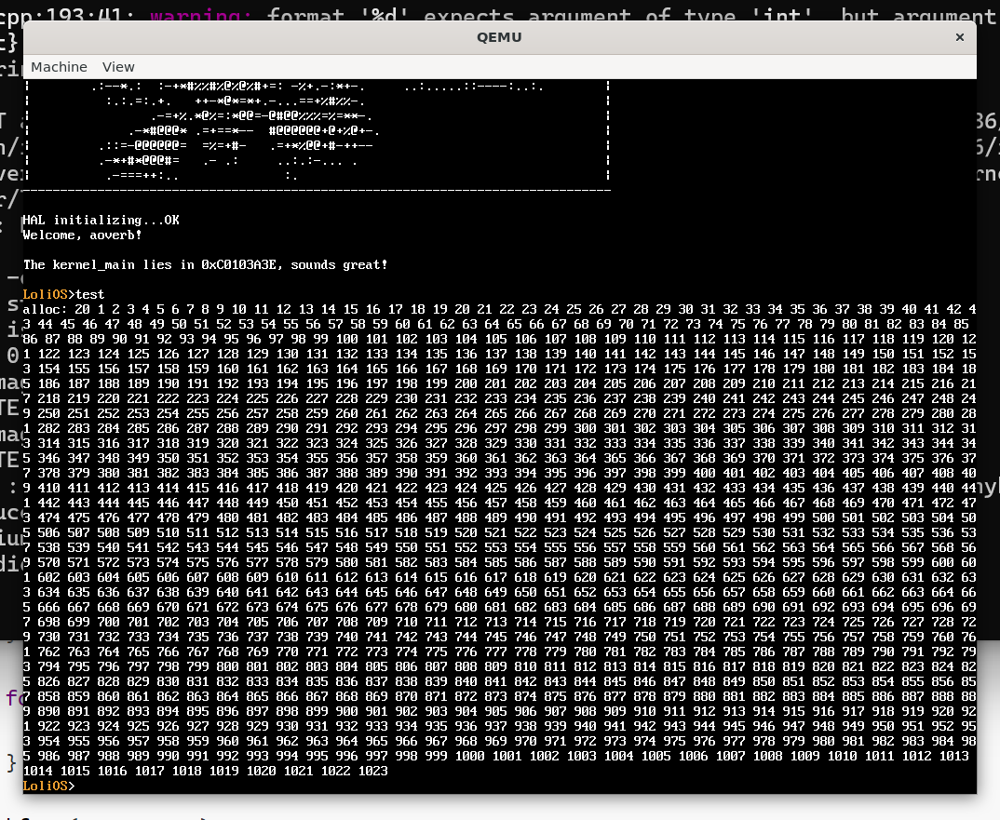

## 自制操作系统（10）：内核堆分配器

在上一节，我们成功地实现了虚拟内存管理器，并把显存的映射进行了重新调整，但是现在我们能申请的内存粒度过大，如果有这么一种经常出现情况：我们只需要申请若干个字节的内存，余下的内存就是一种浪费，造成过多的内部碎片。因此我们需要为内核开发实现一个粒度更小的可用空间管理器，也就是内核堆分配器。有了这样的分配器，我们就能像使用用户态的`malloc`和`free`一样，用`kmalloc`和`free`申请堆内存了。

### 接口

老规矩，我们先通过外部的接口来判断它能为我们带来什么。

```cpp
void kheap_init();
void* kmalloc(uint32_t size);
void kfree(void* addr);
```

...好吧，其实并不需要什么判断，我只是想把他们写出来。

### 实现

对于内核堆分配器，结合当前的情况（make it right），我们采用经典的链表+first fit实现，也就是，我们把整个堆空间看作一个链表，每项链表的头尾都记录了当前内存块的大小和分配信息，一开始链表只有一项，就是我们初始申请的堆空间。

每次调用`kmalloc`都会在这个链表里面找到第一个刚好能满足我们要求的块，找到之后把这个块拆开刚好为size为大小的块，和余下的空闲块，各记录好分配信息和大小后，把前者返回给用户，如果找不到符合要求的块，我们就向vmm申请更多的空间来扩展我们的内核堆。

为了更好地整合空间，每次调用`kfree`，除了记录分配信息，我们还需要把这个块两边的空间合并起来，管理好碎片。

整体策略看起来还是挺简单的，里面有一些细节，我们结合下面的代码示例来进一步讲解。

#### 基础结构

| type       | data           | size        | note                    |
| ---------- | -------------- | ----------- | ----------------------- |
| prologue   | CAFEBABE       | 4 Bytes     |                         |
| block_head | _SIZE \| alloc | 4 Bytes     |                         |
| block_data | …              | _SIZE Bytes |                         |
| block_tail | _SIZE \| alloc | 4 Bytes     | identical to block_head |
| epilogue   | CAFEBABE       | 4 Bytes     |                         |

初始化之后，我们的堆空间应该是这么一个结构，逐一解释：

##### prologue

"序幕"数据头，是一个4字节的魔数，在我们遍历整个堆空间时，可以通过检测这个魔数来判断我们有没有超出堆空间。

顺便一提用`prologue`这个词语来描述堆空间的边界上限是约定俗成的，确实也挺酷。

##### block

block是我们在堆空间内部描述可用空间的一个不定长结构，由`block_head`、`block_data`、`block_tail`组成。

block_head: 4字节大小，描述了block_data的大小，由于我们的block_data是八字节对齐的，这意味着它的大小的后三位一定是0，我们就可以在里面藏一个是否分配的标志位（alloc）。

block_data：数据块的内容。我们在内核堆分配器不去碰它，只会去计算它的大小。

block_tail: 跟block_head的内容保持一致。这样做是为了方便后面的块找到前面的块的边界（没有这个数据，后面的块是不能知道前面的块是多大的，也就不能确定边界了）

##### epilogue

“终幕”数据块，与prologue一样，是一个4字节的魔数，功能也一样。


如果进行了`kmalloc`、`kfree`操作，堆空间的布局无非就是多了几个连在一块的block，与上面大同小异。

#### kheap_init

我们来看看怎么把堆空间初始化成上面描述的布局。

一开始我们的堆空间..还没有空间呢，所以我们得找vmm申请一块`heap_initial_size`大（单位：4KB）的初始的连续空间，也就是用到上一篇实现的`vmm_alloc_pages`函数去申请；

然后用一个指针去记录。我们的布局里面有很多4字节的字段，所以我们可以用`uint32_t*`去接住申请的空间：

```cpp
void kheap_init() {
    heap_size = heap_initial_size;
    kheap_head = reinterpret_cast<uint32_t*>(vmm_alloc_pages(heap_initial_size, 0x3));
    
    set_prologue();
    ++kheap_head;
    set_block_size(kheap_head, heap_initial_size * 4096 - 4 * 4); // 头尾两个4字节的对称的块描述结构，记录块大小和是否已分配的信息
    block_free(kheap_head);
    set_epilogue();
    return;
}
```

接下来我们去把prologue设置好，并移动`kheap_head`四个字节，作为我们真正管理的堆空间的开头；

一开始，我们的堆空间只有一块，而且实际可使用大小是heap_initial_size减去4个4字节的描述块（序幕、终幕、该block本身的头尾），我们定义一个`set_block_size`来调整它的大小信息；

调整好后，我们把这个块的可分配位也调整为空闲标识，设置epilogue，初始化就完成了。

里面用到的一些函数都是一些地址运算+位运算，不难推出，不做赘述。

#### kmalloc

既然我们已经初始化好了堆空间布局（链表），那么调用`kmalloc`的时候，我们根据first fit策略，在这个链表去找一个能满足我们要求的块就好了，并拆开刚好为申请size大小，并往上对齐为8字节的块，和余下的空闲块：

```cpp
void* kmalloc(uint32_t size) {
    size = (size + 0x7) & ~0x7;
    free_block cur_block = kheap_head;
    while (cur_block) {
        if (!is_block_alloc(cur_block) && block_size(cur_block) >= size) {
            split_block(cur_block, size);
            block_alloc(cur_block);
            return cur_block + 1;
        }
        if (next_block(cur_block)) {
            cur_block = next_block(cur_block);
        } else {
            break;
        }
    }
    kheap_expand(cur_block, size);
    free_block new_block = coalesce(next_block(cur_block));
    split_block(new_block, size);
    block_alloc(new_block);
    return new_block + 1;
}
```

各记录好分配信息和大小后，把前者返回给用户，如果找不到符合要求的块，我们就向vmm申请更多的空间来扩展我们的内核堆。

##### split_block

```cpp
void split_block(free_block block, uint32_t size) {
    if (block_size(block) - size < 0x10) return; // 新的块应该至少能挤出头尾记录共8字节 + 8字节的空闲空间
    uint32_t new_block_size = block_size(block) - size - 0x8;
    set_block_size(block, size);
    free_block new_block = block + size / 4 + 2;
    set_block_size(new_block, new_block_size);
    block_free(new_block);
}
```

对于分离当前的块，我们新增一个块，还得多记录8字节的空间（旧块的尾部、新块的头部），而且还得有至少8字节的空间这个分离才有意义。

分离完成后更新各自的大小，把新块设为可用就搞定了。

##### kheap_expand

```cpp
void kheap_expand(free_block block, uint32_t size) {
    uint32_t alloc_pages = (size + 8 + 4095) / 4096;
    free_block new_block = block + block_size(block) / 4 + 2; // 指向epilogue
    vmm_alloc_pages_at(new_block + 1, alloc_pages, 0x3);
    set_block_size(new_block, alloc_pages * 4096 - 8);
    block_free(new_block);
    heap_size += alloc_pages;
    set_epilogue();
}
```

如果当前的堆空间不够用，我们就计算至少需要多少页才能满足要求，但在计算的时候别忘了我们还得额外申请8个字节，存储新块的信息。

然后，我们把之前的epilogue当作新块的头部用，先记录起来，再在epilogue后面的虚拟地址申请新的页，并设置新的块的信息（大小、空闲），更新整个堆的大小，设置新的epilogue边界，就可以了。

...慢着，*在epilogue后面的虚拟地址申请新的页*？我们好像还没有从某个虚拟地址开始申请新页的函数呢，所以我们还得回去vmm实现这个接口...

...但是一旦调用了这个接口，后面别的程序再调用vmm_alloc_pages，那不是一定会出错吗？

看来，我们的vmm_alloc_pages不适用于需要扩展连续的虚拟地址块的情况。我们这样做，自己在kheap的内部实现一个`alloc_pages`，并在虚拟地址空间的内核段划分一段地址，只给kheap用：

```cpp
uint32_t kheap_addr_space_begin = 0xD1000000;
constexpr uint32_t kheap_addr_space_end = 0xE1000000;
...

uintptr_t kheap_alloc_pages(uint32_t size, uint32_t flag) {
    uintptr_t ret = kheap_addr_space_begin;
    for (uint32_t i = 0; i < size; i++) {
        if (kheap_addr_space_begin >= kheap_addr_space_end) panic("kheap available space exhausted!");
        if (vmm_get_mapping(kheap_addr_space_begin) != 0) panic("oom when kheap_alloc_pages!");
        uintptr_t p_addr = reinterpret_cast<uintptr_t>(pmm_alloc(1 << 12));
        vmm_map_page(p_addr, kheap_addr_space_begin, flag);
        kheap_addr_space_begin += (1 << 12);
    }
    return ret;
}
```

（我们靠 `kheap_addr_space_begin` 自动递增来保证连续性）

然后修改`kheap_init`和`kheap_expand`：

```cpp
void kheap_expand(free_block block, uint32_t size) {
    uint32_t alloc_pages = (size + 8 + 4095) / 4096;
    free_block new_block = block + block_size(block) / 4 + 2; // 指向epilogue
    kheap_alloc_pages(alloc_pages, 0x3);
    set_block_size(new_block, alloc_pages * 4096 - 8);
    block_free(new_block);
    heap_size += alloc_pages;
    set_epilogue();
}
```

#### kfree

kfree的实现相对简单，把用户传入的地址-4字节，调整alloc为free就好了：

```cpp
void kfree(void* addr) {
    free_block block_addr = reinterpret_cast<free_block>(addr) - 1;
    block_free(block_addr);
    coalesce(block_addr);
}
```

##### coalesce

单纯的释放会产生许多的外部碎片，我们需要一个函数，能把指定块前后空闲的空间合并起来：

```cpp
free_block coalesce(free_block block) {
    free_block prev = prev_block(block);
    free_block next = next_block(block);

    bool prev_free = prev && !is_block_alloc(prev);
    bool next_free = next && !is_block_alloc(next);

    if (prev_free && next_free) {
        set_block_size(prev, block_size(prev) + block_size(block) + block_size(next) + 16);
        block_free(prev);
        return prev;
    } else if (prev_free) {
        set_block_size(prev, block_size(prev) + block_size(block) + 8);
        block_free(prev);
        return prev;
    } else if (next_free) {
        set_block_size(block, block_size(block) + block_size(next) + 8);
        block_free(block);
        return block;
    }

    return block;
}
```

### 实战

我们修改一下原本的test命令来测试一下：

```cpp
} else if (strcmp(input, "test") == 0) {
    uint32_t* test_array = reinterpret_cast<uint32_t*>(kmalloc(4096));

    for (uint32_t i = 0; i < 1024; i++) {
        test_array[i] = i;
    }

    for (uint32_t i = 0; i < 1024; i++) {
        printf("%d ", test_array[i]);
    }

    kfree(test_array);
```



感觉不错。

---

### 总结

这一节，我们实现了一个内核堆分配器，我们可以用kmalloc和kfree来申请任意大小的内存了！

那么，到目前为止，我们从跟随osdev完成了meaty skeleton开始，实现了像素显示模式的控制台，还有IDT和GDT的配置，键盘驱动，PIT驱动，到最近的令人痛苦的内存管理系列：VMM、PMM、内核堆分配器，真的是完成了很多事情！那么接下来，我们将进入多进程的世界...敬请期待！
