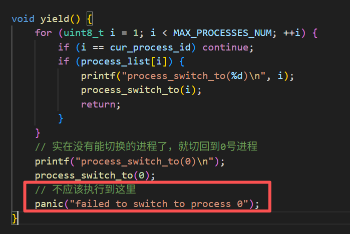
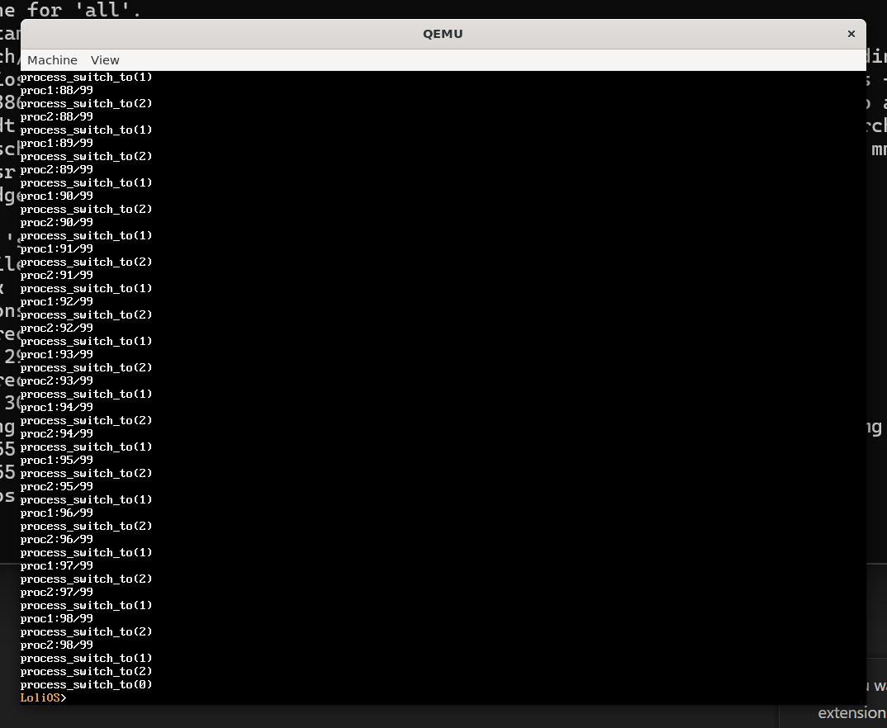

## 自制操作系统（11）：进程创建、调度与切换（上）

在上几章，我们成功地在我们的操作系统实现了内存管理模块，我们可以申请任意的堆空间了。那么接下来，我们进行勇敢的迈进——来看看怎么实现多进程。


### 多进程的本质

要聊多进程就得先聊聊进程，通俗地讲，进程就是运行中的程序，程序在我们的硬盘上，只是一个简单的文件，我们按它的规则把它读到内存里面，再把我们”下一条要执行的指令“指向这个程序的入口点，下面就能让这个程序的指令协同其数据在CPU上运行，这才是一个进程。我们现在的内核进程就是这样的。

多进程的本质是时分复用。一个CPU同时只能执行一条指令，但是通过在不同进程之前的快速切换，看起来就会像是同时在运行多个进程，而且每个进程都感觉自己在独占CPU、内存等资源。现在我们还处在内核态，所以我们在这一章会先实现内核进程的创建和调度，而不是隔离，隔离是我们在未来会在实现用户态进程创建的时候再去实现的事情，因为内核的代码由我们编写，应该是通过编码本身去保证内核代码的可靠性、安全性，而不是隔离。但是，我们可以稍微谈谈未来的“**隔离**”：

上面说到这种独占的体验，依赖的是我们对硬件资源的虚拟化（Virtualization），想想，我们之前花了那么大的功夫去做内核高半区、虚拟内存、分页...为什么不直接用物理内存呢？除了所谓的碎片管理外，还有很重要的原因，我们通过切换不同的页目录（更换CR3），因为有了虚拟地址的屏蔽，每个进程都像是独占所有的内存。很神奇吧？虚拟化是手段，让每个进程感觉自己都在独占所有的硬件资源，不会在执行的时候互相干扰（也就是”隔离“）才是目的。

怎么能让他们不互相干扰呢？拿我们现在的内核进程说，现在我们从头到尾都只有这一个进程，所以我们的进程确实在独占所有的硬件资源，那么，假设我们现在多出来了一个进程，为了让它们不相互影响。我们就得把现有的硬件资源暂时转移给这个新的进程使用，转移的过程就涉及怎么把这些资源上旧的数据保存起来，以及在转移的时候恢复回来的一些逻辑的实现。这些所有的需要保存和恢复的”旧的数据“，被称为“进程上下文”，包括寄存器和内存，而内存因为我们已经做过虚拟化了，可以通过切CR3一键切换虚拟内存，所以总的来说，我们需要保存的是寄存器里面的数据。

#### 接口

我们先来看看进程创建与调度相关的基本接口：

```cpp
uint32_t create_process(void* entry);
uint32_t exit_process(uint32_t pid);
```

以及记录进程上下文的结构PCB（Process control block，进程控制块）：

```cpp
struct PCB {
    uint32_t pid;

    // 通用寄存器
    uint32_t eax;
    uint32_t ebx;
    uint32_t ecx;
    uint32_t edx;
    uint32_t esi;
    uint32_t edi;

    // 栈与执行位置
    uint32_t esp;
    uint32_t ebp;
    uint32_t eip;

    // 标志寄存器
    uint32_t eflags;

    // 该任务的内核栈底（用于释放内存）
    uint32_t kernel_stack_bottom;
};
```

我们把各种PCB的指针通过一个数组组织起来统一管理：

```
static PCB* process_list[MAX_PROCESSES_NUM];
static uint8_t cur_process_idx;
```

为了方便说明，我们再新建一个进程调度相关的文件：`schedule.h`，定义一个函数`yield()`，来表示这个进程愿意主动让出硬件资源（切换到别的进程，给别的进程用）。

```cpp
void yield();
```

#### 进程逻辑初始化

对于我们现在已有的唯一的内核主进程，后面实现创建进程逻辑后，这些稍后被创建的进程在退出后，得返回到我们一开始的内核主进程，这就要求我们还得把一开始的主进程包装成一个进程，我们不妨把这个进程作为0号进程。

```
.global stack_bottom
```

```cpp
extern uintptr_t stack_bottom;

void process_init() {
    process_list[0] = reinterpret_cast<PCB*>(kmalloc(sizeof(PCB)));
    process_list[0]->kernel_stack_bottom = reinterpret_cast<void*>(stack_bottom);
    process_list[0]->pid = 0;
    cur_process_id = 0;
}


uint32_t exit_process(uint32_t pid) {
    if (pid == 0) return 1;
}
```

我感觉应该把从0号进程退出视为一种异常并返回，不然后面kfree掉一开始在.bss区的内核栈就麻烦了。

#### 创建进程

为了创建进程，理论上来说，我们需要一个代表进程入口点的函数的地址以供跳转，一个初始化好的虚拟内存空间以供进程在上面使用，还有初始化的寄存器状态供初始化进程的状态。但是对于内核进程，我们不需要初始化内存空间，这是因为一般来说我们的程序文件是会有很多段的，比如.bss是需要初始化为0的静态数据段，.data是需要进行指定初始化的静态数据段，.rodata是只读的不可修改的一些数据段，.text是需要执行的代码指令段，对于内核进程，我们一直用的是同一个虚拟内存，上面说的种种段早在引导阶段就被加载进程内存了，因此只需要提供入口点即可创建一个内核进程，后面切换到对应的入口点，就相当于切换内核进程，十分简单。

```cpp
uint32_t create_process(void* entry) {
    for (auto nid = 0; nid < MAX_PROCESSES_NUM; ++nid) {
        if (process_list[nid] == nullptr) {
            PCB*& new_process = process_list[nid];
            new_process = reinterpret_cast<PCB*>(kmalloc(sizeof(PCB)));
            memset(new_process, 0, sizeof(PCB));
            new_process->kernel_stack_bottom = kmalloc(4096);
            new_process->esp = (uintptr_t)(new_process->kernel_stack_bottom);
            new_process->ebp = (uintptr_t)(new_process->kernel_stack_bottom);
            new_process->eip = (uintptr_t)(entry);
            new_process->pid = nid;
            process_switch_to(nid);
            return nid;
        }
    }
    return 0;
}
```

在create_process，我们简单设置一下PCB对应的字段即可：找到process_list中的空位，分配一块内存存放PCB并置零，再分配一块内存作为它的内核栈、设置栈指针、把EIP设置为函数的入口点地址，设置pid，并返回该pid。

注意这里的process_switch_to，我们在创建进程后，应该要把当前运行的进程给切换到这个进程，我们留待后面讲上下文切换的时候再实现。

#### 退出进程

退出进程实际上是销毁进程，把分配的PCB内存、内核栈内存回收，置空对应pcb列表项即可。

```cpp
uint32_t exit_process(uint8_t pid) {
    if (pid == 0 || process_list[pid] == nullptr) return 1;
    PCB*& cur_process = process_list[pid];
    kfree(reinterpret_cast<void*>(cur_process->kernel_stack_bottom));
    kfree(reinterpret_cast<void*>(cur_process));
    cur_process = nullptr;
    yield();
    // 不应该执行到这里
    return 0;
}
```

#### 上下文切换

创建了进程，process_list也保存了相关的进程信息，那么我们该怎么去让我们的进程去“依次执行”呢？

##### 美好的世界

想象一个谦让的世界，这里的每个进程都愿意在执行一定程度的工作后，主动调用`yield`函数让出CPU，那么流程将会是进程1执行一段时间后主动让出——调度器选择另外一个进程2继续执行——另外一个进程执行一段时间后主动让出——...直到所有的进程执行完成任务。

那么也许，我们可以这样来实现yield函数：

```cpp
void yield() {
    for (uint8_t i = 1; i < MAX_PROCESSES_NUM; ++i) {
        if (i == cur_process_id) continue;
        if (process_list[i]) {
            process_switch_to(i);
        }
    }
    // 实在没有能切换的进程了，就切回到0号进程
    process_switch_to(0);
    // 不应该执行到这里
    panic("failed to switch to process 0");
}
```

这样朴素的实现或许就挺好，然后我们再来实现process_switch_to函数。

##### process_switch_to

process_switch_to值得特别一提。如果谈到process_switch_to本身应该做什么，应该是不难说明的，把当前的寄存器状态保存到当前进程的PCB，然后读入对应PCB的寄存器状态即可；可在实际的实现上，我们会遇到无法直接用`mov EIP, ...`这样的指令的问题，我们有两条路线，一条是往我们的内核栈里面push进入口地址，然后执行`ret`指令，那么这就会让我们“返回”到函数的入口地址，另一条是jmp到入口地址。对比来看，无非是简洁与直观的区别。我们这里选择把寄存器保存到本栈的方案，这样，我们还能获得新的便利：在PCB中保存ESP寄存器即可。

既然要通过执行假ret来改变EIP，那我们就得看看ret实际上是在执行什么：

```
pop eip    ; 把 esp 指向的值弹到 eip，然后 esp += 4
```

也就是说，我们可以通过汇编指令，去把esp赋值为对应PCB块的esp，再调用pop去恢复寄存器，最后调用一个ret跳到对应的入口函数（或者说，该进程上次yield的地方），这要求我们在create_process阶段就把新进程的内核栈帧给准备好，于是，我们需要更新PCB和create_process：

```cpp
typedef struct PCB {
    uint8_t pid;
    uintptr_t esp;
    // 该任务的内核栈底（用于释放内存）
    void* kernel_stack_bottom;
} PCB;

uint32_t create_process(void* entry) {
    for (auto nid = 0; nid < MAX_PROCESSES_NUM; ++nid) {
        if (process_list[nid] == nullptr) {
            PCB*& new_process = process_list[nid];
            new_process = reinterpret_cast<PCB*>(kmalloc(sizeof(PCB)));
            memset(new_process, 0, sizeof(PCB));
            new_process->kernel_stack_bottom = kmalloc(4096);
            new_process->esp = (uintptr_t)(new_process->kernel_stack_bottom) + 4096;
            *((uintptr_t*)((new_process->esp - 4))) = reinterpret_cast<uintptr_t>(&exit_process_wrapper);
            *((uintptr_t*)(new_process->esp - 8)) = reinterpret_cast<uintptr_t>(entry);
            *((uintptr_t*)(new_process->esp - 12)) = 0; // ebx
            *((uintptr_t*)(new_process->esp - 16)) = 0; // esi
            *((uintptr_t*)(new_process->esp - 20)) = 0; // edi
            *((uintptr_t*)(new_process->esp - 24)) = 0; // ebp
            new_process->esp -= 24;
            new_process->pid = nid;
            process_switch_to(nid);
            return nid;
        }
    }
    return 0;
}
```

注意我还多压了一个exit_process_wrapper函数来退出当前进程，不然我们的程序ret之后，要么不知道跑哪去然后崩溃，要么就直接崩溃了，这个函数的实现如下：

```cpp
void exit_process_wrapper() {
    exit_process(cur_process_id);
}
```

由此，我们可以来通过汇编来实现process_switch_to：

```assembly
.extern process_list
.extern cur_process_id
.global process_switch_to

process_switch_to:
    pushl %ebx
    pushl %esi
    pushl %edi
    pushl %ebp

    #保存...
    movzbl cur_process_id, %eax
    movl process_list(, %eax, 4), %eax
    movl %esp, 4(%eax)

    #更新cur_process_id和esp寄存器...
    movzbl 20(%esp), %eax
    movl process_list(, %eax, 4), %eax
    movl (%eax), %ebx
    movb %bl, cur_process_id
    movl 4(%eax), %esp

    popl %ebp
    popl %edi
    popl %esi
    popl %ebx

    ret
    
```

（上面短短的汇编写了我好久...）

事不宜迟，我们来创建两个函数，代表两个独立的进程：

```cpp
void proc1() {
    for (uint32_t i = 0; i < 99; i++) {
        printf("proc1:%d/99\n", i);
        yield();
    }
}

void proc2() {
    for (uint32_t i = 0; i < 99; i++) {
        printf("proc2:%d/99\n", i);
        yield();
    }
}

...kernel_main
    process_init();
    asm volatile ("sti");
    printf("OK\n");
    printf("Welcome, aoverb!\n\n");
    printf("The kernel_main lies in %X, sounds great!\n\n", &kernel_main);
    char input[256];
    
    create_process(reinterpret_cast<void*>(&proc1));
    create_process(reinterpret_cast<void*>(&proc2));
...
```


哎呀。。。有问题。。。



后面发现，不能这么写。。。



可以了！现在，我们可以看到我们的1号进程和2号进程并驾齐驱，交替执行！我们终于迈出了多进程可喜的第一步！

##### 现实的世界

现在让我们稍微冷静，回到现实的世界——进程之间可不会互相谦让，比如说，大家都不肯yield出CPU资源，或者说更复杂的情况，进程没法yield出CPU，这要怎么办呢？我们现在的调度算法是约等于没有的，需要一个更好的调度算法，这个就留在下篇展开讲解了。