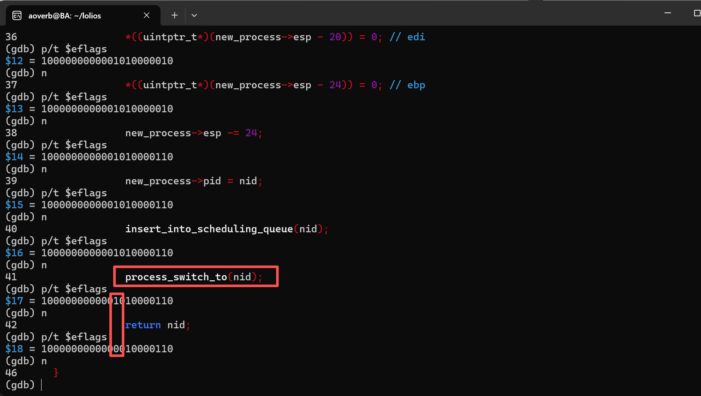
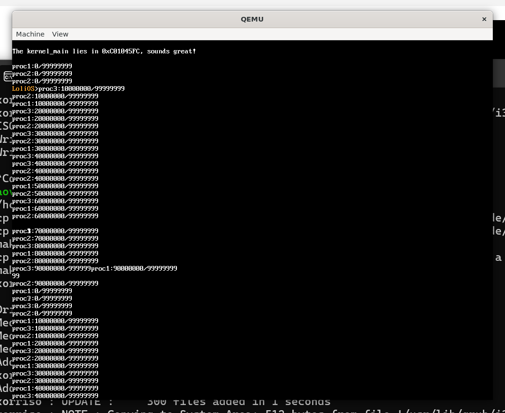
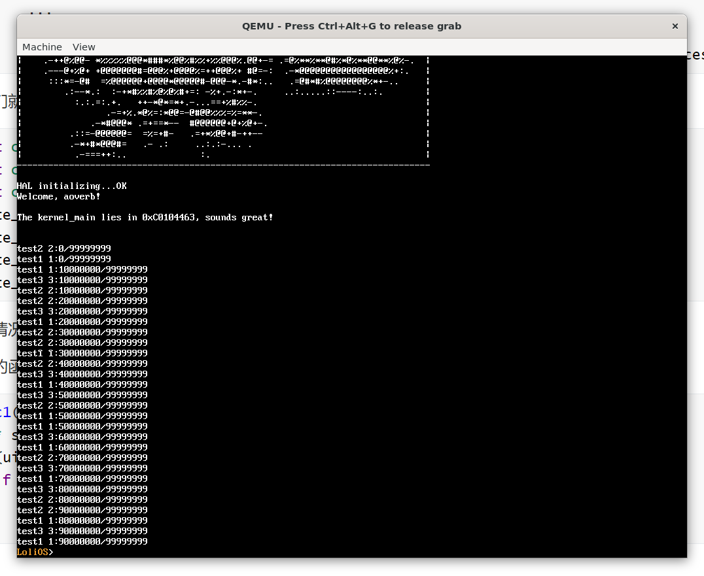
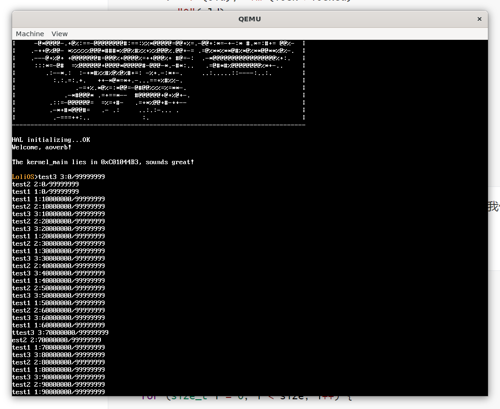

## 自制操作系统（12）：进程创建、调度与切换（下）

上一篇，我们在自制的操作系统中实现了一个初步的多进程实现，之所以说是初步实现，是因为现在多进程的调度器调度算法还不公平，而且调度时，不应该排除0号进程，而且我们能接受的入口点函数不应该排除带入参的情况。

### 分离shell

我们先做点简单的事，把shell从我们的0号进程分离开，作为1号进程，其实就是提取成一个函数，再在kernel_main用create_process去启动。

```cpp
extern "C" void kernel_main(multiboot_info_t* mbi) {
    pmm_prepare(mbi);
    
    ...
    
    printf("Welcome, aoverb!\n\n");
    printf("The kernel_main lies in %X, sounds great!\n\n", &kernel_main);
    
    create_process(reinterpret_cast<void*>(&shell));
    while (1) {
        yield();
    }
}
```

我们让0号进程一直让出。

### 更公平的调度算法-MLFQ

现在的调度算法太简单了，首先，它依赖进程的主动让出，如果进程一直不让出，就会让其它进程“饿死”；其次它优先执行序号靠前的进程，而这没有任何道理。

```cpp
void yield() {
    for (uint8_t i = 1; i < MAX_PROCESSES_NUM; ++i) {
        if (i == cur_process_id) continue;
        if (process_list[i]) {
            process_switch_to(i);
            return;
        }
    }
    // 实在没有能切换的进程了，就切回到0号进程
    process_switch_to(0);
    return;
}
```

我们给它升级成MLFQ算法，这是一个有多个队列，每个队列代表一个优先级的调度算法，该调度算法每一段时间强制执行一次重调度，优先执行优先级最高的队列的进程。所有进程被创建时都会被放在最高的队列，当它们在当前队列赋予的时间配额用光时，就会被移到优先级较次的队列并重新赋予配额。最后，每隔一段时间，所有进程会被移动到优先级最高的队列。

这个算法有很多好处，不会有饿死问题，更快的响应时间...等等。关于这个算法的详细介绍，可阅读OSTEP。

#### 数据结构

```cpp
constexpr uint8_t NUM_PRIORITY = 5;
constexpr uint8_t MAX_PRIORITY = NUM_PRIORITY - 1;
constexpr uint8_t MAP_PRIORITY_TO_QUOTA[NUM_PRIORITY] = {32, 16, 8, 4, 2};
PCB* sche_queue_head[NUM_PRIORITY];

constexpr uint16_t RESETCNT_INITIAL = 500;
uint16_t resetcnt = RESETCNT_INITIAL;
```

我这里把优先级队列分为5个，数字和索引越大优先级越高，对应的初始时间片为{32, 16, 8, 4, 2}（Claude告诉我这样最好），重置优先级的tick数是500（也是Claude告诉我这样最好）。

队列的实现形式是环形链表，这样做有很多好处，最大的好处是我既不用手搓队列，也不需要多记录一个尾指针，合并两个链表的操作也很方便。

同样的，我们需要在PCB里面多记录一些调度相关的信息，如优先级、剩余时间配额、前驱后继指针...

```cpp
typedef struct PCB {
    ...

    uint16_t priority;
    uint16_t quota;
    PCB* prev;
    PCB* next;
} PCB;
```


#### 插入和移除逻辑

```cpp
void insert_into_scheduling_queue(uint8_t pid);
void remove_from_scheduling_queue(uint8_t pid);
```

两个接口的实现逻辑我不打算在这里赘述，但我的设计意图是让这两个接口尽量简单，实现尽量高效（O(1)！），多亏了环形链表，高效的实现并不复杂。


#### 调度逻辑

```cpp
void schedule() {
    PCB* cur_pcb = process_list[cur_process_id];
    if (--(cur_pcb->quota) == 0) {
        if (cur_pcb->priority > 0) {
            remove_from_scheduling_queue(cur_process_id);
            insert_into_queue(cur_pcb, cur_pcb->priority - 1);
        }
        cur_pcb->quota = MAP_PRIORITY_TO_QUOTA[cur_pcb->priority];
    }
    if (--resetcnt == 0) {
        resetcnt = RESETCNT_INITIAL;
        move_all_to_top_priority();
    }
    PCB* chosen_process = nullptr;
    for (int i = NUM_PRIORITY - 1; i >= 0; --i) {
        if (sche_queue_head[i]) {
            chosen_process = sche_queue_head[i];
            sche_queue_head[i] = sche_queue_head[i]->next;
            break;
        }
    }
    if (!chosen_process) {
        chosen_process = process_list[0];
    }
    process_switch_to(chosen_process->pid);
}
```

我们可以在定时中断的地方去触发这个`schedule`来触发调度逻辑。上面干的事情很简单，减少当前进程的时间配额，如果配额为0就降低优先级，如果已经是最低优先级了就直接重置配额即可（也只能这么做了），后面的选择进程切换的逻辑会保证不让同一优先级的别的进程饿死；还有就是如果经过了一段比较长的时间（这里是500个tick，也就是5秒），就把所有的进程移到最高的优先级。

切换进程时，选一个优先级尽可能高的有进程存在的队列切换，并在切换前把链表的头指针往后继走一位。

#### 重置优先级的逻辑

```cpp
void move_all_to_top_priority() {
    for (int i = 1; i < NUM_PRIORITY; ++i) {
        if (!sche_queue_head[i - 1]) continue;
        if (sche_queue_head[i]) {
            sche_queue_head[i]->prev->next = sche_queue_head[i - 1]->next;
            sche_queue_head[i - 1]->next->prev = sche_queue_head[i]->prev;
            sche_queue_head[i]->prev = sche_queue_head[i - 1];
            sche_queue_head[i - 1]->next = sche_queue_head[i];
        } else {
            sche_queue_head[i] = sche_queue_head[i - 1];
        }
        sche_queue_head[i - 1] = nullptr;
    }
    PCB* head = sche_queue_head[MAX_PRIORITY];
    PCB* tail = head;
    do {
        tail->priority = MAX_PRIORITY;
        tail->quota = MAP_PRIORITY_TO_QUOTA[MAX_PRIORITY];
        tail = tail->next;
    } while (tail != head);
}
```

从优先级低的队列开始向上合并，最后重新设置该队列所有进程的优先级和配额。重新设置优先级和配额这里是O(n)，比较低效，但考虑到重置逻辑的执行频率，也许并不是什么要紧的瓶颈。

#### 一些坑

在调试调度器的过程，我发现进程并没有交替执行（而且出来的进程号也很奇怪...不过这是别的问题了）。一开始我以为是时间片太少了，或者每个进程执行的任务不够多，发现并不是这个问题。

后面通过gdb调试发现，居然是中断被关了，进一步排查，是在`process_switch_to`之后被关了。



这就要说回我们上一篇的`process_switch_to`了...我发现我们居然没有保存eflag，而且创建新进程时也没有打开中断，所以需要去修复这两处Bug。



修复之后我们的多进程逻辑就能愉快地跑起来了。Yes！

但是你其实可以注意到，上面控制台的输出有异常，这是因为我们没有给控制台输出加锁所造成的。（说到底，我们还没有实现锁呢！）这个需要后面再修复。

### 创建具有入参的进程

把返回地址放在栈顶，把入参放在返回地址的后面，这个是cdecl规定的，因此，我们再在create_process时多传入一个指向所有入参的地址，构造栈帧时放在返回地址的后面即可：

```cpp
uint32_t create_process(void* entry, void* args) {
    for (auto nid = 0; nid < MAX_PROCESSES_NUM; ++nid) {
        if (process_list[nid] == nullptr) {
            ...
            *((uintptr_t*)(new_process->esp - 4)) = reinterpret_cast<uintptr_t>(args);
            *((uintptr_t*)(new_process->esp - 8)) = reinterpret_cast<uintptr_t>(&exit_process_wrapper);
```

接下来，我们就可以像这样传递入参：

```c++
    const char* c1 = "test1";
    const char* c2 = "test2";
    const char* c3 = "test3";
    create_process(reinterpret_cast<void*>(&proc1), (void*)c1);
    create_process(reinterpret_cast<void*>(&proc1), (void*)c2);
    create_process(reinterpret_cast<void*>(&proc1), (void*)c3);
    create_process(reinterpret_cast<void*>(&shell), nullptr);
```

没有入参的情况，我们直接传一个空指针即可。

我们主进程的函数会收到这个入参，我们按实际情况作相应转换即可。

```cpp
void proc1(void* args) {
    char* s = reinterpret_cast<char*>(args);
    for (uint32_t i = 0; i < 99999999; i++) {
        if (i % 10000000 == 0) printf("%s %d:%d/99999999\n", s, cur_process_id, i);
    }
}
```



这样我们就能在创建进程的时候传递入参了。

### 进程状态

目前来说，我们的进程只有两种状态（隐式）：正在运行和就绪，考虑到更好地对我们的进程进行管理，以及优化整体的调度策略，我们有必要引入进程状态，也就是给我们的PCB增加一个state字段，来表示当前进程正在处于什么状态。目前来说，我们需要四种状态，就绪，运行中，阻塞中和终止中。

```cpp
enum class process_state {
    READY = 0, // 进程正在等待被调度
    RUNNING = 1, // 进程正在运行
    BLOCKED = 2, // 进程正在等待某种事件的发生
    ZOMBIE = 3 // 进程已经终结，等待资源被回收
};

typedef struct PCB {
    uint8_t pid;
    uintptr_t esp;
    // 该任务的内核栈底（用于释放内存）
    void* kernel_stack_bottom;

    uint16_t priority;
    uint16_t quota;
    uint32_t create_time;
    process_state state;
    PCB* prev;
    PCB* next;
} PCB;
```

下面我们来针对各个状态来讨论适配代码：

#### 就绪与运行态

当一个进程被创建时，它就会被设置为就绪状态，并加入调度队列；

当一个进程被调度时，它会把当前正在运行的进程设置为就绪状态，将其重新加入调度序列，而该进程自身就会被移出调度队列，并被设置为运行状态。

也就是说，按照我们之前的设计，我们是把所有的进程都会放在调度队列里，被调度后进程又被重新放回队列后面，现在不一样了，我们的队列里面，只会存放就绪状态的进程。

##### 抽离进程队列逻辑

既然我们预料到后面会有各种的队列，我们最好把队列这个概念从调度队列中抽离出来，成为一个进程队列。

```cpp

bool insert_into_process_queue(process_queue& queue, PCB* process) {
    if (process == nullptr || process->prev != nullptr || process->next != nullptr) {
        // 重复插入直接忽略
        return false;
    }
 
    if (queue) {
        process->next = queue;
        process->prev = queue->prev;
        queue->prev->next = process;
        queue->prev = process;
    } else {
        process->next = process;
        process->prev = process;
        queue = process;
    }
    return true;
}

void remove_from_process_queue(process_queue& queue, uint8_t pid) {
    // 不打算在这里检查pid对应的PCB是否在传入的queue中，调用者应该做检查
    PCB* cur_pcb = process_list[pid];
    PCB* prev_pcb = cur_pcb->prev;
    PCB* next_pcb = cur_pcb->next;
    if (cur_pcb == prev_pcb) {
        queue = nullptr;
        cur_pcb->prev = cur_pcb->next = nullptr;
        return;
    }
    
    if (prev_pcb) prev_pcb->next = next_pcb;
    if (next_pcb) next_pcb->prev = prev_pcb;

    if (queue == cur_pcb) {
        queue = cur_pcb->next;
    }

    cur_pcb->prev = cur_pcb->next = nullptr;
}
```

以后我们会有各种的进程队列，因此尽早抽离会更好。

#### 阻塞状态

阻塞状态的进程是在等待某种事件（比如说，互斥锁，休眠结束事件等）。

按照上面的逻辑，正在运行的进程不处于任何队列，于是我们可以很方便地把当前进程的状态设置为阻塞态，然后把自身放入一个特定事件的等待队列里，并让出CPU。

当特定事件发生时，代表我们等待的某些原本阻塞的情况已经被满足，也就意味着我们的程序已经就绪，这个时候，事件的处理函数会把我们重新设置为就绪态，并把我们放回调度序列。

#### 终结待回收状态

我们之前终结进程的逻辑是这样的：

```cpp
uint32_t exit_process(uint8_t pid) {
    if (pid == 0 || process_list[pid] == nullptr) return 1;
    remove_from_scheduling_queue(pid);
    PCB*& cur_process = process_list[pid];
    kfree(reinterpret_cast<void*>(cur_process->kernel_stack_bottom)); // 内核栈被释放！
    kfree(reinterpret_cast<void*>(cur_process));
    cur_process = nullptr;
    yield();
    // 不应该执行到这里
    return 0;
}
```

可以看到上面的注释对应的代码之后，内核栈已经被释放了，理论上，我们不应该再调用任何函数，但是我们却这么做了，这是一个很严重的问题。有了进程状态后，我们就可以把当前的进程态设置为终结待回收状态，放入一个垃圾回收的等待序列，后面再去让特定的进程帮我们回收掉。我们让0号 idle进程去我们做回收。为什么？因为0号进程永远不会被结束，而且0号进程本来什么事都不会干，所以不会有任何干扰。

```cpp
extern "C" void kernel_main(multiboot_info_t* mbi) {
    ...
    create_process(reinterpret_cast<void*>(&shell), nullptr);
    
    while (1) {
        do_process_recycle();
        yield();
    }
}
```

修改后的进程退出逻辑和回收队列相关逻辑如下：

```cpp
void free_pcb(PCB*& process) {
    kfree(reinterpret_cast<void*>(process->kernel_stack_bottom));
    kfree(reinterpret_cast<void*>(process));
    process = nullptr;
}

uint32_t exit_process(uint8_t pid) {
    if (pid == 0 || process_list[pid] == nullptr) return 1;
    remove_from_scheduling_queue(pid);
    PCB*& cur_process = process_list[pid];
    if (pid != cur_process_id) {
        free_pcb(cur_process);
        return 0;
    } 
    cur_process->state = process_state::ZOMBIE;
    insert_into_process_recycle_queue(cur_process);
    yield();
    // 不应该执行到这里
    return 0;
}
process_queue process_recycle_queue;

void insert_into_process_recycle_queue(PCB* process) {
    insert_into_process_queue(process_recycle_queue, process);
}

void do_process_recycle() {
    while (process_recycle_queue) {
        uint8_t pid = process_recycle_queue->pid;
        remove_from_process_queue(process_recycle_queue, process_recycle_queue->pid);
        free_pcb(process_list[pid]);
    }
}
```

### 锁

按理来说，我们今天的任务已经完成了，遗憾的是我们的控制台显示Bug还没有修复，因此，我觉得我们应该至少在这里先实现一个自旋锁来解决这个问题。

```cpp
typedef struct spinlock {
    volatile uint32_t locked = 0;
} spinlock;

void spinlock_acquire(spinlock* lock) {
    while(1) {
        uint32_t old = 1;
        asm volatile ("xchgl %0, %1"
        : "=r"(old), "+m"(lock->locked)
        : "0"(old)
        : "memory"
        );
        if (old == 0) break;
        asm volatile("pause");
    }
}

void spinlock_release(spinlock* lock) {
    lock->locked = 0;
}
```

自旋锁的核心是`xchgl`这个原子的汇编指令，这个指令的作用是交换两个值。我们用这个值来同时获取并更新锁的值，就能保证同时只有一个进程能进入被锁的区域了。

最后我们在terminal_write加上这把自旋锁：

```cpp
...
#include <kernel/spinlock.h>
...
spinlock tty_lock;
...
void terminal_write(const char* data, size_t size) {
    spinlock_acquire(&tty_lock);
    for (size_t i = 0; i < size; i++) {
        ...
    }
    spinlock_release(&tty_lock);
}
```

最后我们来看看效果。



好吧，每行输出的完整性还是被破坏了，但是至少，我们能输出完整的字符了，滚屏也没有问题了。

要保证每行输出的完整性，我们就得重新设计printf，把要输出的字符格式化到一个缓冲区，并调用一个新的，输出一整行字符的`terminal_write`。但是别沮丧，我们今天做的已经够多了。现在这个结果，已经挺令人满意的了。

---

### 总结

今天我们实现了一个更好的调度器——借助MLFQ，多级反馈队列，我们还把shell分离作为1号进程（后面我们还要把这个进程移到用户态），具备了创建具有入参进程的功能，还实现了自旋锁，并利用它来锁住我们的tty防止进程输出打架。相当不错的一天！

那么下一步，我们是时候！进入用户态了！在下一篇，我们将跳出ring 0，来到ring 3的世界！我们将创建第一个用户态进程！习惯了在内核态编程的我们，想必会在用户态的世界里面碰到不少钉子。无论如何，我们需要耐心，那么下篇再见吧。