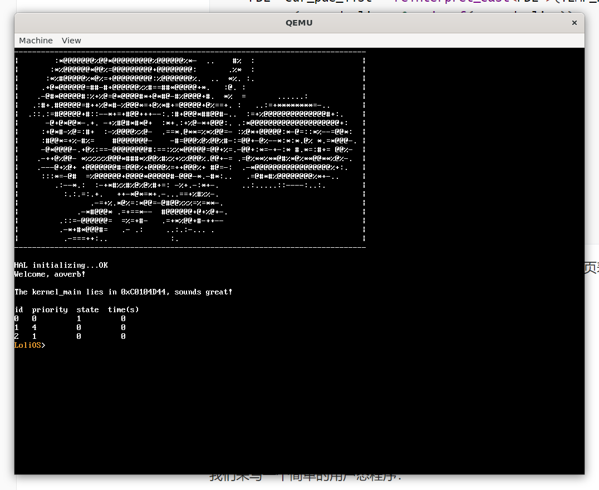
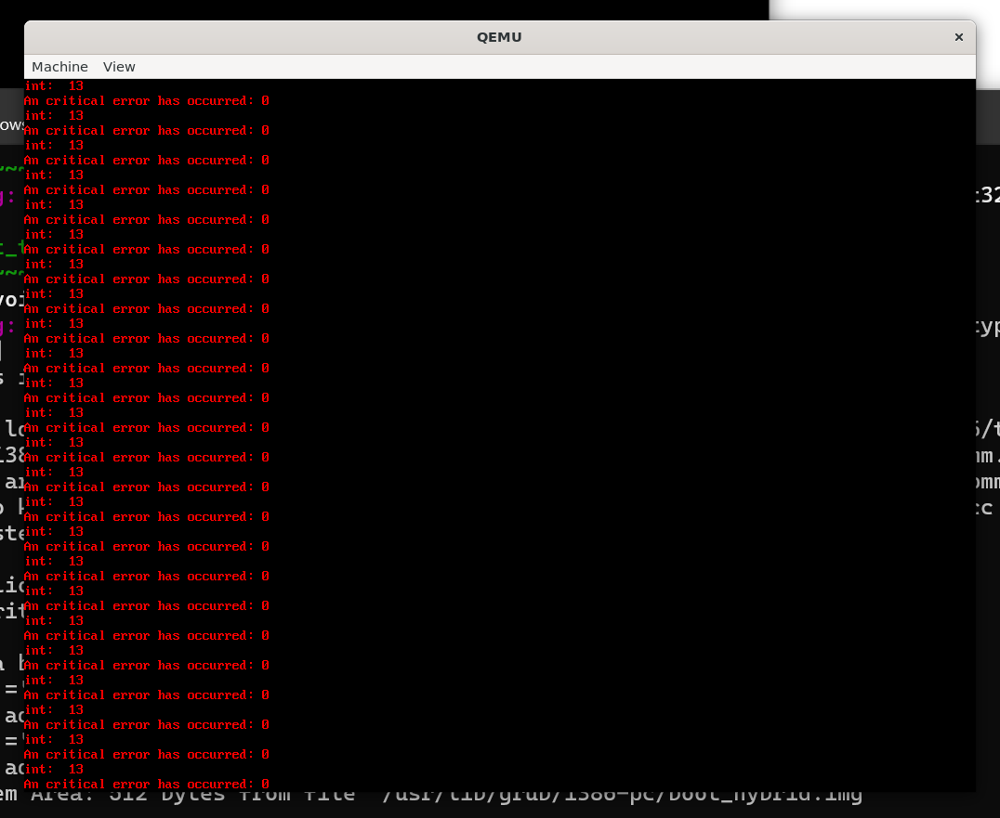
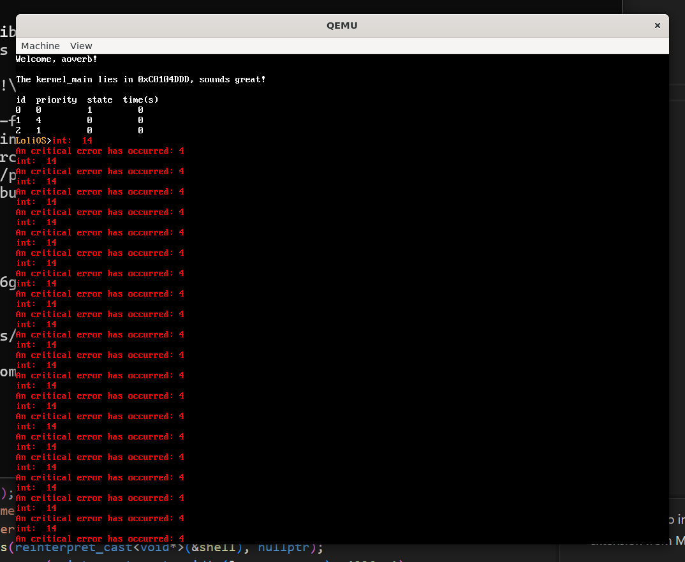
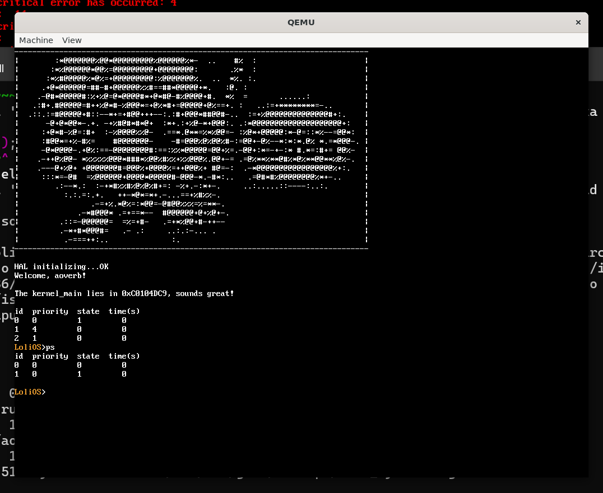
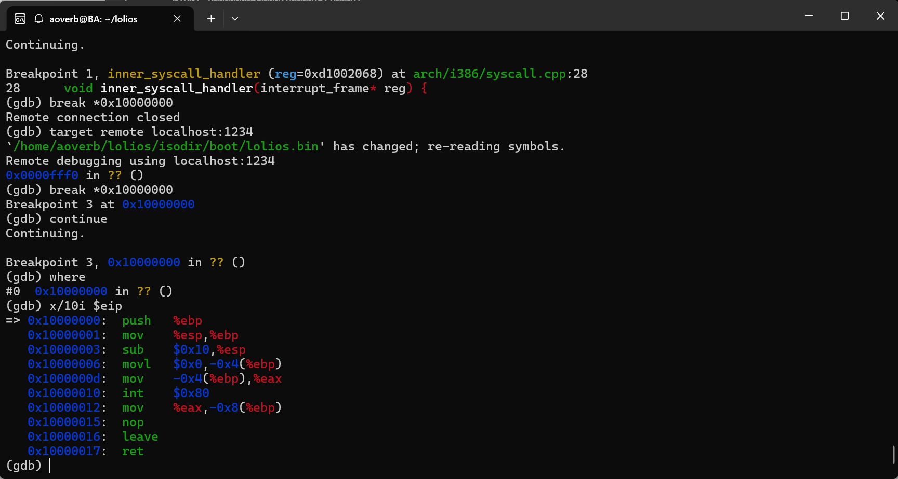
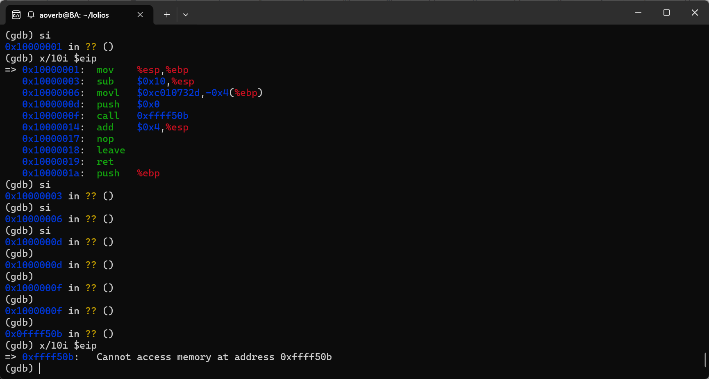
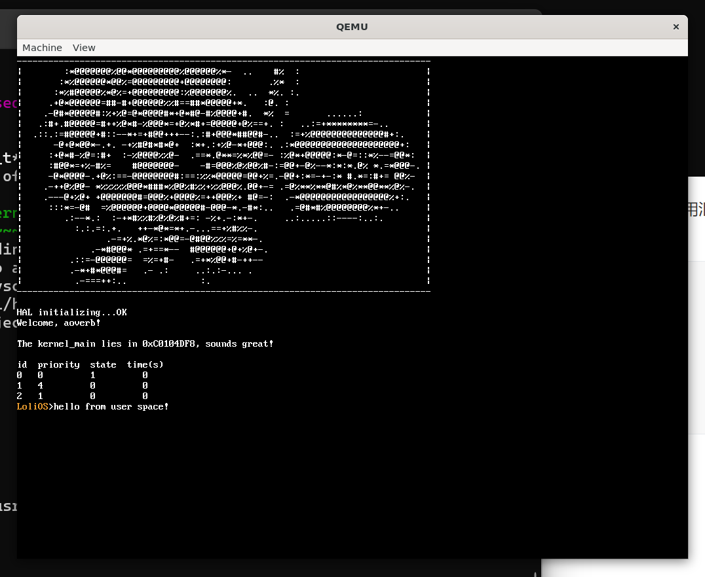

## 自制操作系统（13）：用户态进程

上一篇，我们把内核态进程给收了下尾，完善了很多进程相关的特性，但是我们现在还是处于内核态。

而从这一节开始，我们终于要走出内核态，步入用户态的世界了。

### 用户态vs内核态

...但是我们为什么需要用户态进程呢？

你可能会想，用户态更安全，因为它只能够执行一些非特权指令，以及调用我们给它准备好的系统调用，而且即使用户态的进程崩溃了，也不会导致整个操作系统的崩溃，用户态的进程也有自己的虚拟地址空间，不会污染到内核空间。是的！这就是我们之前做内核进程时回避掉的一点：隔离！而今天我们就要来实现它。

### 用户态进程创建的基础设施

要创建用户态的进程，得思考下面两个问题：

要怎么保证内核安全，也就是不让用户态去读写内核态空间的数据，也不让内核态去执行用户态空间的代码？

该怎么去让用户态可以暂时陷入内核态去执行一些系统调用，还能让它再回到用户态？

对于第一个问题，我们可以往GDT里面再写入两个表项，这两个表项的设置基本与内核态表项（我们之前设置过）一致，之所以要多加两个项是因为这两个项有别于内核态的两个项，它让CPU知道自己在RING3，这样在访问内核态的数据时就会触发缺页异常。

对于第二个问题，我们可以设置一个特殊的软件中断，来让用户态的进程触发，进入内核态。注意，我们本来在用户态的栈，在进入内核态后就不能继续用了，因为用户态的ESP可以被任意指定，不可信，一旦内核态直接借来用，就可能被用户态利用往任意地址写入数据了，所以我们得找到我们当前进程对应的内核栈。那么要怎么找到内核栈呢？CPU会在陷入异常时为我们做很多事情，其中一个就是读取一个叫TSS的数据结构，并把里面存储的数据读取到寄存器，我们可以事先设置好这个数据结构与栈相关的项，让它能够在陷入异常时自动帮我们切换内核栈，并把我们在用户态的寄存器数据放到内核栈上。

陷入到系统中断后，要返回用户态有很多种办法，我们将会采用`iret`指令去返回用户态，执行这个指令时cpu同样会为我们做很多事情，包括从我们存放了跳入内核态时存放了用户态数据的内核态的栈去恢复数据。这样我们就能安全返回用户态了。

那就让我们一步一步来，把上面的基础设施建设好吧。

#### GDT表项

```cpp
void gdt_init() {
    gdt_set_gate(0, 0, 0, 0, 0);
    gdt_set_gate(1, 0, 0xFFFFF, 0, 1);
    gdt_set_gate(2, 0, 0xFFFFF, 0, 0);
    gdt_set_gate(3, 0, 0xFFFFF, 3, 1);
    gdt_set_gate(4, 0, 0xFFFFF, 3, 0);

    load_gdtr();
}
```

突然发现我们已经在做GDT时提前准备好用户态的代码段和数据段了，DPL也被正确设置为3，所以这里可以直接设置TSS。

```cpp
void gdt_set_tss(int32_t num, uint32_t base, uint32_t limit) {
    gdt_entry_struct *entry = &gdt_entries[num];

    entry->base_low    = (base & 0xFFFF);
    entry->base_middle = (base >> 16) & 0xFF;
    entry->base_high   = (base >> 24) & 0xFF;

    entry->limit_low   = (limit & 0xFFFF);
    entry->limit_high  = (limit >> 16) & 0x0F;

    // Access 字节: present=1, DPL=0, descriptor_type=0 (系统段), type=0x9
    entry->present         = 1;
    entry->dpl             = 0;
    entry->descriptor_type = 0;  // 系统段
    entry->executable      = 1;  // type bit 3 = 1
    entry->conforming_expand = 0;  // type bit 2 = 0
    entry->read_write      = 0;  // type bit 1 = 0
    entry->accessed        = 1;  // type bit 0 = 1
    // type = 1001b = 0x9 = 32-bit available TSS

    // Flags
    entry->granularity     = 0;  // 字节粒度
    entry->default_size    = 0;  // TSS 中此位为 0
    entry->long_mode       = 0;
    entry->available       = 0;
}

...

void load_tr() {
    asm volatile(
        "mov $0x28, %ax \n"
        "ltr %ax"
    );
}

void tss_set_kernel_stack(uint32_t esp) {
    tss.esp0 = esp;
}

void tss_init(uint32_t kernel_ss, uint32_t kernel_esp) {
    memset(&tss, 0, sizeof(tss));
    tss.ss0 = kernel_ss;
    tss.esp0 = kernel_esp;
    tss.iomap_base = sizeof(tss_entry);
}

void gdt_init() {
    tss_init(0x10, 0);  // esp0 后续由调度器更新
    gdt_set_gate(0, 0, 0, 0, 0);
    gdt_set_gate(1, 0, 0xFFFFF, 0, 1);
    gdt_set_gate(2, 0, 0xFFFFF, 0, 0);
    gdt_set_gate(3, 0, 0xFFFFF, 3, 1);
    gdt_set_gate(4, 0, 0xFFFFF, 3, 0);
    gdt_set_tss(5, (uint32_t)&tss, sizeof(tss) - 1);
    load_gdtr();
    load_tr();
}
```

这里绝大部分的配置是Claude帮写的，因为我不想深究那些描述符的格式...我是来写操作系统，不是来做某种Descriptor lawyer的。

注意我们会借用tss_set_kernel_stack来让调度器在调度时，设置tss中的内核栈值。

```cpp
void update_kernel_stack(uint32_t esp);
```

我们最终把它暴露在hal.h，名为update_kernel_stack，提醒人们（尤其是调度器），应该在切换进程时，注意把内核栈一并更新好。

```cpp
    chosen_process->state = process_state::RUNNING;
    update_kernel_stack((uint32_t)chosen_process->kernel_stack_bottom + KERNEL_STACK_SIZE);
    process_switch_to(chosen_process->pid);
}
```

注意这里存的是内核栈的栈底，也就是暗示，每次内核栈在陷入用户态时都会是空的。

#### 系统调用中断

我们注册一个中断号为0x80的中断：

```cpp
idt_set_gate(0x80, (uint32_t)(&system_call_handler), 0x08, 3);
```

我已经有点忘了上面字段的含义了。主要是倒数这两个，0x08代表这个是内核代码段的函数，3代表ring3可以通过int 0x主动触发这个中断。

`system_call_handler`我们先用汇编写一段跳板代码，保存好用户的寄存器到内核栈后，再跳到用C++实现的函数处理，直接写C的话，我们的寄存器有可能会被污染掉。

```cpp
.extern inner_syscall_handler
.global system_call_handler
    
system_call_handler:
    # SS, ESP, EFLAGS, CS, EIP已在特权级切换时被自动保存
    pushl %es
    pushl %ds
    pushl %ebp
    pushl %edi
    pushl %esi
    pushl %edx
    pushl %ecx
    pushl %ebx
    pushl %eax

    mov $0x10, %eax
    mov %eax, %ds
    mov %eax, %es

    pushl %esp
    call inner_syscall_handler
    
    addl $4, %esp
    popl %eax
    popl %ebx
    popl %ecx
    popl %edx
    popl %esi
    popl %edi
    popl %ebp
    popl %ds
    popl %es
    iret
```

C++:

```cpp
typedef struct {
    uint32_t eax;
    uint32_t ebx;
    uint32_t ecx;
    uint32_t edx;
    uint32_t esi;
    uint32_t edi;
    uint32_t ebp;
    uint32_t ds;
    uint32_t es;

    uint32_t eip;
    uint32_t cs;
    uint32_t eflags;
    uint32_t esp;
    uint32_t ss;
} interrupt_frame;

typedef uint32_t (*syscall_handler_t)(interrupt_frame*);
void inner_syscall_handler(interrupt_frame* reg);
void register_syscall(uint8_t n, syscall_handler_t handler);
```

接着，我们再在libc写一个用于调用系统调用和传参的函数：

```cpp
#ifndef _SYSCALL_DEF_H
#define _SYSCALL_DEF_H 1
#include <stdint.h>
#define EOF (-1)

#ifdef __cplusplus
extern "C" {
#endif
enum class SYSCALL {
    EXIT = 0,
    TERMINAL_WRITE = 1
};


static inline uint32_t syscall0(uint32_t num) {
    uint32_t ret;
    asm volatile("int $0x80" : "=a"(ret) : "a"(num));
    return ret;
}

static inline uint32_t syscall1(uint32_t num, uint32_t arg1) {
    uint32_t ret;
    asm volatile("int $0x80" : "=a"(ret) : "a"(num), "b"(arg1));
    return ret;
}

static inline uint32_t syscall2(uint32_t num, uint32_t arg1, uint32_t arg2) {
    uint32_t ret;
    asm volatile("int $0x80" : "=a"(ret) : "a"(num), "b"(arg1), "c"(arg2));
    return ret;
}

#ifdef __cplusplus
}
#endif

#endif

```

我们可以在kernel引用这个头文件，来统一SYSCALL的种类：

```cpp
#include <kernel/syscall.h>
#include <syscall_def.h>

constexpr uint32_t MAX_SYSCALL = 255;
syscall_handler_t syscall_table[255] = { nullptr };

void register_syscall(uint8_t n, syscall_handler_t handler) {
    syscall_table[n] = handler;
}

void inner_syscall_handler(interrupt_frame* reg) {
    uint32_t syscall_num = reg->eax;
    if (syscall_num >= MAX_SYSCALL || !syscall_table[syscall_num]) {
        reg->eax = (uint32_t)(SYSCALL_RET::SYSCALL_NOT_FOUND);
        return;
    }
    reg->eax = (syscall_table[syscall_num])(reg);
}
```

我不打算在这里写一堆的swicth case，就像IRQ的注册机制那样，我需要在这里写一个注册函数，让需要接管系统调用的函数在上面注册，`inner_syscall_handler`负责查表即可。

系统调用相关的东西我们先写到这，打好基础后，设置系统调用还是比较简单的。

#### 用户态虚拟地址空间

我们要提供一个接口，可以给每个用户态的进程一个新的虚拟地址空间，其中，0xC0000000以下是用户可用的虚拟地址空间，0xC0000000以上是内核专用的虚拟地址空间。这相当于是在说，我们要创建一个新的页目录，还要把里面0xC0000000以上的虚拟映射设置好（这可以通过复制已有的内核页目录项做到），并申请一块足够大的虚拟地址空间，把用户的代码，配合参数给出的用户代码大小给复制过去。

但是我们之前设计好的VMM是只能针对当前设置的CR3去进行调整的，那么怎么办呢？我们给它增加一个切换CR3的函数，切换之前去关闭中断，切换过来后，开始我们紧锣密鼓的拷贝表项、增加表项、拷贝代码操作...然后再切换回内核的CR3，打开中断。想必是这样比较合适。

##### 创建用户进程接口
从高层次开始讨论比较省事，我们按上面的思路来设计并实现`create_user_process`接口：

```cpp
uint32_t create_user_process(void* code, uint32_t code_size, uint8_t priority);
```
我这里直接准备好了实现代码，我们来从上到下一块一块讲解。

```cpp
uint32_t create_user_process(void* code, uint32_t code_size, uint8_t priority) {
    spinlock_acquire(&process_list_lock);
```
这里连同下面的create_process，我都针对process_list的访问加上了一把锁，我不知道这样做是否必要，但是为了安全起见，我还是这么做了。
```cpp
    uint8_t newpid = 0;
    for (auto nid = 1; nid < MAX_PROCESSES_NUM; ++nid) {
        if (process_list[nid] == nullptr) {
            newpid = nid;
            break;
        }
    }
    if (newpid == 0) {
        spinlock_release(&process_list_lock);
        return 0;
    }
```
我们是不可能被分配到0号的，这里与之前创建内核态进程的逻辑一致。
```cpp
    uint32_t pd_addr_old = vmm_get_cr3();
    uint32_t pd_addr = vmm_create_page_directory();
```
注意这里pd_addr存放的是我们页表的物理地址，后面切cr3时传入用。
```cpp
    asm volatile ("cli");
    vmm_switch(pd_addr);
    uint32_t pages_needed = (code_size + 4095) / 4096;
    for (uint32_t i = 0; i < pages_needed; i++) {
        void* phys = pmm_alloc(1);
        vmm_map_page((uintptr_t)phys, CODE_SPACE_ADDR + i * 4096, 6);
    }
    memcpy((void*)CODE_SPACE_ADDR, code, code_size);
```
这里我们给用户态的代码分配了空间，做好虚拟地址的映射后，把我们内核态的代码复制过去。
```cpp
    void* stack_space = pmm_alloc(1);
    vmm_map_page(reinterpret_cast<uintptr_t>(stack_space), CODE_STACK_TOP_ADDR, 6);
```
这里是给用户栈分配空间，我们要做传参的话可以在这里构造栈帧，这部分逻辑我们先跳过，以后再回头做。
```cpp
    PCB*& new_process = process_list[newpid];
    new_process = reinterpret_cast<PCB*>(kmalloc(sizeof(PCB)));
    memset(new_process, 0, sizeof(PCB));
    new_process->kernel_stack_bottom = kmalloc(KERNEL_STACK_SIZE);
    new_process->esp = (uintptr_t)(new_process->kernel_stack_bottom) + KERNEL_STACK_SIZE;
    
    // 内核栈
    *((uintptr_t*)(new_process->esp - 4)) = 0x23; // SS
    *((uintptr_t*)(new_process->esp - 8)) = CODE_STACK_TOP_ADDR + 4096; // ESP
    *((uintptr_t*)(new_process->esp - 12)) = 0x202; // EFLAG
    *((uintptr_t*)(new_process->esp - 16)) = 0x1B; // CS
    *((uintptr_t*)(new_process->esp - 20)) = CODE_SPACE_ADDR; // EIP
    *((uintptr_t*)(new_process->esp - 24)) = reinterpret_cast<uintptr_t>(&ret_to_user_mode);
    *((uintptr_t*)(new_process->esp - 28)) = 0x200;  // EFLAGS (popfl)
    *((uintptr_t*)(new_process->esp - 32)) = 0;      // ebx
    *((uintptr_t*)(new_process->esp - 36)) = 0;      // esi
    *((uintptr_t*)(new_process->esp - 40)) = 0;      // edi
    *((uintptr_t*)(new_process->esp - 44)) = 0;      // ebp  ← 栈顶，最先被 pop
    new_process->esp -= 44;
    new_process->pid = newpid;
    new_process->create_time = pit_get_ticks();
    new_process->cr3 = pd_addr;
    new_process->state = process_state::READY;
    insert_into_scheduling_queue(newpid, priority);
```
这里是分配进程的内核栈空间，并构造内核栈栈帧，在栈顶靠上的部分，我们为调度器切换进程构造的寄存器与我们创建内核进程时是一样的，但是注意往下我们就不是直接传入进程函数的入口点了——我们调用一个特殊的跳板函数，来为我们切换ds和es到用户的空间，然后执行`iret`“返回”到用户态。ret_to_user_mode的实现如下：
```assembly
ret_to_user_mode:
    mov $0x23, %ax
    mov %ax, %ds
    mov %ax, %es
    iret
```
跟我们之前说过的一样，iret会自动为我们恢复SS、ESP、EFLAG、CS、EIP这五个寄存器，我们同样要往后在内核栈里面构造好iret恢复的栈帧。

```cpp
    vmm_switch(pd_addr_old);
    asm volatile ("sti");
    spinlock_release(&process_list_lock);

    return newpid;
}
```
准备好一切后我们就可以把cr3切回来，打开中断，并释放process_list的锁，返回我们用户态进程的id了。
那么下面再讲讲新加的vmm相关函数的实现。

##### vmm的新接口

```cpp
static inline uintptr_t vmm_get_cr3() {
    uintptr_t cr3;
    asm volatile("mov %%cr3, %0" : "=r"(cr3));
    return cr3;
}

static inline void vmm_switch(uint32_t cr3) {
    asm volatile("mov %0, %%cr3" :: "r"(cr3) : "memory");
}
```

简单的汇编指令，我们封装一下。

```cpp
uintptr_t vmm_create_page_directory() {
    constexpr uint32_t TEMP_PD_ADDR = 0xCF000000;
    uintptr_t p_addr = reinterpret_cast<uintptr_t>(pmm_alloc(1));

    vmm_map_page(p_addr, TEMP_PD_ADDR, 3);

    PDE* kernel_pde_list = reinterpret_cast<PDE*>(page_directory);
    PDE* cur_pde_list = reinterpret_cast<PDE*>(TEMP_PD_ADDR);
    memset(cur_pde_list, 0, sizeof(cur_pde_list));
    for (uint16_t i = 0; i < 1023; ++i) {
        cur_pde_list[i] = kernel_pde_list[i];
    }
    cur_pde_list[1023] = {0};
    cur_pde_list[1023].frame = p_addr >> 12;
    cur_pde_list[1023].read_write = 1;
    cur_pde_list[1023].present = 1;

    vmm_unmap_page(TEMP_PD_ADDR);
    return p_addr;
}
```

我们直接申请一块物理地址，手动做虚拟地址映射，复制现在的页表，就像我们构建内核页表一样，把1023项填成页目录表的物理地址即可。这样做的效果是，无论是内核态还是用户态，页目录表的虚拟地址永远是固定的。
这里值得一提的点是，我这里把整个页表都复制了过来，而不是只复制后1GB虚拟地址空间的页表，因为我暂时甩不掉低地址的一些东西，我需要把它们重新做映射，但这不是什么紧要的事情（仅仅浪费了一小部分的低地址空间），我们以后再来做这些吧。

准备好这些基础设施后，下面我们直接进入实战环节。

### 一个简单的用户态程序

我们来写一个简单的用户态程序：

```cpp
void user_program() {
    while(1) {}
}

...
create_user_process(reinterpret_cast<void*>(&user_program), 4096, 1);
```
这里为了方便，我直接把加载内存的大小写死为了4KB。



我们来做一个简单的实验，来判断这个是不是用户态程序。

```cpp
void user_program() {
    asm volatile ("hlt");
    while(1) {}
}
```

我们让这个程序来挂起CPU。



可以看到我们的指令触发了GPF（通用保护错误）！这提示我们执行的指令越权了，我们终于进入了用户态！

#### 测试系统调用

```cpp
uint32_t sys_exit(interrupt_frame*) {
    exit_process(cur_process_id);
    return 0;
}

uint32_t sys_terminal_write(interrupt_frame* reg) {
    terminal_write((const char*)reg->ebx , strlen((const char*)reg->ebx));
    return 0;
}

void syscall_init() {
    register_syscall(uint32_t(SYSCALL::EXIT), sys_exit);
    register_syscall(uint32_t(SYSCALL::TERMINAL_WRITE), sys_terminal_write);
}
```

注册了一些系统调用，来让我们的用户态程序调用一下：

```cpp
void user_program() {
    const char* s = "hello user space!";
    syscall0((uint32_t)SYSCALL::EXIT);
}
```




运行后报错了。

```cpp
void user_program() {
    uint32_t ret;
    uint32_t num = 0;
    asm volatile("int $0x80" : "=a"(ret) : "a"(num));
}
```



改成汇编后，正常跳出了。调用函数就会挂，让人不得不怀疑是用户栈的问题。

上gdb后，发现直接break user_program失效，猜测是用户空间把我们的程序重新影射了，于是break *0x10000000，这是我们用户空间加载代码的地址，成功：



但是没有符号表，只能看汇编。



噢，原来是我们的syscall函数还在内核那边没复制过来呢...不编译成独立的文件就是会有这种麻烦事。没办法，我们只能先用汇编去调用了：

```cpp
void user_program() {
    uint32_t ret;
    uint32_t num = 0;
    const char* s = "hello from user space!\n";
    asm volatile("int $0x80" : "=a"(ret) : "a"(1), "b"(s));
    asm volatile("int $0x80" : "=a"(ret) : "a"(0));
}
```



无论怎么说，我们现在确实能成功利用系统调用来进行控制台打印和退出进程了！

---

### 总结

在这一节，我们成功地构筑好了用户态进程的基础设施，并成功地把我们的一个简单的函数“搬”到了用户空间，并实现了我们操作系统用户程序的第一个Hello world。当然，我们的征程当然不能止步于Hello world，接下来我们要独立编译出用户态的二进制程序，那我们下一节见吧。

