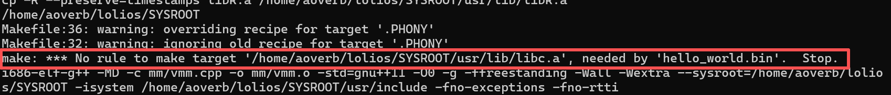
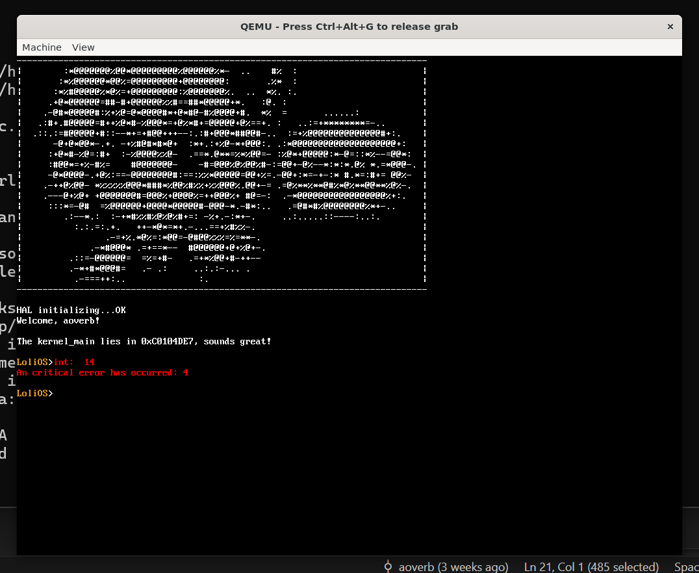
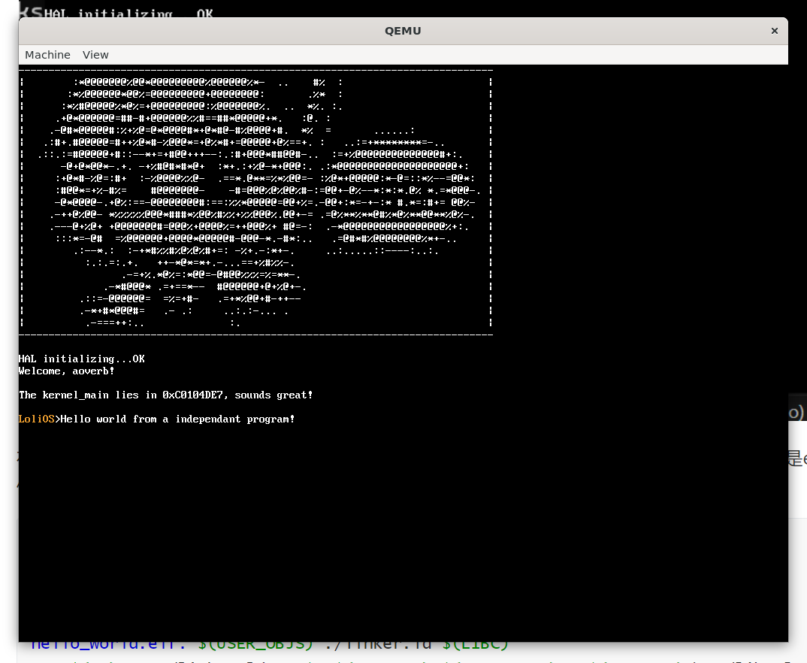
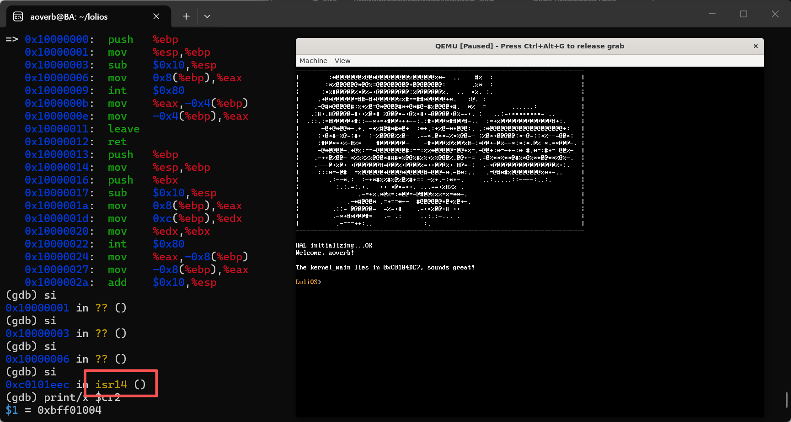
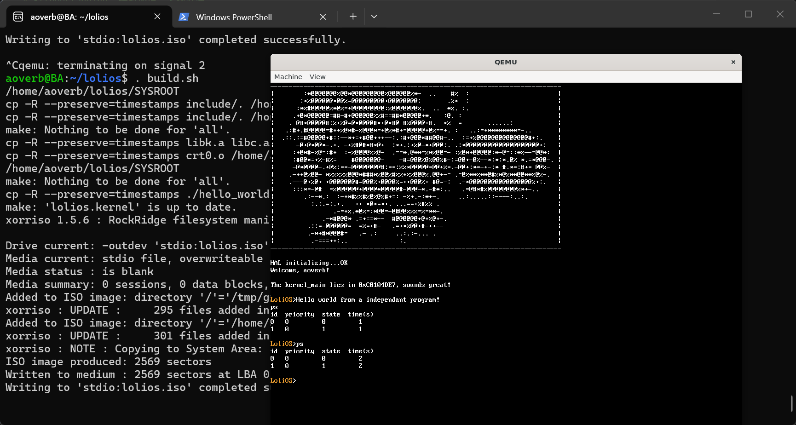
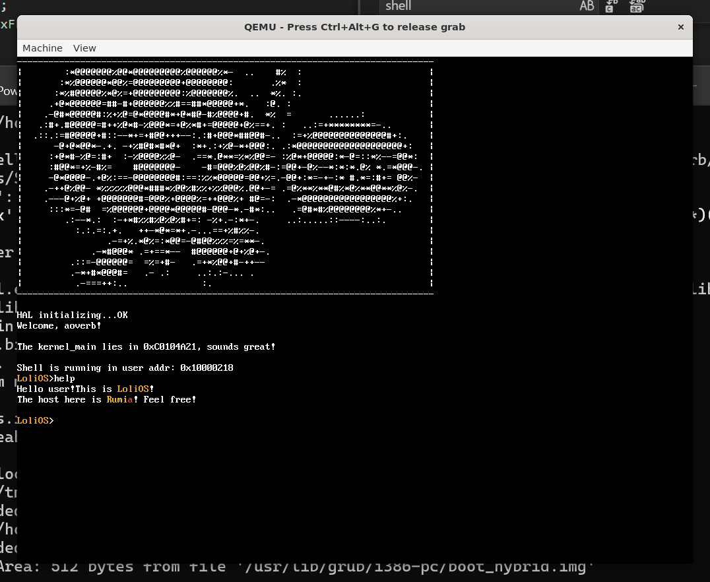

## 自制操作系统（14）：独立用户态程序封装、编译与加载

上一节，我们终于把我们的一小段函数搬到了用户态，但是这个函数居然连调用libc的函数都做不到！看来，是时候把我们从用户态给分离出去了。

### 独立的用户态程序——简单示例

我们的征程当然不能止步于Hello world，接下来我们要独立编译出用户态的二进制程序，结合Grub Module加载程序到内存，我们再从Kernel_main读取内存内容创建进程。我们先写一个极简的程序来完成分离编译，后面再逐步完善。

#### 独立编译准备

是时候在我们的根目录新建一个user目录来存放我们的用户态程序源文件了。我们先在底下创建一个Makefile：

```makefile
# 编译器设置 (假设你已经配置好了 i686-elf-gcc)
CC:=i686-elf-gcc
CXX:=i686-elf-g++
AS = i686-elf-as

# 关键编译参数
# -ffreestanding: 裸机环境，无标准库
CFLAGS:=-O0 -g -ffreestanding -Wall -Wextra --sysroot=$(SYSROOT) -isystem $(SYSROOT)/usr/include
CXXFLAGS:=$(CFLAGS) -fno-exceptions -fno-rtti # C++需要禁用异常和RTTI
LDFLAGS:=-ffreestanding -O0 -nostdlib

USER_OBJS=\
hello_world.o

LIBC:=$(SYSROOT)/usr/lib/libc.a

all: hello_world.bin

# 目标：我们的Hello world.bin
hello_world.bin: $(USER_OBJS) ./linker.ld $(LIBC)
	$(CC) -T ./linker.ld -o $@ $(LDFLAGS) $(USER_OBJS) -L$(SYSROOT)/usr/lib -lc -lgcc

# 自动推导规则：如何从 .c 变成 .o
%.o: %.c
	$(CC) -MD -c $< -o $@ -std=gnu11 $(CFLAGS)

# 自动推导规则：如何从 .cpp 变成 .o
%.o: %.cpp
	$(CXX) -MD -c $< -o $@ -std=gnu++11 $(CXXFLAGS)

install-bin:
	cp -R --preserve=timestamps ./hello_world.bin $(SYSROOT)/usr/bin/.

# 清理
clean:
	rm -f hello_world.bin
	rm -f $(USER_OBJS)
	rm -f $(USER_OBJS:.o=.d)

-include $(USER_OBJS:.o=.d)
```

准备一个简单的用户态程序：

```cpp
#include <stdint.h>

void main() {
    uint32_t ret;
    const char* s = "Hello world from a independant program!\n";
    asm volatile("int $0x80" : "=a"(ret) : "a"(1), "b"(s));
    asm volatile("int $0x80" : "=a"(ret) : "a"(0));
}
```

编写对应的链接配置：

```linker
SECTIONS
{
    /* 我们的用户态加载程序的基址就是这个地方 */
    . = 0x10000000;

    .text :
    {
        hello_world.o(.text) /* 把我们的hello_world放在最头部 */
        *(.text)
    }

    .rodata :
    {
        *(.rodata)
    }

    .data :
    {
        *(.data)
    }

    .bss :
    {
        *(.bss)
    }
}
```

再多配置一个bin脚本，执行之：

```shell
#!/bin/bash
export SYSROOT=`pwd`/SYSROOT
echo $SYSROOT
mkdir -p $SYSROOT/usr/bin
cd user
make all install-bin
cd ..
```



糟了，我们之前的build_libc脚本只能build出libk.a（是的，你没看错我也没写错），所以我们还得再改一下makefile让它能编译出libc。

```makefile
CFLAGS:=$(CFLAGS) -ffreestanding -Wall -Wextra
CPPFLAGS:=$(CPPFLAGS) -D__is_libc --sysroot=$(SYSROOT) -isystem $(SYSROOT)/usr/include
LIBK_CFLAGS:=$(CFLAGS)
LIBK_CPPFLAGS:=$(CPPFLAGS) -D__is_libk
LIBC_CFLAGS:=$(CFLAGS)
LIBC_CPPFLAGS:=$(CPPFLAGS)

LIBK_OBJS=$(LIBC_OBJS:.o=.libk.o)
BINARIES=\
libk.a \
libc.a

.PHONY: all clean install-headers

all: $(BINARIES)

libc.a: $(LIBC_OBJS)
	$(AR) rcs $@ $(LIBC_OBJS)

%.libc.o: %.c
	$(CC) -MD -c $< -o $@ -std=gnu11 $(LIBC_CFLAGS) $(LIBC_CPPFLAGS)

...

-include $(LIBC_OBJS:.o=.d)
-include $(LIBK_OBJS:.o=.d)

...

install-libc:
	cp -R --preserve=timestamps $(BINARIES) $(SYSROOT)/usr/lib/

clean:
	rm -f $(LIBK_OBJS)
	rm -f $(LIBK_OBJS:.o=.d)
	rm -f $(LIBC_OBJS)
	rm -f $(LIBC_OBJS:.o=.d)
```

配置完这些后，就能正常编译出hello_world.bin了。

#### Grub Module

编译出的bin我们要通过Grub Module进行加载。首先我们让它打包进镜像文件：

```shell
# 复制用户态程序
cp user/hello_world.bin isodir/boot/hello_world.bin

# 创建 GRUB 配置文件
cat > isodir/boot/grub/grub.cfg << EOF
menuentry "LoliOS" {
	multiboot /boot/lolios.bin
    module /boot/hello_world.bin
}
EOF
```

然后我们在kernel_main写一段简单的逻辑把module读取出来，并把我们的文件内容创建为一个用户态进程：

```cpp

typedef struct {
    uint32_t mod_start;   // 模块在内存中的起始物理地址
    uint32_t mod_end;     // 模块结束物理地址
    uint32_t cmdline;     // 模块命令行字符串（就是 grub.cfg 里的路径）
    uint32_t pad;         // 保留，为 0
} multiboot_module_t;

extern "C" void kernel_main(multiboot_info_t* mbi) {
    ...

    if (mbi->flags & (1 << 3)) {  // 检查 mods 字段有效
        multiboot_module_t* mods = (multiboot_module_t*)mbi->mods_addr;
        uint32_t mod_count = mbi->mods_count;

        for (uint32_t i = 0; i < mod_count; i++) {
            void* start = (void*)mods[i].mod_start;
            size_t size = mods[i].mod_end - mods[i].mod_start;
            const char* name = (const char*)mods[i].cmdline;

            create_user_process(start, size, 1);
        }
    }

	...
}
```

运行后，触发了PF。看来我们的加载逻辑还是有问题。



在GDB看了下， 感觉指令不太对劲，像是读错数据了，问了Claude之后发现，我前面生成出来的是elf文件，不是flat binary...我们需要修改一下makefile：

```makefile
# 目标：我们的Hello world.bin
hello_world.bin: hello_world.elf
	objcopy -O binary hello_world.elf hello_world.bin

hello_world.elf: $(USER_OBJS) ./linker.ld $(LIBC)
	$(CC) -T ./linker.ld -o $@ $(LDFLAGS) $(USER_OBJS) -L$(SYSROOT)/usr/lib -lc -lgcc
```



成功运行了。我们来接着运行上一篇没有运行成功的syscall函数：

```cpp
#include <stdint.h>
#include <syscall_def.h>

void main() {
    uint32_t ret;
    const char* s = "Hello world from a independant program!\n";
    syscall1(1, reinterpret_cast<uint32_t>(s));
    syscall0(0);
}
```

运行，发现还是报错#14，GDB调试之：



结果发现，.text最头部的代码居然变成syscall1了，大意了啊！我忽略了#include头文件会带来的影响了。

#### 简单的封装

这样的话，我们只能在编译阶段去做一些小小的封装了。

我们在libc写一段小小的汇编，来帮我们做一些启动进程的初始化和收尾操作：

```assembly
.section .text.entry
.global _start
.extern main

_start:
    call main
    mov $0, %eax
    int $0x80
    ret

```

这就是经典的**crt0**（C Runtime 0）。

在makefile加一条编译汇编的规则：

```makefile
all: $(BINARIES) crt0.o

crt0.o: crt/crt0.s
	$(AS) --32 -o $@ $<
```

这里有个坑：不能把crt0.o作为链接的一部分用ld链在libc里面，因为ld只会链接那些目前还找不到的符号。我们定义的_start符号还得在链接libc.a的时候才会被用到呢，所以我们得把它单独拿出来编译成一个crt0.o。

```makefile
CRT0:=$(SYSROOT)/usr/lib/crt0.o

...

hello_world.elf: $(USER_OBJS) ./linker.ld $(LIBC) $(CRT0)
	$(CC) -T ./linker.ld -o $@ $(LDFLAGS) $(USER_OBJS) $(CRT0) -L$(SYSROOT)/usr/lib -lc -lgcc

```

按上面所说的，生成hello_world.elf时需要单独链接crt0.o。

再修改一下linker.ld，让我们程序的入口点设置为_start（这个目前设置了并没有什么用处，只是为了方便后面转elf加载），并把我们放在.text的最前面：

```linker
ENTRY(_start)

SECTIONS
{
    /* 我们的用户态加载程序的基址就是这个地方 */
    . = 0x10000000;

    .text :
    {
        
        *(.text.entry) /* 入口的start放在最头部 */
        *(.text)
    }

    .rodata :
    {
        *(.rodata)
    }

    .data :
    {
        *(.data)
    }

    .bss :
    {
        *(.bss)
    }
}
```

我们就能看到正确调用了系统调用函数来输出字符串，并正确退出程序的用户态程序调用结果了：



可喜可贺！

### 提取shell

是时候做点我们一直都很想做的事了...没错，这次，我们要把Shell移到用户态去。但是为了高效的迁移，我们将删去shell原有的一些指令。

```cpp
enum class SYSCALL {
    EXIT = 0,
    TERMINAL_WRITE = 1,
    TERMINAL_SET_TEXT_COLOR = 2,
    TERMINAL_GET_LINE = 3
};
```

我们先来实现这几条系统调用。

```cpp
uint32_t sys_terminal_set_text_color(interrupt_frame* reg) {
    terminal_setcolor(reg->ebx);
    return 0;
}

uint32_t sys_terminal_getline(interrupt_frame* reg) {
    getline(reinterpret_cast<char*>(reg->ebx), reg->ecx);
    return 0;
}

void syscall_init() {
    register_syscall(uint32_t(SYSCALL::EXIT), sys_exit);
    register_syscall(uint32_t(SYSCALL::TERMINAL_WRITE), sys_terminal_write);
    register_syscall(uint32_t(SYSCALL::TERMINAL_SET_TEXT_COLOR), sys_terminal_set_text_color);
    register_syscall(uint32_t(SYSCALL::TERMINAL_GET_LINE), sys_terminal_getline);
}
```

#### 以set_color为例

```cpp
#include <stdio.h>
#include <syscall_def.h>
#if defined(__is_libk)
#include <kernel/tty.h>
#endif

void set_color(uint32_t color) {
#if defined(__is_libk)
	terminal_setcolor(color);
#else
	syscall1(2, color);
#endif
}
```

我们可以通过编译选项来改变宏，这样可以通过同一份文件来编译出libc和libk库！

最终迁移的shell运行的效果如下：



这是shell进程的一小步...但却是我们操作系统的一大步！

---

### 总结

这一节，我们实现了用户态程序的封装编译和加载，完善了系统调用和libc库、crt0，还把shell迁移到了用户空间，虽然功能减少，但未来可期啊！但是我们现在的用户态文件还只能加载flat binary，本质上是一些指令流，后面可以考虑解析真正的ELF格式文件。

从下一节开始，我们将揭开文件系统的神秘面纱...我们先从一个基于tar文件的initrd文件系统开始，搭建VFS的基本框架，后面再专注后端，转为EXT文件系统。那么我们下回见！