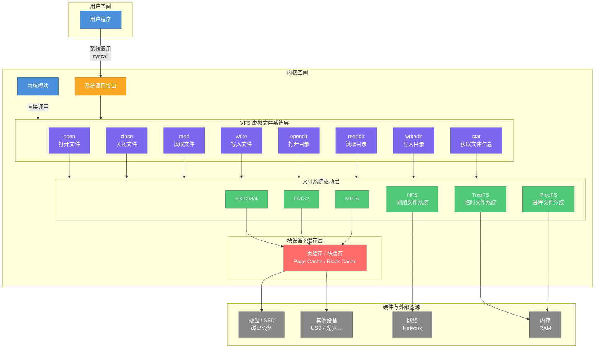
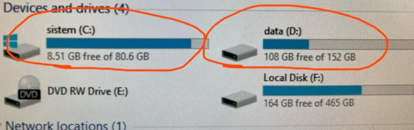

## 自制操作系统（15）：虚拟文件系统

在上一节我们实现了用户态程序的封装编译和加载，完善了系统调用和libc库、crt0，还把shell迁移到了用户空间。今天，我们要干点更激动人心的事情：实现一个基于ustar的文件系统！

不过，我们先来解决一些遗留问题...

### 一些遗留问题的解决

我们先来做一些收尾操作，之前有些todo的事项放了太久了，后面就积重难返了，所以我们现在集中解决下。

#### 低地址资源重映射和清理

我们的mbi和pmm初始化时遗留的一些数据一直占据着低地址区域，我们是时候考虑它们的去向了。

mbi的数据只会在内核启动初期用到，所以我们可以直接把它清掉，但是记录pmm就需要重新做映射了。

#### pmm预留Grub模块区域

之前做模块Grub加载的时候我们其实漏做了一部分，没有把加载的地址给算进pmm的预留内存里，这次我们不仅要预留这块内存，还得在后面把这块内存拷贝出来映射到内核地址，把低地址给留出来：

```cpp
void save_module(multiboot_info_t* mbi, saved_module*& saved, uint32_t& mod_count) {
    mod_count = 0;
    saved = nullptr;
    if (mbi->flags & (1 << 3)) {
        multiboot_module_t* mods = (multiboot_module_t*)mbi->mods_addr;
        mod_count = mbi->mods_count;
        saved = (saved_module*)kmalloc(sizeof(saved_module) * mod_count);
        for (uint32_t i = 0; i < mod_count; i++) {
            saved[i].size = mods[i].mod_end - mods[i].mod_start;
            saved[i].data = kmalloc(saved[i].size);
            memcpy(saved[i].data, (void*)mods[i].mod_start, saved[i].size);
        }
    }
}
```

#### pmm早期分配内存迁移

```cpp
void pmm_migrate_to_high() {
    uint32_t total_size = page_limit * sizeof(page_frame);

    // 1. 在高地址分配新空间
    page_frame* new_all_pages = (page_frame*)kmalloc(total_size);

    // 2. 拷贝数据
    memcpy(new_all_pages, all_pages, total_size);

    // 3. 计算偏移量，修正指针
    intptr_t delta = (intptr_t)new_all_pages - (intptr_t)all_pages;

    for (uint32_t i = 0; i < page_limit; i++) {
        if (new_all_pages[i].next)
            new_all_pages[i].next = (page_frame*)((uintptr_t)new_all_pages[i].next + delta);
        if (new_all_pages[i].prev)
            new_all_pages[i].prev = (page_frame*)((uintptr_t)new_all_pages[i].prev + delta);
    }

    for (uint32_t i = 0; i < MAX_ORDER; i++) {
        if (free_area[i])
            free_area[i] = (page_frame*)((uintptr_t)free_area[i] + delta);
    }

    // 4. 切换
    page_frame* old_all_pages = all_pages;
    all_pages = new_all_pages;

    // 旧的物理页不回收了，直接忽略
}
```

我们有all_pages一开始借用了pmm的可用地址的一部分来记录可用页，并有指针挂在free_area上，all_pages其实就是一个数组，所以我们在高地址区域申请一块连续的内存，复制过去，更新所有记录地址增加偏移即可。至于一开始借用的那一小块物理地址，由于回收逻辑比较复杂（懒），这里就直接忽略了。

#### 内核调用全局构造函数

我们的内核没有调用crt标准提供的\_init全局构造函数，之所以一直没有问题，是因为我们没有调用全局构造函数的必要。这部分需要修复一下。

要调用这个函数要严格按照下面的链接顺序：

crti crtbegin 我们的.o文件（包括lib库）crtend crtn

因为crtbegin会插入调用.ctor段的代码片段，而crtend会声明一个哨兵标记来表示.ctor段的结束，我们的全局构造函数也会在.ctor段由\_init函数遍历调用，要是在.ctor段哨兵标记之后我们再拼接，_init函数就不会调用到我们的构造函数了，这两个文件平台无关，由编译器提供。至于crti和crtn是平台有关的（取决于你如何调用函数，把参数、返回地址放在哪），定义函数的prologue（处理入参栈帧）和epilogue（ret），属于\_init函数的一部分，所以需要我们自己实现，但是很简单。

crti.s:

```assembly
.section .init
.global _init
_init:
    push %ebp
    mov %esp, %ebp
    /* gcc 会在这中间插入构造函数调用 */

.section .fini
.global _fini
_fini:
    push %ebp
    mov %esp, %ebp
```

crtn.s:

```cpp
.section .init
    pop %ebp
    ret

.section .fini
    pop %ebp
    ret
```

有人可能会问那crt0呢？其实我们之前的boot.s就相当于crt0了，不过我们确实需要再在\_start里面，call kernel_main之前调用全局构造的\_init函数:
```assembly
_tokernelmain:
    mov $stack_top, %esp
    push %ebx
    call _init
    call kernel_main
```
当然多出来的段我们还需要在链接脚本拼进去，这部分陌生的段较多，特请来了Claude为我生成：
```
...
    .text ALIGN(4K) : AT(ADDR(.text) - 0xC0000000)
    {
        *(.text)
    }

    .init ALIGN(4K) : AT(ADDR(.init) - 0xC0000000)
    {
        *(.init)
    }

    .fini ALIGN(4K) : AT(ADDR(.fini) - 0xC0000000)
    {
        *(.fini)
    }

    .init_array ALIGN(4K) : AT(ADDR(.init_array) - 0xC0000000)
    {
        __init_array_start = .;
        *(.init_array)
        *(SORT(.init_array.*))
        __init_array_end = .;
    }

    .fini_array ALIGN(4K) : AT(ADDR(.fini_array) - 0xC0000000)
    {
        __fini_array_start = .;
        *(.fini_array)
        *(SORT(.fini_array.*))
        __fini_array_end = .;
    }

    .rodata ALIGN(4K) : AT(ADDR(.rodata) - 0xC0000000)
    {
        *(.rodata)
    }
...
```
### 文件系统

文件系统就是管理和组织文件的系统，是对于一块存储设备而言的。说管理，是因为你能往存储设备里面随意地放一些或者扔一些东西（想想你的房间，你有自由支配里面所有东西的权力和能力），说组织，是说里面放着的文件，是以某种方式去规划在存储设备上存放的（想想你刚收拾好的房间，很简单就能找到东西，再想想你的乱糟糟的房间，你会把很多时间花费在找一件物品上）。

#### 驱动

不同的设备适用于不同的文件系统，就像如果你的房间有50层，你肯定会把经常会一块拿的东西放在同一层，减少跑上跑下的时间。这时候的你就像是这个文件系统的驱动，因为你知道怎么去管理这个房间，要是换别人来，可能连楼梯都找不到...更何况，你的房间可能是更加奇奇怪怪的形态，比如回转寿司盘、跑步机、自动贩卖机...而你已经在这个房间住了很久了，你已经有了应付这种复杂房间的能力。

#### VFS

有时候你妈会让你去收拾东西，这是一次对于具体文件系统的接口的调用，如果你有兄弟姐妹而他们也有自己擅长管理的房间（无论是什么形态），而有一天你爸想让你们都去收拾自己的房间，但他不知道怎么跟你们沟通，你爸就可以找到你妈，因为你妈妈知道每个人该用怎么样的方式沟通才能让你们收拾房间。于是我们就有了爸爸（求助于妈妈的调用方），妈妈（知道如何调用驱动的VFS）还有我们和我们的兄弟姐妹（各种难缠刁钻的文件系统的驱动）。我希望我讲的足够生动:D

#### 架构

下面是一个文件系统的架构图：



这个图看起来元素很多，其实现在我想表达的意思只有一个：用户或内核程序想要打开一个文件很轻松，只要调用接口并提供一个路径名就可以了，所有的脏活累活都交给VFS（虚拟文件系统）层了。

想想平时我们与各种存储设备打交道：硬盘、U盘、光碟、网盘，我们无论是在上面打开、读取、写、删除文件，还是读取文件列表，其实是不关心上面组织文件的形式的（想一想：你平时会好奇存储设备上面的文件是怎么组织的吗？像我，顶多也就是好奇为啥光盘只能读，后面也只是得出了个因为激光在盘面上打了很多个不可逆的坑，从存储介质来看而不是软件层面不可更改的结论...）。

但是不好意思，现在开始我们就是VFS层了，我们得站在VFS层（妈妈）的角度去想一些问题（是的，我们又回到了这个奇妙的比喻），但在这之前，我们先来聊聊挂载这个概念。

#### 挂载

挂载就像是你们一家人中了大奖，搬到了一片超大的空地，你决定带着孩子（别忘了，你是妈妈）从头开始规划建立自己的房子，每个人都拿着自己的东西（当然还有脑子里各种奇妙的物品整理方式）。当然，我们是不可能在空地上生存的——这里什么基础设施都没有！于是你可能会想到一种方案，给每个孩子建一栋房子，房子可以是各种天马行空的形态（只要方便孩子们管理就好，这里有个好处是你的孩子都很听话，只要你想，都能让它们对自己的房间进行某种操作），于是你的三个孩子在这里建立了四栋房子，名为C盘、D盘、E盘和F盘：



你看着它们的房子，虽然还是觉得很奇怪，但是你并不关心——孩子们有自己的世界，你只需要关注孩子本身就好了。

我们所有的房子都建立在空地这个层次，就像windows系统，会把所有磁盘挂载在目录的最顶层一样，这是一种挂载方式：

比如说C:/ D:/ E:/，这三个就是不同的存储设备的挂载点。这种对你来说就比较直观了，有时候你要拿出D:/aa/bb/cc这个文件，你只要看一眼这个路径的第一个字符，就知道这个文件属于哪个挂载点，该让哪个孩子来帮你拿出来。

还有一种挂载方式，是linux系统采用的，他把房子建在房子里面，像/mnt/c，/mnt/c/aa/bb，/mnt/c/aa/bb/cc/d，如果我告诉你这三个路径是挂载点，然后问你要拿/mnt/c/aa/bb/dd该问谁去操作，估计你会找不着北。这个时候有一个原则，我们把所有的挂载点拿去路径做前缀匹配，也就是看看挂载点是不是这个路径的一部分，如果是，那么最长的那个就是这个文件对应的挂载点，比如说上面的例子，/mnt/c/aa/bb就是最长的匹配，我们直接调用（问）这个挂载点（房子）对应的驱动接口（孩子），告诉他我要你的挂载点/mnt/c/aa/bb对应的房子里面的dd这个文件就好了。

你可能会好奇，是不是得先进到/mnt/c这个房子（目录）才能拿到/mnt/c/aa/bb/dd？其实不用，因为你知道更后面的/mnt/c/aa/bb/属于哪个具体的孩子（驱动），直接找他就好了，并且你也不用告诉他/mnt/c/aa/bb/，房子已经建好了，他只关心房子里面的文件。

看完了（我希望你们觉得）有趣的介绍之后，我们来看看代码：

```cpp
mounting_point* get_mounting_point(const char* path) {
    mounting_point* best = nullptr;
    uint32_t best_len = 0;

    for (uint32_t i = 0; i < mount_num; i++) {
        const char* mp_path = mount_list[i]->mount_path;
        uint32_t mp_len = strlen(mp_path);

        // 检查 path 是否以这个挂载路径为前缀
        if (strncmp(path, mp_path, mp_len) == 0) {
            // 确保是完整的路径边界匹配
            // 比如挂载点 "/mnt" 不应该匹配 "/mnt2/file"
            if (mp_len == 1 && mp_path[0] == '/') {
                // 根挂载点 "/" 匹配一切
            } else if (path[mp_len] == '/' || path[mp_len] == '\0') {
                // 合法边界
            } else {
                continue;
            }

            if (mp_len > best_len) {
                best_len = mp_len;
                best = mount_list[i];
            }
        }
    }

    return best;
}
```

这就是上面的，通过找最长前缀找到文件实际挂载点的算法。

```cpp
typedef struct mounting_point {
	uint32_t index;
    FS_DRIVER driver;
    char mount_path[MAX_PATH_LEN];
    fs_operation* operations;
    void* data;
} mounting_point;
```

这就是描述挂载点的结构，index就是代表我在记录挂载点数组的第几个，driver就是驱动，管理这个挂载点的孩子，mount_path就是我把这个挂载点挂在了哪，operations就是可以对这个挂载点对应的文件系统进行的一系列的操作，data就是这个存储相关的数据，你不关心，交给驱动来解析就好。

```cpp
struct fs_operation {
    int (*mount)(mounting_point* mp);
    int (*unmount)(mounting_point* mp);
    int (*open)(mounting_point* mp, const char* path, uint8_t mode);
    int (*close)(mounting_point* mp, uint32_t handle_id);
    int (*read)(mounting_point* mp, uint32_t handle_id, char* buffer, uint32_t size);
    int (*write)(mounting_point* mp, uint32_t handle_id, const char* buffer, uint32_t size);
    int (*opendir)(mounting_point* mp, const char* path);
    int (*readdir)(mounting_point* mp, uint32_t handle_id, dirent* out);
    int (*closedir)(mounting_point* mp, uint32_t handle_id);
    int (*stat)(mounting_point* mp, const char* path, file_stat* out);
};
```

fs_operation里面存放的是一系列的函数指针，代表这个文件系统驱动对应的文件操作函数。当然你也可以定义自己的操作，只要确保你的驱动都能实现它们，并将对应的接口传给你。

所以说我们要对一个文件进行某种操作的时候，一般是这样的：

看看这个文件的挂载点是哪个，找到了挂载点后把路径的前缀消去，把剩下的部分作为这个挂载点下的文件系统的真实路径准备传入；

找到了挂载点后我们还可以找到一系列的工具函数，我们把刚刚准备好的路径传入这个工具函数，为了让驱动能访问到挂载点里记录的数据信息，我们把挂载点信息一并传给驱动。

而挂载，就是准备好这么个一个挂载点，记录好挂载的路径方便后面做匹配，以及找好工具函数存起来，再把后面需要驱动解析的原始数据存放起来，然后你再调用工具函数的挂载函数就好，驱动会帮你完成剩下的操作；

```cpp
int v_mount(FS_DRIVER driver, const char* mount_path, void* device_data) {
    mount_list[mount_num] = reinterpret_cast<mounting_point*>(kmalloc(sizeof(mounting_point)));
    mount_list[mount_num]->operations = get_fs_operation(driver);
    mount_list[mount_num]->index = mount_num;
    mount_list[mount_num]->driver = driver;
    mount_list[mount_num]->data = device_data;
    strcpy(mount_list[mount_num]->mount_path, mount_path);
    if (!mount_list[mount_num]->operations ||
        mount_list[mount_num]->operations->mount(mount_list[mount_num]) != 0) {
        kfree(mount_list[mount_num]);
        mount_list[mount_num] = nullptr;
        return -1;
    }
    
    return mount_num++;
}
```
mounting_point：代表一个文件系统的挂载点

一个驱动可以对应多个挂载点，驱动应该是无状态的，挂载点是有状态的，而驱动就可以去管理和更新挂载点的状态，应该是这样的逻辑。

VFS挂载时会传入一个特殊的数据结构，这个结构只需透传给driver的mount由驱动去解析，VFS不关心它的含义。

#### 卸载

```cpp
int v_unmount(const char* mount_path) {
    for (uint32_t i = 0; i < mount_num; i++) {
        if (strcmp(mount_list[i]->mount_path, mount_path) == 0) { // 精确匹配
            int ret = mount_list[i]->operations->unmount(mount_list[i]);
            if (ret == 0) {
                kfree(mount_list[i]);
                mount_list[i] = nullptr;
            }
            return ret;
        }
    }
    return -1;
}
```

卸载的操作其实就是把上面所说的信息清空掉，然后也是调用驱动的卸载函数让它帮你完成余下操作。

#### 打开文件

打开文件其实是获取一个访问当前文件的句柄（指向记录你访问这个文件的状态的数据结构的一个标识符）：

```cpp
int alloc_fd(PCB* proc) {
    for (int i = 0; i < MAX_FD_NUM; i++) {
        if (!proc->fd[i].mp) return i;
    }
    return -1;
}

int v_open(PCB* proc, const char* path, uint8_t mode) {
    mounting_point* mp = get_mounting_point(path);
    if (!mp) return -1;
    uint32_t handle_id = mp->operations->open(mp, get_mounting_relative_path(mp, path), mode);
    if (handle_id == -1) return -1;
    
    int fd_id = alloc_fd(proc);
    if (fd_id == -1) {
        mp->operations->close(mp, handle_id);
        return -1;
    }
    file_description& fd = proc->fd[fd_id];
    strcpy(fd.path, path);
    fd.handle_id = handle_id;
    fd.mp = mp;
    proc->fd_num++;
    return fd_id;
}
```

“你”是谁？你是一个进程。所以你要把这个标识符记录在你的PCB的一个数组里面，还得知道你的这个标识符属于哪个文件系统。

后面你就能拿着这个标识符去读写文件了：

```cpp
int v_read(PCB* proc, int fd, char* buffer, uint32_t size) {
    if (fd < 0 || fd >= MAX_FD_NUM) return -1;
    mounting_point* mp = proc->fd[fd].mp;
    if (!mp) return -1;
    return mp->operations->read(mp, proc->fd[fd].handle_id, buffer, size);
}

int v_write(PCB* proc, int fd, const char* buffer, uint32_t size) {
    if (fd < 0 || fd >= MAX_FD_NUM) return -1;
    mounting_point* mp = proc->fd[fd].mp;
    if (!mp) return -1;
    return mp->operations->write(mp, proc->fd[fd].handle_id, buffer, size);
}
```

基本上只是做了些校验，然后把操作委托给了驱动。

```
提示：摆烂警告
```

---

### 总结

我好累！实现了VFS！下一节我们来介绍tarfs，并基于他来实现我们的文件系统。
