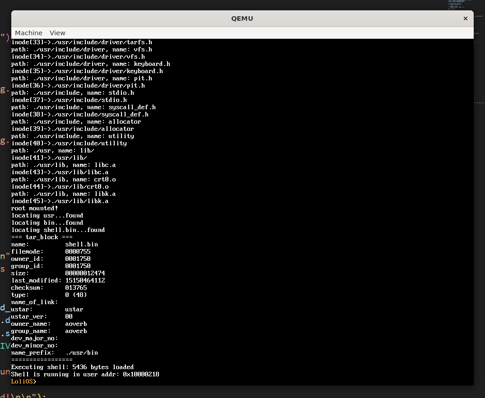

## 自制操作系统（16）：tarfs

```
这篇文章并不完整...正在建设中。
```

上一节我们说完了抽象的vfs，这一节我们来讲讲具体的tarfs。

### tar文件

tar文件其实早期是用于在磁带上组织文件的文件系统。所以解析这个文件很简单，既然文件的记录方式是顺序记录，我们可以用一次循环把里面的所有东西读取出来。我们以512字节为单位解析，解析一个头出来，获取大小，偏移512+大小字节，就是下一个头，直到读到空文件名。

注意里面很多东西都基于8进制的字符串记录。

#### 索引建立

因为一直顺序读取会比较耗时间，我们可以在mount的时候，基于里面的tar头建立树形索引，因为要建立文件名->inode_id的键值对，我还让claude帮我实现了unordered_map。


我们的shell解析成功，也正确执行了。

