## 自制操作系统（17）：围绕增强Shell进行的一系列改进

我们实现了文件系统...但是我们的shell居然还不能自由地访问这个文件系统！是可忍熟不可忍！

我们来制定目标：

1、可以用cd 切换当前工作目录；

2、输入命令时，能匹配/usr/bin下面的文件（最好是可配的），还有当前目录的文件，还能把紧跟着的参数作为入参传给这个文件；

3、运行进程时能阻塞shell，还能把返回值返回给shell。

接下来我们来逐个实现。

### 匹配/usr/bin下面的文件并执行

我们先来看看怎么让shell默认匹配/usr/bin下面的文件并执行。

我们构建一个数据，冒充path环境变量：

```cpp
constexpr char* PATH[2] = {
    "/usr/bin/",
    "/"
};
```

然后我们适配几个系统调用：文件相关操作，以及内存的分配...慢着，我们还没有做用户态的内存分配呢！看来只好读在栈上了，希望我们分配给用户态的栈空间足够。


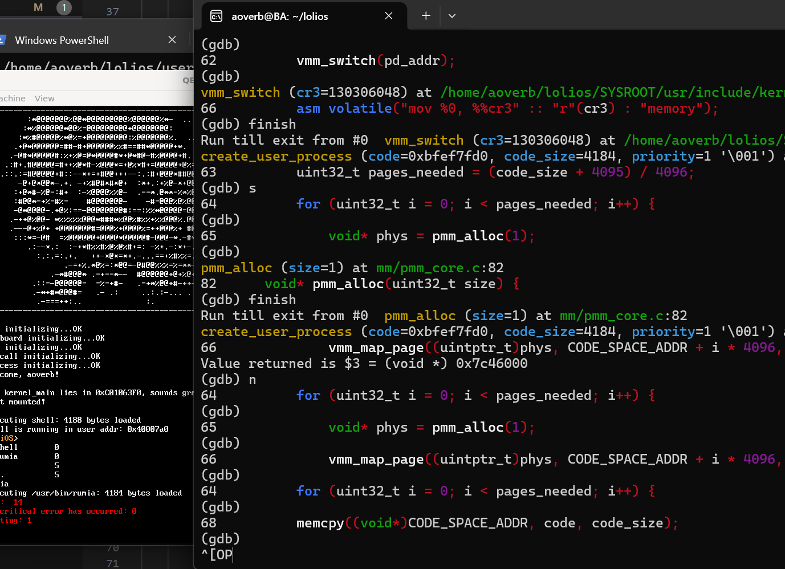

exec的问题：我们的代码不在内核！

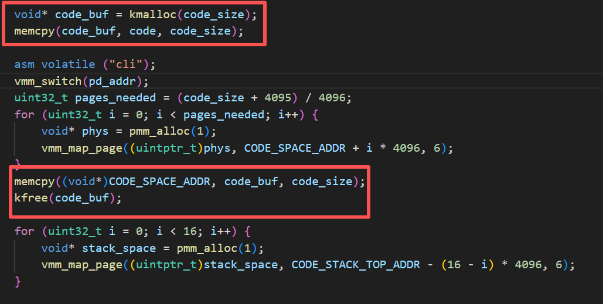

我们可以先把用户代码拷贝到内核缓冲区，后面复制到了新的用户空间之后再释放。

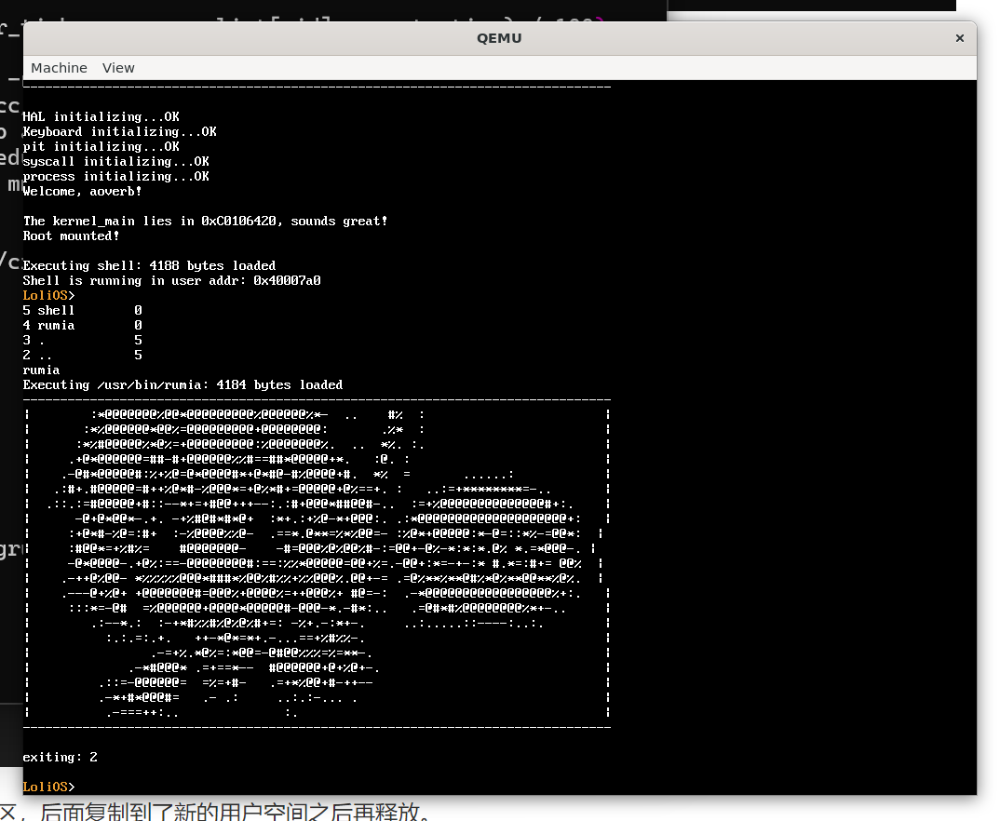

这次运行成功了。

### 入参传递给文件

这就需要我们升级一下create_user_process函数了。

我们在用户栈上构造Argc，argv地址，argv地址直接就指向我们的栈更深处。

我们来试试创建进程时传参：

```cpp
            bool flag = false;
            char fn[256] = "/usr/bin/";
            for (int i = 0; i < 2; ++i) {
                int fd = open(strcat(fn, input), 1);
                if (fd == -1) continue;
                int size = read(fd, buffer, 32768);
                if (size == -1) continue;
                printf("Executing %s: %d bytes loaded\n", fn, size);
                char* v[] = {"rumianomnomnom\n", "yay\n", "can you hear me?"};
                exec(buffer, size, 1, 3, v);
                flag = true;
            }
```


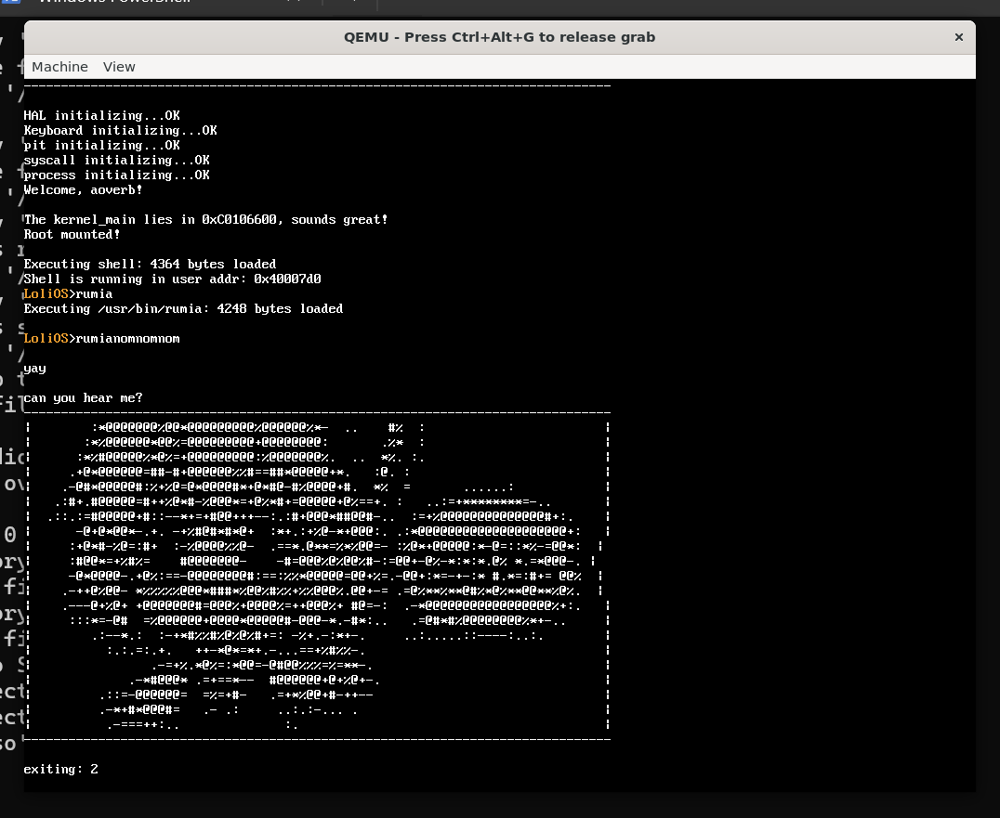

现在我们可以向运行中的程序传参了！

### cwd

我们在PCB里面新加入一个cwd字段记录当前的工作目录：

然后再在创建内核进程的逻辑中，继承父进程的cwd：

```cpp
    strcpy(new_process->cwd, process_list[cur_process_id]->cwd);
```

然后我们添加两个系统调用，chdir还有getcwd

我们就可以编出来一个pwd还有一个ls

cd我们在shell内建实现，我们还为shell添加了分词器

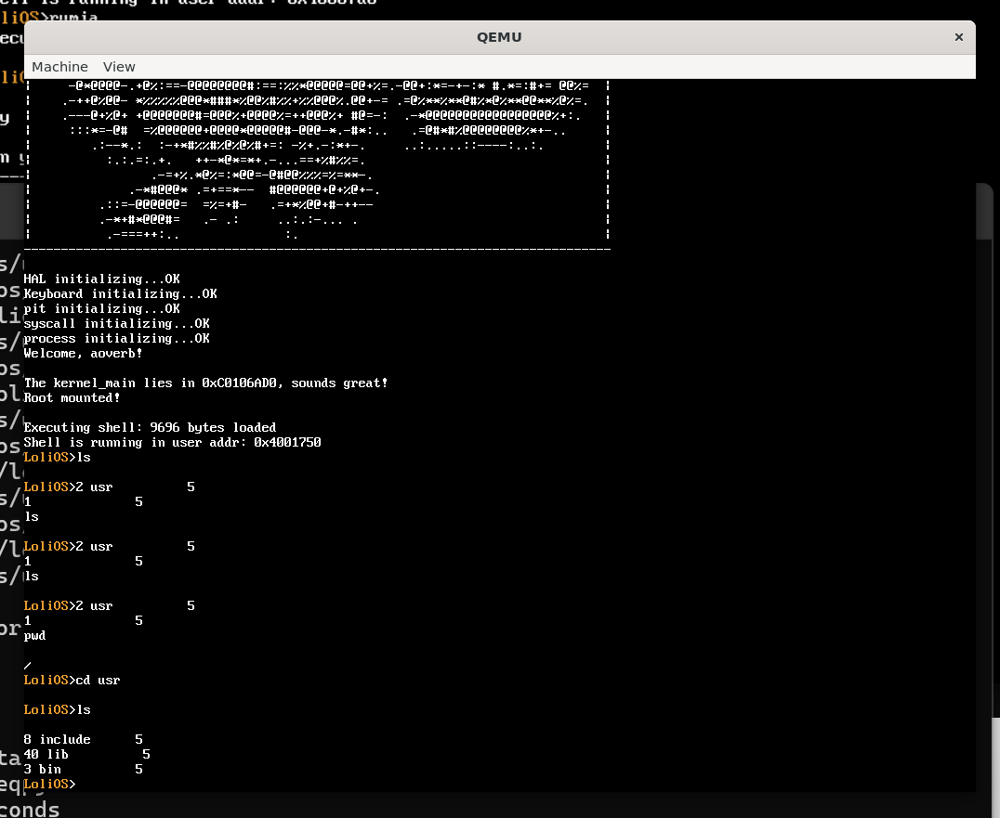

但是我们现在有了输出打架的情况，我们需要一个waitpid！

### waitpid

通过类似spawn的机制创建子进程后，我要把自己设置为等待状态，这时候我基本有两种选择，一个是在进程PCB里面加一个等待队列的数据结构，那我把自己设置为等待状态后，就把我自己从调度队列移除，然后调用schedule，子进程退出时，在exit_process再遍历一遍等待序列，把里面的进程放回去调度队列；或者是进入一个循环，每次调度到我的时候就检测现在的子进程pid，如果子进程还没有变成zombie态就继续循环，变成zombie态就拿它的返回码并执行回收其PCB的进程。

我们这里选择方案一，因为方案二本质上是忙等待+轮询。

```cpp
    new_process->parent_pid = cur_process_id;
    new_process->waiting_queue = nullptr;
    new_process->fd_num = 0;
    strcpy(new_process->cwd, process_list[cur_process_id]->cwd);

    // 父进程设置为等待态，从调度队列中移除
    remove_from_scheduling_queue(cur_process_id);
    process_list[cur_process_id]->state = process_state::WAITING;
    // 放入新进程的等待序列
    insert_into_process_queue(new_process->waiting_queue, process_list[cur_process_id]);

    insert_into_scheduling_queue(newpid, priority);
```

然后我们在退出进程时，去把自己的等待序列里面的进程重新放回可调度序列：

```cpp
uint32_t exit_process(uint8_t pid) {
    printf("exiting process %d...\n", pid);
    if (pid == 0 || process_list[pid] == nullptr) return 1;
    
    PCB*& exiting_process = process_list[pid];
    if (pid != cur_process_id) { // 要退出的进程不是自己的话
		exiting_process->to_exit = 1; // 不要直接清理这个进程的空间，告诉进程自己将要被退出就好
        return 0;
    }
    PCB* itr = exiting_process->waiting_queue;
    while (itr) {
        insert_into_scheduling_queue(itr->pid);
        itr = itr->next;
    }
    exiting_process->state = process_state::ZOMBIE;
    remove_from_scheduling_queue(pid);
    // insert_into_process_recycle_queue(cur_process); 不需要了
    yield();
    // 不应该执行到这里
    return 0;
}
```

在这里我还顺带修复了另一个问题，就是如果退出的不是当前进程，是不是不应该去把别的进程的数据给干掉，而是给它发一个信号或者别的什么东西，让它后面被调度之后自己退出。新加一个to_exit字段，需要在初始化和schedule的时候做匹配：

```cpp
    process_switch_to(chosen_process->pid);

    flags = process_list[cur_process_id]->saved_eflags;
    asm volatile ("pushl %0; popfl" : : "r"(flags));

    if (cur_pcb->to_exit) {
        exit_process(cur_process_id);
    }
}
```

然后我们去实现waitpid逻辑：

```cpp
int waitpid(uint8_t child) {
    if (!process_list[child] || process_list[child]->parent_pid != cur_process_id) {
        return -1;
    }
    PCB* child_pcb = process_list[child];
    while(child_pcb->state != process_state::ZOMBIE) {
        yield();
    }
    free_pcb(child_pcb);
    return 0;
}
```

并实现对应的系统调用：

```cpp
// WAITPID(ebx = pid)
int sys_waitpid(interrupt_frame* reg) {
    uint8_t pid = static_cast<uint8_t>(reg->ebx);
    return waitpid(pid);
}
```

然后我们来到shell：

```cpp
#include <sys/wait.h>
```


原来的进程回收序列逻辑不需要了，我们直接删掉。


我还多做了一个修改：process_id用pid_t类型，转用int。这里感觉是要吃苦头的，但是目前来看转换之后没有什么bug。

```
asm volatile ("sti");
spinlock_release(&process_list_lock);
```

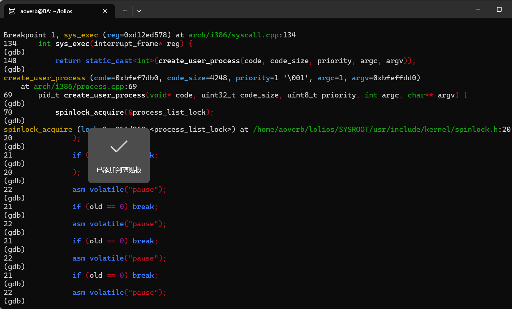

打开中断的时机不对导致死锁。把两条指令调换即可。

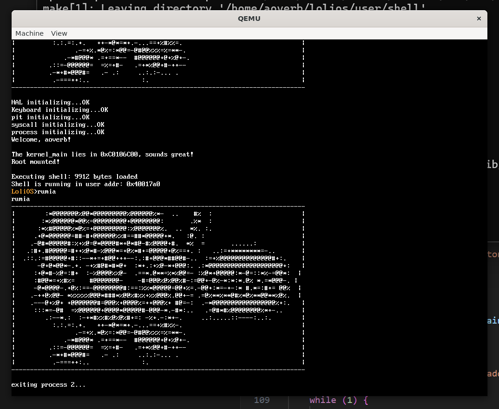

程序能跑了，但是没有正确调度回shell。

一方面是我们没有正确遍历等待序列：


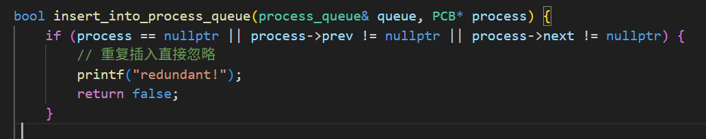

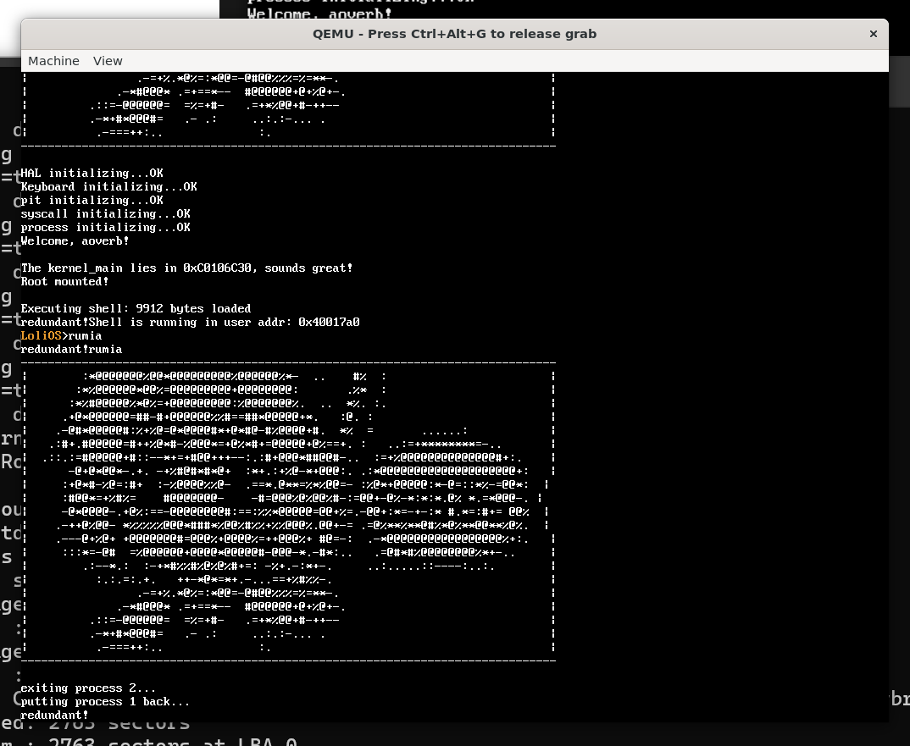

哟吼，居然说我们还在调度队列。。

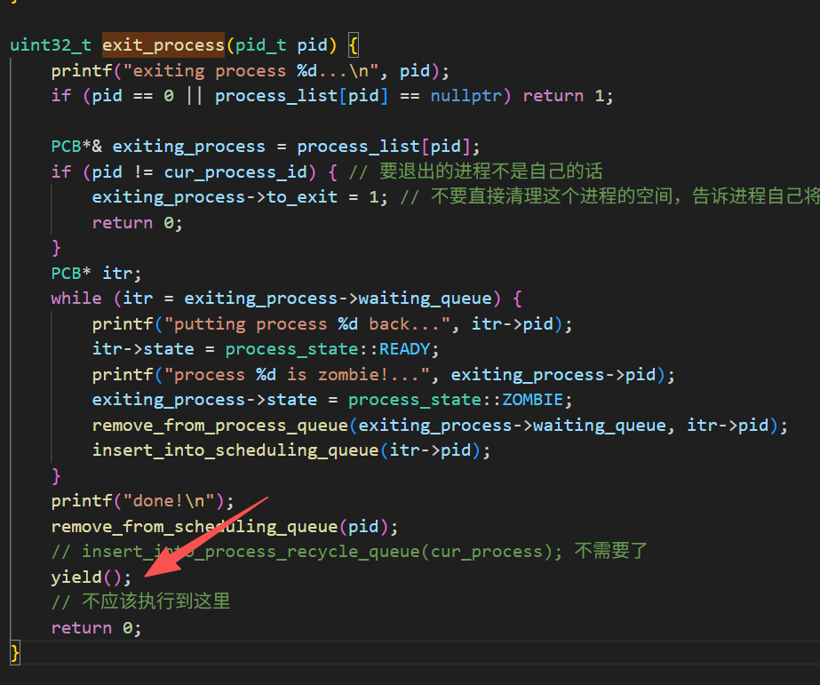

这里会把状态改成ready...

yield要改变状态的，搭配改变进程状态的语句要注意。

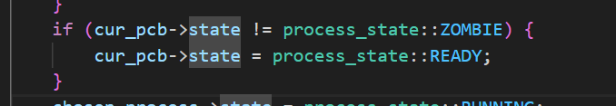

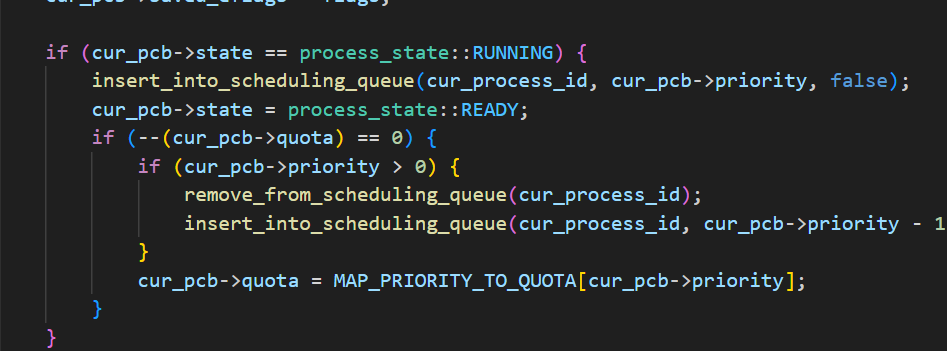

改进。


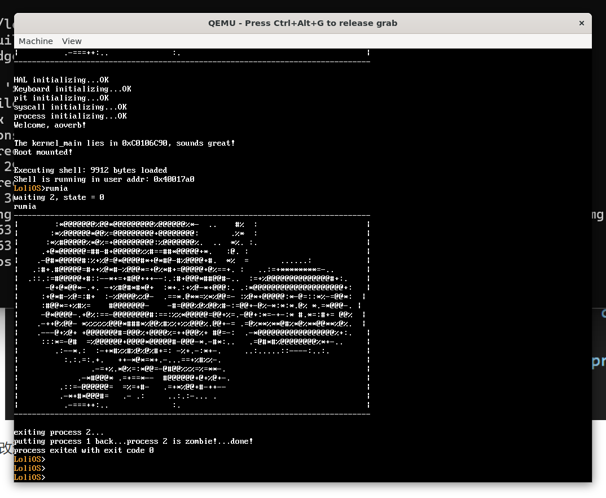

完事了。

我们的改进：

git commit -m "增加waitpid调用；调度器调整为schedule只把running的进程重新入队；process_id用pid_t类型，转用int；Exit_process退出别的进程时，使用类似信号量的机制。"

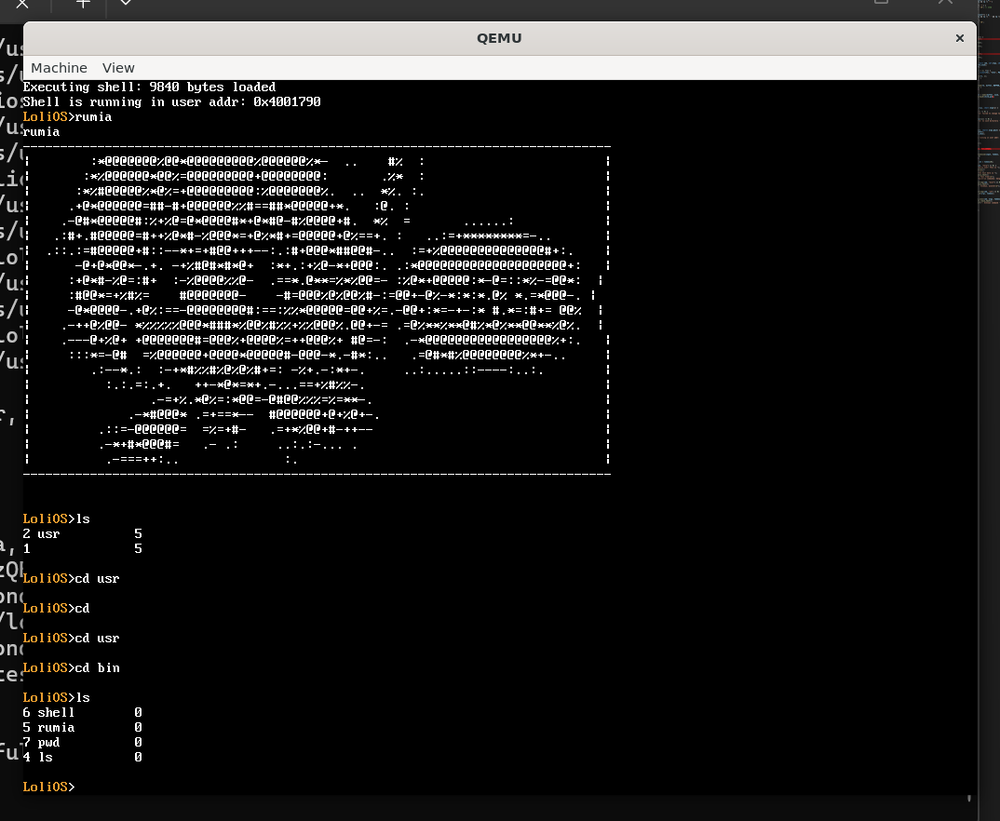

于是现在已经不会有输出打架的问题了。

发现不应该把阻塞语义放在create_process里

```cpp
int waitpid(pid_t child) {
    if (child < 0 || child > MAX_PROCESSES_NUM ||
        !process_list[child] || process_list[child]->parent_pid != cur_process_id) {
        return -1;
    }
    PCB* child_pcb = process_list[child];
    // 父进程设置为等待态，从调度队列中移除
    process_list[cur_process_id]->state = process_state::WAITING;
    remove_from_scheduling_queue(cur_process_id);
    // 放入新进程的等待序列
    insert_into_process_queue(child_pcb->waiting_queue, process_list[cur_process_id]);
    while(child_pcb->state != process_state::ZOMBIE) {
        yield();
    }
    free_pcb(process_list[child]);
    return 0;
}
```


返回值适配

需要在PCB准备一个exit_code

```cpp
uint32_t exit_process(pid_t pid, int exit_code) {
    if (pid == 0 || process_list[pid] == nullptr) return 1;
    PCB*& exiting_process = process_list[pid];
    if (!exiting_process->to_exit) {
        // 当前进程还没被指派退出，使用传入的退出码
        exiting_process->exit_code = exit_code;
    }
```

这样做保证退出码不被覆盖

```cpp
int waitpid(pid_t child) {
    if (child < 0 || child > MAX_PROCESSES_NUM ||
        !process_list[child] || process_list[child]->parent_pid != cur_process_id) {
        return -1;
    }
    PCB* child_pcb = process_list[child];

    asm volatile("cli");
    if (child_pcb->state == process_state::ZOMBIE) {
        // 子进程已经退出了，直接回收
        asm volatile("sti");
        int exit_code = child_pcb->exit_code;
        free_pcb(process_list[child]);
        return exit_code;
    }
    process_list[cur_process_id]->state = process_state::WAITING;
    insert_into_process_queue(child_pcb->waiting_queue, process_list[cur_process_id]);
    yield();

    int exit_code = child_pcb->exit_code;
    free_pcb(process_list[child]);
    return exit_code;
}
```

这边也要去接住返回码

```cpp
// CLOSE(ebx = exit_code)
int sys_exit(interrupt_frame* reg) {
    int exit_code = static_cast<int>(reg->ebx);
    exit_process(cur_process_id, exit_code);
    return 0;
}
```

系统调用，用ebx去接

```assembly
_start:
    call main
    mov %eax, %ebx
    mov $0, %eax
    int $0x80
    ret
```

crt0也得一块改，返回码是在eax，我们先拷贝一份到ebx传入

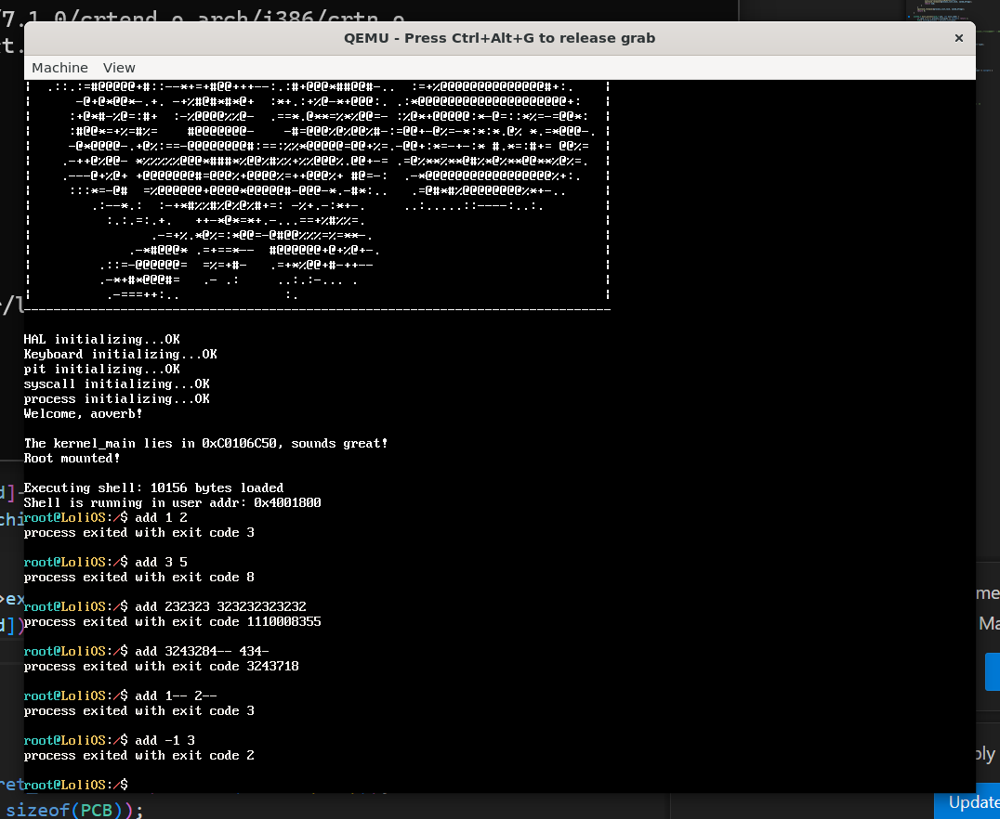

可以做算术了。


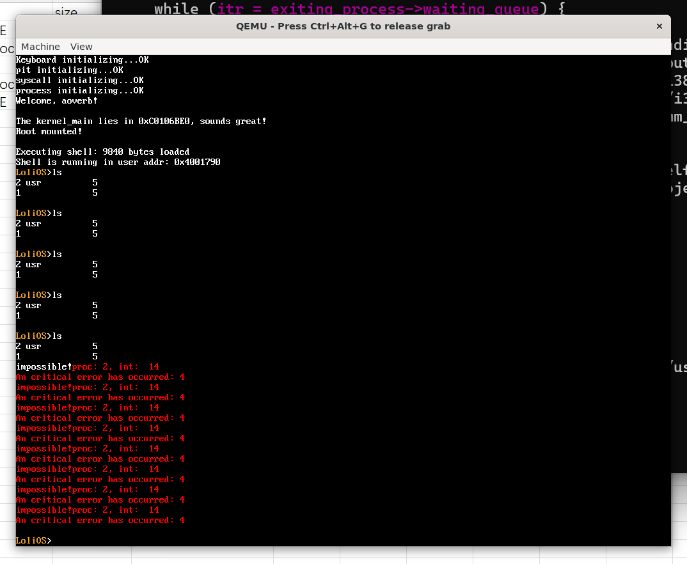

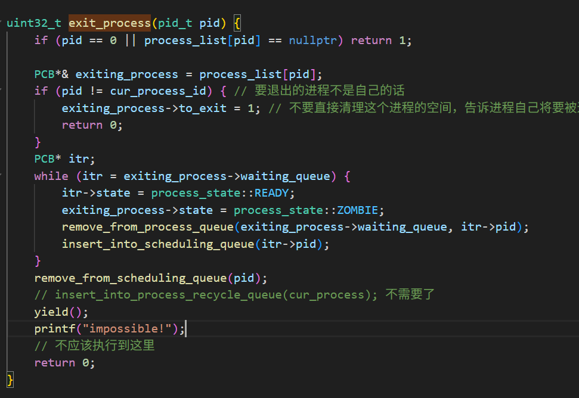

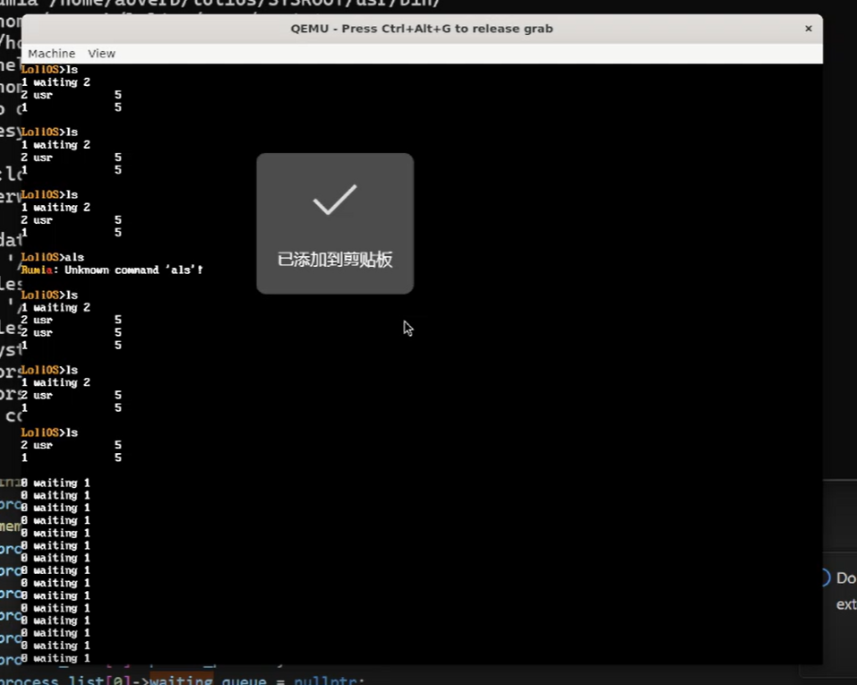

后面发现是PCB太大踩内存了...


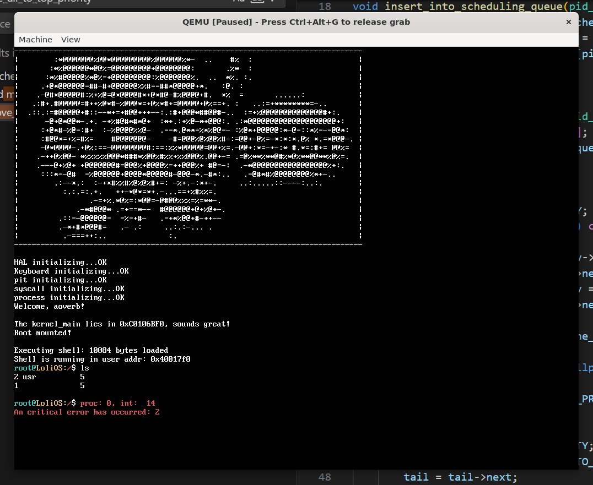

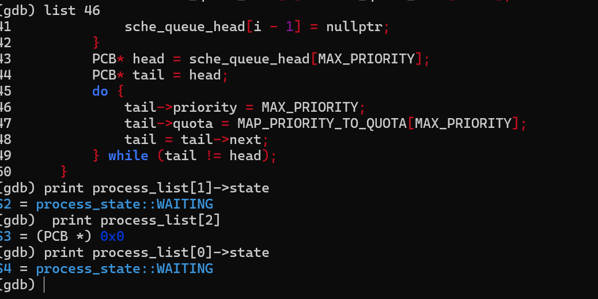

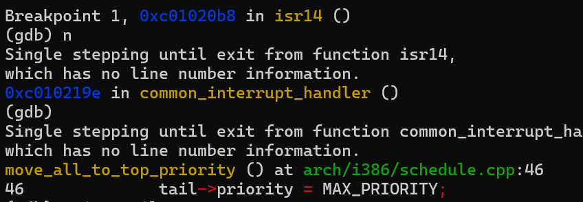

设想这种情况：

```cpp
int waitpid(pid_t child) {
    if (child < 0 || child > MAX_PROCESSES_NUM ||
        !process_list[child] || process_list[child]->parent_pid != cur_process_id) {
        return -1;
    }
    PCB* child_pcb = process_list[child];
    // 父进程设置为等待态，从调度队列中移除
    process_list[cur_process_id]->state = process_state::WAITING;
    // 放入新进程的等待序列
    insert_into_process_queue(child_pcb->waiting_queue, process_list[cur_process_id]);
    while(child_pcb->state != process_state::ZOMBIE) {
        process_list[cur_process_id]->state = process_state::WAITING; // 假设在执行到这条前被调度走
        yield();
    }
    free_pcb(process_list[child]);
    return 0;
}

uint32_t exit_process(pid_t pid) {
    if (pid == 0 || process_list[pid] == nullptr) return 1;
    PCB*& exiting_process = process_list[pid];
    if (pid != cur_process_id) { // 要退出的进程不是自己的话
		exiting_process->to_exit = 1; // 不要直接清理这个进程的空间，告诉进程自己将要被退出就好
        return 0;
    }
    asm volatile("cli");
    PCB* itr;
    while (itr = exiting_process->waiting_queue) {
        itr->state = process_state::READY;
        remove_from_process_queue(exiting_process->waiting_queue, itr->pid);
        insert_into_scheduling_queue(itr->pid); // 后面虽然把它放回了调度序列，前面也设置成了ready
    }
    exiting_process->state = process_state::ZOMBIE;
    yield();
    // 不应该执行到这里
    return 0;
}


        process_list[cur_process_id]->state = process_state::WAITING; // 调度回来，生生把自己又设置成了waiting...
        yield();
    }
    free_pcb(process_list[child]);
    return 0;
}

void schedule() {
    uint32_t flags;
    asm volatile ("pushfl; popl %0; cli" : "=r"(flags));

    PCB* cur_pcb = process_list[cur_process_id];
    cur_pcb->saved_eflags = flags;

    if (cur_pcb->state == process_state::RUNNING) { // 后面执行调度的时候，就不会把自己放回调度序列
        insert_into_scheduling_queue(cur_process_id, cur_pcb->priority, false);
        cur_pcb->state = process_state::READY;
        if (--(cur_pcb->quota) == 0) {
            if (cur_pcb->priority > 0) {
                insert_into_scheduling_queue(cur_process_id, cur_pcb->priority - 1);
            }
            cur_pcb->quota = MAP_PRIORITY_TO_QUOTA[cur_pcb->priority];
        }
    }

    结果现在有两个进程：
        0号进程：正在等待1号进程结束
        1号进程：永远都不会被调度
        
  
    if (!chosen_process) {
        chosen_process = process_list[0];
    }
    chosen_process->state = process_state::RUNNING;
    remove_from_scheduling_queue(chosen_process->pid);
    
    所以跑到后面时shedule的保底机制会把0号给唤醒，并且因为保底机制，0号会一直在跑...
        
        if (cur_pcb->state == process_state::RUNNING) {
        insert_into_scheduling_queue(cur_process_id, cur_pcb->priority, false);
        cur_pcb->state = process_state::READY;
        if (--(cur_pcb->quota) == 0) {
            if (cur_pcb->priority > 0) {
                insert_into_scheduling_queue(cur_process_id, cur_pcb->priority - 1);
            }
            cur_pcb->quota = MAP_PRIORITY_TO_QUOTA[cur_pcb->priority];
        }
    }
    if (--resetcnt == 0) {
        resetcnt = RESETCNT_INITIAL;
        move_all_to_top_priority(); <- 跑到这里的时候，坏事发生了！
    }
        
    这个函数：
  void move_all_to_top_priority() {
    for (int i = 1; i < NUM_PRIORITY; ++i) {
        if (!sche_queue_head[i - 1]) continue;
        if (sche_queue_head[i]) {
            sche_queue_head[i]->prev->next = sche_queue_head[i - 1]->next;
            sche_queue_head[i - 1]->next->prev = sche_queue_head[i]->prev;
            sche_queue_head[i]->prev = sche_queue_head[i - 1];
            sche_queue_head[i - 1]->next = sche_queue_head[i];
        } else {
            sche_queue_head[i] = sche_queue_head[i - 1];
        }
        sche_queue_head[i - 1] = nullptr;
    }
    PCB* head = sche_queue_head[MAX_PRIORITY];
    PCB* tail = head;
    do {
        tail->priority = MAX_PRIORITY; // 总是认为就绪队列有东西！
        tail->quota = MAP_PRIORITY_TO_QUOTA[MAX_PRIORITY];
        tail = tail->next;
    } while (tail != head);
}
    于是0号进程触发空指针错误。
 (gdb) list 46
41              sche_queue_head[i - 1] = nullptr;
42          }
43          PCB* head = sche_queue_head[MAX_PRIORITY];
44          PCB* tail = head;
45          do {
46              tail->priority = MAX_PRIORITY;
47              tail->quota = MAP_PRIORITY_TO_QUOTA[MAX_PRIORITY];
48              tail = tail->next;
49          } while (tail != head);
50      }
Breakpoint 1, 0xc01020b8 in isr14 ()
(gdb) n
Single stepping until exit from function isr14,
which has no line number information.
0xc010219e in common_interrupt_handler ()
(gdb)
Single stepping until exit from function common_interrupt_handler,
which has no line number information.
move_all_to_top_priority () at arch/i386/schedule.cpp:46
46              tail->priority = MAX_PRIORITY;
(gdb) print tail
$1 = (PCB *) 0x0
(gdb) where
#0  move_all_to_top_priority () at arch/i386/schedule.cpp:46
#1  0xc0102ef1 in schedule () at arch/i386/schedule.cpp:71
#2  0xc0102fa5 in yield () at arch/i386/schedule.cpp:104
#3  0xc0102b68 in waitpid (child=1) at arch/i386/process.cpp:47
#4  0xc0106dd1 in kernel_main (mbi=0x0) at kernel/kernel.cpp:254
#5  0xc0101155 in _tokernelmain ()
    
    
(gdb) print process_list[1]->state
$2 = process_state::WAITING
(gdb)  print process_list[2]
$3 = (PCB *) 0x0
(gdb) print process_list[0]->state
$4 = process_state::WAITING
(gdb) print process_list[2]->state
Cannot access memory at address 0x30
(gdb) print tail->priority
Cannot access memory at address 0x14
(gdb) print tail
$5 = (PCB *) 0x0
```

还有一种情况，schedule没来的及调waitpid，子进程已经结束了：

```
int waitpid(pid_t child) {
    if (child < 0 || child > MAX_PROCESSES_NUM ||
        !process_list[child] || process_list[child]->parent_pid != cur_process_id) {
        return -1;
    }
    PCB* child_pcb = process_list[child];

    asm volatile("cli");
    if (child_pcb->state == process_state::ZOMBIE) {
        // 子进程已经退出了，直接回收
        asm volatile("sti");
        free_pcb(process_list[child]);
        return 0;
    }
    process_list[cur_process_id]->state = process_state::WAITING;
    insert_into_process_queue(child_pcb->waiting_queue, process_list[cur_process_id]);
    yield();

    free_pcb(process_list[child]);
    return 0;
}
```

需要这样修复。


---

这一节我们围绕增强shell进行了很多os的改进和bug修复，下一节我们来实现用户态 malloc/free。
