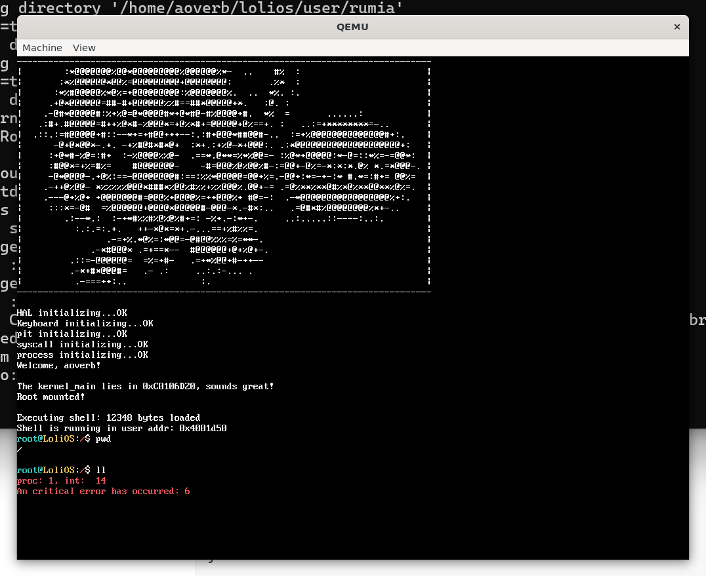
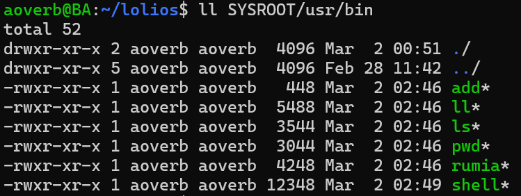
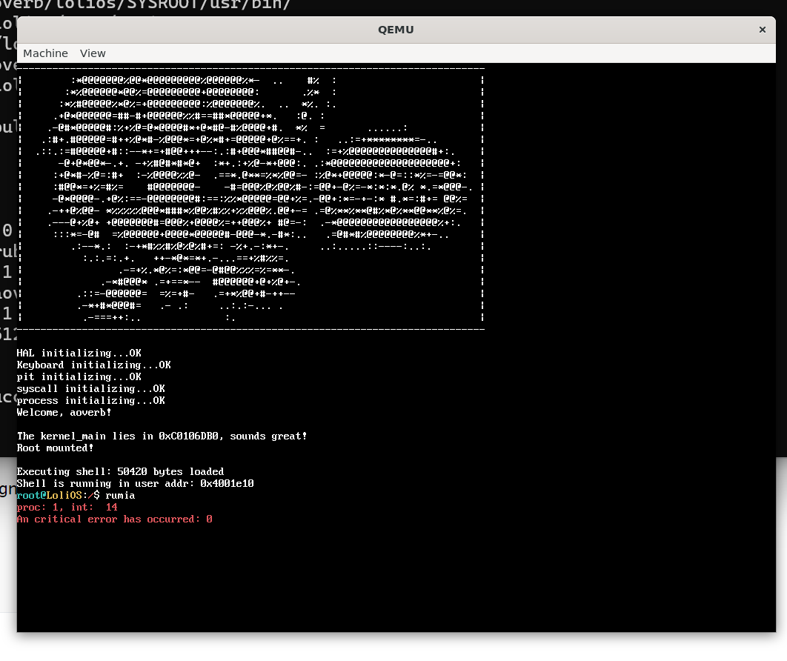
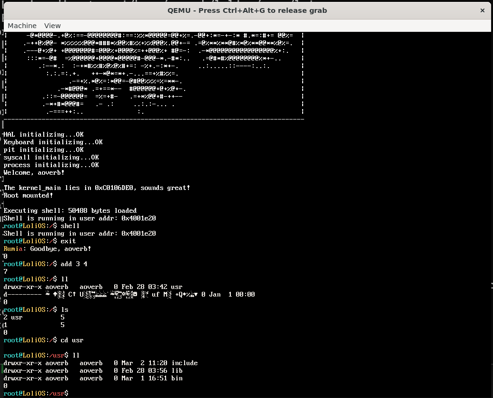

## 自制操作系统（18）：用户态 malloc/free，解析ELF

我们的进程居然不支持malloc堆空间！这导致我们现在还在栈空间上读取程序映像...

这样做的话后面稍微有大点的程序跑起来栈空间就危险了。我们还是需要给进程去做一个堆空间。

### 在PCB记录堆的指针

```cpp
typedef struct PCB {
    pid_t pid;
    uintptr_t esp;
    uintptr_t cr3;
    uint32_t saved_eflags;
    // 该任务的内核栈底（用于释放内存）
    void* kernel_stack_bottom;
    uintptr_t heap_start;  // 堆起始地址（固定不变）
    uintptr_t heap_break;  // 当前堆顶（sbrk 移动这个）

    uint16_t priority;
    uint16_t quota;
    uint32_t create_time;

    PCB* prev = nullptr;
    PCB* next = nullptr;

    pid_t parent_pid;
    uint8_t to_exit;
    int exit_code;
    process_state state;
    process_queue waiting_queue;

    file_description fd[MAX_FD_NUM];
    uint32_t fd_num;

    char cwd[256];
} PCB;
```

对于创建进程初始化这两个值的逻辑，现在我们只能拿着USER_ADDR_SPACE去加上一个size去设置这个堆起始地址：

```cpp
pid_t create_user_process(void* code, uint32_t code_size, uint8_t priority, int argc, char** argv) {
    ...
    vmm_switch(pd_addr);
    uint32_t pages_needed = (code_size + 4095) / 4096;
    for (uint32_t i = 0; i < pages_needed; i++) {
        void* phys = pmm_alloc(1);
        vmm_map_page((uintptr_t)phys, CODE_SPACE_ADDR + i * 4096, 6);
    }
    memcpy((void*)CODE_SPACE_ADDR, code_buf, code_size);
    kfree(code_buf);
    ...
    new_process->heap_start = (CODE_SPACE_ADDR + code_size + 0xFFF) & ~0xFFF // 页对齐
    new_process->heap_break = new_process->heap_start; // 一开始堆空间大小是0
    ...
}
```

### sbrk系统调用

sbrk是set break的意思，break是linux里面对于代码数据段结尾的术语，我们每次调用sbrk，就会增量地去增加堆的空间。

sbrk的逻辑很简单：接受一个增量值，由于内核pmm是按页来分配内存的，如果你当前的增量加上break没有超出同一页的边界（通过地址的掩码是否相等来判断），那就只把break增加增量即可；如果超出了边界，就按需申请新的页并做映射。也就是实际上用户态可以超出break的边界一点点，因为申请的单位是一整个页，只要别超出申请页带来的余量就没问题（但是别这样做！）。

```cpp
// SBRK(ebx = increment)
uintptr_t sys_sbrk(interrupt_frame* reg) {
    uintptr_t increment = static_cast<uintptr_t>(reg->ebx);
    PCB* cur_pcb = process_list[cur_process_id];
    uintptr_t old_break = cur_pcb->heap_break;
    uintptr_t new_break = old_break + increment;

    if (new_break < cur_pcb->heap_start) return (uintptr_t)-1;

    if (increment > 0) {
        uintptr_t old_page = (old_break + 0xFFF) & ~0xFFF;
        uintptr_t new_page = (new_break + 0xFFF) & ~0xFFF; // 按页对齐
        for (uintptr_t addr = old_page; addr < new_page; addr += 0x1000) {
            if (vmm_get_mapping(addr) == 0) {
                uintptr_t phys = reinterpret_cast<uintptr_t>(pmm_alloc(0x1000));
                vmm_map_page(phys, addr, 0x7); // Present | RW | User
            }
        }
    }

    cur_pcb->heap_break = new_break;
    return old_break;
}
```

然后我们就可以去实现用户态侧的系统调用了：

```cpp
void* sbrk(uintptr_t increment) {
    return (void*)syscall1((uintptr_t)SYSCALL::SBRK, increment);
}
```

### malloc/free

还记得我们之前实现kmalloc/kfree吗？其实我们可以把kheap的代码迁移到用户态！只是要把kheap_alloc_pages换成sbrk系统调用罢了，非常简单：

```cpp
void heap_expand(block_t last_block, uint32_t need_size) {
    uint32_t alloc_bytes = (need_size + 8 + 4095) & ~4095;
    void* result = sbrk(alloc_bytes);
    if ((int)result == -1) return;

    block_t new_block = last_block + block_size(last_block) / 4 + 2;
    set_block_size(new_block, alloc_bytes - 8);
    block_free_mark(new_block);

    heap_size += alloc_bytes;
    set_epilogue((uint32_t*)heap_head - 1);
}

void kheap_expand(free_block block, uint32_t size) {
    uint32_t alloc_pages = (size + 8 + 4095) / 4096;
    free_block new_block = block + block_size(block) / 4 + 2; // 指向epilogue
    kheap_alloc_pages(alloc_pages, 0x3);
    set_block_size(new_block, alloc_pages * 4096 - 8);
    block_free(new_block);
    heap_size += alloc_pages;
    set_epilogue();
}

void heap_init() {
    uint32_t init_bytes = 4096;
    uint32_t* base = (uint32_t*)sbrk(init_bytes);
    if ((int)base == -1) return;

    heap_size = init_bytes;

    set_prologue(base);
    heap_head = base + 1;
    set_block_size(heap_head, init_bytes - 4 * 4);
    block_free_mark(heap_head);
    set_epilogue(base);
}

void kheap_init() {
    heap_size = heap_initial_size;
    kheap_head = reinterpret_cast<free_block>(kheap_alloc_pages(heap_initial_size, 0x3));
    set_prologue();
    ++kheap_head;
    set_block_size(kheap_head, heap_initial_size * 4096 - 4 * 4); // 头尾两个4字节的对称的块描述结构，记录块大小和是否已分配的信息
    block_free(kheap_head);
    set_epilogue();
    return;
}
```

这些代码不能说非常相像，简直就是一模一样...

现在我们实现了malloc/free，有这么好的东西，当然要先给我们的shell用一下咯。我们之前程序是读取在栈空间的，现在我们来用堆空间：

```cpp
bool try_exec(const char* cmd, int argc, char* argv[]) {
    char fn[MAX_PATH];
    file_stat fst;

    for (int i = 0; i < 2; ++i) {
        snprintf(fn, sizeof(fn), "%s%s", PATH[i], cmd);

        if (stat(fn, &fst) == -1) continue;

        int fd = open(fn, 1);
        if (fd == -1) continue;

        char* buffer = (char*)malloc(fst.size);
        if (!buffer) {
            close(fd);
            continue;
        }

        int size = read(fd, buffer, fst.size);
        close(fd);

        if (size <= 0) {
            free(buffer);
            continue;
        }

        int child_pid = exec(buffer, size, 1, argc, argv);
        free(buffer);
        int ret = waitpid(child_pid);
        return true;
    }
    return false;
}
```



结果pwd可以，ll跪了...



大小超过4096的全部跪了，一通排查后发现，由于我们现在还是在flat binary阶段，没有正确清零bss段，记录堆的全局变量就变成了一堆垃圾值。不过由于我们下一节就要实现读取elf了，我们先让AI帮我们生成一个临时方案，多分配几页去清空.bss段。

### 解析ELF

我们苦flat binary久矣，是时候迁移到ELF了！

#### ELF文件结构

```cpp
ELF 文件
┌─────────────────────────┐
│      ELF Header         │  ← 总入口，描述文件基本信息
├─────────────────────────┤
│   Program Header Table  │  ← 给【加载器】看的目录（段/Segment）
├─────────────────────────┤
│                         │
│   .text  .rodata  .data │  ← 实际的数据块
│   .bss   .symtab  ...   │
│                         │
├─────────────────────────┤
│   Section Header Table  │  ← 给【链接器】看的目录（节/Section）
└─────────────────────────┘
```

ELF文件，大体由上面的四个部分组成：

一个固定大小的头，描述ELF的基本信息；

Program Header Table，被称为”段“的部分，描述了一系列的指令，告诉加载器要怎么加载数据块里面的内容，或者提供一些别的信息（比如动态链接相关的东西）；

实际的数据块；

Section Header Table，被称为”节“的部分，会对数据块进行更细分的数据分块描述，本质是给链接看的，我们不关心。

也就是说上下的这两个Table，不太准确地说，就是阐述同一个数据块的不同方式（要较真的话，两者描述的数据并不完全一致，段会有一些元数据包含在自己的头里，这些也需要被加载进去，而节会描述一些不会被加载到内存的内容，这些东西没有对应的加载segment。

#### 对比Flat binary

那么相比于加载Flat binary，加载ELF还需要些什么呢？

原来的流程：binary除了指令流没有任何的多余信息，把Flat binary按照大小加载到哪就从哪作为入口点开始执行；

ELF：我们除了要解析ELF Header来判断这个是不是一个合法的ELF，还得解析程序头表，因为它描述了一系列指令：把数据块的什么地方加载到哪（这样的加载会有若干个），可能还得清零一部分内存，最后跳转到读取的入口点...

#### 加载ELF

我们现在只讨论加载ET_EXEC的ELF，不涉及ASLR（地址空间布局虚拟化），更不涉及PIC（位置无关代码）。

##### 拆解create_user_process

我们的create_user_process函数实现达到了100+行，这不是一个好迹象，我们必须先拆解这个函数。

这个函数现在的工作流：为用户进程创建新的用户空间、复制镜像信息到内核缓冲区、切换页表、构造代码区并在新的用户空间映射、构造用户栈并在新的用户空间映射，初始化PCB（构造内核栈与iret栈帧）、将新进程加入就绪队列、切回页表。我们以此为思路来抽取几个函数。我们新建一个包装这个流程的函数，称为exec，参数与原来的create_user_process一致。

```cpp
pid_t exec(void* code, uint32_t code_size, uint8_t priority, int argc, char** argv);
```

这样的话我们甚至可以先改下几个用到了create_user_process的地方：

```cpp
// EXEC(ebx = code, ecx = code_size, edx = priority, esi = argc, ebp = argv)
int sys_exec(interrupt_frame* reg) {
    void*    code      = reinterpret_cast<void*>(reg->ebx);
    uint32_t code_size = reg->ecx;
    uint8_t  priority  = static_cast<uint8_t>(reg->edx);
    int      argc      = static_cast<int>(reg->esi);
    char**   argv      = reinterpret_cast<char**>(reg->ebp);
    return static_cast<int>(exec(code, code_size, priority, argc, argv)); // 这里改成了Exec
}
// kernel_main
...
    char* buffer = (char*)kmalloc(65536);
    int size = v_read(cur_pcb, fd, buffer, 65536);
    printf("Executing shell: %d bytes loaded\n", size);

    pid_t shell_pid = exec(buffer, size, 1, 0, nullptr); // 这里改成了Exec
    waitpid(shell_pid);
    while (1) {
        yield();
    }
```

毕竟我们现在create_user_process的逻辑其实比较像exec，我们先给它改头换面了，再一步步抽取。

```cpp

pid_t exec(void* code, uint32_t code_size, uint8_t priority, int argc, char** argv) {
    uint32_t saved_eflags = spinlock_acquire(&process_list_lock);
    pid_t newpid = get_new_pid();

    if (newpid == 0) {
        spinlock_release(&process_list_lock, saved_eflags);
        return 0;
    }

    void* code_buf = copy_image_to_kernel_buffer(code, code_size);

    uint32_t* arg_lens;
    char** arg_bufs;
    copy_args_to_kernel_buffer(argc, argv, arg_lens, arg_bufs);

    uint32_t pd_addr_old = vmm_get_cr3();
    uint32_t pd_addr = vmm_create_page_directory();
    asm volatile ("cli");
    vmm_switch(pd_addr);

    copy_image_from_kernel_buffer(code_buf, code_size);
    
    uintptr_t sp = create_user_stack(USER_STACK_PAGE_SIZE);
    construct_args_for_user_stack(argc, arg_lens, arg_bufs, sp);

    PCB* new_pcb = init_pcb(newpid);
    prepare_pcb_for_new_process(new_pcb);
    new_pcb->cr3 = pd_addr;
    // heap_start 也要考虑 .bss 额外页
    uint32_t total_pages = calc_total_pages(code_size);
    new_pcb->heap_start = CODE_SPACE_ADDR + total_pages * 4096;
    new_pcb->heap_break = new_pcb->heap_start;
    init_kernel_stack(new_pcb, KERNEL_STACK_SIZE, sp, CODE_SPACE_ADDR);

    insert_into_scheduling_queue(newpid, priority);

    vmm_switch(pd_addr_old);

    spinlock_release(&process_list_lock, saved_eflags);
    asm volatile ("sti");
    return newpid;
}
```

##### 解析ELF

重构完create_user_process，我们就可以怎么在exec函数去替代原来flat binary的逻辑了。

我们原来的逻辑是，直接把flat binary拷到CODE_SPACE_ADDR上，后面再垫几页零数据，再在后面构建栈；

解析ELF的逻辑是，我们删掉CODE_SPACE_ADDR这个东西，读取我们拷贝到内核缓冲区的ELF文件中的Segment段，遇到PT_LOAD指令我们就按要求在数据块里面拷贝内容到用户区，并按要求映射虚拟地址。所以改动后的exec函数会变成这样：

```cpp
pid_t exec(void* code, uint32_t code_size, uint8_t priority, int argc, char** argv) {
    uint32_t saved_eflags = spinlock_acquire(&process_list_lock);
    pid_t newpid = get_new_pid();

    if (newpid == 0) {
        spinlock_release(&process_list_lock, saved_eflags);
        return 0;
    }

    if (!verify_elf(code, code_size)) {
        return 0;
    }
```

首先一上来会有一个验证ELF镜像是否有效的逻辑，无效直接退出；

```cpp
    if (verify_elf(code, code_size) != 0) {
        return 0;
    }

    // 待会我们直接在内核缓冲区解析ELF，不需要复制
    // void* code_buf = copy_image_to_kernel_buffer(code, code_size);

    uint32_t* arg_lens;
    char** arg_bufs;
    copy_args_to_kernel_buffer(argc, argv, arg_lens, arg_bufs);

    uint32_t pd_addr_old = vmm_get_cr3();
    uint32_t pd_addr = vmm_create_page_directory();
    asm volatile ("cli");
    vmm_switch(pd_addr);

    // 不是复制，而是解析
    // copy_image_from_kernel_buffer(code_buf, code_size);
    uint32_t entry = 0;
    uint32_t heap_addr = 0;
    if (!construct_user_space_by_elf_image(code, code_size, entry, heap_addr)) {
        vmm_switch(pd_addr_old);
        asm volatile ("sti");
        spinlock_release(&process_list_lock, saved_eflags);
        // todo:
        // dispose_user_space(pd_addr);
        return 0;
    }
```

后面我们切换到新进程的用户空间后，直接在内核缓冲区做解析，构造用户空间，这个解析会返回一个入口点，还有一个用以初始化进程堆空间的值。

对于解析的ELF，堆空间的起始地址如此设置：记录PT_LOAD实际占用地址的最大值然后进行页对齐，设置成这个值。

这里如果解析失败，除了返回还要销毁用户空间，这里我们先记录todo。（后面我们就能修复了！）

```cpp
    uintptr_t sp = create_user_stack(USER_STACK_PAGE_SIZE);
    construct_args_for_user_stack(argc, arg_lens, arg_bufs, sp);

    PCB* new_pcb = init_pcb(newpid);
    prepare_pcb_for_new_process(new_pcb);
    new_pcb->cr3 = pd_addr;
    // heap_start 也要考虑 .bss 额外页
    // uint32_t total_pages = calc_total_pages(code_size);
    // new_pcb->heap_start = entry + total_pages * 4096;
    // new_pcb->heap_break = new_pcb->heap_start;
    new_pcb->heap_start = heap_addr;
    new_pcb->heap_break = heap_addr;
    init_kernel_stack(new_pcb, KERNEL_STACK_SIZE, sp, entry);

    insert_into_scheduling_queue(newpid, priority);

    vmm_switch(pd_addr_old);

    spinlock_release(&process_list_lock, saved_eflags);
    asm volatile ("sti");
    return newpid;
}
```

后面的修改点有两个，第一个是我们有了指定的entry，需要把原来固定的用户空间开头地址给去掉；第二个是我们现在可以放心地把elf解析器给我们的堆空间地址直接赋给PCB的相应字段了。

然后剩下的就是实现verify_elf和construct_user_space_by_elf_image这两个函数了。

##### 验证ELF：verify_elf

verify_elf负责检查魔数、是否是我们能读取的ELF、边界。

```cpp
int verify_elf(void* elf_image, uint32_t size) {
    if (!elf_image || size < sizeof(Elf32_Ehdr))
        return 0;

    Elf32_Ehdr* ehdr = (Elf32_Ehdr*)elf_image;

    if (ehdr->e_ident[EI_MAG0] != ELFMAG0 ||
        ehdr->e_ident[EI_MAG1] != ELFMAG1 ||
        ehdr->e_ident[EI_MAG2] != ELFMAG2 ||
        ehdr->e_ident[EI_MAG3] != ELFMAG3)
        return 0;

    if (ehdr->e_ident[EI_CLASS] != ELFCLASS32)
        return 0;

    if (ehdr->e_ident[EI_DATA] != ELFDATA2LSB)
        return 0;

    if (ehdr->e_ident[EI_VERSION] != EV_CURRENT)
        return 0;

    if (ehdr->e_type != ET_EXEC && ehdr->e_type != ET_REL) // 不支持重定向
        return 0;

    if (ehdr->e_machine != EM_386) // x86
        return 0;

    if (ehdr->e_ehsize != sizeof(Elf32_Ehdr)) // Elf Header大小
        return 0;

    if (ehdr->e_phoff + ehdr->e_phnum * sizeof(Elf32_Phdr) > size) // 越界检查
        return 0;

    return 1;
}
```

我们不关心节，所以我没有对节的边界进行检查。

##### 加载ELF到用户空间

加载ELF的用户空间的步骤是：

按照ELF文件头的描述，找到段的开头和边界；

然后用Program header去遍历解析段数据；

一旦解析到类型为PT_LOAD的段，就按照指引去复制数据块里面对应的块到指定地址；

直到遍历完成所有的段。

```cpp

#define VMM_PAGE_PRESENT  (1 << 0)   /* P: 位 0，1 表示页面在内存中 */
#define VMM_PAGE_WRITABLE (1 << 1)   /* R/W: 位 1，1 表示可读写，0 表示只读 */
#define VMM_PAGE_USER     (1 << 2)   /* U/S: 位 2，1 表示用户态可访问，0 表示仅内核 */

uint32_t elf_to_vmm_flags(uint32_t p_flags) {
    uint32_t vmm_flags = VMM_PAGE_PRESENT | VMM_PAGE_USER;
    if (p_flags & PF_W) vmm_flags |= VMM_PAGE_WRITABLE;
    return vmm_flags;
}

int construct_user_space_by_elf_image(void* elf_image, uint32_t size, uint32_t& entry, uint32_t &heap_addr) {
    Elf32_Ehdr* ehdr = (Elf32_Ehdr*)elf_image;
    // 我们始终假设在调用construct_user_space_by_elf_image之前，你已经调用了verify_elf进行检查

    // 按照ELF文件头的描述，找到段的开头和边界
    Elf32_Phdr* phdr = (Elf32_Phdr*)((uint32_t)elf_image + ehdr->e_phoff);
    uint16_t phnum = ehdr->e_phnum;
    heap_addr = 0;
    // 用Program header去遍历解析段数据；
    for (uint32_t i = 0; i < phnum; ++i) {
        phdr = (Elf32_Phdr*)((uint32_t)elf_image + ehdr->e_phoff + i * ehdr->e_phentsize);
        if (phdr->p_type != PT_LOAD) continue;
        if (phdr->p_offset + phdr->p_filesz > size) {
            // 用户态下需要自己回收内存，这里还没有实现用户态，先标记todo
            return 0;
        }
        // 解析到类型为PT_LOAD的段，就按照指引去复制数据块里面对应的块到指定地址
        // 看看实际加载需要多大，按页对齐
        // 映射页要求物理地址和虚拟地址都要按页对齐
        // 我们的物理地址无所谓，但是elf提供的虚拟地址不一定会按页对齐！
        // 所以我们要确认每一块的虚拟地址的起始和终点，按页对齐
        uintptr_t aligned_load_vaddr = phdr->p_vaddr & ~0xFFF;
        uintptr_t aligned_load_vaddr_end = (phdr->p_vaddr + phdr->p_memsz + 0xFFF) & ~0xFFF;
        
        uint32_t load_size = aligned_load_vaddr_end - aligned_load_vaddr; 
        void* load_paddr = elf_malloc(load_size);
        uint32_t load_flag = elf_to_vmm_flags(phdr->p_flags);

        for (uintptr_t offset = 0; offset < load_size / 0x1000; ++offset) {
            elf_mmap((uintptr_t)load_paddr + offset * 0x1000, aligned_load_vaddr + offset * 0x1000, load_flag);
        }
            
        memcpy((void*)phdr->p_vaddr, (void*)((uint32_t)elf_image + phdr->p_offset), phdr->p_filesz);

        // 遇到读取大小和段大小不一致的情况就代表是.bss，需要手动置零
        if (phdr->p_filesz < phdr->p_memsz) {
            memset((void*)((uint32_t)phdr->p_vaddr + phdr->p_filesz), 0, phdr->p_memsz - phdr->p_filesz);
        }
        heap_addr = heap_addr < aligned_load_vaddr_end ? aligned_load_vaddr_end : heap_addr;
    }
    entry = ehdr->e_entry;
    return heap_addr > 0 ? 1 : 0;
}
```



shell正常打开，一执行程序就跪了，为什么捏...

```cpp
pid_t exec(void* code, uint32_t code_size, uint8_t priority, int argc, char** argv) {
    uint32_t saved_eflags = spinlock_acquire(&process_list_lock);
    pid_t newpid = get_new_pid();

    if (newpid == 0) {
        spinlock_release(&process_list_lock, saved_eflags);
        return 0;
    }

    if (!verify_elf(code, code_size)) {
        return 0;
    }

    // 待会我们直接在内核缓冲区解析ELF，不需要复制
    // void* code_buf = copy_image_to_kernel_buffer(code, code_size);

```

这里有问题，只是说“不用从内核再拷贝到用户空间”，不是不用拷贝到内核！

```cpp
    if (!construct_user_space_by_elf_image(code_buf, code_size, entry, heap_addr)) {
        kfree(code_buf);
        vmm_switch(pd_addr_old);
        asm volatile ("sti");
        spinlock_release(&process_list_lock, saved_eflags);
        return 0;
    }
    kfree(code_buf);
```



修复这个BUG之后，我们的elf加载器正确运行了！我们的用户态程序也回来了！

---

### 总结

经此一役，我们利用新实现的malloc/free，总算是抛弃了落后的flat binary，投向了ELF的怀抱！
下一节我们来看看IPC（进程间通信），来实现管道吧！
