## 自制操作系统（19）：IPC（进程间通信）

这一节我们来实现IPC的两种：管道和信号。

### 管道

管道的原理：管道可以看作是一个文件，从外部看，其实就是多个进程打开同一个文件，于是它们都会持有这个文件的读端或写端两个文件描述符，或持有读端读取，或写入这个文件，或同时持有。

内部实现的话，存储形态是一个环形缓冲区，还有一把管道访问相关的锁，以及读写端的引用计数。

所以我们想实现管道的话应该是这样：

实现一个pipe函数，这个函数能为我们返回两个文件描述符，它们指向同一个代表管道的文件；

文件描述符会记录当前是写端还是读端，以及当前指向的文件类型是一个管道；

当文件是空的时候，如果有读端来读取，就需要将当前进程放入这个文件的读等待序列，直到写端写入数据；同样，如果文件满了，这个进程也需要放入写等待序列，直到文件有足够的空间写入；

无论读写，同时只能有一个进程来访问管道，读写锁是统一的一把锁；

文件内部需要两个引用计数，来记录当前写端和读端的数量。

### 重构VFS和TARFS：全局文件数组

我们现在的fd是这样的：

```cpp
struct file_description {
    mounting_point* mp;
    char path[256];
    uint32_t handle_id;
};
```

但是管道需要记录文件的引用计数，还要为文件加锁（实际上，所有的文件都需要...我们之前偷懒了，没做这一步）。所以我们要加上两个记录字段：

```c++
    spinlock lock;
    uint32_t readcnt;
    uint32_t writecnt;
```

但是这几个字段应该跟文件本身绑定，而不是跟访问文件的句柄绑定（不然记录这些字段就没有意义了！这些字段是需要打开这个文件的所有进程共享的）。那我们有handle_id写在文件原始数据的file_handle如何呢？

```cpp
struct file_handle {
    uint32_t inode_no;
    uint32_t offset;
    uint32_t mode;
    uint8_t type;
    uint8_t valid;
};
```

不行，这个handle记录的是单个进程访问某个文件的状态，同样无法共享。

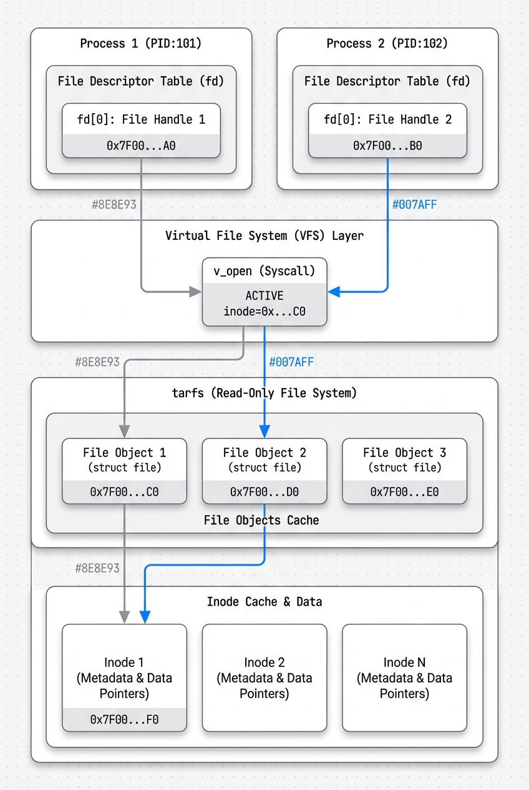

其实看到这里可以发现，我们之前的设计有两个缺陷：

1、我们没有意识到文件的状态分为两部分：一部分是所有进程共享的（锁、读写计数），一部分是进程拥有的句柄；

2、我们把文件句柄的管理放在了具体驱动（这里是tarfs）的实现层，这部分应该放在vfs。

因此，我们需要做的是，把文件状态的定义和处理放在vfs层，在file_handle添加上上述的几个公共记录字段。

这样做的话，我们最好将所有的file_handle统一放到一个数组里面进行管理，而这个数组就成为了我们的全局文件数组。

```cpp
typedef struct {
    mounting_point* mp;
    uint32_t inode_id;
    uint32_t offset;
    uint32_t mode;
    uint32_t handle_id;
    uint32_t refcnt;
} file_description;
```

注意这里为了命名统一，把file_handle改成了file_description。而且为了后面的dup和fork（有可能）准备，我还提供了引用计数refcnt。

而共享的文件状态，我们就可以直接记录在tar_inode内：

```cpp
struct tar_inode {
    spinlock lock;
    uint32_t readcnt;
    uint32_t writecnt;
    tar_block* block = nullptr;
    std::unordered_map<std::string, inode_id> child_inodes;
};
```

...实际上我并没有修改tar_inode，而是在tarfs_data结构加了把全局锁

```cpp
struct tarfs_data {
    void* tar_addr;
    uint32_t tar_size;
    tar_inode* inodes[MAX_INODE_NUM]; 
    uint32_t inode_cnt;
    spinlock lock;
};
```

等到了实现管道，我们就可以往inode里面加这些字段了。

### 控制台设备文件

但是在实现管道之前，我们得先把控制台这个设备文件给实现（真麻烦！）

实现这个的目的是，我们可以创建标准输入输出这两个文件描述符，然后我们后面就可以用管道对它们做重定向。

读写测试正常！

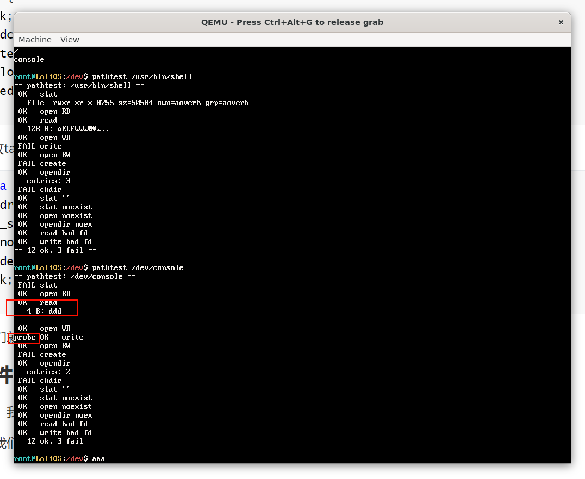

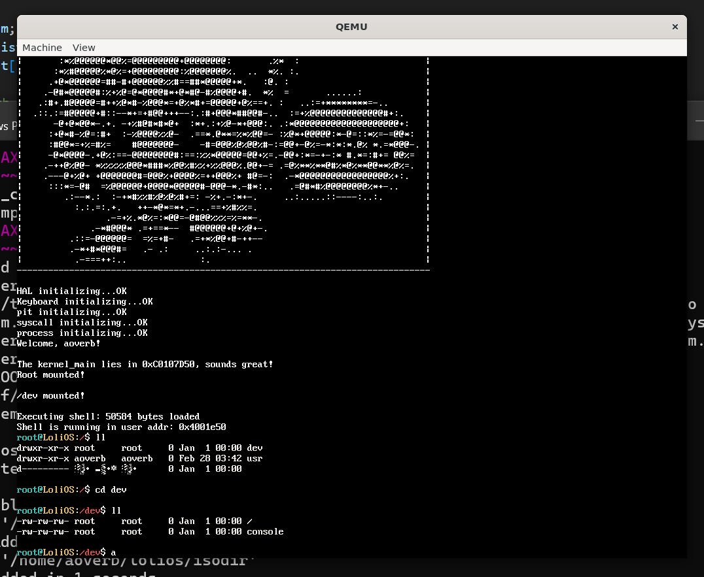

现在我们的控制台已经变成一个可以任意读写的设备文件了！

现在，让我们实现进程默认打开标准输入输出：

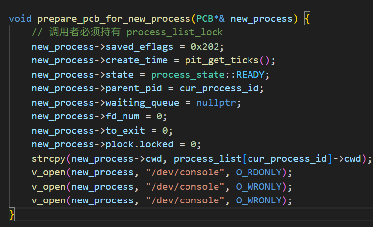

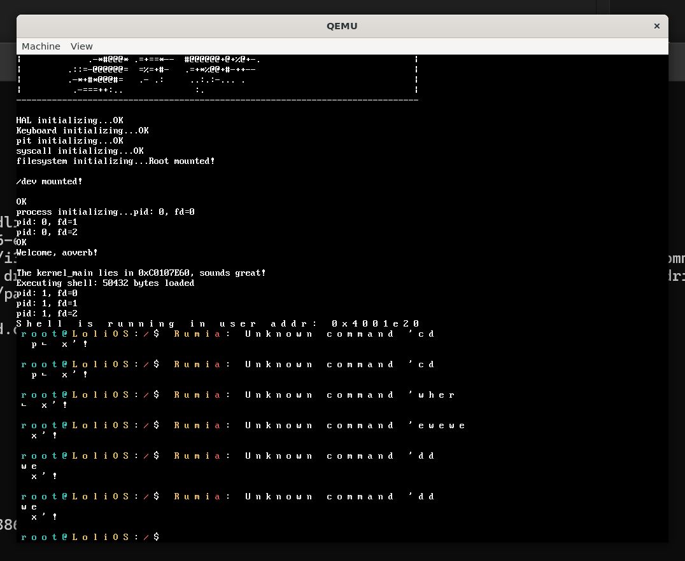

好消息：成了！坏消息：格式不对劲...

```cpp
static int console_read(char* buffer, uint32_t offset, uint32_t size) {
    uint32_t i = 0;
    while (i < size - 1) {
        while (!keyboard_haschar())
            asm volatile("pause");
        char c = keyboard_getchar();

        if (c == '\b') {
            if (i == 0) continue;
            --i;
            terminal_write("\b", 1);   // 回显退格
            continue;
        }

        if (c == '\n') {
            buffer[i++] = '\n';
            terminal_write("\n", 1);   // 回显换行
            break;
        }

        if (c >= 32 && c <= 126) {
            buffer[i++] = c;
            terminal_write(&c, 1);     // 回显可见字符
        }
    }
    return i;
}
```

输入没有回显的问题：在dev驱动层面解决；而且getline不能光读入数据，还要识别换行符，清除不显示的字符等；

```cpp
void getline(char* buf, uint32_t size) {
#if defined(__is_libk)
    keyboard_flush();
    uint32_t i = 0;

    while (i < size - 1) {
        while (!keyboard_haschar()) {
            asm volatile("pause"); 
        }

        char c = keyboard_getchar();

        if (c == '\b') {
            if (i == 0) continue;
            --i;
            printf("\b");
            continue;
        }

        if (c == '\n') {
            buf[i] = '\0';
            printf("\n");
            return;
        }

        if (c >= 32 && c <= 126) {
            buf[i++] = c;
            printf("%c", c);
        }
    }

    buf[i] = '\0';
#else
    int n = read(0, buf, size - 1);
    if (n < 0) n = 0;
    if (n > 0 && buf[n - 1] == '\n') n--;
    buf[n] = '\0';
#endif
```

标准输出有问题是因为写单个字符，长度没算对，写成跟下面那样就好了。

```cpp
int putchar(int ic) {
#if defined(__is_libk)
	char c = (char) ic;
	terminal_write(&c, sizeof(c));
#else
	char c = (char) ic;
	char s[2];
	s[0] = c;
	s[1] = '\0';
	write(1, s, 1);
#endif
	return ic;
}
```

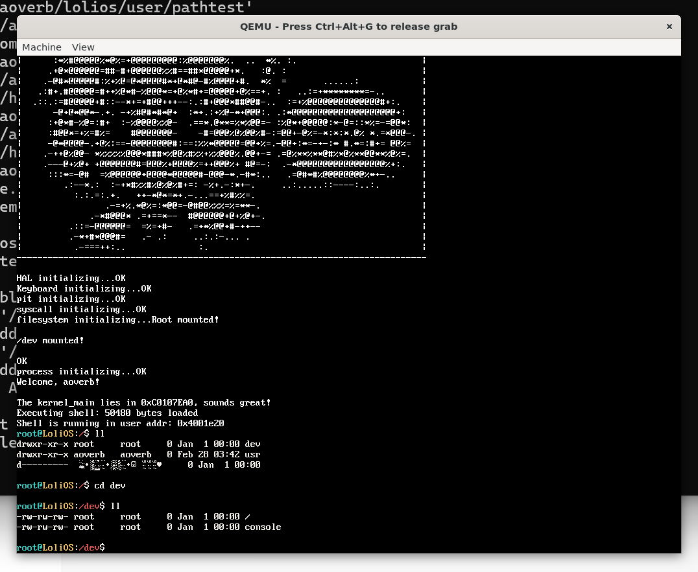

太美妙了！现在，我们终于可以开始写管道了！

### 实现PipeFS

有点难写。我决定自顶向下实现。

先用AI写一个支持管道的shell，看了下，主要是给我们原来的exec后面带了两个参数，还有用到了新的函数pipe，我们编译：

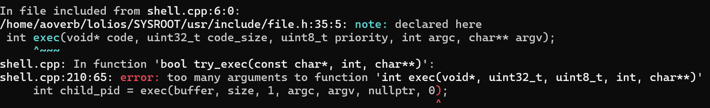

#### 顶层exec打桩

先给exec加参数打桩，我们再往下适配函数签名和传参：

```cpp
int exec(void* code, uint32_t code_size, int argc, char** argv,
    fd_remap* remaps = nullptr, int remap_cnt = 0);
```


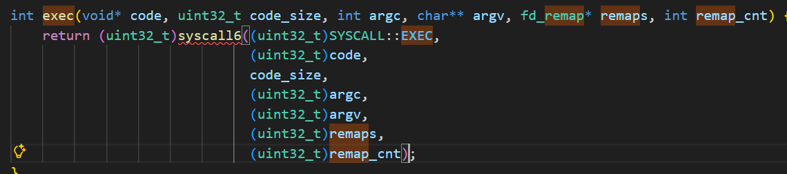

这回syscall5都不够用了。

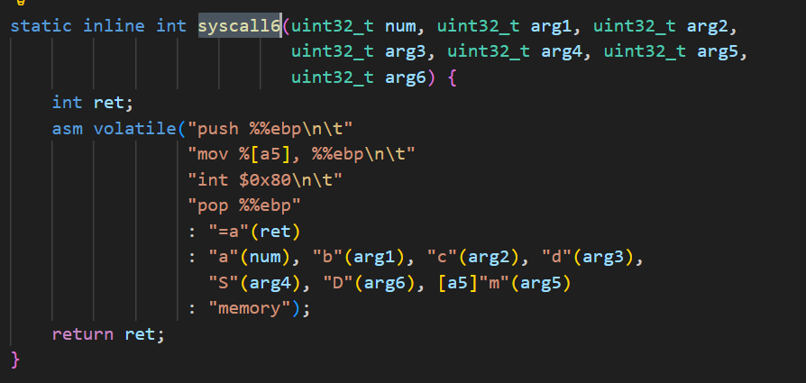

我们的六个寄存器全用上了。

```cpp
pid_t exec(void* code, uint32_t code_size, uint8_t priority, int argc, char** argv,
    fd_remap* remaps, int remap_cnt) {
    if (!verify_elf(code, code_size)) {
        return 0;
    }
```

#### 顶层pipe打桩


我们来实现一个pipe：

```cpp
static int pipe(int fds[2]) {
    return syscall1((uint32_t)SYSCALL::PIPE, (uint32_t)fds);
}
...
// PIPE(ebx = fds[2])
int sys_pipe(interrupt_frame* reg) {
    int* fds = reinterpret_cast<int*>(reg->ebx);
    return kpipe(fds);
}
```

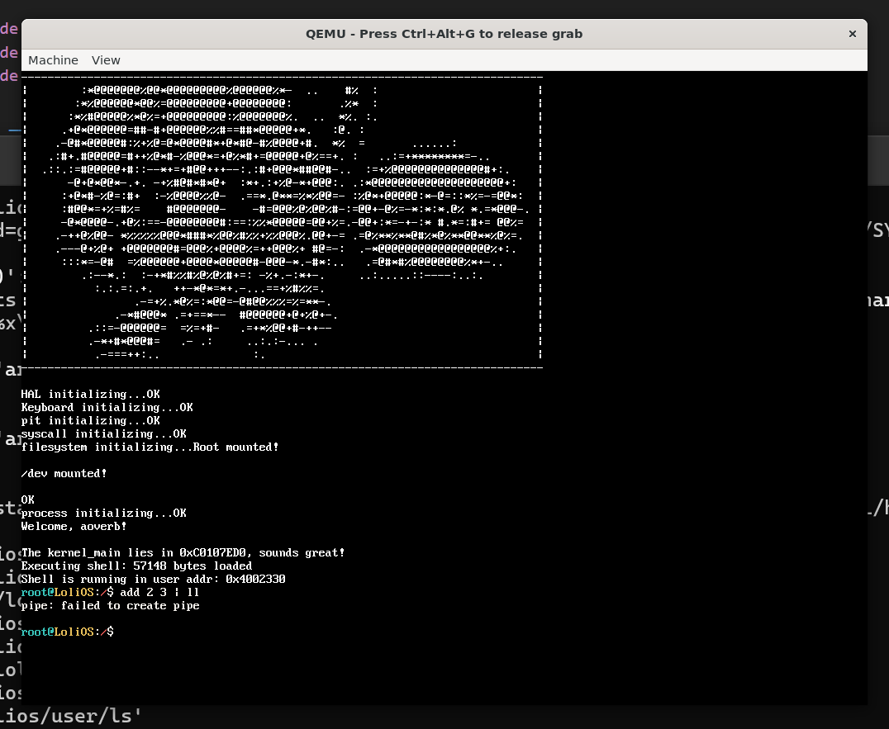

打了桩之后起码我们的程序能跑起来了。

### kpipe

创建管道。逻辑是创建两个指向同一个pipe_entry的描述符。我们直接在file_description里面内嵌pipe的数据结构（不大）：

```cpp
struct pipe_entry {
...还没想好写什么
};

typedef struct {
    mounting_point* mp;
    uint32_t inode_id;
    uint32_t offset;
    uint32_t mode;
    uint32_t handle_id;
    uint32_t refcnt;
    char path[255];

    uint8_t is_pipe;
    uint8_t is_read;
    pipe_entry* pipe;
} file_description;
```

然后就是我们的kpipe，很丑...建议直接跳到尾部。

```cpp
int kpipe(int fds[2]) {
    SpinlockGuard guard(process_list_lock);
    PCB* proc = process_list[cur_process_id];
    SpinlockGuard guard_pcb(proc->plock);
    int read_fd = alloc_fd_for_proc(proc);
    if (read_fd == -1) {
        return -1;
    }
    proc->fd[read_fd] = (file_description*)kmalloc(sizeof(file_description));
    proc->fd_num++;
    int write_fd = alloc_fd_for_proc(proc);
    if (write_fd == -1) {
        kfree(proc->fd[read_fd]);
        proc->fd_num--;
        return -1;
    }
    proc->fd[write_fd] = (file_description*)kmalloc(sizeof(file_description));
    proc->fd_num++;

    int read_handle_id = get_empty_handle();
    if (read_handle_id == -1) {
        kfree(proc->fd[read_fd]);
        kfree(proc->fd[write_fd]);
        proc->fd_num--;
        proc->fd_num--;
        return -1;
    }
    file_handle[read_handle_id] = proc->fd[read_fd];
    file_handle_num++;

    int write_handle_id = get_empty_handle();
    if (write_handle_id == -1) {
        kfree(proc->fd[read_fd]);
        kfree(proc->fd[write_fd]);
        proc->fd_num--;
        proc->fd_num--;
        file_handle[read_handle_id] = nullptr;
        file_handle_num--;
        return -1;
    }
    file_handle[write_handle_id] = proc->fd[write_fd];
    file_handle_num++;
    // ...好蠢的代码
    file_description*& read_handle = proc->fd[read_fd];
    file_description*& write_handle = proc->fd[write_fd];

    read_handle->handle_id = read_handle_id;
    write_handle->handle_id = write_handle_id;
    read_handle->is_pipe = 1;
    write_handle->is_pipe = 1;
    read_handle->is_read = 1;
    write_handle->is_read = 0;

    read_handle->pipe = write_handle->pipe = (pipe_entry*)kmalloc(sizeof(pipe_entry));

    fds[0] = read_fd;
    fds[1] = write_fd;
    return 0;
}
```

Claude提议我们可以简单实现，pipe逻辑耦合到file_description，这样我们的kpipe就是跟vfs写在一块的了，这样太挫了，我们不能这么做。我们的kpipe应该利用vfs来创建管道，通过vfs来访问我的pipefs，pipefs内部才去实现管道相关的逻辑，我们通过vfs就可以对管道进行操作，所以，我们应该把这部分单独提取成pipefs。

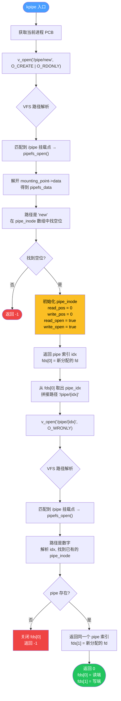

这样的话，我们的kpipe就变成了：

```cpp
int kpipe(int fds[2]) {
    PCB* proc = process_list[cur_process_id];

    fds[0] = v_open(proc, "/pipe/new", O_CREATE | O_RDONLY);
    if (fds[0] < 0) return -1;

    int pipe_idx = proc->fd[fds[0]]->inode_id;
    char path[32];
    sprintf(path, "/pipe/%d", pipe_idx);
    fds[1] = v_open(proc, path, O_WRONLY);
    if (fds[1] < 0) {
        v_close(proc, fds[0]);
        return -1;
    }
    return 0;
}
```

清爽多了！既然这样，我们可以直接来看看怎么实现pipefs：

#### exec适配

exec适配逻辑其实就是把子进程指定的fd换成父进程的fd，只不过，remaps是放在用户空间的，我们同样要将其先拷贝到内核区。

#### 最终效果

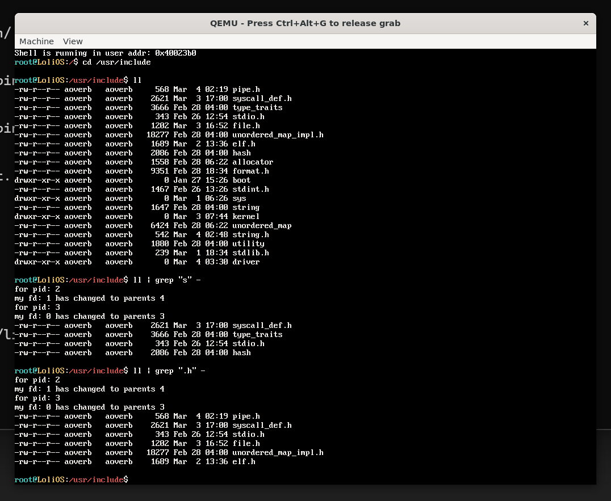

恍然大悟：我的程序在退出时没有自动释放句柄...

其实也不是，忘了改函数签名...

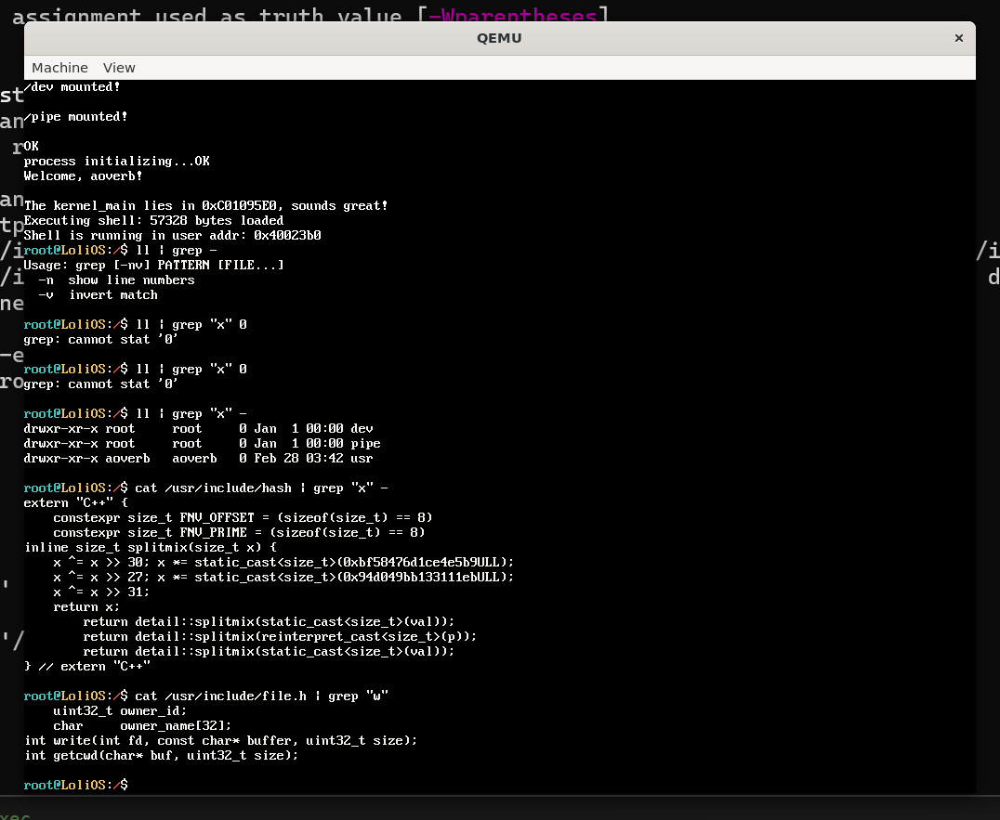

至此，我们就成功自顶向上地实现了管道！

---

本来想搞信号的，但是被管道弄得力竭了；

本来想搞ProcFS的，但是最近搞了太多FS了，有些审美疲劳。

下一节也是第二十章了，该搞点不一样的了。下一节，我们来初探网络栈，写一个网卡驱动，实现设备文件/dev/nic！
