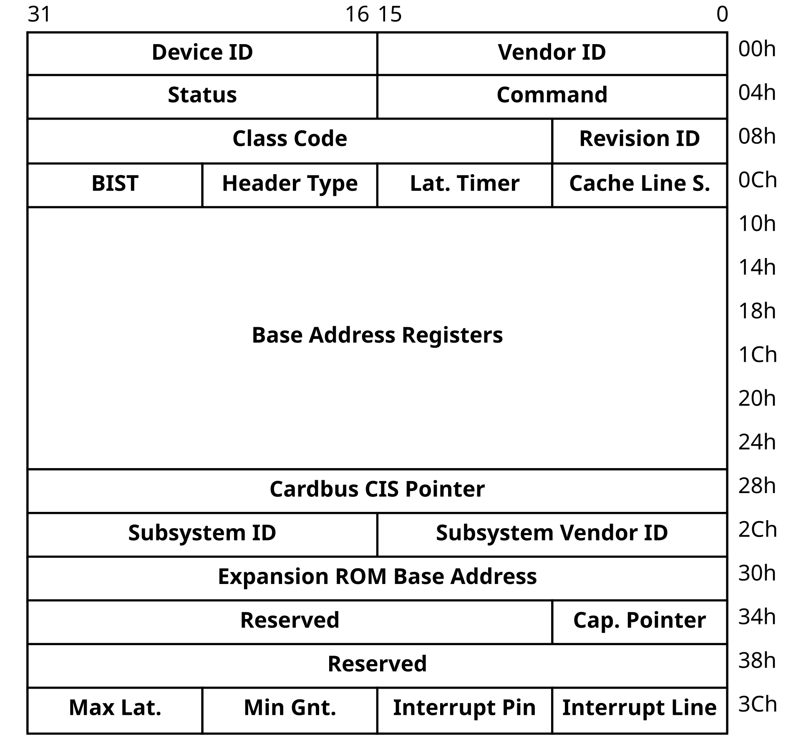
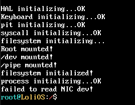
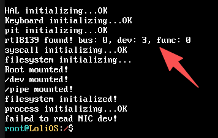
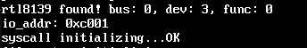

## 自制操作系统（20）：rtl8139网卡驱动（上）- 驱动介绍，初始化与收发数据逻辑实现

我平常不会开发驱动这种东西，所以这种越靠近底层的东西，我觉得自顶向下去实现去实现就更合适。

讲解一个东西的思路应该是，你找到一个最小的你有足够清醒认识的概念，然后顺着这个概念往下讲，比如对我来说，可能就是以太网帧。

### 目标态

既然是自顶向下，我们就从目标态讲起：我们的目标是以/dev/nic作为我们网卡驱动的虚拟设备文件，我们对它进行读写操作，其实就是读写以太网帧。（不久之后我们就会明白，这是一个**很糟糕的点子**——但是对于目前的我们来说借它来调试，倒也不算是什么坏主意）那么本质上，我们是要实现nic_read和nic_write两个函数，nic_write就是我们要发送的以太网帧，nic_read返回一个以太网帧数据。

别想多，我们先来写一个空实现：

```cpp
#include <driver/devfs.hpp>
#include <driver/rtl8139.hpp>

void rtl8139_init() {
    return;
}

static int nic_read(char* buffer, uint32_t offset, uint32_t size) {
    return -1;
}

static int nic_write(const char* buffer, uint32_t size) {
    return -1;
}

void init_nic_dev_file(mounting_point* mp) {
    static dev_operation nic_opr;
    nic_opr.read = &nic_read;
    nic_opr.write = &nic_write;
    register_in_devfs(mp, "nic", &nic_opr);
};

```

然后我们就可以在kernel_main初始化的时候，调用这些函数去初始化咱们的驱动：

```cpp
    extern void init_nic_dev_file(mounting_point* mp);
...
	mounting_point* dev_ret = v_mount(FS_DRIVER::DEVFS, "/dev", nullptr);
    if (dev_ret == nullptr) {
        panic("failed to mount devfs to /dev!");
    } else {
        printf("/dev mounted!\n");
    }
    init_console_dev(dev_ret);
    init_nic_dev_file(dev_ret);

...
    rtl8139_init();
```

这像是在自嗨——也确实是，但是编写驱动本质上是一件不容易的事，为什么不先让自己看到点反馈呢？

运行程序，我们就能看到设备文件了：


我们甚至可以写一段测试代码，来给自己一些埋下一些种子：

```cpp
    PCB* cur_pcb = process_list[cur_process_id];
    int nic_fd = v_open(cur_pcb, "/dev/nic", O_RDONLY);
    if (nic_fd == -1) {
        printf("failed to open NIC dev!\n");
    }
    char* buf = (char*)kmalloc(1024 * sizeof(char));
    if ((v_read(cur_pcb, nic_fd, buf, 1024)) != -1) {
        printf("do nic_read successfully! %.8s\n", buf);
    } else {
        printf("failed to read NIC dev!\n");
    }
```

我们相信在不久的将来后，这里将可以正常地调用返回！

### 环形缓冲区

那么nic_read实际上是在读什么呢？原来在我们配置好之后，rtl8139会根据我们配置好的物理地址，把接收到的数据通过DMA（Direct Memory Access）刷到内存上。那么也许，我们现在可以先设计好要把这段缓冲区放在虚拟地址的什么位置，要多大。

缓冲区的大小有很多种规格，分别是8K/16K/32K/64K，这里我们直接给到顶格的64KB 。这些规格是rtl8139的 RCR 寄存器里 RBLEN 字段决定的，后面配置寄存器时会再详细说。

```cpp
#include <kernel/mm.h>

constexpr uint32_t RBUFFER_SIZE = 0x10000;
constexpr uint32_t RBUFFER_ADDR_START = 0xE1000000;
constexpr uint32_t RBUFFER_ADDR_END = 0xE1000000 + 0x10000 + 0x10; // 64kb缓冲区映射 + 16字节的余量
static uint32_t p_addr = 0;

void round_buffer_init() {
    int total_pages = 0x10000 / (1 << 12) + 1; // 多出的一页是为了16字节的余量
    p_addr = (uint32_t)pmm_alloc(total_pages);
    for (int i = 0; i < total_pages; ++i) {
        vmm_map_page(p_addr + (1 << 12) * i, RBUFFER_ADDR_START + (1 << 12) * i,
        VMM_WRITABLE | VMM_CACHE_DISABLE); // 注意这里VMM_CACHE_DISABLE是不缓存策略
    }
}

void rtl8139_init() {
    round_buffer_init();
    return;
}
```

使用pmm_alloc是因为我们需要一段连续的物理内存区域，DMA直接写内存，不走MMU。

我们现在的vmm_map_page实现还不支持不缓存策略的设置，因此我们需要修改下：

```cpp
    cur_pte->present       = 1;
    cur_pte->read_write    = (flag >> 1) & 1;
    cur_pte->user_super    = (flag >> 2) & 1;
    cur_pte->write_through = (flag >> 3) & 1;
    cur_pte->cache_disable = (flag >> 4) & 1;
    cur_pte->frame         = p_addr >> 12;
```

上面值得一提的是这16字节的余量是因为rtl8139会在末尾多写16字节（用于CRC等），我们不得不为此再申请一页。

那么我们怎么告诉网卡，我们已经为它准备好了一块缓存呢？我们需要通过读写它的寄存器与它“交流”。

### 串口通信-io_addr

说到交流，其实我们与这块网卡硬件的交流，是通过串口向它的串口地址io_addr写入数据来实现的，本质上，我们是在向它的寄存器写入内容，我们这里可以直接给出配置它的缓冲区的示例代码：

```cpp
constexpr uint16_t REG_CONFIG1  = 0x52;
constexpr uint16_t REG_CHIPCMD  = 0x37;
constexpr uint16_t REG_RBSTART  = 0x30;
constexpr uint16_t REG_RXCONFIG = 0x44;
constexpr uint16_t REG_TXCONFIG = 0x40;

static uint32_t p_addr = 0;

...

static uint16_t io_addr = 0;

void rtl8139_init() {
    round_buffer_init();

    outl(io_addr + REG_RBSTART, p_addr);
    return;
}
```

注意我这里很顺手地把后面要用到的寄存器偏移量也写出来了。

相当于是说，io_addr是访问这个设备的基址，我们拿到它就可以操控rtl8139网卡，而后面的这个偏移量（RBSTART），就代表我们在访问它的环形缓冲区起始地址寄存器。寄存器-偏移量的映射可以在这个网卡的数据手册中找到。

我们现在已经告诉了rtl8139缓冲区在哪。但是，我们要怎么知道网卡对应的io_addr呢？这就要谈到我们怎么发现rtl8139了。

### 遍历PCI配置

许多外设都是连接在PCI总线的，每种支持PCI协议的设备，都有自己独特的厂商码和设备型号码，每个主板最多支持256根总线（通常个人电脑都是一根总线），每根总线最多支持32个设备，每个设备最多支持8个功能，在操作系统看来，最多就支持256 * 32 * 8 = 65536台设备。我们通过遍历PCI上面所有的设备，就可以知道设备对应的信息，就像这样：

```c++
int search_for_rtl8139() {
    uint8_t bus = 0;
    do {
        for (uint8_t dev = 0; dev < 32; ++dev)
            for (uint8_t func = 0; func < 8; ++func) {
                获取信息...
                if (厂商名和设备类型名与rtl8139的一致) {
                    获取信息返回
                }
            }
    } while (bus++ != 255);

    return -1;
}

void rtl8139_init() {
    if (round_buffer_init() == -1) return;

    outl(io_addr + REG_RBSTART, p_addr);
    return;
}
```

那么，怎么跟PCI交流获取指定信息呢？是的你没有猜错，还是我们的串口！所以获取信息的函数可以是下面这样：

```cpp
constexpr uint16_t PCI_CONFIG_ADDRESS = 0xCF8;
constexpr uint16_t PCI_CONFIG_DATA = 0xCFC;
uint32_t read_pci_by_32bits(uint8_t bus, uint8_t dev, uint8_t func, uint8_t reg_index) {
    uint32_t addr = (1u << 31) | (bus << 16) | (dev << 11) | (func << 8) | (reg_index << 2);
    // 最高位是一个enable位，需要为1
    outl(PCI_CONFIG_ADDRESS, addr);
    // reg_index左移两位是因为我们每次读取4个字节
    return inl(PCI_CONFIG_DATA);
}
```

上面的地址是与PCI进行配置信息交换的串口地址。

可以注意到上面的函数多了一个索引参数reg_index，这是因为PCI_CONFIG包含多个字段：



By Vijay Kumar Vijaykumar - Own work, Public Domain, https://commons.wikimedia.org/w/index.php?curid=3181779

这个就是PCI_CONFIG的结构了，可以看到我们要的就是第一行的设备ID和厂商ID。read_pci_by_32bits会为我们返回32位的内容，所以我们reg_index填入0，就能获取到它们了：

```cpp
                // 获取信息...
                uint32_t config = read_pci_by_32bits(bus, dev, func, 0);
                uint16_t device_id = config >> 16;
                uint16_t vendor_id = config & ((1 << 16) - 1);
                if (vendor_id == 0x10ec && device_id == 0x8139) {
                    pci_bus = bus;
                    pci_dev = dev;
                    pci_func = func;
                    return 0;
                }
```

我们可以在控制台输出打印来确定我们有没有找到对应的信息：

```cpp

    if (search_for_rtl8139() == -1) return;
    printf("rtl8139 found! bus: %d, dev: %d, func: %d\n", pci_bus, pci_dev, pci_func);

```



找不到。因为我们现在还没有让qemu模拟出rtl8139网卡呢。我们给启动命令添加`-device rtl8139,netdev=net0 -netdev user,id=net0`参数就可以了：



别忘了我们是来找io_addr的，这个其实就在上面的BAR Address Registers的第0位，也就是整个表的第四位：

```cpp
    io_addr = read_pci_by_32bits(pci_bus, pci_dev, pci_func, 4) & ~0x3;
    printf("io_addr: %x\n", io_addr);
```



我们拿到的数据后面两位是标记位，需要清零。

### 初始化，以及更多的初始化

拿到io_addr之后，我们需要对设备进行更多的初始化，首先是上电，然后是打开Bus Mastering（用以启动DMA），再来是进行软件复位，才到我们刚刚的设置缓冲区地址，最后需要进行收发配置。

#### 上电（写 0x00 到 Config1）

我们之前定义的`REG_CONFIG1`就派上了用场：

```cpp
outb(io_addr + REG_CONFIG1, 0x00);
```


#### 开启 Bus Mastering

开启Bus Mastering是为了启用DMA，不然我们就读不到真实数据了。

据说BIOS大部分都是会默认打开的，但是qemu就不一定了。

启用的方式是把上面PCI_CONFIG的COMMAND寄存器（也就是第二行前半段）的第二位（从0开始算）设置为1。

```cpp
void write_pci_by_32bits(uint8_t bus, uint8_t dev, uint8_t func, uint8_t reg_index, uint32_t data) {
    uint32_t addr = (1u << 31) | (bus << 16) | (dev << 11) | (func << 8) | (reg_index << 2);
    outl(PCI_CONFIG_ADDRESS, addr);
    outl(PCI_CONFIG_DATA, data);
}

    // enable bus mastering
    uint32_t dword = read_pci_by_32bits(pci_bus, pci_dev, pci_func, 1);
    uint16_t command = (dword & 0xFFFF);
    command |= (1 << 2); // bit 2 = Bus Master Enable
    write_pci_by_32bits(pci_bus, pci_dev, pci_func, 1, (dword & 0xFFFF0000) | command);

```


#### 软件复位

```cpp
    outb(io_addr + REG_CHIPCMD, 0x10);
    while (inb(io_addr + REG_CHIPCMD) & 0x10);
```

将rtl8139的CHIPCMD设置为0x10会触发其软件复位，在复位完成前，其第4位不会被置为1，所以这里需要循环等待。


#### 收发配置

收发配置会配置我们刚刚所说的缓冲区大小，寄存器对应位的注解如下：

```cpp
    // 收发配置

    // define CR_RESET (1 << 4)
    // define CR_RECEIVER_ENABLE (1 << 3)
    // define CR_TRANSMITTER_ENABLE (1 << 2)
    // define CR_BUFFER_IS_EMPTY (1 << 0)
    outb(io_addr + REG_CHIPCMD, 0x0C); // 设置RE, TE位为高，第二第三位

    // define RCR_MXDMA_512 (5 << 8)
    // define RCR_MXDMA_1024 (6 << 8)
    // define RCR_MXDMA_UNLIMITED (7 << 8)
    // define RCR_ACCEPT_BROADCAST (1 << 3)
    // define RCR_ACCEPT_MULTICAST (1 << 2)
    // define RCR_ACCEPT_PHYS_MATCH (1 << 1)
    // 这里 RBLEN 位决定了 64K, 还有 RCR_ACCEPT_BROADCAST，RCR_ACCEPT_PHYS_MATCH
    outl(io_addr + REG_RXCONFIG, 0x00001F0A);

    // define TCR_IFG_STANDARD (3 << 24)
    // define TCR_MXDMA_512 (5 << 8)
    // define TCR_MXDMA_1024 (6 << 8)
    // define TCR_MXDMA_2048 (7 << 8)
    outl(io_addr + REG_TXCONFIG, 0x03000700); // TCR_IFG_STANDARD, TCR_MXDMA_2048
```


### 发送数据

现在初始化完成，我们可以发送数据了。

发送数据同样需要指定一块连续的物理地址，然后rtl8139来通过DMA获取。以太网帧的上限是1536字节，我们提供一点余量，给到2048字节。我们把物理地址通过串口发送给设备，然后再发送命令，设备就能为我们发送了。发送数据需要时间，为了防止CPU干等，形成一个流水线，rtl8139提供了四个轮流用的发送描述符，我们借此可以写完一个立马指定下一次发送，这样做提供了更大的吞吐量。

像初始化环形缓冲区一样，我们在一开始初始化发送缓冲区：

```cpp
constexpr uint32_t SEND_BUFFER_ADDR_START = 0xE1012000;
constexpr uint32_t SEND_BUFFER_SIZE_TOTAL = 0x2000;

constexpr uint8_t SEND_BUFFER_NUM = 4;
constexpr uint32_t SEND_BUFFER_SIZE = SEND_BUFFER_SIZE_TOTAL / SEND_BUFFER_NUM;

uint32_t send_buffer_paddr[4];
uint32_t send_buffer_vaddr[4];

void init_send_buffer() {
    uint8_t total_pages = SEND_BUFFER_SIZE_TOTAL / (1 << 12);
    uint32_t p_addr = (uint32_t)pmm_alloc(total_pages * 4096); // 4 * 2048

    for (int i = 0; i < SEND_BUFFER_NUM; ++i) {
        send_buffer_paddr[i] = p_addr + SEND_BUFFER_SIZE * i;
        send_buffer_vaddr[i] = SEND_BUFFER_ADDR_START + SEND_BUFFER_SIZE * i;
        if (i % (((1 << 12) / SEND_BUFFER_SIZE)) == 0) vmm_map_page(send_buffer_paddr[i], send_buffer_vaddr[i],
        VMM_WRITABLE | VMM_CACHE_DISABLE); // 以每页为单位映射虚拟地址
    }
}
```

然后是发送逻辑的实现：

```cpp
constexpr uint16_t REG_TSAD[4] = {0x20, 0x24, 0x28, 0x2C}; // 发送缓冲区物理地址
constexpr uint16_t REG_TSD[4]  = {0x10, 0x14, 0x18, 0x1C}; // 发送状态/控制
static int tx_cur = 0;

static int nic_write(const char* buffer, uint32_t size) {
    if (size > SEND_BUFFER_SIZE) return -1;
    while(!(inl(io_addr + REG_TSD[tx_cur]) & (1 << 13))); // TSD寄存器第13位是own位，设置为1代表DMA已完成

    memcpy((void*)send_buffer_vaddr[tx_cur], buffer, size);

    outl(io_addr + REG_TSAD[tx_cur], send_buffer_paddr[tx_cur]); // 物理地址
    outl(io_addr + REG_TSD[tx_cur], size & 0x1FFF); // 前13位代表发送长度，第13位置零代表发送

    tx_cur = (tx_cur + 1) % 4;
    return size;
}
```

一开始TSD寄存器的第13位会被初始化为0，所以这里不会被阻塞住。但是这里的循环需要一个超时机制，不然硬件有故障，我们的程序就会被永久阻塞，我们留待后面实现。

既然实现了发送逻辑，我们赶紧来测试一下吧：

```cpp
    char* buf = (char*)kmalloc(1024 * sizeof(char));
    if ((v_write(cur_pcb, nic_fd, buf, 1024)) != -1) {
        printf("/dev/nic do v_write successfully! %.8s\n", buf);
    } else {
        printf("failed to write to /dev/nic!\n");
    }
```

但是，发送什么呢？我们需要构造一个以太网帧，而以太网帧由目标MAC地址、源MAC地址、帧类型、载荷构成。

目标MAC地址可以填全1广播；

源MAC地址可以填一个假的；

帧类型可以填0x88B5，表示一个本地实验用途的以太网帧；

载荷就随便我们填了。我们可以填一个：Hello world from LoliOS!

```cpp
    char* buf = (char*)kmalloc(1024 * sizeof(char));
    memset(buf, 0xFF, 6); // 目标mac地址，FF:FF:FF:FF:FF:FF 表示广播
    // 跳过6 - 11字节
    buf[12] = 0x88; // 0x88B5（IEEE保留的本地实验用途类型）
    buf[13] = 0xB5;
    memset(buf + 14, 0, 45);
    strcpy(buf + 14, "Hello world from LoliOS!");
    if ((v_write(cur_pcb, nic_fd, buf, 60)) != -1) { // 最小的以太帧长为60字节
        printf("/dev/nic do v_write successfully!\n");
    } else {
        printf("failed to write to /dev/nic!\n");
    }
```


提示是发送成功了，但是没什么实感。我们利用tcpdump抓包看看。

#### tcpdump抓包

```cpp
qemu-system-i386 -cdrom lolios.iso \
    -netdev tap,id=net0,ifname=tap0,script=no,downscript=no \
    -device rtl8139,netdev=net0
```

抓包前我们要改用tap模式，让我们的系统用一根虚拟网线连上wsl将要配置的一块虚拟网卡，就像两台主机，他们彼此通过一根网线，把两边的实体网卡连接在了一起。有人可能会问，现实世界一般不这么连啊，一般都是连路由器的，但是对于我们现在来说（包括后面的ARP）已经够用了。

还得先在宿主机上创建 tap 设备：

```shell
sudo ip tuntap add dev tap0 mode tap user $(whoami) # 在wsl为当前用户创建一块名为tap0的tap设备（虚拟网卡）
sudo ip link set tap0 up # 把tap0虚拟网卡启用起来
```

然后打开tcpdump：

```shell
sudo tcpdump -i tap0 -XX
```

运行程序，我们就能看到刚刚发送的以太网帧了：

```shell
aoverb@BA:~/lolios$ sudo tcpdump -i tap0 -XX
tcpdump: verbose output suppressed, use -v[v]... for full protocol decode
listening on tap0, link-type EN10MB (Ethernet), snapshot length 262144 bytes
11:36:17.556740 IP6 fe80::70a7:8ff:fe97:a0 > ff02::16: HBH ICMP6, multicast listener report v2, 1 group record(s), length 28
        0x0000:  3333 0000 0016 72a7 0897 00a0 86dd 6000  33....r.......`.
        0x0010:  0000 0024 0001 fe80 0000 0000 0000 70a7  ...$..........p.
        0x0020:  08ff fe97 00a0 ff02 0000 0000 0000 0000  ................
        0x0030:  0000 0000 0016 3a00 0502 0000 0100 8f00  ......:.........
        0x0040:  f6f3 0000 0001 0400 0000 ff02 0000 0000  ................
        0x0050:  0000 0000 0001 ff97 00a0                 ..........
11:36:18.240607 IP6 fe80::70a7:8ff:fe97:a0 > ff02::16: HBH ICMP6, multicast listener report v2, 1 group record(s), length 28
        0x0000:  3333 0000 0016 72a7 0897 00a0 86dd 6000  33....r.......`.
        0x0010:  0000 0024 0001 fe80 0000 0000 0000 70a7  ...$..........p.
        0x0020:  08ff fe97 00a0 ff02 0000 0000 0000 0000  ................
        0x0030:  0000 0000 0016 3a00 0502 0000 0100 8f00  ......:.........
        0x0040:  f6f3 0000 0001 0400 0000 ff02 0000 0000  ................
        0x0050:  0000 0000 0001 ff97 00a0                 ..........
11:36:18.906045 00:00:00:00:00:00 (oui Ethernet) > Broadcast, ethertype Unknown (0x88b5), length 60:
        0x0000:  ffff ffff ffff 0000 0000 0000 88b5 4865  ..............He
        0x0010:  6c6c 6f20 776f 726c 6420 6672 6f6d 204c  llo.world.from.L <-这里！
        0x0020:  6f6c 694f 5321 0000 0000 0000 0000 0000  oliOS!..........
        0x0030:  0000 0000 0000 0000 0000 0000            ............
```

感觉不错！然后我们来看看怎么接收数据。

### 接收数据

接收数据需要读取一个状态寄存器，来确认有新数据写入到环形缓冲区中；

我们还需要记录一个初始化为0的偏移量，来记录上次读取的位置；

确认有新数据后，我们读取缓冲区，从其头部获取状态信息和长度信息，状态信息可以判断当前数据包是否有效；

无论状态如何，我们都需要根据长度信息推进指针（同时记录一个旧指针）；

如果数据包有效，我们就把这个包的内容根据长度信息拷贝到准备好的接收缓冲区；

同时更新寄存器，告诉网卡我们读到哪了（用于让网卡判断是否溢出）：

```cpp
constexpr uint16_t REG_CAPR = 0x38;

static int rx_cur = 0;

static int nic_read(char* buffer, uint32_t /* offset */, uint32_t size) {
    // 确认是否有新数据写入到环形缓冲区中
    if (inb(io_addr + REG_CHIPCMD) & (1 << 0x0)) return -1;   // BUFE 位，bit 0，缓冲区空标记

    uint32_t* header = reinterpret_cast<uint32_t*>(RBUFFER_ADDR_START + rx_cur);
    uint16_t length = (*header) >> 16; // 这里的长度包含尾部4字节的CRC
    uint16_t status = (*header) & 0xFFFF;

    int old_rx_cur = rx_cur;
    rx_cur += length + 4; // 把头部4字节长度算上
    rx_cur = (rx_cur + 3) & (~3); // 四字节对齐
    rx_cur %= RBUFFER_SIZE; // 当前指针的位置正常移动

    if (!(status & 0x01)) return -1; // ROK 位，bit 0

    int data_cur = (old_rx_cur + 4) % RBUFFER_SIZE; // 忽略前4字节的头部，直接从old_rx_cur + 4开始读起
    int data_end_cur = (old_rx_cur + length - 4) % RBUFFER_SIZE;  // 读到尾部倒数第四个字节不读了

    int readcnt = 0;

    for (int i = 0; i < size; ++i) {
        if (((data_cur + i) % RBUFFER_SIZE) == data_end_cur) break;
        buffer[i] = ((char*)(RBUFFER_ADDR_START))[(data_cur + i) % RBUFFER_SIZE];
        ++readcnt;
    }

    // 告诉网卡我们当前的读取地址，减去16字节是硬件要求
    // 要注意寄存器的长度，尤其是写的时候...
    outw(io_addr + REG_CAPR, (rx_cur - 0x10 + RBUFFER_SIZE) % RBUFFER_SIZE);
    
    return readcnt;
}
```

现在我们已经能用实现的驱动来驱动这块网卡收发以太网帧了！

---

下面，我们要用这个驱动做一件更酷的事：发送一个以太网请求，来询问我们宿主机（WSL）的MAC地址，这样我们就会收到一个以太网帧，里面就是宿主机回复的宿主机（WSL）的MAC地址。

但是在做这件事之前，我们还需要先知道自己的MAC地址是什么，限于篇幅，我们今天先到此为止，留待下节详解。

