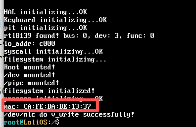
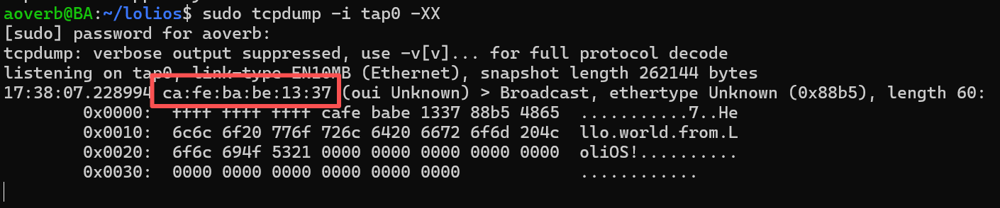
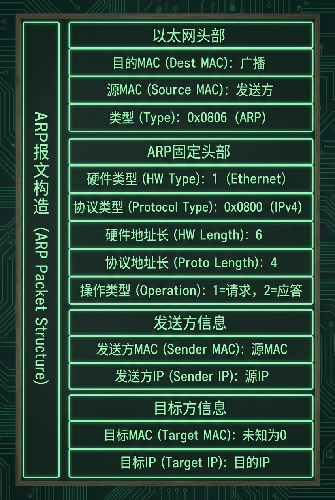
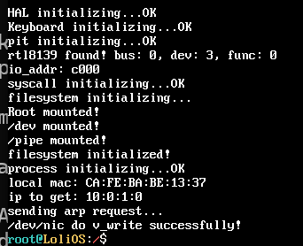
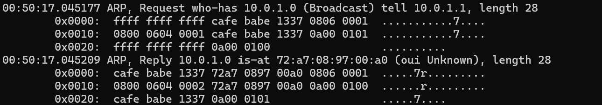
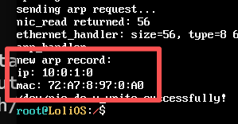
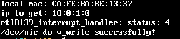
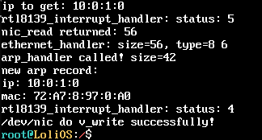
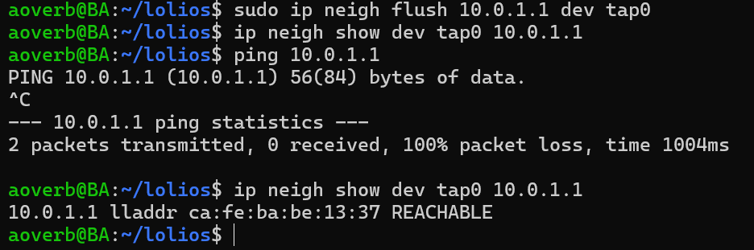

## 自制操作系统（21）：rtl8139网卡驱动（下）- 中断处理与ARP支持

我们先接着写驱动来实现一个获取MAC地址的函数。

### 获取MAC地址

获取MAC地址也是读取网卡驱动的某个寄存器。RTL8139 的 MAC 地址存储在 I/O 端口偏移 `0x00 ~ 0x05` 处，直接逐字节读取就行：

```cpp
static void get_mac(uint8_t mac[6]) {
    for (int i = 0; i < 6; ++i)
        mac[i] = inb(io_addr + i);
}
```

我这里还多做了一步，把这个网卡的mac也包了起来：

```cpp
static int nic_mac_read(char* buffer, uint32_t /* offset */, uint32_t size) {
    uint8_t mac[6];
    get_mac(mac);
    for (int i = 0; i < size; ++i) {
        if (i >= 6) return 6;
        buffer[i] = mac[i];
    }
    return size;
}

static int nic_mac_write(const char*, uint32_t) { return -1; } // 不支持写MAC

void init_nic_dev_file(mounting_point* mp) {
    static dev_operation nic_opr;
    nic_opr.read = &nic_read;
    nic_opr.write = &nic_write;
    register_in_devfs(mp, "nic", &nic_opr);

    static dev_operation nic_mac_opr;
    nic_mac_opr.read = &nic_mac_read;
    nic_mac_opr.write = &nic_mac_write;
    register_in_devfs(mp, "nic_mac", &nic_mac_opr);
};
```

我们回到发送以太帧的地方，读取我们的设备文件获取mac，填入以太帧的目标mac字段：

```cpp
...
    int nic_mac_fd = v_open(cur_pcb, "/dev/nic_mac", O_RDONLY);
    if (nic_mac_fd == -1) {
        printf("failed to open NIC dev!\n");
    }

    uint8_t mac[6];
    if (v_read(cur_pcb, nic_mac_fd, reinterpret_cast<char*>(mac), 6)) {
        printf("mac: %X:%X:%X:%X:%X:%X\n", mac[0], mac[1], mac[2], mac[3], mac[4], mac[5]);
    }

    char* buf = (char*)kmalloc(1024 * sizeof(char));
    memset(buf, 0xFF, 6); // 目标mac地址，FF:FF:FF:FF:FF:FF 表示广播
    memcpy(buf + 6, mac, 6);
    buf[12] = 0x88; // 0x88B5（IEEE保留的本地实验用途类型）
    buf[13] = 0xB5;
    memset(buf + 14, 0, 45);
    strcpy(buf + 14, "Hello world from LoliOS!");
    if ((v_write(cur_pcb, nic_fd, buf, 60)) != -1) { // 最小的以太帧长为60字节
        printf("/dev/nic do v_write successfully!\n");
    } else {
        printf("failed to write to /dev/nic!\n");
    }
```

之后我们在qemu启动时给我们的网卡配置一个MAC地址：

```cpp
qemu-system-i386 -cdrom lolios.iso \
    -netdev tap,id=net0,ifname=tap0,script=no,downscript=no \
    -device rtl8139,netdev=net0,mac=CA:FE:BA:BE:13:37
```
启动，就能看到我们配置的MAC地址输出在控制台了：



tcpdump也能看到。



### “一个糟糕的点子”

还记得我在上一章说过，我们把NIC虚拟成一个文件是个糟糕的点子吗？这是因为在当时，我还沉浸在完成了简单的文件系统的余韵之中，有些转不过弯来，所以当我踏进网络栈时，我的想法没有从读文件的思路转过来。

其实我们的写没什么问题，我一直有点隐隐约约地觉得，“读取NIC的接收缓冲区”是个坏点子，但是具体说是什么不对劲呢？我首先想到的，其实是安全问题：因为首先，我们可以看到任何一个帧，其次，我们的读是有代价的，会让原本想读这个东西的人读不到了（因为缓冲区的指针已经偏移过去了！）。那是我还没去看ARP是什么的时候。（ARP下面会介绍，你可以理解为这是某个具体的，会用到读以太帧功能的组件）

当我看了ARP，想去实现它的时候，我发现我得先写一个读并解析以太帧的逻辑，那我就在以太帧的代码实现呗，但是这个时候，我陷入了一个具体的困境：首先，我不知道网卡什么时候能读到东西，什么时候读不到，这就意味着，我只能用一个while语句去轮询；其次，我只有读了才可能发现这个东西不是我想要的，于是我还得接着等待，更糟糕的是，别人要遭殃了，我把别人的东西读掉了：如果他也用轮询，他永远等不到想要的东西！逐渐的，我恍然大悟：我不知不觉中，把读网络数据与读文件等量齐观了。

文件是静止确定的，文件是不变的，就像你家楼下的便利点，他总是在那，所以我们去“拉取”，这没有问题；而现在我像在马路上等狂奔的快递车，等一辆有我的快递的快递车，我是只要看到快递车就拦下来，马上把上面的那个快递签收掉，发现里面不是我想要的东西就继续等，麻烦不说，还把别人的快递给丢了，害的别人永远收不到他们的快递！

所以我们要转变思路，面对瞬息万变的网络“快递”，我们应该做的是：设计成快递到了，就由分拣站给直接送到我们手上签收，这就没问题了。

上面和下面，就是拉模型和推模型的区别。其实网络栈的每一层都是这样，注册和推送，NIC是可以设置中断处理程序的，我们可以在里面写逻辑，把包推给以太帧处理程序，以太帧处理程序解析完后，看看这个帧是属于哪个协议的，就又推给指定协议的处理程序...

这是我踩过的一个坑，分享给大家，理解了上面的这些点后，我们的补救措施其实就很简单，我们看怎么给rtl8139指定中断处理程序。

### 中断处理程序


By Vijay Kumar Vijaykumar - Own work, Public Domain, https://commons.wikimedia.org/w/index.php?curid=3181779

我们继续看回这张图，我们要做的是把interrupt line的内容读出来，这里面是IRQ的号码，我们用它配合我们的中断处理函数注册中断就好了：

```cpp
void rtl8139_interrupt_handler(registers*) {
    // 读取，推送
}

void reg_isr() {
    uint8_t irq = read_pci_by_32bits(pci_bus, pci_dev, pci_func, 15) & 0xFF;
    register_interrupt_handler(irq, rtl8139_interrupt_handler);
}
```

注册就这么简单，别忘了在驱动的初始化函数的最后调用`reg_isr()`。

```cpp
static char recv_buff[1800];
void ethernet_handler(char* buffer, uint16_t size);

void rtl8139_interrupt_handler(registers*) {
    uint16_t status = inw(io_addr + REG_ISR);

    if (status & 0x0001) { // 收到了包
        while (!(inb(io_addr + REG_CHIPCMD) & 0x01)) {  // 缓冲区不为空
            int len = nic_read(recv_buff, 0, sizeof(recv_buff));
            if (len > 0)
                ethernet_handler(recv_buff, len);
        }
    }

    outw(io_addr + REG_ISR, status);  // 写回清除
    return;
}
```

收到中断之后，如果两个中断挨得比较近可能会丢失一个，所以我们用一个循环来读取，确保把缓冲区取完。

就这样，我们rtl8139网卡驱动就已经基本完成了。我们下面来实现以太帧处理的逻辑，以实现ethernet_handler。

### 以太帧

以太网帧由目标MAC地址、源MAC地址、帧类型、载荷构成。这些上一篇已经大概介绍给

我们先实现一个发以太帧的函数:

```cpp
#include <kernel/net/ethernet.hpp>
#include <driver/rtl8139.hpp>
#include <kernel/mm.hpp>
#include <string.h>

typedef struct {
    char target_mac[6];
    char source_mac[6];
    char type[2];
} __attribute__((packed)) ethernet_head;

int send_ethernet_frame(char target_mac[6], char source_mac[6], char type[2],
    char* buffer, uint16_t size) {
    if (size > 1536 - sizeof(ethernet_head)) return -1;
    void* buf = kmalloc(sizeof(ethernet_head) + size);
    ethernet_head* head = (ethernet_head*)buf;
    memcpy(head->target_mac, target_mac, 6);
    memcpy(head->source_mac, source_mac, 6);
    memcpy(head->type, type, 2);
    memcpy(buf + sizeof(ethernet_head), buffer, size);
    return nic_write((const char*)buf, sizeof(ethernet_head) + size);
}
```

发嘛，基本上就是根据传入的参数来做包装然后调用下层函数发出去。但是这里有个坑：这样每一层封装岂不是都得kmalloc，用完又马上释放？时间和内存开销都不小。所以最好是一开始就预留好头部空间，下面逐渐按照头部指针填即可，这个我们后面再做。

ethernet_handler的实现其实也很简单：用ethernet_head来解头部，根据头部的类型，来调用对应的网络层协议处理函数，比如IP、ICMP，还有我们要做的ARP。

```cpp
void arp_handler(char* buffer, uint16_t size);

void ethernet_handler(char* buffer, uint16_t size) {
    if (size < 60) return;
    char* type = reinterpret_cast<ethernet_head*>(buffer)->type;
    // 注意网络传输用的是大端，但是这里我们逐个字节判断，没问题
    if (type[0] == 0x08 && type[1] == 0x06) { // ARP
        arp_handler(buffer + sizeof(ethernet_head), size - sizeof(ethernet_head));
    }
    return;
}
```

我们依旧把arp_handler留给后面实现。

### ARP

终于来到我们的主线任务了：发送一个ARP请求，然后尝试接收响应。

#### ARP介绍

ARP（地址解析协议）用于发现协议地址（如IP地址）对应的硬件地址（如MAC地址），发送ARP请求会向网络中的所有设备广播ARP请求，内容是“我是XX协议下地址为XX，XX类硬件下地址为XX的设备，我在寻找同一协议同一硬件下协议地址为XX的设备的硬件地址”，当对应的硬件接收到请求时，就会发送一条响应到请求发送的硬件地址，告知自己的硬件地址。

我们先看下ARP报文的构造：



然后我们来结合场景写出处理各种场景的代码：

#### 1.我要问别人MAC

问别人mac的场景，其实就是发送一个arp报文：

```cpp
typedef struct {
    uint16_t hw_type;       // 硬件类型，以太网 = 0x0001
    uint16_t proto_type;    // 协议类型，IPv4 = 0x0800
    uint8_t  hw_len;        // 硬件地址长度，6
    uint8_t  proto_len;     // 协议地址长度，4
    uint16_t opcode;        // 1 = request 2 = reply
    uint8_t  sender_mac[6];
    uint8_t  sender_ip[4];
    uint8_t  target_mac[6];
    uint8_t  target_ip[4];
} __attribute__((packed)) arp_packet;
```

除了后面两个字段，前面都是固定的，target_mac我们不知道可以全填0，target_ip就填我们要查的ip对应的mac：

```cpp
const uint8_t broadcast_mac[] = {
    0xff, 0xff, 0xff, 0xff, 0xff, 0xff
};

int send_arp(uint16_t opcode, uint8_t* target_mac, uint8_t* target_ip) {
    arp_packet header;
    header.hw_type = htons(0x0001);
    header.proto_type = htons(0x0800);
    header.hw_len = 6;
    header.proto_len = 4;
    header.opcode = opcode;
    memcpy(header.sender_mac, my_mac(), 6);
    memcpy(header.sender_ip, my_ip, 4);
    memcpy(header.target_mac, target_mac, 6);
    memcpy(header.target_ip, target_ip, 4);
    // 以太帧目标：request 用广播，reply 用对方 MAC
    uint8_t* eth_dst = (opcode == htons(APR_OPCODE_REQ))
        ? (uint8_t*)broadcast_mac
        : target_mac;
    return send_ethernet_frame(eth_dst, my_mac(), TYPE_ARP, &header, sizeof(header));
}
```

我们可以把它包装成一个函数：send_arp。

先来看看里面的实现，用到的htons函数可以提一下，它是把主机端用的字节序（小端），换成网络数据用的字节序（大端）。

以及，我们先给自己设置一个固定的IP，后面可以实现自动获取：

```cpp
const uint8_t my_ip[] = {
    10, 0, 1, 1
};
```

调用send_arp之后，如果找到了对应的主机，它就会给我们发送一个reply，这个属于我们要处理的第二个场景：别人给我回复MAC。

#### 2.别人给我回复MAC

来自外部的ARP包最终会触发我们的arp_handler，我们需要做一些初步的过滤：
```cpp
void arp_handler(char* buffer, uint16_t size) {
    arp_packet* header = reinterpret_cast<arp_packet*>(buffer);
    // 仅接受<ip, 以太网>的映射
    if (header->hw_type != htons(0x0001) || header->proto_type != htons(0x0800)) return;
```

而别人给我回复MAC，我则需要把ip->mac映射记录到我的数据结构里：

```cpp
void arp_handler(char* buffer, uint16_t size) {
    arp_packet* header = reinterpret_cast<arp_packet*>(buffer);
    // 仅接受<ip, 以太网>的映射
    if (header->hw_type != htons(0x0001) || header->proto_type != htons(0x0800)) return;
    if (header->opcode == htons(APR_OPCODE_REQ)) { // 请求
        if (is_same_ip(my_ip, header->target_ip)) { // 场景3：别人问mac，如果目标ip就是我
                send_arp(htons(APR_OPCODE_REPLY), header->sender_mac, header->sender_ip); // 我来响应
            }
    } else if (header->opcode == htons(APR_OPCODE_REPLY) && is_same_mac(my_mac(), header->target_mac)) {
        // 场景2：别人给我回复它的MAC
        arp_table_insert(header->sender_ip, header->sender_mac);
    }
}
```

这里我用的是哈希表：

```cpp
#include <unordered_map>

std::unordered_map<uint32_t, uint64_t> ip_to_mac;

bool arp_table_lookup(uint8_t* ip, uint8_t* mac) {
    uint32_t t_ip = 0;
    for (int i = 0; i < 4; ++i) {
        t_ip = (t_ip << 8) + ip[4 - i - 1];
    }
    if (ip_to_mac.find(t_ip) == ip_to_mac.end()) return false;
    uint64_t t_mac = ip_to_mac[t_ip];
    for (int i = 0; i < 6; ++i) {
        mac[6 - i - 1] = t_mac & 0xff;
        t_mac >>= 8;
    }
    return true;
}

void arp_table_insert(uint8_t* ip, uint8_t* mac) {
    uint32_t t_ip = 0;
    for (int i = 0; i < 4; ++i) {
        t_ip = (t_ip << 8) + ip[4 - i - 1];
    }
    uint64_t t_mac = 0;
    for (int i = 0; i < 6; ++i) {
        t_mac = (t_mac << 8) + mac[6 - i - 1];
    }
    ip_to_mac[t_ip] = t_mac;
}
```

这样后面就可以用arp_table_lookup去查出ip对应的mac地址了，只不过还得再把得到的结果再自行转换。

#### 3.别人问我MAC

其实在上面的代码已有呈现：

```cpp
    if (header->opcode == htons(APR_OPCODE_REQ)) { // 请求
        if (is_same_ip(my_ip, header->target_ip)) { // 场景3：别人问mac，如果目标ip就是我
                send_arp(htons(APR_OPCODE_REPLY), header->sender_mac, header->sender_ip); // 我来响应
            }
```

#### 测试

我们来测试一下查询MAC的场景，不过首先，我们要给我们的宿主机在我们的tap上面分配一个ip：

```cpp
 sudo ip addr add 10.0.1.0/24 dev tap0
```


再准备一些函数：

```cpp
void to_print_mac(uint8_t* ip) {
    printf("sending arp request...\n");
    send_arp(htons(APR_OPCODE_REQ), broadcast_mac, ip);
}
```

打印返回的新表项：

```cpp
void arp_table_insert(uint8_t* ip, uint8_t* mac) {
    uint32_t t_ip = 0;
    for (int i = 0; i < 4; ++i) {
        t_ip = (t_ip << 8) + ip[4 - i - 1];
    }
    uint64_t t_mac = 0;
    for (int i = 0; i < 6; ++i) {
        t_mac = (t_mac << 8) + mac[6 - i - 1];
    }
    ip_to_mac[t_ip] = t_mac;
    printf("new arp record:\n");
    printf("ip: %d:%d:%d:%d\n", ip[0], ip[1], ip[2], ip[3]);
    printf("mac: %X:%X:%X:%X:%X:%X\n", mac[0], mac[1], mac[2], mac[3], mac[4], mac[5]);
}
```

在kernel调用我们发送arp请求的函数：

```cpp
    uint8_t ip[4] = {10, 0, 1, 0};
    printf("ip to get: %d:%d:%d:%d\n", ip[0], ip[1], ip[2], ip[3]);
    to_print_mac(ip);
```



运行，没有返回记录...为什么？

原来是：1、我之前设置过PIC从片偏移，注册中断函数时忘了把这个算进去了；2、从片PIC没有打开。

````cpp
void reg_isr() {
    // 读取网卡的中断号
    uint8_t irq = read_pci_by_32bits(pci_bus, pci_dev, pci_func, 15) & 0xFF;
    register_interrupt_handler(irq + 0x20, rtl8139_interrupt_handler); // 加上从片偏移 减去在主片的7个设备

    hal_enable_irq(2);   // 打开从片
    hal_enable_irq(irq); // 打开IRQ 11 本身

    // 开启接收OK和接收错误的中断
    outw(io_addr + REG_IMR, 0x0001 | 0x0004);  // ROK | RXErr
}
````


现在能响应中断了，但是还是没有打印MAC。一路向上追：



tcpdump看到我们的请求是发送成功了的。

```cpp
void ethernet_handler(char* buffer, uint16_t size) {
    if (size < sizeof(ethernet_head)) return;
    char* type = reinterpret_cast<ethernet_head*>(buffer)->type;
    // 注意网络传输用的是大端，但是这里我们逐个字节判断，没问题
    if (type[0] == 0x08 && type[1] == 0x06) { // ARP
        arp_handler(buffer + sizeof(ethernet_head), size - sizeof(ethernet_head));
    }
    return;
}
```

后面把这个最小以太网帧阈值改小了就能收到了。



但是还是会偶尔收不到：



中断是有的，但是缓冲区为空。

```cpp
    if (irq + 0x20 >= 0x28) {
        outb(0xA0, 0x20);  // slave EOI
    }
    outb(0x20, 0x20);      // master EOI
```

问了下Claude，恍然大悟，原来是在我的中断处理程序里面，没标记中断处理结束！这样就不会给我们发下一个中断了，我们有时候会先收到一个传输成功的中断，然后后面通知我们缓冲区有内容的中断就发不过来了。



现在正常了。



并且经过测试，我们的系统也能正确响应ARP请求噢。鼓掌👏！

---

### 总结

我们实现了ARP的支持，下一节我们将实现IP和ICMP协议的支持，并来看看怎么让我们的系统可以实现ping和响应ping！
