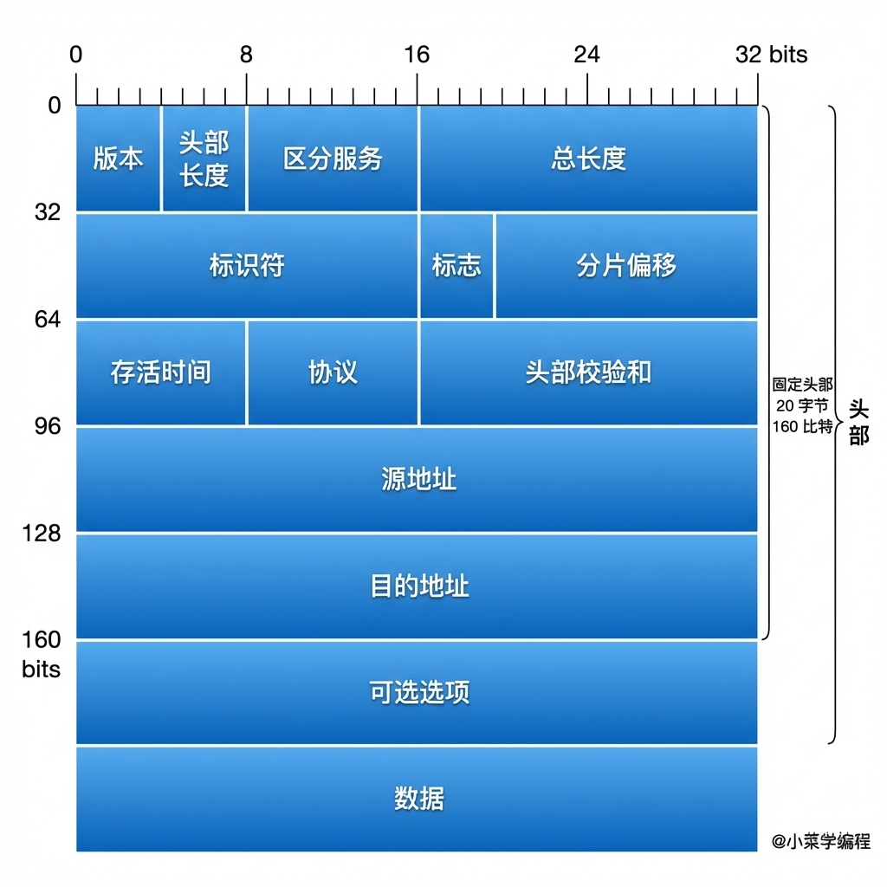
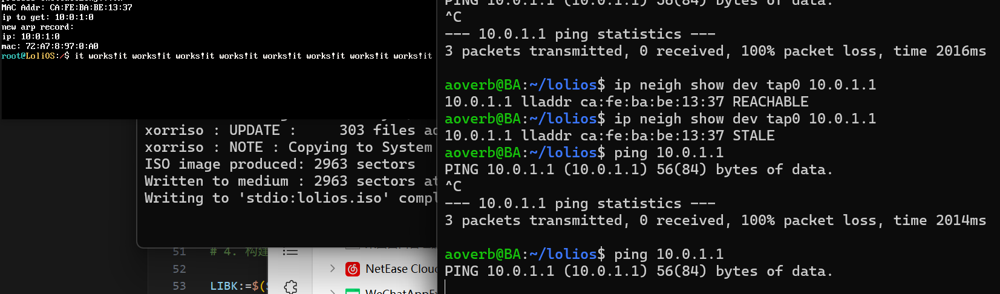
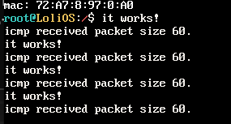
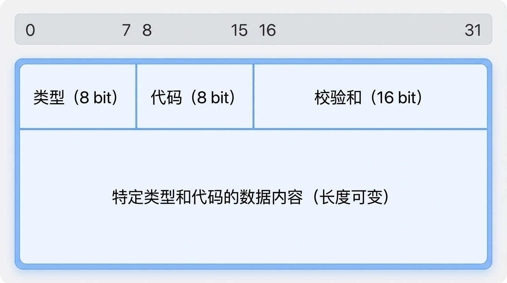
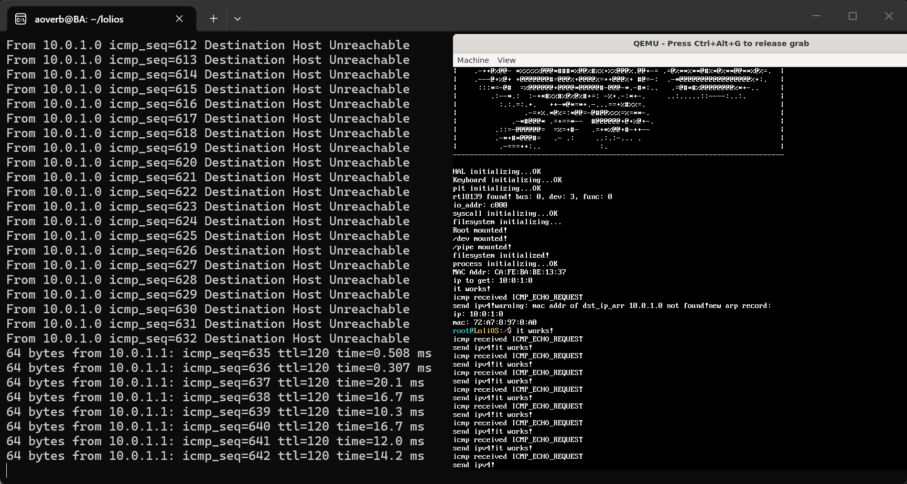

## 自制操作系统（22）：IP、ICMP与重构

在上一节，我们实现了rtl8139网卡驱动，并用它实现了对ARP协议的支持，我们的操作系统在某种程度上具备了网络通信的能力！但是，我们的通信能力到现在位置还仅限于局域网内，而IP协议的适配可以使我们摆脱局域网进行数据传输。今天我们就来适配IP协议，并再基于IP协议来适配ICMP，并实现一个用户程序——PING。

### IP

IP协议的实现可以使我们摆脱局域网进行数据传输。既然IP属于网络栈的一部分，那它也有属于自己的报文格式：



这里面有很多的字段，但是我不打算逐一解释，网上有很多相关的资料，在查阅资料时，我们可以忽略区分服务、可选选项这两个字段，因为这些字段是给负责路由转发的设备用的，我们是端设备，可以不用管。（当然，你要在操作系统里面实现路由转发那就另当别论了）

#### IP Handler注册

我们先在以太帧Handler里面写一个处理IP的逻辑：

```cpp
void ip_handler(char* buffer, uint16_t size);

void ethernet_handler(char* buffer, uint16_t size) {
    if (size < sizeof(ethernet_head)) return;
    char* type = reinterpret_cast<ethernet_head*>(buffer)->type;
    // 注意网络传输用的是大端，但是这里我们逐个字节判断，没问题
    if (type[0] == 0x08 && type[1] == 0x06) { // ARP
        arp_handler(buffer + sizeof(ethernet_head), size - sizeof(ethernet_head));
    } else if (type[0] == 0x08 && type[1] == 0x0) { // IP
        ip_handler(buffer + sizeof(ethernet_head), size - sizeof(ethernet_head));
    }
    return;
}
```

再稍微给ip handler加点打印：

```cpp
void ip_handler(char* buffer, uint16_t size) {
    printf("it works!");
}
```



在wsl ping一下我们的ip，我们就能收到了。

####  IP Handler实现

我们当然不只是要打个输出那么简单，我们要给这个数据解析一下，上struct：

```cpp
typedef struct {
    uint8_t header_len : 4;
    uint8_t version : 4; // 这里有坑，version和header_len构成一个字节，但是要转成大端的所以位置要调换
    uint8_t type_of_svc : 8;
    uint16_t total_len : 16;
    uint16_t id : 16;
    uint16_t flags_n_offset : 16;
    uint8_t ttl : 8;
    uint8_t protocol : 8;
    uint16_t checksum : 16;
    uint32_t src_ip;
    uint32_t dst_ip;
} __attribute__((packed)) ip_header;
```

我们拿到IP帧，要做什么呢？

首先第一件事就是判断校验和；其次是判断目的IP是不是本机；版本是不是我们支持的IPV4；如果有一个不是就可以扔掉了（header_len 也要检查一下，小于5其实也可以直接扔掉了）；

确定是我们要处理的IP帧，那就看看这个帧是不是一个IP分片，如果是，我们把它放入一个处理IP分片的逻辑（暂不实现）；

如果不是IP分片，我们就判断下协议类型，交给对应的协议handler就行了。

##### 校验和

校验和的计算是把整个头部每16位地累加，最后把结果算反码：

```cpp
uint16_t checksum(ip_header* header) {
    uint16_t size = header->header_len * 4; // header_len四个字节为单位
    uint32_t res = 0;
    for (int i = 0; i < size / 2; ++i) { // 每次算16位，两个字节
        res += *((uint16_t*)header + i);
    }
    while (res >> 16) {
        res = (res & 0xFFFF) + (res >> 16); // 折叠进位
    }
    return ~(uint16_t)res;
}
```

校验和位0表示没有问题。

```cpp
    if (checksum(header) != 0) {
        printf("checksum error!\n");
        return;
    }
```
前面所说的：目标IP是否为本机，协议是否为IPV4，,头部是否太小，这些都要做校验。

```cpp
    if (!is_same_ip(reinterpret_cast<uint8_t*>(&(header->dst_ip)), my_ip)) {
        return;
    }
    if (header->version != 4) { // 仅支持IPV4
        return;
    }
    if (header->header_len < 5) { // 头部太小
        return;
    }
```

##### 分片检测

IP Flag字段格式

```
           0     1      2
        +-----+------+------+
        |  0  |  DF  |  MF  |
        +-----+------+------+
```

- Bit 0: 保留位，必须为0。
- Bit 1: DF（Don't Fragment），能否分片位，0表示可以分片，1表示不能分片。
- Bit 2: MF（More Fragment），表示是否该报文为最后一片，0表示最后一片，1代表后面还有。

我们这里直接根据DF位来走不同的分支，reassemble暂不实现。

```cpp
    uint8_t flag = (header->flags_n_offset >> 13);
    if ((flag & 0b010) != 0) {// Don't fragment 位不为0，也就是要分片
        reassemble(header);
        return;
    }
```
这些检验都通过后，我们通过协议来分发payload：
```cpp
    if (header-> protocol == 0x01) { // ICMP
        icmp_handler(buffer + (header->header_len * 4), ip_total_len - (header->header_len * 4));
    }
```
这里有个坑：分发时传的size有可能为了字节对齐做了0填充，要用header->total_len计算payload大小。

写一个stub handler，运行后ping，我们现在能检测到ICMP报文了。


### ICMP

考虑到我们完成一个 IP报文解析->ICMP报文->ICMP回复发送->IP发送 的链路比较合适，我们先直接来介绍ICMP。

#### ICMP报文

ICMP（Internet Control Message Protocol，互联网控制消息协议）是 TCP/IP 协议族中的一个核心协议，主要用于在网络设备之间传递控制信息和错误报告。它工作在网络层（OSI 模型第三层），定义在 RFC 792 中。它并不传递具体的信息，而是协助IP协议，作为一个处理错误报告相关的助手。

ICMP报文格式：



#### ICMP 常用消息类型

| Type | 名称                    | 说明                 | 常见场景                |
| ---- | ----------------------- | -------------------- | ----------------------- |
| 0    | Echo Reply              | 回复 ping            | `ping` 收到的回包       |
| 3    | Destination Unreachable | 数据包无法送达       | 端口没开、主机不存在等  |
| 5    | Redirect                | 路由器建议走更优路径 | 局域网多网关时          |
| 8    | Echo Request            | 发起 ping            | `ping` 发出的包         |
| 11   | Time Exceeded           | TTL 耗尽             | `traceroute` 的核心原理 |

##### Type 3 常见 Code

| Code | 含义                            | 通俗解释                       |
| ---- | ------------------------------- | ------------------------------ |
| 0    | Network Unreachable             | 路由器不知道怎么去目标网络     |
| 1    | Host Unreachable                | 找不到目标主机                 |
| 3    | Port Unreachable                | 目标端口没进程监听（UDP 常见） |
| 4    | Fragmentation Needed but DF Set | 包太大又不让分片               |

ICMP报文的格式根据它的消息类型会有比较大的变化（其实倒不如说是它的固定头部太小...）。

上面是一些常用的消息类型列举，我们最终要实现这些类型的处理，而对于现在来说，我们先来搞定0：Echo Reply和8：Echo Request吧。

#### Echo Reply & Request


这个是Echo Reply & Echo Request的数据格式。它们的格式是一样的，更有趣的是，请求对应的响应除了类型和校验和不同，其它都是一样的：也就是说，我们收到请求，只要改下类型和校验和，然后发回去就好了：

```cpp
constexpr uint8_t ICMP_ECHO_REPLY = 0x0;
constexpr uint8_t ICMP_ECHO_REQUEST = 0x8;

void handle_echo_request(uint32_t src_ip, char* buffer, uint16_t size) {
    *reinterpret_cast<uint8_t*>(buffer) = ICMP_ECHO_REPLY;
    *reinterpret_cast<uint16_t*>(buffer + 2) = 0; // 清零，再算校验和
    uint16_t chksum = checksum(buffer, size);
    *reinterpret_cast<uint16_t*>(buffer + 2) = chksum;
    send_ipv4(src_ip, IP_PROTOCOL_ICMP, buffer, size);
}

void icmp_handler(uint32_t src_ip, char* buffer, uint16_t size) {
    if (checksum(buffer, size) != 0) {
        return;
    }
    // 根据类型做分类
    uint8_t type = *(reinterpret_cast<uint8_t*>(buffer));
    if (type == ICMP_ECHO_REQUEST) {
        handle_echo_request(src_ip, buffer, size);
    }
}
```

我们要实现send_ipv4。所以，我们要先回到IP， 把它讲完：

### 回到IP

#### send_ipv4函数

现在我们的系统能响应ping了！可喜可贺！



### 网络栈重构

很不幸！我们的网络栈已经出现屎山的端倪了！

我们需要从下到上地进行重构...

#### 锁

在rtl8139我们的send_buffer和rbuffer是有可能被多个进程同时写的...所以我们需要给它们的访问加上锁。

#### 超时机制

我们需要给nic_write补充超时机制。

```cpp
int nic_write(const char* buffer, uint32_t size) {
    if (size > SEND_BUFFER_SIZE || !is_initialized) return -1;

    SpinlockGuard guard(send_buffer_lock);

    uint32_t old_ticks = pit_get_ticks();
    while(!(inl(io_addr + REG_TSD[tx_cur]) & (1 << 13))) {
        if (pit_get_ticks() - old_ticks > 100) { // 1秒的时间上限
            return -1;
        }
```

#### IPADDR、MACADDR封装

对于IP、MAC，代码里面有太多的组织形态，是时候给它们统一的封装，并提供一些工具函数了。

```cpp
typedef struct macaddr {
    static constexpr uint64_t MASK = 0x0000FFFFFFFFFFFF; // 低6字节有效

    uint64_t addr; // 网络字节序存储，仅低6字节有效

    macaddr(uint64_t input_addr = 0) : addr(input_addr & MASK) {}

    macaddr(const char* s) {
        addr = 0;
        memcpy(&addr, s, 6);
    }

    macaddr(const uint8_t* s) {
        addr = 0;
        memcpy(&addr, s, 6);
    }

    macaddr(uint8_t a, uint8_t b, uint8_t c, uint8_t d, uint8_t e, uint8_t f) {
        addr = 0;
        uint8_t octets[6] = {a, b, c, d, e, f};
        memcpy(&addr, octets, 6);
    }

    bool operator==(const macaddr& rhs) const {
        return addr == rhs.addr;
    }

    bool operator!=(const macaddr& rhs) const {
        return addr != rhs.addr;
    }

    bool operator==(const uint8_t* rhs) const {
        return memcmp(&addr, rhs, 6) == 0;
    }

    bool operator!=(const uint8_t* rhs) const {
        return memcmp(&addr, rhs, 6) != 0;
    }

    friend bool operator==(const uint8_t* lhs, const macaddr& rhs) {
        return rhs == lhs;
    }

    friend bool operator!=(const uint8_t* lhs, const macaddr& rhs) {
        return rhs != lhs;
    }

    explicit operator uint64_t() const {
        return addr;
    }

    macaddr& operator=(const char* s) {
        addr = 0;
        memcpy(&addr, s, 6);
        return *this;
    }

    macaddr& operator=(const uint8_t* s) {
        addr = 0;
        memcpy(&addr, s, 6);
        return *this;
    }

    macaddr& operator=(uint64_t u) {
        addr = u & MASK;
        return *this;
    }

    void to_bytes(uint8_t out[6]) const {
        memcpy(out, &addr, 6);
    }
} macaddr;

struct ipv4addr {
    uint32_t addr = 0; // 网络字节序

    ipv4addr() = default;
    ipv4addr(const ipv4addr&) = default;

    explicit ipv4addr(uint32_t raw) : addr(raw) {}

    explicit ipv4addr(const char* s) {
        const uint8_t* u = reinterpret_cast<const uint8_t*>(s);
        memcpy(&addr, u, 4);
    }

    explicit ipv4addr(const uint8_t* u) {
        memcpy(&addr, u, 4);
    }

    explicit ipv4addr(const char* a, const char* b,
                      const char* c, const char* d) {
        uint8_t octets[4] = {
            (uint8_t)atoi(a), (uint8_t)atoi(b),
            (uint8_t)atoi(c), (uint8_t)atoi(d)
        };
        memcpy(&addr, octets, 4);
    }

    ipv4addr& operator=(const ipv4addr&) = default;

    ipv4addr& operator=(const uint8_t* u) {
        memcpy(&addr, u, 4);
        return *this;
    }

    ipv4addr& operator=(const char* s) {
        const uint8_t* u = reinterpret_cast<const uint8_t*>(s);
        memcpy(&addr, u, 4);
        return *this;
    }

    bool operator==(const ipv4addr& rhs) const { return addr == rhs.addr; }
    bool operator!=(const ipv4addr& rhs) const { return addr != rhs.addr; }

    bool operator==(const uint8_t* rhs) const { return memcmp(&addr, rhs, 4) == 0; }
    bool operator!=(const uint8_t* rhs) const { return memcmp(&addr, rhs, 4) != 0; }

    explicit operator uint32_t() const { return addr; }

    void to_bytes(uint8_t out[4]) const { memcpy(out, &addr, 4); }
};
```

#### ARP等待队列

我们之前遇到过发送IP报文时，查不到数据就只能放弃的情况：我们要给ARP加入等待与重试机制，还有超时机制。

```cpp
bool arp_table_lookup(const ipv4addr& ip, macaddr& mac) {
    if (ip_to_mac.find((uint32_t)ip) == ip_to_mac.end()) {
        send_arp(htons(APR_OPCODE_REQ), broadcast_mac, ipv4addr(ip));
        ...做什么？
        return false;
    }
    mac = ip_to_mac[(uint32_t)ip];
    return true;
}
```

##### 超时机制

我们先实现超时机制，因为我们还没有定时器，需要尽快做一个出来。

```cpp
#include <kernel/timer.hpp>
#include <kernel/mm.hpp>

#include <priority_queue>

constexpr uint16_t MAX_TIMER_NUM = 256;
typedef struct  {
    uint32_t wake_tick;
    timer_callback_func callback_func;
    void* args;
} timer_config;

struct TimerCmp {
    bool operator()(const timer_config& a, const timer_config& b) const {
        return a.wake_tick > b.wake_tick;  // a > b → a 优先级更低
    }
};

std::priority_queue<timer_config, MAX_TIMER_NUM, TimerCmp> pq;

bool register_timer(uint32_t ms_10, timer_callback_func callback, void* args) {
    if (pq.size() >= MAX_TIMER_NUM) {
        return false;
    }
    pq.emplace(timer_config{ ms_10, callback, args });
    return true;
}

void timer_handler(uint32_t current_tick) {
    if (!pq.empty() && pq.top().wake_tick <= current_tick) {
        timer_config t;
        pq.pop_into(t);
        t.callback_func(t.args); // ??
    }
}
```

我使用了优先队列去做一个比较高效的定时器。注意看上面??的注释，这里其实值得思考，一开始我是打算直接触发，但是后面想了想如果是有多个进程，当进程1执行时触发了2的定时器，那么1该不该去执行2的回调函数呢？答案是不应该，而且这样做很危险，因为这里的代码是未知的，很有可能来自用户态。

一个更好的方案是，我们专门创建一个进程ktimerd，去处理过期定时器的回调函数。

```cpp
void kernel_timer_main() {
    while(1) {
        while(!due_timer_queue.empty()) {
            timer_config conf = due_timer_queue.front();
            conf.callback_func(conf.args);
            due_timer_queue.pop();
        }
        yield();
    }
}

void init_kernel_timer() {
    create_process("ktimerd", (void *)(&kernel_timer_main), nullptr); // ktimerd进程
}

void timer_handler(uint32_t current_tick) {
    if (!pq.empty() && pq.top().wake_tick <= current_tick) {
        due_timer_queue.push(pq.top());
        pq.pop();
    }
}
```

这样的话，我们就可以在Arp查表失败的时候注册一个定时器，在回调函数里面把自己加回等待序列，挂起自己，然后启动定时器了...等等，那我为什么不干脆封装一个sleep函数呢？

```cpp
void sleep(uint32_t ms) {
    uint32_t ms_10 = (ms + 9) / 10;
    pid_t sleep_pid;
    uint32_t flags = spinlock_acquire(&process_list_lock);
    auto callback = [](void* args) -> void {
        pid_t* pid = (pid_t*)args;

        uint32_t flags = spinlock_acquire(&process_list_lock);
        process_list[*pid]->state = process_state::READY;
        spinlock_release(&process_list_lock, flags);
        
        insert_into_scheduling_queue(*pid);
        return;
    };
    sleep_pid = cur_process_id;
    register_timer(ms_10, callback, &sleep_pid);
    process_list[cur_process_id]->state = process_state::SLEEPING;
    spinlock_release(&process_list_lock, flags);
    yield();
}
```

这样的话我们就可以像下面这样做重试机制了：

```cpp
bool arp_table_lookup(const ipv4addr& ip, macaddr& mac) {
    for (int attempt = 0; attempt <= 3; ++attempt) {
        {
            SpinlockGuard guard(ip_to_mac_lock);
            auto itr = ip_to_mac.find((uint32_t)ip);
            if (itr != ip_to_mac.end()) {
                mac = itr->second;
                return true;
            }
        }
        if (attempt == 3) break;
        send_arp(htons(APR_OPCODE_REQ), broadcast_mac, ipv4addr(ip));
        sleep(500);
    }
    return false;
}
```

---

本来想在本节做ping的，但是考虑到icmp用户调用的前置条件还没做好，我们留待下节实现。
