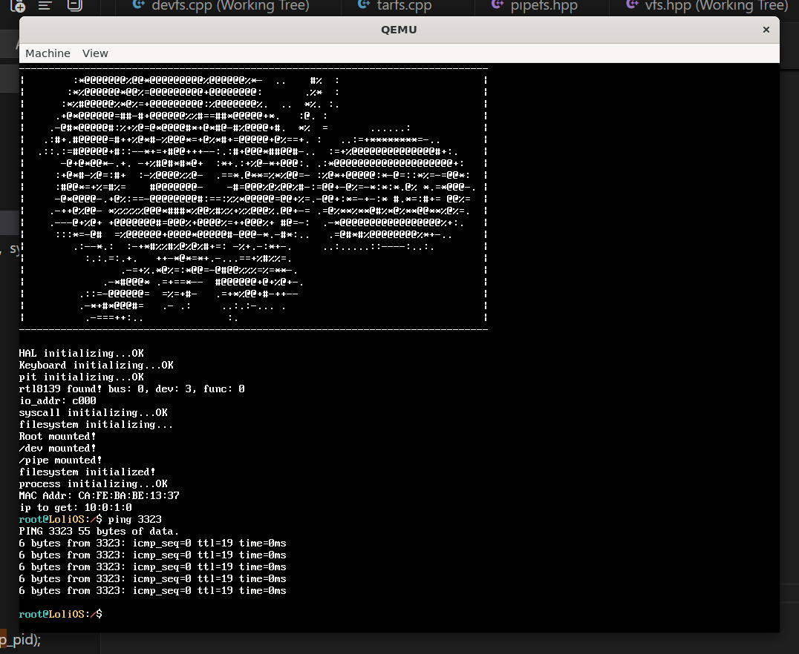
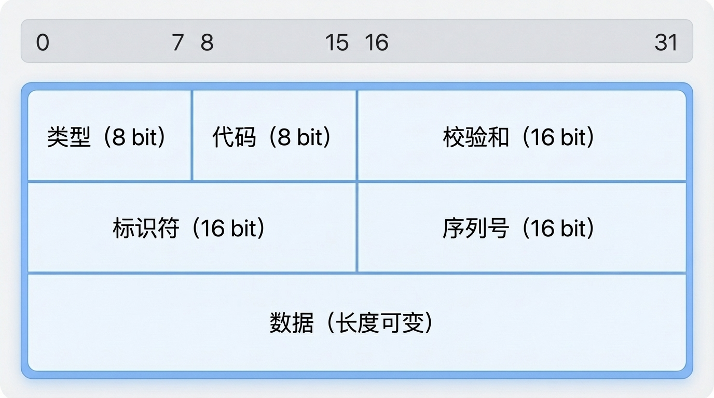
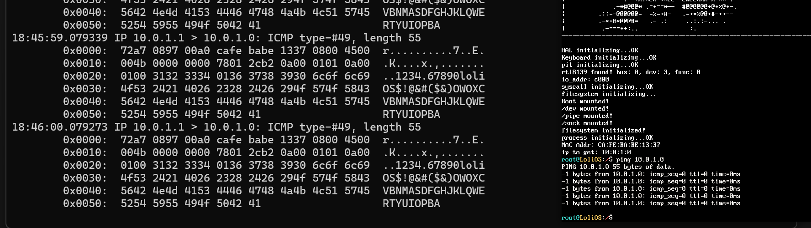
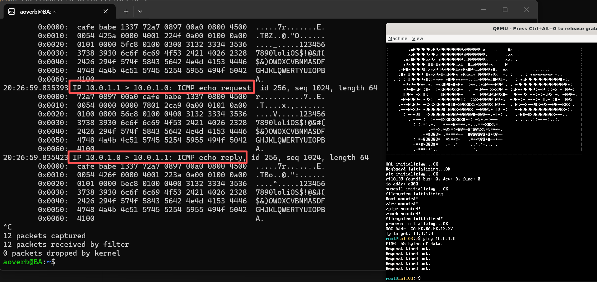
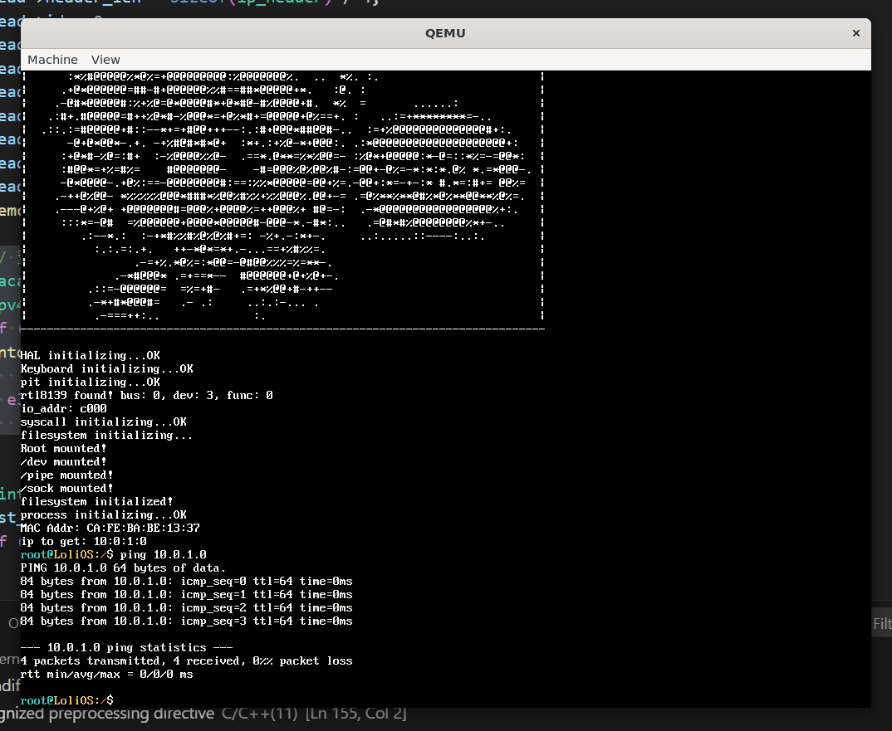
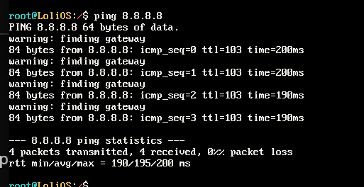

## 自制操作系统（23）：SocketFS与Ping应用程序

我们今天要把我们做的网络栈的一部分接口通过SocketFS暴露到用户态。

### 目标态

虽然我们现在眼中只有ICMP，做SocketFS不免眼光狭隘，会做出一些让后面的我们很为难的早期设计，但这正是理解何为”正确设计“的过程！相信现在就给我们一套标准，告诉我们就这么做，以我们现在的眼光，虽然会接受这个标准，但是也不知道为什么这么做吧！所以我认为，按我们的想法先做一套出来，后面再根据需求优化是很有必要的。所以，我们自上而下，先做一个用户态的ping出来：

```cpp
#include <file.h>
#include <stdio.h>
#include <string.h>
#include <format.h>
#include <stdlib.h>
#include <time.h>

struct icmp_recv_result {
    uint8_t  src_ip[4];
    uint8_t  ttl;
    uint16_t seq;
    uint32_t rtt_ms;
    // 后面跟 payload
};

int main(int argc, char** argv) {
    if (argc < 2) {
        printf("usage: ping <ip addr>\n");
        return 0;
    }
    
    char ip_addr[16];
    snprintf(ip_addr, sizeof(ip_addr), "%s", argv[1]);

    char icmp_open_path[64];
    snprintf(icmp_open_path, sizeof(icmp_open_path), "/sock/%s/icmp/", ip_addr);

    int file = open(icmp_open_path, O_RDWR);
    if (file == -1) {
        printf("icmp unsupported!\n");
        return 0;
    }

    const char* payload = "1234567890loliOS$!@&#($&)OWOXCVBNMASDFGHJKLQWERTYUIOPBA";

    printf("PING %s %d bytes of data.\n", ip_addr, strlen(payload));
    int ping_count = 5;
    char* buffer = (char*)malloc(sizeof(char) * 2048);
    while(ping_count--) {
        
        clock_t ticks = clock();

        uint32_t recv_size = 0;
        if (!write(file, payload, strlen(payload))) {
            printf("Failed to send icmp request.\n");
        } else if ((recv_size = read(file, buffer, 2048))){

            printf("%d bytes from %s: icmp_seq=%d ttl=%d time=%dms\n", recv_size, ip_addr,
                reinterpret_cast<icmp_recv_result*>(buffer)->seq,
                reinterpret_cast<icmp_recv_result*>(buffer)->ttl,
                (clock() - ticks) * 10);
        } else {
            printf("Request timed out.\n")
        }
        
        sleep(1);
    }
    free(buffer);
    return 0;
}
```

请注意：里面的sleep，clock函数还没有实现，我们第一阶段的目标，是让这个程序先通过编译，所以我会先把这两个函数实现出来。

### 第一关：通过编译

```cpp
// SLEEP(ebx = ms)
int sys_sleep(interrupt_frame* reg) {
    uint32_t* fds = reinterpret_cast<uint32_t*>(reg->ebx);
    sleep(*fds * 100);
    return 0;
}

// CLOCK(eax = ticks)
int sys_clock(interrupt_frame* reg) {
    return pit_get_ticks();
}
```

定义两个syscall。libc也补充相关调用。

```cpp
int sys_sleep(interrupt_frame* reg) {
    uint32_t fds = reinterpret_cast<uint32_t>(reg->ebx);
    sleep(fds * 1000);
    return 0;
}

static uint32_t clock() {
    return syscall0((uint32_t)SYSCALL::CLOCK);
}
```

#### 坑：内核进程关闭中断了

```cpp

process_switch_to:
    cli
    pushl %ebx
    pushl %esi
    pushl %edi
    pushl %ebp

    #保存...
    movl cur_process_id, %eax
    movl process_list(, %eax, 4), %eax
    movl %esp, 4(%eax)

    #更新cur_process_id和esp寄存器...
    movzbl 20(%esp), %eax
    movl process_list(, %eax, 4), %eax
    movl (%eax), %ebx
    cmp %ebx, (cur_process_id)
    je 1f
    movl %ebx, cur_process_id
    movl 4(%eax), %esp

    movl 8(%eax), %eax
    movl %cr3, %ebx
    cmpl %ebx, %eax
    je 1f
    movl %eax, %cr3
1:
    popl %ebp
    popl %edi
    popl %esi
    popl %ebx
    ret
```

内核进程只关不开了，我们的定时器有问题。

```cpp
    *((uintptr_t*)(new_process->esp - 16)) = 0x202;
    *((uintptr_t*)(new_process->esp - 20)) = reinterpret_cast<uintptr_t>(schedule_tail_restore);
    *((uintptr_t*)(new_process->esp - 24)) = 0;  // ebx
    *((uintptr_t*)(new_process->esp - 28)) = 0;  // esi
    *((uintptr_t*)(new_process->esp - 32)) = 0;  // edi
    *((uintptr_t*)(new_process->esp - 36)) = 0;  // ebp
```

我们在构造新进程的内核栈时，多加一个函数专门用来恢复eflags（而不是直接跳到entry）就好了。



把这个BUG修好后，我们的程序就不会一进sleep就卡死，能出数据了（当然是幻觉）。

### 第二关：SockFS的挂载

我们现在需要解决打开这个“文件”失败的问题。

```cpp
/sock/%s/icmp
```

我们要把SockFS挂在/sock，并且能调到我们的临时文件系统。。。但是，什么是Socket呢？

#### 简单的Socket定义

**警告：下面的Socket定义是怎么方便怎么来的，跟正式的Socket定义肯定不一样**

我们可以把Socket视为一个通信端口，我们指定这个端口使用的协议和地址，使用open来为我们创建一个指向一个socket的文件描述符，我们就可以用read和write来向这个文件描述符指向的端口读写数据了。

#### Socket在SocketFS的组织

```cpp
typedef struct {
    protocol ptcl;
    char addr[64];
} socket;

typedef struct {
    socket* sock[MAX_SOCK_NUM];
    uint32_t sock_num;
} socketfs_data;
```

先这样简单定义一下。其实就是一个socket数组，每个socket记录了使用的协议和对应的地址。

#### Mount

创建一个根节点。

```cpp
static int mount(mounting_point* mp) {
    if (!mp) return -1;
    mp->data = (socketfs_data*)kmalloc(sizeof(socketfs_data));
    memset(mp->data, 0, sizeof(socketfs_data));
    reinterpret_cast<socketfs_data*>(mp->data)->sock[0].ptcl = protocol::ROOT;
    strcpy(reinterpret_cast<socketfs_data*>(mp->data)->sock[0].addr, ".");
    reinterpret_cast<socketfs_data*>(mp->data)->sock[0].addr;
    reinterpret_cast<socketfs_data*>(mp->data)->sock_num = 1;
    return 0;
}
```

#### Open

我们需要解析`/sock/<addr>/<protocol>`这样的串，为了方便，我们找Claude帮我们写一个vsscanf函数。
```cpp
static int open(mounting_point* mp, const char* path,  uint8_t mode) {
    ++path; // 第一位是斜线
    if (!mp->data) return -1;
    socketfs_data* data = (socketfs_data*)mp->data;
    if (mode == O_CREATE) { // 创建一个套接字
        uint32_t new_sock_num = 0;
        for (int i = 0; i < MAX_SOCK_NUM; ++i) {
            if (data->sock[i].valid == 0) {
                new_sock_num = i;
                break;
            }
        }
        if (new_sock_num == 0) { // 套接字数量已到达最大值
            return -1;
        }
        socket& new_sock = data->sock[new_sock_num];
        new_sock.valid = 1;

        // 创建socket格式：<addr>/<protocol>
        char protocol[8];
        protocol[0] = '\0';
        sscanf_s(path, "%[^/]/%[^/]", new_sock.addr, sizeof(new_sock.addr),
                                      protocol, sizeof(protocol));
        if (!strlen(new_sock.addr) || !strlen(protocol)) {
            return -1;
        }

        if (strcmp("icmp", protocol) == 0) {
            new_sock.ptcl = protocol::ICMP;
        } else {
            // 不支持的协议
            return -1;
        }
        return new_sock_num;
    } else { // 打开已有的套接字
        return -1; // todo: 暂不支持
    }
    return -1;
}
```

当用户使用创建模式调用open接口时，主要是解析路径上面的协议和地址是否有效，而合法性暂时只校验了协议，地址会在调用对应的读写接口时再去校验。

#### write

写接口，我们直接把对应参数对应到指定协议的send接口即可。


对于ICMP，我们让用户直接构造整个ICMP报文传入。

但是我们上一节实现的icmp处理逻辑里面还没有send函数呢，我们先去做一个。

##### icmp_send

之前确定目标态的时候，我没有考虑到ICMP报文格式的多变，我应该让用户端直接构造整个ICMP的报文！因此我们需要让ping程序代码里面payload的构造变一变，但这是后话了。

这是我一开始想到的icmp_send实现：

```cpp
void icmp_send(const ipv4addr& dst_ip, char* buffer, uint16_t size) {
    send_ipv4(dst_ip, IP_PROTOCOL_ICMP, buffer, size);
}
```

乍一看，能用，但是仔细想想，不对啊，那如果ICMP包跑回来一个REPLY报文，它怎么知道这个报文对应的是哪个REQUEST的呢？噢，IP里面有一个ID字段，我们也许可以把ID字段填成INODEID直接发出去，回来的时候再检查下ID字段就好了，但是REPLY方一定保证ID一定会原样返回吗？恐怕并不是，因为我自己构造REPLY的时候IP头的ID是直接填的0，对端却也能响应我的REPLY。难道是有什么别的方法吗？

后面一看，原来Echo和Reply也有一个ID字段= =;



这个是Echo Reply & Echo Request的数据格式。上一节也有的，我已经完全忘了。。。

不过这么看的话，我的icmp报文是用户构造直接透传的，Identifier恐怕还得用户自己填，这样的话要是用户构造错这个reply就会发到别的程序上去，感觉不太可靠啊。也许我们应该接管这个字段。

```cpp
int icmp_send_withid(const ipv4addr& dst_ip, uint16_t id, char* buffer, uint16_t size) {
    // 虽然我们现在的socket数量最大是1024，在这个情况下这个标识符应该是但是我不排除后面会有调大这个数量的情况
    // 我不希望调大socket数的时候忘掉了修改这里导致标识符冲突，因此我需要在这里加个断言...
    // 虽然现在这个断言永不失败，但谁知道呢？或许后面我会把MAX_SOCK_NUM换个类型。
    static_assert(MAX_SOCK_NUM <= 65536);
    *reinterpret_cast<uint8_t*>(buffer + 4) = id;
    return send_ipv4(dst_ip, IP_PROTOCOL_ICMP, buffer, size);
}

int icmp_send(const ipv4addr& dst_ip, const char* buffer, uint16_t size) {
    return send_ipv4(dst_ip, IP_PROTOCOL_ICMP, buffer, size);
}
```

但是实际上，我们有时候可能也希望这个字段就按我们传入的走，暗示着我们也许需要多一种输入报文的方式，因此我在这里预留了icmp_send。现在先默认按系统会加工的路线走吧。

```cpp
static int write(mounting_point* mp, uint32_t inode_id, const char* buffer, uint32_t size) {
    if (!mp->data || (MAX_SOCK_NUM <= inode_id)) return -1;
    socketfs_data* data = (socketfs_data*)mp->data;
    if (data->sock[inode_id].valid == 0) return -1;
    socket& cur_sock = data->sock[inode_id];
    uint8_t trans_addr[4];
    sscanf_s(cur_sock.addr, "%d.%d.%d.%d", trans_addr[0], trans_addr[1], trans_addr[2], trans_addr[3]);
    ipv4addr addr = ipv4addr(trans_addr);

    char* id_modified_buffer = (char*)kmalloc(size);
    memcpy(id_modified_buffer, buffer, size);
    int ret = icmp_send_withid(addr, inode_id, id_modified_buffer, size);
    kfree(id_modified_buffer);
    return ret;
}
```

我们需要单独复制一份buffer来供icmp_send_withid修改。

##### 简单的测试



看tcpdump结果，我们的payload已经发出去了，但是因为我们还没有正确构造报文，收不到REPLY。

#### 完善Payload

```cpp
    const char* data_str = "1234567890loliOS$!@&#($&)OWOXCVBNMASDFGHJKLQWERTYUIOPBA";

    size_t payload_size = sizeof(icmp_echo_head) + sizeof(char) * (strlen(data_str) + 1);
    void* payload = malloc(payload_size);
    icmp_echo_head* head = (icmp_echo_head*)payload;
    memcpy(payload + sizeof(icmp_echo_head), data_str, payload_size - sizeof(icmp_echo_head));
    head->type = ICMP_ECHO_REQUEST;
    head->code = 0;
```




##### ICMP 常用消息类型

| Type | 名称                    | 说明                 | 常见场景                |
| ---- | ----------------------- | -------------------- | ----------------------- |
| 0    | Echo Reply              | 回复 ping            | `ping` 收到的回包       |
| 3    | Destination Unreachable | 数据包无法送达       | 端口没开、主机不存在等  |
| 5    | Redirect                | 路由器建议走更优路径 | 局域网多网关时          |
| 8    | Echo Request            | 发起 ping            | `ping` 发出的包         |
| 11   | Time Exceeded           | TTL 耗尽             | `traceroute` 的核心原理 |

##### Type 3 常见 Code

| Code | 含义                            | 通俗解释                       |
| ---- | ------------------------------- | ------------------------------ |
| 0    | Network Unreachable             | 路由器不知道怎么去目标网络     |
| 1    | Host Unreachable                | 找不到目标主机                 |
| 3    | Port Unreachable                | 目标端口没进程监听（UDP 常见） |
| 4    | Fragmentation Needed but DF Set | 包太大又不让分片               |

我们要接着把上一篇没做的消息类型适配给做完。

#### read

read一定要做成下面这样：

首先，read调用icmp_read，icmp_read会看看有没有相应资源，没有的话把当前进程挂起；icmp_handler则会根据返回的报文里面的id（也就是inode_id）去把包推进对应的队列。

最终在socket里面内置一个队列解决。

### 第三关：ping



### 第四关：额外关卡：PING外网

我们要ping通外网：

```cpp
    // 查ARP表
    macaddr dst_mac;
    ipv4addr dst_ip_x;
    if ((ntohl(dst_ip.addr) & ntohl(getLocalNetconf()->mask.addr)) ==
    (ntohl(getLocalNetconf()->ip.addr) & ntohl(getLocalNetconf()->mask.addr))) { // 同一子网
        dst_ip_x = ipv4addr(head->dst_ip);
    } else {
        dst_ip_x = ipv4addr(getLocalNetconf()->gateway);
    }
```

加一个查MAC时，不是同一子网就去找网关的逻辑。

```shell
sudo sysctl -w net.ipv4.ip_forward=1
```

同时给linux添加一个转发功能，这样他会帮我们在收到目的地为别处的包时帮忙转发。

```cpp
sudo iptables -t nat -A POSTROUTING -s 10.0.1.0/24 -o eth0 -j MASQUERADE
sudo iptables -A FORWARD -i tap0 -o eth0 -j ACCEPT
sudo iptables -A FORWARD -i eth0 -o tap0 -m state --state RELATED,ESTABLISHED -j ACCEPT
```



我们的OS能PING外网了！

### 超时机制

```cpp
        while (1) {
            {
                SpinlockGuard guard(cur_sock.lock);
                if (cur_sock.data) {
                    icmp_node* icmp_data = (icmp_node*)cur_sock.data;
                    size_t cpysize = icmp_data->size < size ? icmp_data->size : size;
                    memcpy(buffer, icmp_data->data, cpysize);
                    icmp_node* next = icmp_data->next;
                    kfree(icmp_data->data);
                    kfree(cur_sock.data);
                    cur_sock.data = next;
                    ret = cpysize;
                    break;
                } else {
                    SpinlockGuard guard(process_list_lock);
                    process_list[cur_process_id]->state = process_state::WAITING;
                    insert_into_process_queue(cur_sock.wait_queue, process_list[cur_process_id]);
                }
            }
            yield();
        }
```

为这段代码添加定时器并非易事...

添加一个timeout逻辑。

```cpp
void timeout(process_queue* queue, uint32_t ms) {
    uint32_t ms_10 = (ms + 9) / 10;
    uint32_t flags = spinlock_acquire(&process_list_lock);
    auto callback = [](pid_t pid, void* queue) -> void {
        uint32_t flags = spinlock_acquire(&process_list_lock);
        if (!process_list[pid] ||
            process_list[pid]->state != process_state::WAITING) {
            spinlock_release(&process_list_lock, flags);
            return;
        }
        process_list[pid]->state = process_state::READY;
        process_queue& pq = *((process_queue*)queue);
        remove_from_process_queue(pq, pid);
        spinlock_release(&process_list_lock, flags);
        insert_into_scheduling_queue(pid);
    };
    timer_id_t id = register_timer(pit_get_ticks() + ms_10, callback, queue);
    process_list[cur_process_id]->state = process_state::WAITING;
    spinlock_release(&process_list_lock, flags);
    yield();
    cancel_timer(id);
}
```

核心是waiting queue的管理信息不与定时器同步，那我就干脆把queue传进定时器，让它与icmp_handler一起管理。

```cpp
{
            uint32_t flags = spinlock_acquire(&(cur_sock.lock));
            if (cur_sock.data) {
                icmp_node* icmp_data = (icmp_node*)cur_sock.data;
                size_t cpysize = icmp_data->size < size ? icmp_data->size : size;
                memcpy(buffer, icmp_data->data, cpysize);
                icmp_node* next = icmp_data->next;
                kfree(icmp_data->data);
                kfree(cur_sock.data);
                cur_sock.data = next;
                ret = cpysize;
            } else {
                {
                    SpinlockGuard guard(process_list_lock);
                    process_list[cur_process_id]->state = process_state::WAITING;
                    insert_into_process_queue(cur_sock.wait_queue, process_list[cur_process_id]);
                }
                spinlock_release(&(cur_sock.lock), flags);
                timeout(&(cur_sock.wait_queue), 1000);
                uint32_t flags = spinlock_acquire(&(cur_sock.lock));
                if (cur_sock.data) {
                    icmp_node* icmp_data = (icmp_node*)cur_sock.data;
                    size_t cpysize = icmp_data->size < size ? icmp_data->size : size;
                    memcpy(buffer, icmp_data->data, cpysize);
                    icmp_node* next = icmp_data->next;
                    kfree(icmp_data->data);
                    kfree(cur_sock.data);
                    cur_sock.data = next;
                    ret = cpysize;
                }
            }
            spinlock_release(&(cur_sock.lock), flags);
        }
```

要用到timeout的话，机制就变成了上面这样。

---

### 总结

下一步：TCP！
