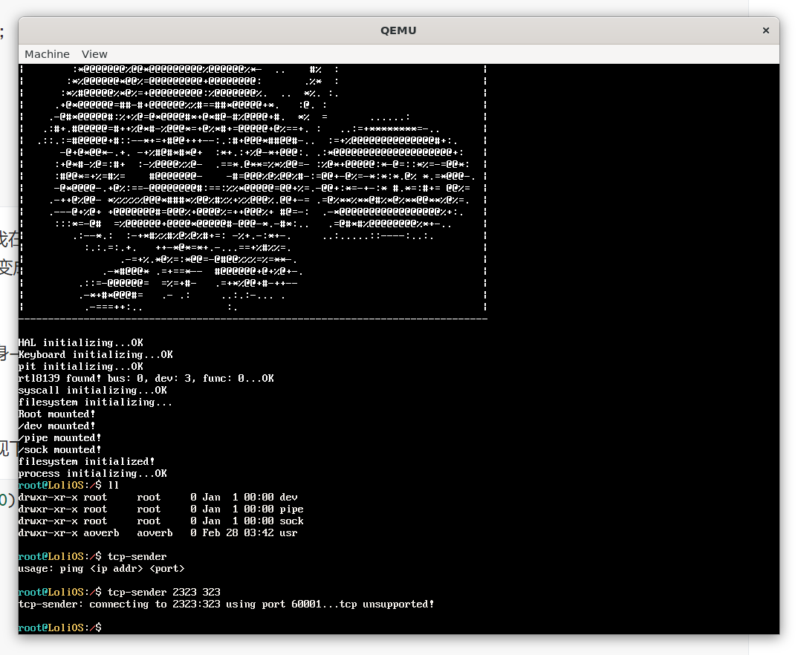
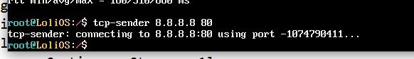
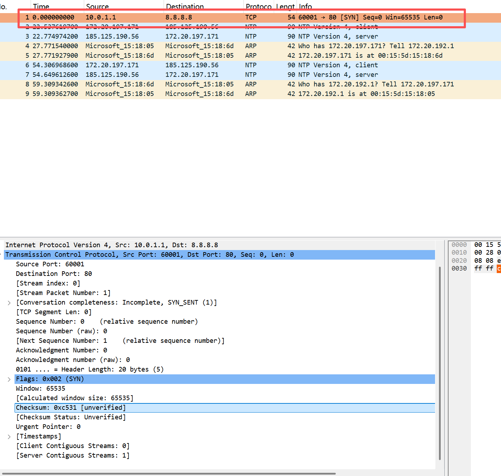
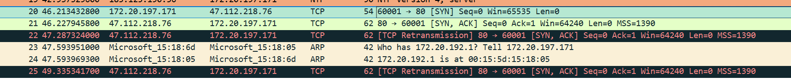
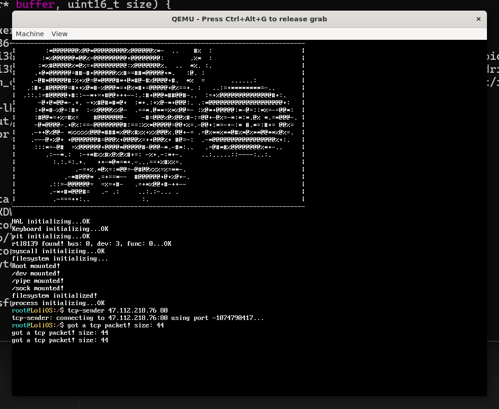
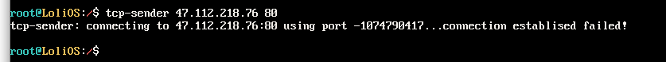
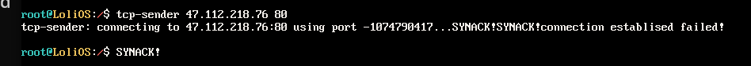
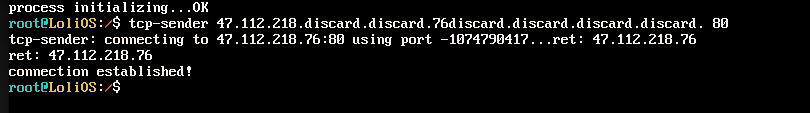

## 自制操作系统（24）：TCP（一）——三次握手（主动）

TCP是非常复杂的一套协议，其实我很担心凭借我多年前贫瘠的计算机网络课程知识能不能挺下去，但是无论如何，**让我们先乐观地开始吧**。

### 什么是TCP？

IP层是不可靠的，不保证送达，不保证顺序，不保证不重复发送。为了在这样一套不可靠的底层协议上面去做一层可靠的传输，前人想了很多办法，归纳出了几个比较重要的点：

```cpp
Basic Data Transfer 基础数据传输
Reliability 可靠性
Flow Control 流量控制
Multiplexing 多路复用
Connections 连接
Precedence and Security 优先级和安全性
```

### 目标态

这次的目标态是我们作为发送方，实现三次握手。

### TCP报文头

```
  0                   1                   2                   3
  0 1 2 3 4 5 6 7 8 9 0 1 2 3 4 5 6 7 8 9 0 1 2 3 4 5 6 7 8 9 0 1
 +-+-+-+-+-+-+-+-+-+-+-+-+-+-+-+-+-+-+-+-+-+-+-+-+-+-+-+-+-+-+-+-+
 |          Source Port          |       Destination Port        |
 +-+-+-+-+-+-+-+-+-+-+-+-+-+-+-+-+-+-+-+-+-+-+-+-+-+-+-+-+-+-+-+-+
 |                        Sequence Number                       |
 +-+-+-+-+-+-+-+-+-+-+-+-+-+-+-+-+-+-+-+-+-+-+-+-+-+-+-+-+-+-+-+-+
 |                    Acknowledgment Number                     |
 +-+-+-+-+-+-+-+-+-+-+-+-+-+-+-+-+-+-+-+-+-+-+-+-+-+-+-+-+-+-+-+-+
 |  Data |       |C|E|U|A|P|R|S|F|                               |
 | Offset| Rsrvd |W|C|R|C|S|S|Y|I|            Window             |
 |       |       |R|E|G|K|H|T|N|N|                               |
 +-+-+-+-+-+-+-+-+-+-+-+-+-+-+-+-+-+-+-+-+-+-+-+-+-+-+-+-+-+-+-+-+
 |           Checksum            |         Urgent Pointer        |
 +-+-+-+-+-+-+-+-+-+-+-+-+-+-+-+-+-+-+-+-+-+-+-+-+-+-+-+-+-+-+-+-+
 |                    Options                    |    Padding    |
 +-+-+-+-+-+-+-+-+-+-+-+-+-+-+-+-+-+-+-+-+-+-+-+-+-+-+-+-+-+-+-+-+
```

TCP报文头如上所示，因为我们只实现一个精简的TCP支持，我们会忽略上面的Urgent Pointer以及Options。

报文头里面字段的含义不多介绍了，网上有太多太多的资料了...

### TCP伪头

```
+------------------+
| 源 IP 地址 (4B)   |
+------------------+
| 目的 IP 地址 (4B)  |
+------------------+
| 0 | 协议号 | TCP长度 |
+------------------+
```

TCP想在校验和带上源IP和目的IP地址的校验，但是TCP头本身没有这个信息，因此我们在算校验和的时候，需要把这个头拼在TCP报文头的上面一起做校验。

### 用户态程序

这次我们直接上用户态程序。老规矩，我们的目标是用户态程序能跑通。

```cpp
#include <net/net.hpp>
#include <file.h>
#include <stdio.h>
#include <format.h>
#include <stdlib.h>
#include <poll.h>

int main(int argc, char** argv) {
    if (argc < 3) {
        printf("usage: ping <ip addr> <port>\n");
        return 0;
    }
    const uint16_t src_port = 60001; // 本机端口

    char ip_addr[16];
    uint16_t dst_port;
    snprintf(ip_addr, sizeof(ip_addr), "%s", argv[1]);
    dst_port = atoi(argv[2]);

    char tcp_open_path[64];
    snprintf(tcp_open_path, sizeof(tcp_open_path), "/sock/%s/tcp/%d/%d", ip_addr, src_port, dst_port);

    printf("tcp-sender: connecting to %s:%d using port %d...", ip_addr, dst_port, src_port);
    int conn = open(tcp_open_path, O_CREATE);
    if (conn == -1) {
        printf("tcp unsupported!\n");
        return 0;
    }

    auto tcp_cb = [&](size_t size) {
        int r_size = size > 1024 ? 1024 : size;
        char* buffer = (char*)malloc(r_size);
        if (read(conn, buffer, r_size)) {
            printf("%s\n", buffer);
        }
    };

    pollfd fds[2] = {
        { .fd = 0, .events = POLLIN }, // 标准输入
        { .fd = conn, .events = POLLIN },
    };

    char buff[256];
    while(1) {
        int ret = poll(fds, 2, -1);  // -1 = 无限等待
        if (ret < 0) { break; }

        if (fds[0].revents & POLLIN) {
            uint32_t n = read(0, buff, sizeof(buff));
            if (n <= 0) break;
            write(conn, buff, n);
        }

        // socket 有数据 → 读取并打印
        if (fds[1].revents & POLLIN) {
            uint32_t n = read(conn, buff, sizeof(buff));
            if (n <= 0) {
                printf("connection has been cloased\n");
                break;
            }
            buff[n] = '\0';
            printf("%s\n", buff);
        }
    }

    close(conn);
    return 0;
}
```

注意到我们用到了一个新文件poll，这是我在POSIX标准（其实是linux）找到的好东西，它能监听你提供的任意一个文件描述符的，你所关心的事件。反正我们都把标准输入输出变成文件描述符了，不用白不用嘛！

所有我们的流程就变成了：

创建TCP连接——监听标准输入和连接本身——唤醒了就检查是标准输入还是连接触发的输入事件——输出缓冲区的内容或者发送。

#### poll stub

我们先给poll来个stub吧，然后后面先实现下创建tcp socket并进行连接。

```cpp
constexpr int8_t POLLIN = (1 << 0);
struct pollfd {
    int fd;
    uint8_t events;
    uint8_t revents;
};

int poll(pollfd* fds, uint32_t fd_num, uint32_t timeout) {
    return -1;
}
```



#### 套接字相关操作

套接字相对于文件，多了很多操作，而且这些操作无法用基本的open,read,write操作去表示（就算有也比较丑陋，而且会把类型检查的代价转移到运行期）！我想，我是时候妥协，在vfs系统里面添加一套套接字专用的操作...就当我们是在适配POSIX标准吧！但是我还是不会接受socket()操作，我只会把其它文件视作是不支持bind、connect等套接字操作的文件。但是，这样真的好吗？

总而言之，我现在面临一个决策，我在实现支持ICMP的时候，做了一个sockfs，这样我就能用vfs的基本操作来收发ICMP报文了，但是现在我要支持TCP的时候，我发现TCP多了非常多需要支持的操作，如果我把这些操作合并进VFS，耦合就非常非常高了，但是要分出来一个socket类型又感觉不是滋味，socket本来也绑定一个VFS的文件，所以为什么不能视为是一个文件呢？我有点不知道怎么演进了。

我想，还是把socket视为一种特殊的文件比较好。按照面向对象的逻辑，socket应该视为文件的一种子类。它具有所有文件所支持的操作，同时，作为套接字，它也有自己支持的一套逻辑。

本质上socket还是一个文件，上面说到的所有对于socket的特殊操作，都是通过ioctl接口去控制， 然后为了适应posix标准，我会把上面所有的socket接口都实现，但是本质上，最终还是调ioctl。这样行不行？——ioctl里面的实现会变成一个switch case，而且强行适配，会有问题...

那如果是这样，我们把sock里面的接口分成能用ioctl和不能用ioctl表示的，不能用的，我们用间接指针封装在fs_operation里！

```cpp
struct fs_operation {
    int (*mount)(mounting_point* mp);
    int (*unmount)(mounting_point* mp);
    int (*open)(mounting_point* mp, const char* path, uint8_t mode);
    int (*close)(mounting_point* mp, uint32_t inode_id, uint32_t mode);
    int (*read)(mounting_point* mp, uint32_t inode_id, uint32_t offset, char* buffer, uint32_t size);
    int (*write)(mounting_point* mp, uint32_t inode_id, const char* buffer, uint32_t size);
    int (*opendir)(mounting_point* mp, const char* path);
    int (*readdir)(mounting_point* mp, uint32_t inode_id, uint32_t offset, dirent* out);
    int (*closedir)(mounting_point* mp, uint32_t inode_id);
    int (*stat)(mounting_point* mp, const char* path, file_stat* out);

    sock_operation* sock_opr;
};

struct sock_operation {
    int (*connect)(mounting_point* mp, uint32_t inode_id, const char* addr, uint16_t port);
};
```

就这样了！

#### open

open首先要做icmp适配，我们不能再在这里面带地址了。我们通过connect来设置地址：

```cpp
static int connect(mounting_point* mp, uint32_t inode_id, const char* addr, uint16_t port) {
    if (!mp->data) return -1;
    socketfs_data* data = (socketfs_data*)mp->data;
    socket& sock = data->sock[inode_id];
    if (sock.ptcl == protocol::ICMP) {
        return icmp_connect(sock, addr, port);
    } else if (sock.ptcl == protocol::TCP) {
        return tcp_connect(sock, addr, port);
    }
}

int icmp_connect(socket& sock, const char* addr, uint16_t) {
    strcpy(sock.addr, addr);
    return 0;
}
```

#### connect





没有返回的请求。



后面发现是校验和算错了，而且8.8.8.8也不会响应SYN，换成我的博客的服务器，触发了！



而且我这边也收到后续的包了！

#### tcp_handler

但是收到后续的包之后要怎么处理呢？我想，这应该是一个生产者/消费者模型，包可以通过链表的形式放在我们sock的data里面。数据有了，但是拿到的数据要做什么呢？比如说现在的TCP三次握手，我们收到了来自外部的数据包，应该是需要结合自身的状态去处理的，所以我们需要在data里面记录咱们的状态，并根据收到的内容去转移我们的状态。于是，我们定义一个结构，名为传输控制块（Transmission control block，TCB）：

```cpp
struct TCB { // 传输控制块
    tcb_state state;
    char* window;
    size_t window_size;
};
```

并提供一个初始化函数：

```cpp
constexpr uint32_t DEFAULT_WINDOW_SIZE = (1 << 16) - 1;
constexpr uint32_t DEFAULT_WINDOW_SCALE = 1;

int tcp_init(socket& sock) {
    sock.data = kmalloc(sizeof(TCB));
    TCB* tcb = (TCB*)sock.data;
    tcb->state = tcb_state::CLOSED;
    tcb->window_size = DEFAULT_WINDOW_SIZE * DEFAULT_WINDOW_SCALE;
    tcb->window = (char*)kmalloc(tcb->window_size);
}
```

我们可以料想到，以后建立被动连接时也要用到这样的函数，我们应该把这个函数做完善，把原本在sockfs open操作要做的初始化操作移进来：

```cpp
int tcp_init(socket& sock, uint16_t local_port) {
    sock.ptcl = protocol::TCP;
    strcpy("127.0.0.1", sock.dst_addr); // 先给一个默认地址，后面通过connect设置
    sock.dst_port = 0; // 与上面同理

    uint8_t src_addr[4];
    getLocalNetconf()->ip.to_bytes(src_addr);
    sprintf(sock.src_addr, "%d.%d.%d.%d", src_addr[0], src_addr[1], src_addr[2], src_addr[3]);
    sock.src_port = local_port;

    sock.data = kmalloc(sizeof(TCB));
    TCB* tcb = (TCB*)sock.data;
    tcb->state = tcb_state::CLOSED;
    tcb->window_size = DEFAULT_WINDOW_SIZE * DEFAULT_WINDOW_SCALE;
    tcb->window = (char*)kmalloc(tcb->window_size);
    return 1;
}
```

sockfs的open就干净了：

```cpp

uint32_t init_new_socket(socketfs_data* data) {
    SpinlockGuard guard(data->socket_lock);
    uint32_t new_sock_num = 0;
    for (int i = 0; i < MAX_SOCK_NUM; ++i) {
        if (data->sock[i].valid == 0) {
            new_sock_num = i;
            data->sock[i].valid = 1;
            break;
        }
    }
    return new_sock_num;
}

static int open(mounting_point* mp, const char* protocol,  uint8_t mode) {
    ++protocol; // 默认第一位是斜线，todo，要校验输入
    if (!strlen(protocol)) {
        return -1;
    }
    if (!mp->data) return -1;
    socketfs_data* data = (socketfs_data*)mp->data;

    if (mode == O_CREATE) { // 创建一个套接字
        uint32_t new_sock_num = init_new_socket(data);
        socket& new_sock = data->sock[new_sock_num];
        if (new_sock_num == 0) { // 套接字数量已到达最大值
            return -1;
        }
        
        if (strcmp("icmp", protocol) == 0) {
            icmp_init(new_sock);
        } else if (strcmp("tcp", protocol) == 0) {
            tcp_init(new_sock, 60001);  // TODO：应该是要有一个全局端口池分配的
        } else {
            return -1; // 不支持的协议
        }
        return new_sock_num;
    } else { // 打开已有的套接字
        return -1; // todo: 暂不支持
    }
}
```

好了，我们可以在tcp_handler来实现把包塞进接收窗口了，但是我们会遇到第一件让我们犯难的事：怎么知道这个包对应的是哪个socket呢？也就是，我们需要维护一个（源地址，源端口，本地地址，本地端口）-> Socket的映射。这个好办，我们有unordered_map，于是我们的实现就会变成这样：

```cpp
struct tcp_quadruple {
    uint32_t src_ip;
    uint32_t dst_ip;
    uint16_t src_port;
    uint16_t dst_port;
    bool operator==(const tcp_quadruple& o) const {
        return src_ip == o.src_ip && dst_ip == o.dst_ip &&
               src_port == o.src_port && dst_port == o.dst_port;
    }
} __attribute__((packed));

std::unordered_map<tcp_quadruple, socket*> map_to_sock;
```

并且，我们还需要为四元组写一个哈希函数：

```cpp
struct tcp_hasher {
    size_t operator()(const tcp_quadruple& q) const {
        size_t seed = 0;
        auto combine = [&](uint32_t v) {
            // 经典的位扰动算法，防止哈希冲突
            seed ^= v + 0x9e3779b9 + (seed << 6) + (seed >> 2);
        };
        combine(q.src_ip);
        combine(q.dst_ip);
        combine((uint32_t)q.src_port << 16 | q.dst_port);
        return seed;
    }
};

std::unordered_map<tcp_quadruple, socket*, tcp_hasher> map_to_sock;
```

哈希函数采用位扰动算法。

于是，我们就可以在handler里面通过找哈希表判断对应的套接字是否已经存在：

```cpp
void tcp_handler(uint16_t ip_header_size, char* buffer, uint16_t size) {
    printf("got a tcp packet! size: %d\n", size);
    tcp_header* header = reinterpret_cast<tcp_header*>(buffer + ip_header_size);
    uint32_t src_ip = reinterpret_cast<ip_header*>(buffer)->src_ip;
    uint32_t dst_ip = reinterpret_cast<ip_header*>(buffer)->dst_ip;
    uint16_t src_port = header->src_port;
    uint16_t dst_port = header->dst_port;

    auto itr = map_to_sock[tcp_quadruple {.src_ip = src_ip, .dst_ip = dst_ip,
                               .src_port = src_port, .dst_port = dst_port}]; // ???
```

...等等，我们是源，还是对方是源？？有点搞不懂了。

这里其实暴露出一个问题：我们在写tcp_quadruple的时候，只用了”源“”目标“这种**相对**的描述，而我们应该站在源是主机的视角去记录连接，那么对于网络传来的包，里面记录的数据是网络视角，我们就要进行镜像，把网络视角转成自己的视角。

所以我们现在要做两件事：

1、tcp_quadruple使用语义更精确的字段；

2、handler要把接过来的包的源、目标反过来，在tcp_quadruple作相应转换。

```cpp
    printf("got a tcp packet! size: %d\n", size);
    tcp_header* header = reinterpret_cast<tcp_header*>(buffer + ip_header_size);
    uint32_t src_ip = reinterpret_cast<ip_header*>(buffer)->src_ip;
    uint32_t dst_ip = reinterpret_cast<ip_header*>(buffer)->dst_ip;
    uint16_t src_port = header->src_port;
    uint16_t dst_port = header->dst_port;

    auto itr = map_to_sock[tcp_quadruple {.local_ip = dst_ip, .remote_ip = src_ip,
                               .local_port = dst_port, .remote_port = src_port}];
```

搞错了，map_to_sock应该是用find去找哈。往下写：

```cpp
    auto itr = map_to_sock.find(tcp_quadruple {.local_ip = dst_ip, .remote_ip = src_ip,
                               .local_port = dst_port, .remote_port = src_port});
    if (itr == map_to_sock.end()) { // 没在已有的连接找到
        printf("discard.");
    } else {
        TCB* tcb = (TCB*)itr->second->data;
        // buffer的数据在window里面应该是怎么组织的？？
    }
```

到这里我又犯了难。buffer真的把数据推进去就好了吗？噢，我们还有wait queue，把里面的人都叫醒可能是个好办法。那里面的数据包呢？谁抢到算谁的吗？那数据不是会不完整吗？
后面问了下Claude，噢，TCP是一个字节流算法，也就是说，窗口里面是一段连续的数据，而且很大程度上只有一个读者，要是真的有多个读者，一般的操作系统里，也会发生我上面所说的数据不完整的情况。看来我又陷入了消息协议的思维...
因为我们现在还没完成三次握手，我原本的想法是，把TCP的报文塞进窗口，然后叫醒建立连接到一半的Connect接着处理，然后connect又发一个ACK，于是状态就可以变成establised。但是这样做明显很麻烦，而且SYNACK的数据包是没内容的，到了窗口什么都得不到...所以，我们让connect发完SYN之后就睡着去等状态变成establised：

```cpp
...
    if (send_ipv4((ipv4addr(dst_addr)), IP_PROTOCOL_TCP, t_header, sizeof(tcp_header)) != 0) {
        return -1;
    }
    int ret = -1;
    uint32_t flags = spinlock_acquire(&(sock.lock));
    if (tcb->state == tcb_state::ESTABLISHED) {
        ret = 0;
    } else {
        {
            SpinlockGuard guard(process_list_lock);
            process_list[cur_process_id]->state = process_state::WAITING;
            insert_into_process_queue(sock.wait_queue, process_list[cur_process_id]);
        }
        spinlock_release(&(sock.lock), flags);
        timeout(&(sock.wait_queue), 3000);
        uint32_t flags = spinlock_acquire(&(sock.lock));
        if (tcb->state == tcb_state::ESTABLISHED) {
            ret = 0;
        }
    }
    spinlock_release(&(sock.lock), flags);
    kfree(header);
    return ret;
```

我们的tcp-sender也要改下提示信息：

```cpp
    if (connect(conn, ip_addr, dst_port)) {
        printf("connection establised failed!\n");
    }
```



现在我们能知道握手失败了。我们现在需要在handler实现一个状态机来根据我的状态和发来的包的状态，去转移状态。

```cpp
    SpinlockGuard guard(itr->second->lock);
    TCB* tcb = (TCB*)itr->second->data;

    switch (tcb->state)
    {
    case tcb_state::CLOSED:
        return;
    case tcb_state::SYN_SENT:
        if (header->flags == ((uint8_t)tcp_flags::SYN | (uint8_t)tcp_flags::ACK)) {
            // 构造ACK包，返回
            printf("SYNACK!");
            // tcb->state = tcb_state::ESTABLISHED;
        }
        return;
    default:
    }
    // todo: 把数据写入缓冲区
```



我们现在能感知到synack了！

这个构造ACK包，就是我们在connect写过的那一大堆代码，看来也是时候把它们抽取出来了：

（seq、ack也要管理好）

```cpp
    tcb->seq = 0; // todo: 这里要使用时间戳+随机数生成
    tcb->ack = 0;
```

TCB里面新增SEQ ACK的记录，表示我下一个包发送的序列号是啥，我接收的序列号是啥。

```cpp
int send_tcp_pack(socket& sock, tcp_flags flags, const char* payload, size_t size) {
    void* packet = kmalloc(sizeof(pseudo_tcp_header) + sizeof(tcp_header) + size);
    uint32_t packet_size = sizeof(pseudo_tcp_header) + sizeof(tcp_header) + size;
    memset(packet, 0, packet_size);
    pseudo_tcp_header* p_header = (pseudo_tcp_header*)packet;
    tcp_header* t_header = (tcp_header*)((char*)packet + sizeof(pseudo_tcp_header));
    TCB* tcb = (TCB*)sock.data;
    int tmp[4];

    sscanf_s(sock.dst_addr, "%d.%d.%d.%d", &tmp[0], &tmp[1], &tmp[2], &tmp[3]);
    uint8_t dst_addr[4] = { (uint8_t)tmp[0], (uint8_t)tmp[1], (uint8_t)tmp[2], (uint8_t)tmp[3] };

    sscanf_s(sock.src_addr, "%d.%d.%d.%d", &tmp[0], &tmp[1], &tmp[2], &tmp[3]);
    uint8_t src_addr[4] = { (uint8_t)tmp[0], (uint8_t)tmp[1], (uint8_t)tmp[2], (uint8_t)tmp[3] };
    p_header->src_addr = ipv4addr(src_addr).addr;
    p_header->dst_addr = ipv4addr(dst_addr).addr;
    p_header->protocol = IP_PROTOCOL_TCP;
    p_header->zero = 0;
    p_header->tcp_length = htons(sizeof(tcp_header));

    t_header->src_port = htons(sock.src_port);
    t_header->dst_port = htons(sock.dst_port);
    t_header->seq_num = htonl(tcb->seq); // 我现在发送的序列号
    t_header->ack_num = htonl(tcb->ack); // 对端应该发送的序列号
    t_header->reserved = 0;
    t_header->data_offset = sizeof(tcp_header) / 4;
    t_header->flags = (uint8_t)flags;
    t_header->window = htons(tcb->window_size);
    t_header->checksum = 0;
    t_header->urgent_ptr = 0;
    memcpy(((char*)packet + sizeof(pseudo_tcp_header) + sizeof(tcp_header)), payload, size);
    t_header->checksum = checksum(packet, packet_size);
    map_to_sock[tcp_quadruple {.local_ip = p_header->src_addr, .remote_ip = p_header->dst_addr,
                               .local_port = t_header->src_port, .remote_port = t_header->dst_port}] = &sock;
    tcb->seq += size; // 注意这里的递增
    int ret = send_ipv4((ipv4addr(dst_addr)), IP_PROTOCOL_TCP, t_header, sizeof(tcp_header) + size);
    printf("ret: %s\n", sock.dst_addr);
    kfree(packet);
    return ret;
}
```

注意，我们在某些特殊的flag发送后，即使payload为空，也要递增一个虚拟字节。

```c++
int tcp_connect(socket& sock, const char* addr, uint16_t port) {
    TCB* tcb = (TCB*)sock.data;
    
    strncpy(sock.dst_addr, addr, 16);
    sock.dst_port = port;
    // SEND SYN
    if (send_tcp_pack(sock, tcp_flags::SYN, nullptr, 0) < 0) return -1; 
    tcb->seq += 1; // 虚拟字节
    tcb->state = tcb_state::SYN_SENT;
    
    ...
    
    case tcb_state::SYN_SENT:
    if ((header->flags & ((uint8_t)tcp_flags::SYN | (uint8_t)tcp_flags::ACK)) != 
        ((uint8_t)tcp_flags::SYN | (uint8_t)tcp_flags::ACK)) {
            break;
    }
    tcb->ack = ntohl(header->seq_num) + 1; // 下一次希望收到的：SYN出来的序列号，加一个虚拟字节
    send_tcp_pack(*sock, tcp_flags::ACK, nullptr, 0);
    tcb->state = tcb_state::ESTABLISHED;
    {
        SpinlockGuard guard(process_list_lock);
        PCB* cur;
        while(cur = sock->wait_queue) {
            remove_from_process_queue(sock->wait_queue, cur->pid);
            cur->state = process_state::READY;
            insert_into_scheduling_queue(cur->pid);
        }
    }
    printf("connection established!");
    break;
```
事实上，我们不应该由自己来判断SYN然后加一个虚拟字节，而是应该直接写在send_tcp_pack内。后面再改吧。



我们成功实现了三次握手！

---

下一节，我们来实现三次握手的被动版。

