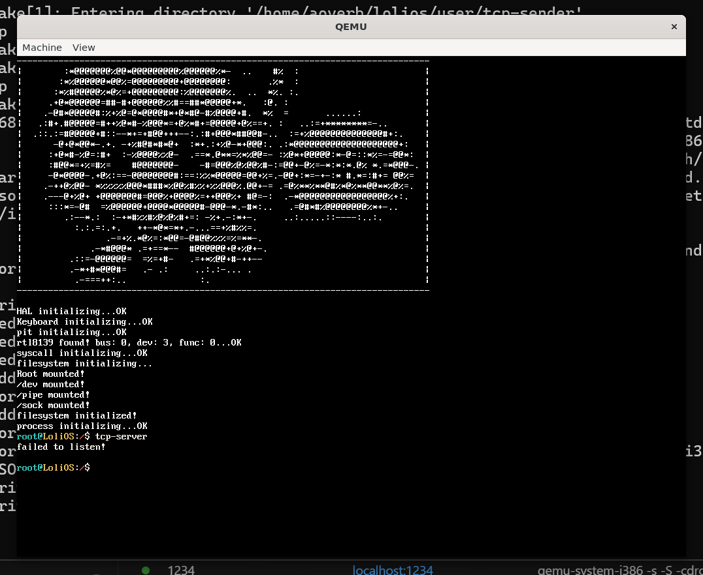
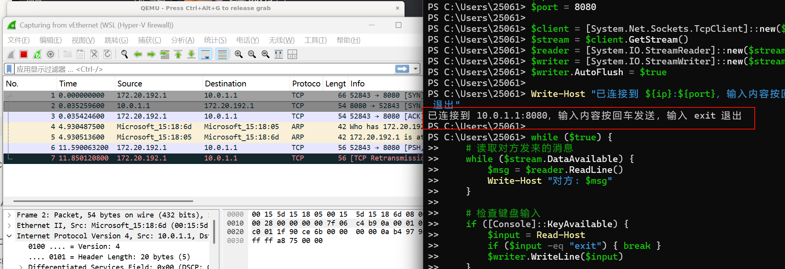
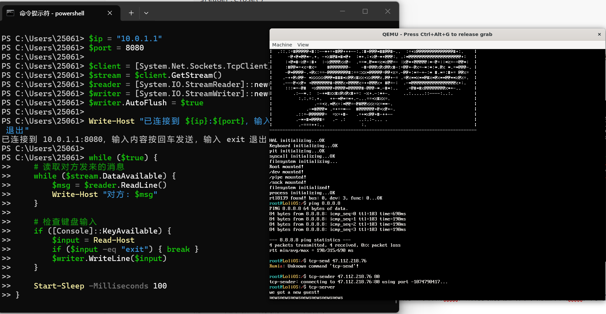

## 自制操作系统（25）：TCP（二）——三次握手（被动）

在上一节，我们踏上了TCP旅程的第一步，实现了通过三次握手主动创建TCP连接，这一节，我们要实现被动的三次握手。

### 目标态

老规矩，我们先来实现目标态的用户程序`tcp-server`：

```cpp
#include <net/net.hpp>
#include <net/socket.hpp>
#include <file.h>
#include <stdio.h>
#include <format.h>
#include <stdlib.h>
#include <poll.h>

int main(int argc, char** argv) {
    int conn = open("/sock/tcp", O_CREATE);
    if (conn == -1) {
        printf("tcp unsupported!\n");
        return 0;
    }
    sockaddr bindaddr;
    bindaddr.port = 8080;
    strcpy(bindaddr.addr, SOCKADDR_BROADCAST_ADDR); 
    if (ioctl(conn, "SOCK_IOC_BIND", &bindaddr) < 0) {
        printf("failed to bind %s:%d", bindaddr.addr, bindaddr.port);
        return 0;
    }

    if (listen(conn, 5)) {
        printf("failed to listen!\n");
    }

    int client_fd;
    while (client_fd = accept(conn, nullptr, nullptr)) {
        if (client_fd == -1) break;
        pollfd fds[2] = {
            { .fd = 0, .events = POLLIN, .revents = 0}, // 标准输入
            { .fd = client_fd, .events = POLLIN, .revents = 0 }
        };

        char buff[256];
        while(1) {
            int ret = poll(fds, 2, -1);  // -1 = 无限等待
            if (ret < 0) { break; }

            if (fds[0].revents & POLLIN) {
                uint32_t n = read(0, buff, sizeof(buff));
                if (n <= 0) break;
                write(client_fd, buff, n);
            }

            // socket 有数据 → 读取并打印
            if (fds[1].revents & POLLIN) {
                uint32_t n = read(client_fd, buff, sizeof(buff));
                if (n <= 0) {
                    printf("connection has been closed\n");
                    break;
                }
                buff[n] = '\0';
                printf("%s\n", buff);
            }
        }
    }

    close(conn);
    return 0;
}
```


串行地接受来自客户端的连接，最大5个。具体的打桩过程就不介绍了。



### bind

bind实际上是通过ioctl实现的。对于我们的ioctl，它有如下的这些命令：

```
SOCK_IOC_BIND           // 绑地址
SOCK_IOC_SHUTDOWN       // 半关闭
SOCK_IOC_SETSOCKOPT     // 设选项
SOCK_IOC_GETSOCKOPT     // 读选项
SOCK_IOC_GETSOCKNAME    // 查本端地址
SOCK_IOC_GETPEERNAME    // 查对端地址
```

今天我们要实现SOCK_IOC_BIND，这个命令接受一个sockaddr结构体，代码很简单：

```cpp
struct sockaddr {
    char addr[32];
    uint16_t port;
};

int tcp_bind(socket& sock, sockaddr* bind_conf) {
    strcpy(sock.src_addr, bind_conf->addr);
    sock.src_port = bind_conf->port;
    return 0;
}

int tcp_ioctl(socket& sock, const char* cmd, void* arg) {
    if (strcmp(cmd, "SOCK_IOC_BIND") == 0) {
        return tcp_bind(sock, reinterpret_cast<sockaddr*>(arg));
    }
    return -1;
}
```

没有什么特别的。

### listen

listen其实就是我们上一节没做的被动响应：

```cpp
    if (itr == map_to_sock.end()) { // 没在已有的连接找到
        printf("discard."); // todo: 这里可能是被动连接，我们先丢弃。
        return;
    }
```

我们实际上有这样的情况：我们只是打开了一个socket，然后把自己注册进一个"被动连接表"，主动发起的TCP连接，会根据某种策略，选择一个socket去建立连接。

```cpp
while (client_fd = accept(conn, nullptr, nullptr))
```

再看我们tcp_server的这一句代码，这句代码是阻塞的，如果我们的socket被选择到了，那accept就会返回一个新的socket，代表我们跟这台主机的连接。

回到我们listen的实现，那么其实就是要完成注册这个操作，注册进哪里呢？没错，还是哈希表，不过这次我们用的是二元组哈希：

```cpp
struct sockaddr_hasher {
    size_t operator()(const sockaddr& q) const {
        size_t seed = 0;
        auto combine = [&](uint32_t v) {
            // 经典的位扰动算法，防止哈希冲突
            seed ^= v + 0x9e3779b9 + (seed << 6) + (seed >> 2);
        };
        combine(q.addr);
        combine(q.port);
        return seed;
    }
};

std::unordered_map<sockaddr, socket*, sockaddr_hasher> map_sockaddr_to_sock;

int tcp_listen(socket& sock, size_t queue_length) {
    SpinlockGuard guard(sock.lock);
    TCB* tcb = (TCB*)sock.data;
    if (tcb->state == tcb_state::LISTEN) {
        return -1;
    }
    tcb->state = tcb_state::LISTEN;
    tcb->accepted_queue_size = queue_length;

    sockaddr config;
    config.addr = sock.src_addr;
    config.port = sock.src_port;
    map_sockaddr_to_sock[config] = &sock;

    return -1;
}
```

而且，listen会定义接受队列的长度，这个也要记录下来。

### accept

accept的逻辑就是把队列里面已经建立连接的TCB取出，然后返回，如果队列为空就等待。

不过，这个函数比较特殊，因为它会产生一个新的fd。我们按这样的思路去做：
原本的调用链条是accept()->sys_accept()->v_accept()->sockfs_accept()->tcp_accept()，那我们的返回过程就是tcp_accept()返回一个新TCB->sockfs_accept()封装成一个socket，返回inode_id->v_accept()封装成一个fd，然后用户就能拿到一个新的fd了！

```cpp
TCB* tcp_accept(socket& sock, sockaddr* peeraddr, size_t* size) {
    uint32_t flags = spinlock_acquire(&(sock.lock));
    TCB* tcb = (TCB*)sock.data;
    if (tcb->state != tcb_state::LISTEN) {
        spinlock_release(&(sock.lock), flags);
        return nullptr;
    }
    TCB* ret = nullptr;
    if (!tcb->accepted_queue.empty()) {
        ret = tcb->accepted_queue.front();
        tcb->accepted_queue.pop_into(ret);
    } else {
        {
            SpinlockGuard guard(process_list_lock);
            process_list[cur_process_id]->state = process_state::WAITING;
            insert_into_process_queue(sock.wait_queue, process_list[cur_process_id]);
        }
        spinlock_release(&(sock.lock), flags);
        yield();
        flags = spinlock_acquire(&(sock.lock));
        if (!tcb->accepted_queue.empty()) {
            ret = tcb->accepted_queue.front();
            tcb->accepted_queue.pop_into(ret);
        }
    }
    spinlock_release(&(sock.lock), flags);
    return ret;
}
```

逐层往上包装，先把逐层能准备好的先准备好，让错误尽早发生！

```cpp
int accept(mounting_point* mp, uint32_t inode_id, sockaddr* peeraddr, size_t* size) {
    if (!mp->data) return -1;
    socketfs_data* data = (socketfs_data*)mp->data;
    socket& sock = data->sock[inode_id];
    if (sock.ptcl == protocol::TCP) {
        // 准备好包装的inode
        uint32_t new_sock_num = init_new_socket(data);
        socket& new_sock = data->sock[new_sock_num];
        if (new_sock_num == 0) { // 套接字数量已到达最大值
            return -1;
        }
        new_sock.data = tcp_accept(sock, peeraddr, size);
        if (new_sock.data == nullptr) {
            new_sock.valid = 0;
            return -1;
        }
        return inode_id;
    }
    return -1;
}
```

```cpp
int v_accept(PCB* proc, int fd_pos, sockaddr* peeraddr, size_t* size) {
    SpinlockGuard guard(vfs_lock);
    if (fd_pos < 0 || fd_pos >= MAX_FD_NUM) return -1;
    file_description*& fd = proc->fd[fd_pos];
    if (!fd) return -1;
    mounting_point* mp = fd->mp;
    if (!mp || !(mp->operations->sock_opr)) return -1;

    // 先准备好新的fd
    int fd_pos = alloc_fd_for_proc(proc);
    if (fd_pos == -1) {
        return -1;
    }
    int handle_id = get_empty_handle();
    if (handle_id == -1) {
        return -1;
    }
    uint32_t inode_id = mp->operations->sock_opr->accept(mp, fd->inode_id, peeraddr, size);
    if (inode_id == -1) {
        return -1;
    }
    file_description*& fd = proc->fd[fd_pos];
    fd = file_handle[handle_id] = (file_description*)kmalloc(sizeof(file_description));
    fd->mp = mp;
    fd->handle_id = handle_id;
    fd->inode_id = inode_id;
    fd->mode = O_RDWR;
    fd->offset = 0;
    fd->refcnt = 1;
    strcpy(fd->path, "/sock/tcp");
    ++file_handle_num;
    return proc->fd_num++;
}
```

### tcp_handler

```cpp
    if (itr == map_quad_to_sock.end()) { // 没在已有的连接找到
        printf("discard."); // todo: 这里可能是被动连接，我们先丢弃。
        return;
    }
```

这里要在我们的二元组哈希表查找，看看是否能找到正在监听的套接字：

```cpp
        sockaddr tofind_addr;
        tofind_addr.addr = dst_ip;
        tofind_addr.addr = dst_port;
        auto itr = map_sockaddr_to_sock.find(tofind_addr);
        if (itr == map_sockaddr_to_sock.end()) {
            // 如果按特定ip找没找到，那就找0.0.0.0
            tofind_addr.addr = 0;
            itr = map_sockaddr_to_sock.find(tofind_addr);
            if (itr == map_sockaddr_to_sock.end()) { return; } // 实在找不到对应的，就丢弃掉了
        }
        socket* sock = itr->second;
```

那后面是什么呢？自然就是响应SYNACK了。但是这样做的话，我会遇到一种棘手的情况：

```cpp
        send_tcp_pack(*sock, ((uint8_t)tcp_flags::SYN | (uint8_t)tcp_flags::ACK), nullptr, 0); // ???
```

注意这里的`*sock`，它是我们用来listen的socket。

我们本来想走的流程是什么？既然我们已经找到了能承载我们新的连接的套接字，我们就会响应SYNACK，创建一块新的TCB，放进接受队列，叫醒Accept去把这块TCB层层包装，包装成socket->fd，再交到用户手里。但是现在我们需要先响应SYNACK，而我们的手里还没有属于自己的socket呢！

为什么会发生这种事情？因为我们要调用send_tcp_pack，就得拿到源和目标的IP地址和端口（四元组），以及对应的SEQ和ACK号，后者在我们手上，前者在socket手上，于是我们就会遇到这种尴尬的情况。

那看来，我们就只能先把TCB建好，然后等accept之后才响应SYNACK了。

等等...我发现我犯了个错误：我不应该在第二次握手的时候就把fd建好！这是有问题的，因为这个时候三次握手还没完成，连接状态都不对呢。

那现在一定要先响应SYNACK，问题又回到了原点。怎么办呢？看来，我们只好修改send_tcp_pack的函数签名了。但是我send_tcp_pack要改tcb->seq，没有tcb怎么改呢...所以我还是得传tcb。但是！tcb里面没有四元组...于是，我只好在tcb里面放冗余的源和目标的IP地址和端口了；但是放两份，就要维护两份，很担心会出问题。真是纠结啊！

我决定了：

1、四元组只放一份，到TCB；

2、ICMP需要IP的场景，到socket->data去拿；

3、把socket->data变成union！

```cpp
typedef struct {
    uint8_t valid;
    protocol ptcl;
    uint32_t src_addr;
    uint32_t dst_addr;
    uint16_t src_port;
    uint16_t dst_port;
    union {
        struct { icmp_info info; } icmp;
        struct { TCB* block; }        tcp;
    } data;
    spinlock lock;
    process_queue wait_queue;
} socket; // 全部都放网络序！
```

只能说，干净！

```
$ip = "10.0.1.1"
$port = 8080

$client = [System.Net.Sockets.TcpClient]::new($ip, $port)
$stream = $client.GetStream()
$reader = [System.IO.StreamReader]::new($stream)
$writer = [System.IO.StreamWriter]::new($stream)
$writer.AutoFlush = $true

Write-Host "已连接到 ${ip}:${port}，输入内容按回车发送，输入 exit 退出"

while ($true) {
    # 读取对方发来的消息
    while ($stream.DataAvailable) {
        $msg = $reader.ReadLine()
        Write-Host "对方: $msg"
    }

    # 检查键盘输入
    if ([Console]::KeyAvailable) {
        $input = Read-Host
        if ($input -eq "exit") { break }
        $writer.WriteLine($input)
    }

    Start-Sleep -Milliseconds 100
}

$reader.Close()
$writer.Close()
$client.Close()
Write-Host "已断开连接"
```

有个故障排了我好久...如果我发现我找不到arp信息，我会发送一个arp请求然后睡500ms回复。那么问题来了，由于中断被关了，我现在醒不来了...

如果我先ping，ARP里面有mac，那就没问题，唉...



添加一个缓冲区处理程序，继续看发送SYNACK后怎么处理。

发送SYNACK后其实就是把它写入四元组哈希表，但是我们只有一个裸的TCB，所有我们要把哈希表的值改成TCB，同时在TCB里面记录我的socket是谁和监听我的socket是哪个！



然后我们现在的accept就有返回了！

---

今天我们总算把三次握手都做完了！但是，我们还是不能收发信息，下一节，我们一起来实现数据的收发！

