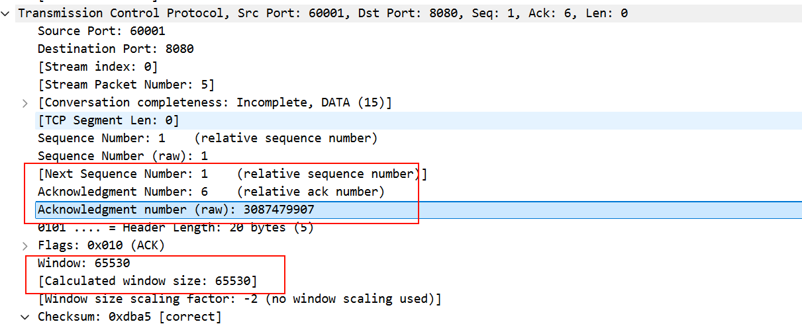
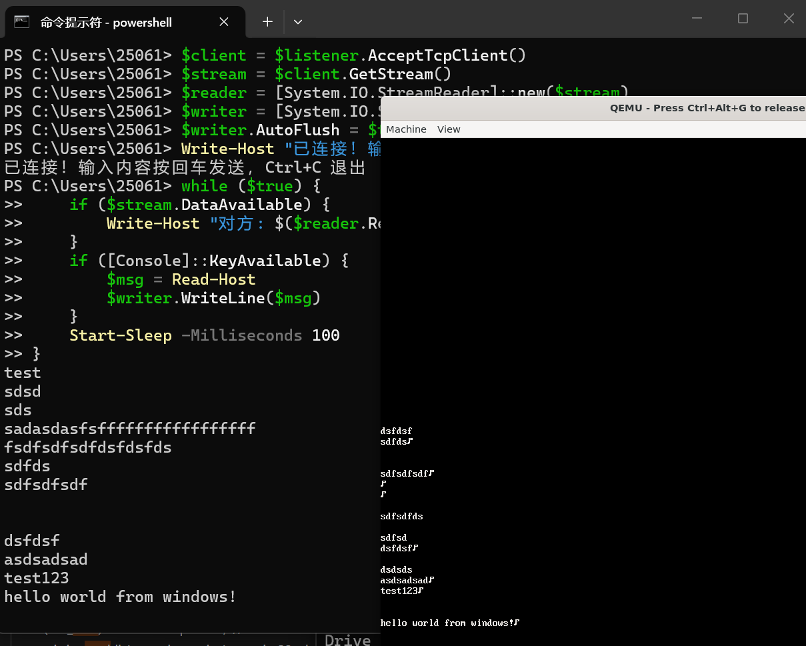
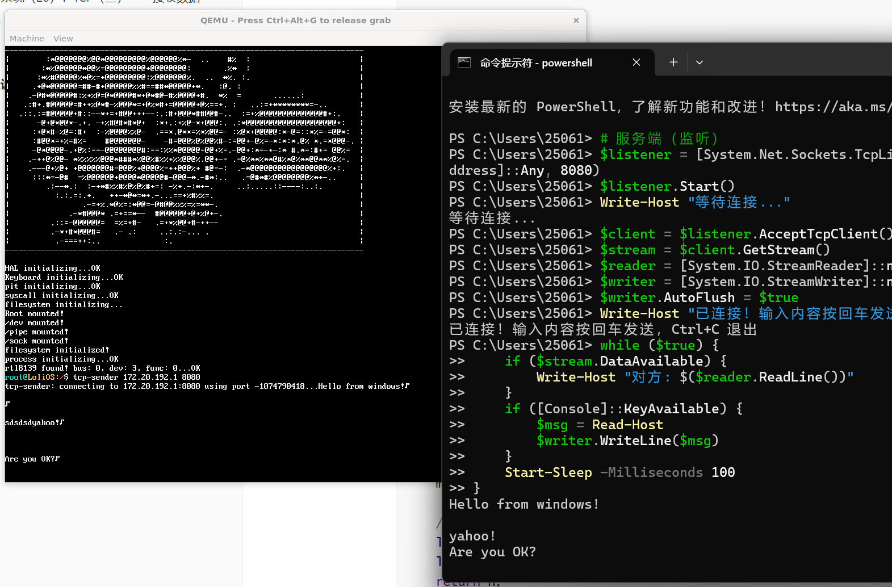
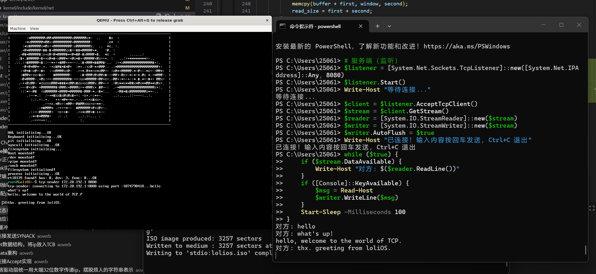
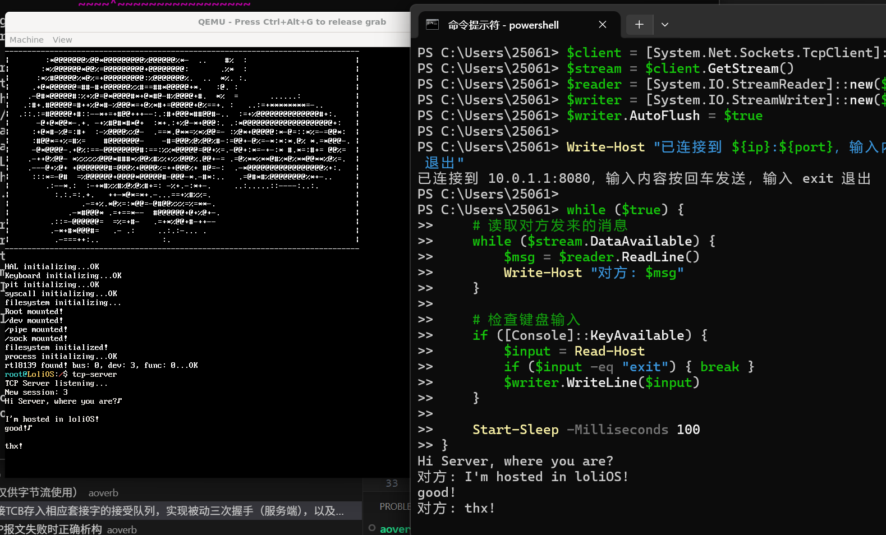
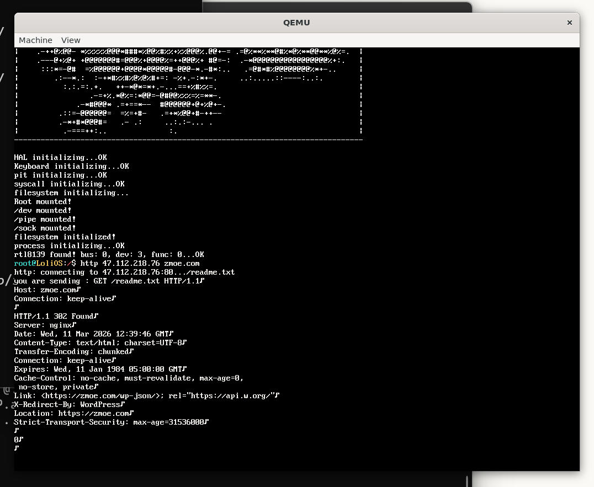
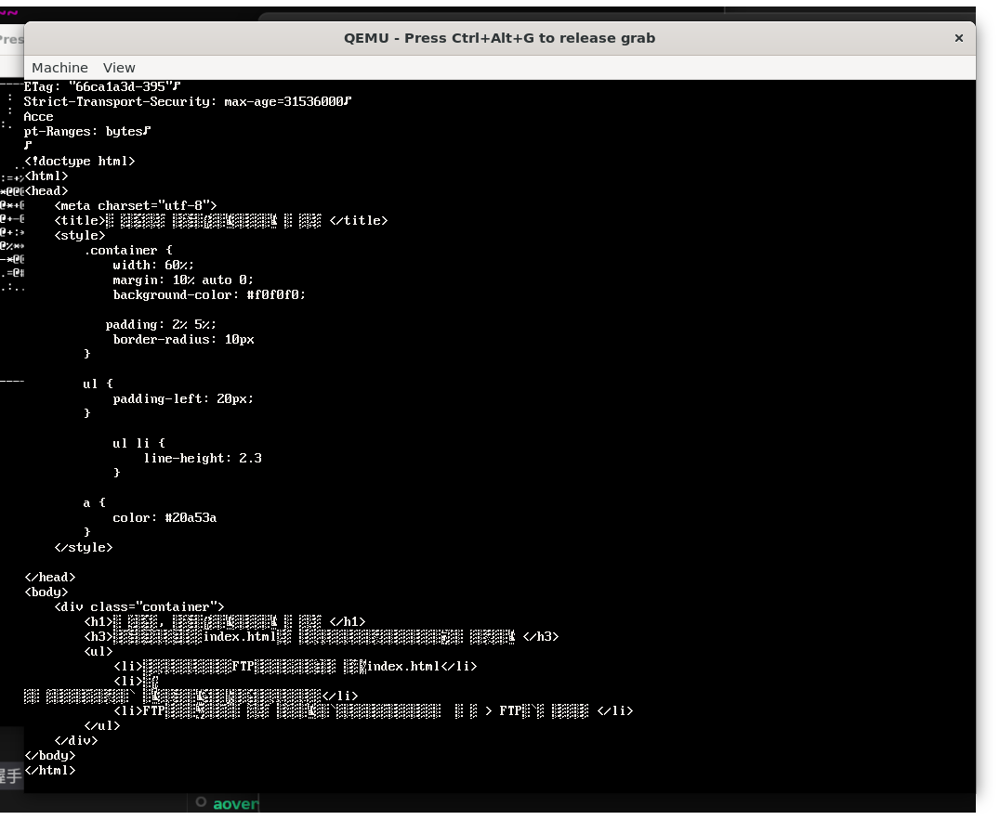

## 自制操作系统（26）：TCP（三）——接发数据

今天我们来实现TCP接发数据。

### 用户态

```cpp
    pollfd fds[2] = {
        { .fd = 0, .events = POLLIN, .revents = 0}, // 标准输入
        { .fd = conn, .events = POLLIN, .revents = 0 }
    };

    char buff[256];
    while(1) {
        int ret = poll(fds, 2, -1);  // -1 = 无限等待
        if (ret < 0) { break; }

        if (fds[0].revents & POLLIN) {
            uint32_t n = read(0, buff, sizeof(buff));
            if (n <= 0) break;
            write(conn, buff, n);
        }

        // socket 有数据 → 读取并打印
        if (fds[1].revents & POLLIN) {
            uint32_t n = read(conn, buff, sizeof(buff));
            if (n <= 0) {
                printf("connection has been closed\n");
                break;
            }
            buff[n] = '\0';
            printf("%s\n", buff);
        }
```

这是我们剩下的要实现的代码，我们可以看到一个很关键的概念：poll。

#### poll

poll的概念很简单，就是我们给它一些文件描述符，我们调用它开始阻塞，直到有文件描述符生成了相应的事件，或者超时，它就让我们跑通下面的流程。而我们还没有实现poll，下面需要给出它的实现。

我们首先可以想到一种简单的做法：把所有的文件描述符的read都调用一遍。但是，这样做效率不高，而且有的读是阻塞的。

我们可以想象，poll会把当前进程丢进这几个文件描述符的等待序列，而文件描述符的驱动（或者相关的别的什么东西）会负责去唤醒等待序列中的进程。我们或许可以再实现一个文件操作相关的函数，这个函数可以把进程注册进文件驱动的等待序列中，让文件驱动去唤醒这个进程。

但是我们现在的进程只支持把自己放在一个等待序列，要放在多个序列，需要再做一层封装，并在要移出等待队列的时候，加锁，判断状态是否还是waiting。而且这还不够，我们最好是能把自己从所有的等待序列里面移出来。

也许可以换一种思路，我们不把自己挂在任何文件驱动的等待序列，而是调用文件驱动的回调函数去确认有没有数据。

```cpp
int sys_poll(interrupt_frame* reg) {
    pollfd* fds         = reinterpret_cast<pollfd*>(reg->ebx);
    uint32_t fd_num     = reg->ecx;
    uint32_t timeout    = reg->edx;
    process_queue poll_queue;
    bool has_event = false;
    bool has_data = false;
    {
        SpinlockGuard guard(process_list_lock);
        PCB* cur_pcb = current_pcb();
        insert_into_process_queue(poll_queue, cur_pcb);
        for (int i = 0; i < fd_num; ++i) {
            if (cur_pcb->fd[fds[i].fd] == nullptr) {
                if (fds[i].events & INVFD) {
                    fds[i].revents |= INVFD;
                    has_event = true;
                }
            } else {
                int ret = v_peek(cur_pcb, fds[i].fd);
                if (ret < 0 && (fds[i].events & ERROR)) {
                    fds[i].revents |= ERROR;
                    has_event = true;
                } else if (ret == 0 && (fds[i].events & POLLIN)) {
                    fds[i].revents |= POLLIN;
                    has_event = true;
                    has_data = true;
                }
                v_setpoll(cur_pcb, fds[i].fd, &poll_queue);
            }
        }
        if (!has_event) {
            current_pcb()->state = process_state::WAITING;
        }
    }
    if (!has_event) {
        ::timeout(&poll_queue, timeout);
    } else {
        SpinlockGuard guard(process_list_lock);
        remove_from_process_queue(poll_queue, current_pcb()->pid);
        return 1;
    }
    {
        SpinlockGuard guard(process_list_lock);
        PCB* cur_pcb = current_pcb();
        for (int i = 0; i < fd_num; ++i) {
            if (cur_pcb->fd[fds[i].fd] == nullptr) {
                if (fds[i].events & INVFD) {
                    fds[i].revents |= INVFD;
                }
            } else {
                int ret = v_peek(cur_pcb, fds[i].fd);
                if (ret < 0 && (fds[i].events & ERROR)) {
                    fds[i].revents |= ERROR;
                } else if (ret == 0 && (fds[i].events & POLLIN)) {
                    fds[i].revents |= POLLIN;
                    has_data = true;
                }
                v_setpoll(cur_pcb, fds[i].fd, nullptr);
            }
        }
    }
    return has_data;
}
```

最终采取了这种不能多进程打开fd的方案：我们把自己挂入本地的等待队列，并把当前队列的队头指针传给fd的poll_queue，当有数据时由fd负责从把我们从队列中叫醒，因为大家在移除队列时都会用process_list_lock，所以是不担心被唤醒多次的。醒来之后我们每个文件都peek一下，并记录事件，最后把大家的poll_queue清空。

如果后面需要做多进程打开fd的方案，那就要把poll_queue做成一个链表，我们自己构造链表项，并去持一把公共的，放在fd的poll_queue_lock插入poll_queue，清理时也是一样的，持锁清理即可。

#### read

我们到现在都还没适配tcp读的逻辑——因为我们的window里面都还没有东西呢！不过我们可以先把这部分逻辑补上：

```cpp
int tcp_read(socket& sock, char* buffer, uint32_t size) {
    // head 与 tail，左闭右开
    TCB* tcb = sock.data.tcp.block;
    SpinlockGuard guard(tcb->lock);
    char* window = sock.data.tcp.block->window;
    size_t read_size;
    if (tcb->window_used_size == 0) {
        return 0;
    }
    if (tcb->window_head < tcb->window_tail) {
        read_size = tcb->window_tail - tcb->window_head < size?
                           tcb->window_tail - tcb->window_head : size;
        memcpy(buffer, window + tcb->window_head, read_size);
    } else {
        size_t first = tcb->window_size - tcb->window_head;
        if (size <= first) {
            memcpy(buffer, window + tcb->window_head, size);
            read_size = size;
        } else {
            memcpy(buffer, window + tcb->window_head, first);
            size_t second = (size - first) > tcb->window_tail ? tcb->window_tail : size - first;
            memcpy(buffer + first, window, second);
            read_size = first + second;
        }
    }
    tcb->window_head = (tcb->window_head + read_size) % tcb->window_size;
    tcb->window_used_size -= read_size;
    return read_size;
}
```

我们在TCB给window加了个window_used_size字段，这样可以让我们的循环缓冲区语义更明确。

```cpp
    case tcb_state::ESTABLISHED:
    {
        if ((header->flags & (uint8_t)tcp_flags::ACK) == 0) {
            break;
        }
        if (ntohl(header->seq_num) != tcb->ack) { // 我们先做一个简单实现，乱序的直接丢弃
            break;
        }
        size_t payload_size = size - ip_header_size - header->data_offset * 4; // 别忘了乘4
        char* payload = buffer + header->data_offset * 4 + ip_header_size;
        if (tcb->window_size - tcb->window_used_size < payload_size) {
            break; // 超过当前窗口大小直接丢弃
        }
        if (tcb->window_tail < tcb->window_head) {
            memcpy(tcb->window + tcb->window_tail, payload, payload_size);
        } else {
            size_t first = tcb->window_size - tcb->window_tail;
            if (first >= payload_size) {
                memcpy(tcb->window + tcb->window_tail, payload, payload_size);
            } else {
                memcpy(tcb->window + tcb->window_tail, payload, first);
                size_t second = payload_size - first;
                memcpy(tcb->window, payload + first, second);
            }
        }
        tcb->window_used_size += payload_size;
        tcb->window_tail = (tcb->window_tail + payload_size) % tcb->window_size;
        tcb->ack += payload_size;
        send_tcp_pack(tcb, (uint8_t)tcp_flags::ACK, nullptr, 0);
```

接收的逻辑。别忘了用payload_size更新ack，以及在send_tcp_pack里面告诉对端我们还剩的窗口大小：



从wireshark抓包的逻辑看我们都正确更新了。但是有消息来时系统崩溃了，加这段；

```cpp
    } else {
        SpinlockGuard guard(process_list_lock);
        remove_from_process_queue(poll_queue, current_pcb()->pid);
        for (int i = 0; i < fd_num; ++i) {
            if (current_pcb()->fd[fds[i].fd] != nullptr) {
                v_setpoll(current_pcb(), fds[i].fd, nullptr);
            }
        }
        return 1;
    }
```

之前是use-after-free了。把这个修复之后还没能收到数据，应该是peek的问题。



把peek修好之后，可以收到信息了，但是显示还是有问题..

首先，是收到数据后会无限换行（这个大概率是我对于read返回值判断不严格）；

其次是会被控制台阻塞，导致我发送完信息才能看到服务器发过来的信息。

问了Claude，很有可能是我的控制台设备peek太宽松，要按换行符来判断。

#### 改造设备文件

read的时候会把文字塞进console_buffer，直到buffer充满，或者换行，或者超过指定大小；在这之前，read函数不会向你提供的buffer写进任何东西。我们改造一下console_peek函数，让它把我们输入的字符吃进一个缓冲区，且提供一个line_ready标识给console_read函数直到我们敲下回车，都不会把这个值设置为true：

```cpp
static int console_peek() {
    while (keyboard_haschar() && !line_ready) {
        char c = keyboard_getchar();

        if (c == '\b') {
            if (line_len > 0) {
                --line_len;
                terminal_write("\b", 1);   // 回显退格
            }
            continue;
        }

        if (c == '\n') {
            line_buf[line_len++] = '\n';
            terminal_write("\n", 1);   // 回显换行
            line_ready = true;
            break;
        }

        if (c >= 32 && c <= 126 && line_len < sizeof(line_buf) - 1) {
            line_buf[line_len++] = c;
            terminal_write(&c, 1);     // 回显可见字符
        }
    }
    return line_ready ? (int)line_len : 0;
}

static int console_read(char* buffer, uint32_t offset, uint32_t size) {
    while (!line_ready) {
        console_peek();
        if (!line_ready)
            asm volatile("pause");
    }

    uint32_t n = line_len < size ? line_len : size;
    memcpy(buffer, line_buf, n);

    // 重置缓冲区
    line_len = 0;
    line_ready = false;
    return n;
}

```

这样我们在peek的时候，只要不敲下回车，我们就不会调用read；而调用read的时候因为行数据已经准备好了，就不会被阻塞。



就这样，我们的TCP实现了接收数据！

### 发送数据

我们先不做重传，所以我们发出一条数据后，只能等ack发回来之后，再发送数据。甚至，我们可以完全不用等ACK。

#### 非完美主义

完美主义是实干的大敌。事实是，我们只能通过尝试与迭代来做成一件事，而不是一上来就有各种“伟大的想法...”。所以对于发送数据，我不打算把事情干得很漂亮，能用，对我来说就足够了。

于是，这就是我的发送数据的实现代码：

```cpp
int tcp_write(socket& sock, char* buffer, uint32_t size) {
    TCB* tcb = sock.data.tcp.block;
    int ret = send_tcp_pack(tcb, (uint8_t)tcp_flags::ACK, buffer, size);
    return ret;
}
```

我们想要的东西其实就这么简单，不是吗？





就这样，我们成功实现了TCP的客户端和服务端，并实现了简单的接发数据，而且把发送数据是简化得不能再简化。
#### poc: 一个简单的HTTP客户端

我们现在还没有DNS，所以只能靠自己手动输入IP。





我们已经有一个能用的TCP网络栈了！

---

下一节我们来看看连接的关闭。