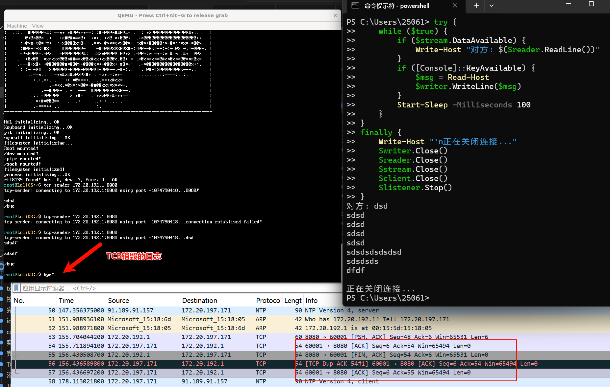
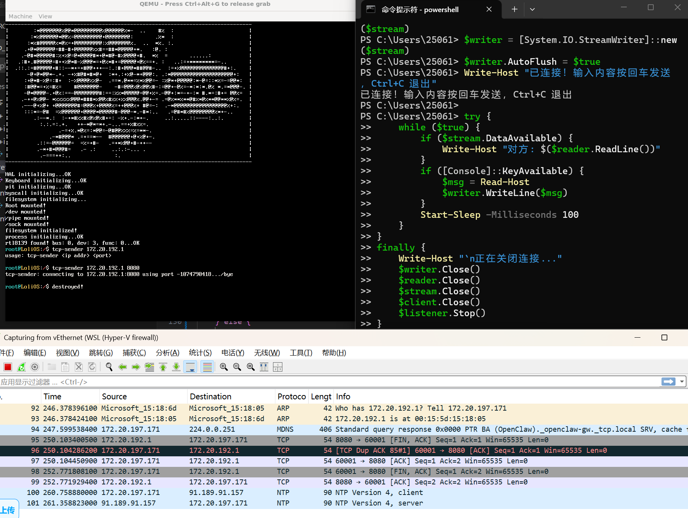
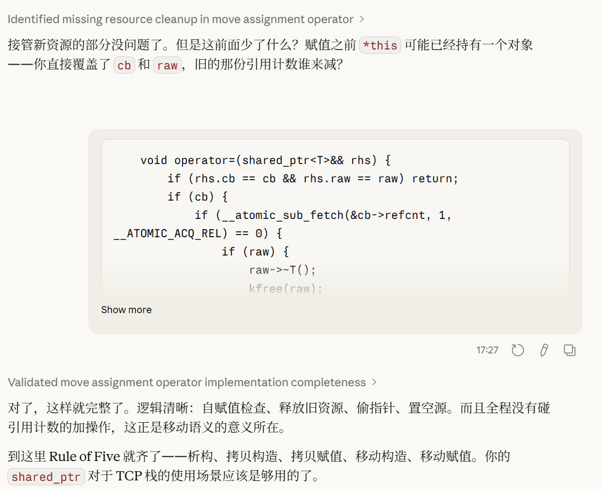

## 自制操作系统（27）：TCP（四）——关闭连接

今天我们来实现连接的关闭。

关闭连接是所谓的“四次挥手”，简单来说就是：

A：我发完了（FIN）。B：好的（ACK）。（一会后）我也发完了（或者“好的，我也发完了”，FINACK）

A：好的。然后这个时候两方都会进入一个TIME_WAIT的状态，等待一段时间之后，再销毁TCB。

### 主动关闭

主动关闭会发FINACK，然后把自己的状态转入FIN_WAIT_1，这代表我们已经完成了数据发送，并在确认对方是否已经了解这一情况，而一旦收到来自对方的ACK，那就可以再把状态转入FIN_WAIT_2，代表对方已经知道我们不会发数据了，并且正在等待对方把它那边的数据发完，发FIN：

```cpp
int tcp_close(socket& sock) {
    SpinlockGuard guard(sock.lock);
    TCB* tcb = sock.data.tcp.block;
    PCB* cur;
    // 这里我拿sock里面的wait_queue好像没什么办法，因为这说明了进程正在被阻塞，是没法主动调close的
    // 除非是收到了一些外部事件，但是这一般来说，会是整个进程都会被销毁掉的情况
    sock.valid = 0;

    send_tcp_pack(tcb, ((uint8_t)tcp_flags::FIN | (uint8_t)tcp_flags::ACK), nullptr, 0);
    tcb->state = tcb_state::FIN_WAIT1;
}
```

FIN是需要一个虚拟字节的，因为这样可以增加一个序列号，确保我们的结束信息发送的可靠性：（如果不加这个，那就没办法区分传输数据的ACK和一般的ACK了）

```cpp
// send_tcp_pack内
// 需要被可靠确认的标志位都需要虚拟字节
    if (((uint8_t)flags & (uint8_t)tcp_flags::SYN) || ((uint8_t)flags & (uint8_t)tcp_flags::FIN)) {
        tcb->seq += 1; // 虚拟字节
    }
```

我们对于FIN_WAIT1状态的处理如下：

```cpp
    case tcb_state::FIN_WAIT1:
        if ((header->flags & (uint8_t)tcp_flags::ACK) != 0) {
            // 确认了我们这边已经发完了东西
            if ((header->flags & (uint8_t)tcp_flags::FIN) != 0) { // 如果对端一块把FIN发了过来，那就是他们那边也发送完了
                tcb->ack = ntohl(header->seq_num) + 1; // FIN会占一个虚拟字节
                send_tcp_pack(tcb, (uint8_t)tcp_flags::ACK, nullptr, 0);
                tcb->state = tcb_state::TIME_WAIT;
                time_wait(tcb);
            } else {
                // 如果只发了个ACK，把状态调成FIN_WAIT_2即可
                tcb->state = tcb_state::FIN_WAIT2;
            }
        } else if ((header->flags & (uint8_t)tcp_flags::FIN) != 0) { // 如果收到了FIN但是没有ACK，那就是刚好对端也在关闭连接
            tcb->state = tcb_state::CLOSING; // 那就转成CLOSING
            tcb->ack = ntohl(header->seq_num) + 1; // FIN会占一个虚拟字节
            send_tcp_pack(tcb, (uint8_t)tcp_flags::ACK, nullptr, 0);
        }
        break;
```

注意这里对于虚拟字节的处理，我们这边收到了FIN Flag的话，是要把ACK加上一个虚拟字节的；

这里还有一种神奇的情况，就是我们和对端同时发了FIN...这会变成神奇的CLOSING状态，我们放在最后面讨论。

那么现在先来看看新的状态FIN_WAIT_2，这个状态代表对方已经知道我们不会再发数据了，但是他们可能还会有发过来的数据：

```cpp
    case tcb_state::FIN_WAIT2:
        if ((header->flags & (uint8_t)tcp_flags::FIN) != 0) { // 对端发完了
            tcb->ack = ntohl(header->seq_num) + 1;
            send_tcp_pack(tcb, (uint8_t)tcp_flags::ACK, nullptr, 0); // 好
            tcb->state = tcb_state::TIME_WAIT;
            time_wait(tcb);
        }
        // 如果不是FIN，那就说明对方可能还有数据要发，我们让执行流直接流到下面的ESTABLISHED，但状态不变
        [[fallthrough]];
    case tcb_state::ESTABLISHED:
    {
```

所以我们可以判断对方带不带FIN，如果不带FIN，就执行ACK的流程。

看到这里，你有没有发现上面的流程有问题？先想想。


问题在于，我们无论是在FIN_WAIT1还是FIN_WAIT2，这个状态是代表了我们是不会再发数据的。

但是对方还有可能发数据，而我们在FIN_WAIT2没有处理的情况是发了个带FIN的数据（这是有可能的），所以我们要把FIN_WAIT2的代码改一下：

```cpp
    case tcb_state::FIN_WAIT2:
        [[fallthrough]];
    case tcb_state::ESTABLISHED:
    {
        if (ntohl(header->seq_num) != tcb->ack) { // 我们先做一个简单实现，乱序的直接丢弃
            break;
        }
        if ((header->flags & (uint8_t)tcp_flags::RST) == 0) {
            // todo: 正确handle RST
            break;
        }
        if ((header->flags & (uint8_t)tcp_flags::ACK) == 0) {
            break;
        }
        
        ...处理数据包的流程，事已至此，先处理数据吧

        if ((header->flags & (uint8_t)tcp_flags::FIN) != 0) {
            tcb->ack = ntohl(header->seq_num) + 1;
            send_tcp_pack(tcb, (uint8_t)tcp_flags::ACK, nullptr, 0); // 好
            if (tcb->state == tcb_state::FIN_WAIT2) { // 如果我们实际上是FIN_WAIT2
                tcb->state = tcb_state::TIME_WAIT;
                time_wait(tcb);
                break;
            } else {
                ... 被动关闭的流程
            }
        }
        
```

而且FIN_WAIT1也得跟着一块改，我们原本的FIN_WAIT1流程也是无论如何都要先处理数据的，我们先把FIN_WAIT1原来的代码修改下，可以发现，下面的FIN_WAIT1代码跟原来的逻辑是一样的：

```cpp
    case tcb_state::FIN_WAIT1:
        if ((header->flags & (uint8_t)tcp_flags::ACK) != 0) {
            // 确认了我们这边已经发完了东西
            tcb->state = tcb_state::FIN_WAIT2;
            if ((header->flags & (uint8_t)tcp_flags::FIN) == 0) { // 如果对端一块把FIN发了过来，那就是他们那边也发送完了
                tcb->ack = ntohl(header->seq_num) + 1; // FIN会占一个虚拟字节
                send_tcp_pack(tcb, (uint8_t)tcp_flags::ACK, nullptr, 0);
                tcb->state = tcb_state::TIME_WAIT;
                time_wait(tcb);
            }
        } else if ((header->flags & (uint8_t)tcp_flags::FIN) != 0) { // 如果收到了FIN但是没有ACK，那就是刚好对端也在关闭连接
            tcb->state = tcb_state::CLOSING; // 那就转成CLOSING
            tcb->ack = ntohl(header->seq_num) + 1; // FIN会占一个虚拟字节
            send_tcp_pack(tcb, (uint8_t)tcp_flags::ACK, nullptr, 0);
        }
        break;
```

也就是，对于第一种FIN_WAIT1收到了ACK的情况，我们完全可以把自己转成FIN_WAIT2！（想想FIN_WAIT2处理FINACK的流程，是不是跟WAIT1处理流程是一样的！

```cpp
    case tcb_state::FIN_WAIT1:
        if ((header->flags & (uint8_t)tcp_flags::ACK) != 0) {
            tcb->state = tcb_state::FIN_WAIT2; // 确认了我们这边已经发完了东西
        } else if ((header->flags & (uint8_t)tcp_flags::FIN) != 0) { // 如果收到了FIN但是没有ACK，那就是刚好对端也在关闭连接
            tcb->state = tcb_state::CLOSING; // 那就转成CLOSING
            tcb->ack = ntohl(header->seq_num) + 1; // FIN会占一个虚拟字节
            send_tcp_pack(tcb, (uint8_t)tcp_flags::ACK, nullptr, 0);
        }
        [[fallthrough]];
    case tcb_state::FIN_WAIT2:
        [[fallthrough]];
    case tcb_state::ESTABLISHED:
    {
        if (ntohl(header->seq_num) != tcb->ack) { // 我们先做一个简单实现，乱序的直接丢弃
            break;
        }
        if ((header->flags & (uint8_t)tcp_flags::RST) == 0) {
            // todo: 正确handle RST
            break;
        }
        if ((header->flags & (uint8_t)tcp_flags::ACK) == 0) {
            break;
        }
        
        ...处理数据包的流程，事已至此，先处理数据吧

        if ((header->flags & (uint8_t)tcp_flags::FIN) != 0) {
            tcb->ack = ntohl(header->seq_num) + 1;
            send_tcp_pack(tcb, (uint8_t)tcp_flags::ACK, nullptr, 0); // 好
            if (tcb->state == tcb_state::FIN_WAIT2) { // 如果我们实际上是FIN_WAIT2
                tcb->state = tcb_state::TIME_WAIT;
                time_wait(tcb);
                break;
            } else {
                ... 被动关闭的流程
            }
        }
```

慢着，我们还有一种流程没处理呢：如果我发了FIN的同时它也发了FIN，还把数据一块发了过来那怎么办呢？真是麻烦呢。但是这种情况下，对方在FIN_WAIT1的时候同时发FIN，还不带ACK地把数据发过来，也太不讲规矩了吧。这种情况下，他的数据丢掉就丢掉了。

#### TIME_WAIT状态与time_wait()

TIME_WAIT状态是，你和对方都达成了一个我这边（主动关闭连接方）即将不发数据的共识，而对方也跟你打过招呼说他也要不发数据了，你发“好”之后，进入的状态。进入这个状态的同时，你会调用time_wait()函数启动一个TCB销毁定时器，进入TCB生命周期的倒计时。这个状态是为了防止我们发送的“我知道你这边要不发数据了”的数据包被丢掉了，如果有这个状态，对方再发一次FIN，我们还能回复，如果没有这个状态，我们直接把这个连接销毁掉，对方发的FIN就会一直得不到回复，那就进退两难了，由于他很可能在最后一个FIN带上自己的数据，他会在想“对方有没有收到我最后发给他的数据呢？好焦急啊”。而有了这个状态，相当于是一个能稳妥的接收到最后数据的保障。

如果定时器触发了ACK都发不出去，那说明连接本身就有问题，这种情况下，收不到对方最后的数据，也没有办法了，对方迟迟得不到回复，也只能作罢。

我们的炸弹套件：

```cpp
static void destroy_tcb(pid_t pid, void* tcb) {
    kfree(reinterpret_cast<TCB*>(tcb)->window);
    kfree(tcb);
}

static void time_wait(TCB* tcb) {
    register_timer(pit_get_ticks() + 300, &destroy_tcb, nullptr); // 10ms 1tick, 也就是等3秒
}
```

状态处理器：

```cpp
    case tcb_state::TIME_WAIT:
        if ((header->flags & (uint8_t)tcp_flags::FIN) != 0) {
            // 这回不用加ACK了，我们之前肯定加过了
            send_tcp_pack(tcb, (uint8_t)tcp_flags::ACK, nullptr, 0);

        }
        break;
```
这里如果收到FIN，按照规范是需要重置定时器的，这里不重置定时器，就相当于定时器是限定“尝试发送所有的最后一个ACK”的尝试周期；当然你也可以重置，这样每次尝试发最后一个ACK都是独立计时的，我这里就简单实现了。
#### 调试

我们作为发送方去主动销毁连接。



测试无问题！

### 被动关闭

被动关闭是指对方发送FIN到我们这边，我们去进行处理的一系列过程。我们收到对方的FIN，无非就是ACK一下，然后把状态转成CLOSE_WAIT就行了，我们这边还是想怎么发就怎么发。

```CPP
        if ((header->flags & (uint8_t)tcp_flags::FIN) != 0) { // 对端通知，后面不发数据了
            tcb->ack = ntohl(header->seq_num) + 1;
            send_tcp_pack(tcb, (uint8_t)tcp_flags::ACK, nullptr, 0); // 好
            if (tcb->state == tcb_state::FIN_WAIT2) { // 如果我们实际上是FIN_WAIT2
                tcb->state = tcb_state::TIME_WAIT;
                time_wait(tcb);
            } else { // 被动关闭的情况
                tcb->state = tcb_state::CLOSE_WAIT;
                wake_all_queue();
            }
        }
```

唯一注意的是需要唤醒那些还挂在等待序列的进程，已经没有数据可以接收了。我们调用封装了的`wake_all_queue`：
```cpp
void wake_all_queue(socket* sock){
    { // 阻塞式read
        SpinlockGuard guard(process_list_lock);
        PCB* cur;
        while(cur = sock->wait_queue) {
            remove_from_process_queue(sock->wait_queue, cur->pid);
            cur->state = process_state::READY;
            insert_into_scheduling_queue(cur->pid);
        }
    }
    { // poll
        SpinlockGuard guard(process_list_lock);
        PCB* cur;
        while((sock->poll_queue != nullptr) && (*(sock->poll_queue) != nullptr) &&
            (cur = *(sock->poll_queue))) {
            remove_from_process_queue(*(sock->poll_queue), cur->pid);
            cur->state = process_state::READY;
            insert_into_scheduling_queue(cur->pid);
        }
    }
}
```

然后我们在tcp_close的时候，根据我们现在所处的状态去转成不同的状态即可。


```cpp
int tcp_close(socket& sock) {
    ...
    send_tcp_pack(tcb, ((uint8_t)tcp_flags::FIN | (uint8_t)tcp_flags::ACK), nullptr, 0);
    if (tcb->state == tcb_state::ESTABLISHED) {
        tcb->state = tcb_state::FIN_WAIT1;
    } else if (tcb->state == tcb_state::CLOSE_WAIT) {
        tcb->state = tcb_state::LAST_ACK;
    } else {
        printf("warning: unexpected state %d\n", tcb->state);
    }
    return 0;
}
```

LAST_ACK状态，很直白，就是我们还得再等最后一个ACK。

```cpp
    case tcb_state::LAST_ACK:
        if ((header->flags & (uint8_t)tcp_flags::ACK) != 0) { // 收到最后一个ACK
            destroy_tcb(cur_process_id, tcb);
        }
        break;
```

被动关闭就是这么简单，直白。

```cpp
case tcb_state::CLOSING:
        if ((header->flags & (uint8_t)tcp_flags::ACK) != 0) {
            // 我们之前的FIN的ACK收到了，所以，对方知道了我们不发数据了
            // 但是我们之前发出去的ACK，对方有没有收到呢？如果没有收到，对方会再发一次FIN
            // 所以我们要进入TIME_WAIT
            tcb->state = tcb_state::TIME_WAIT;
            time_wait(tcb);
        }
        break;
```

顺便一块把closing也做了。

#### 调试



被动关闭也正确实现了。

连接确实是关闭了，但是...我们安全了吗？

### 资源管理

我们的TCB可能存在于系统各处（Socket，queue，map，TCP_Handler，Timer）...然而，我们释放得很随便，很有可能忘了释放，还有可能重复释放，最糟糕的是释放了之后继续使用...要是稍有不慎，系统，危！

至少现在，我们要把后面两种可能性给灭掉。所以，让我们来给TCB加上引用计数——或者说，让我们来给TCB用上Shared_ptr！

但是我们现在的库还没有实现Shared_ptr。我们来自己写一个吧。

#### shared_ptr

shared_ptr的逻辑很简单，里面有一个引用计数，我们执行拷贝操作时，这个计数就会加1，我们执行析构操作时，这个计数就会减1，并且在计数器减为0时，就会调用指针内容的析构函数。

```cpp
int refcount;

void grab() {
    __atomic_fetch_add(&refcount, 1, __ATOMIC_RELAXED);
}

bool put() {
    return __atomic_sub_fetch(&refcount, 1, __ATOMIC_ACQ_REL) == 0;
}
```

计数器的加减，我们使用原子操作。

我不怎么写现代C++，所有我尽量试了试，基本上就是写一版代码，然后让Claude去引导我修改：



就这样加上了智能指针的保护，想必是相当不错的了。

---

我们的TCP栈已经具有相当的实用性了！下节，我要分享一些你能用现在的TCP栈做的一些激动人心的东西。
