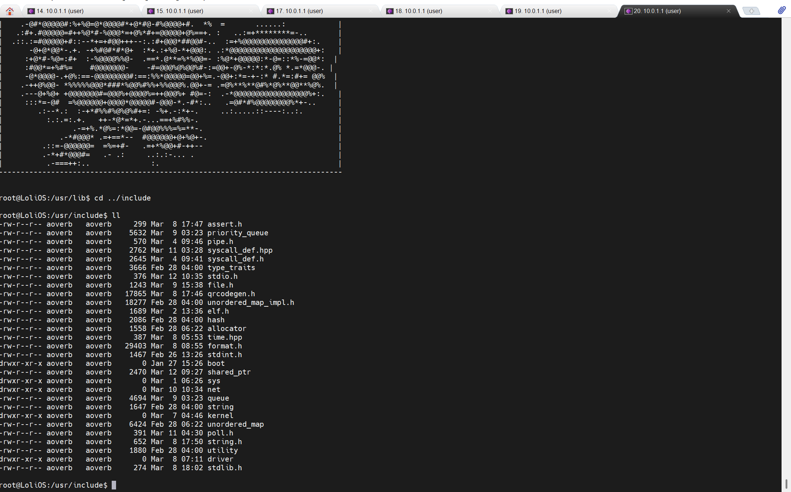

## 自制操作系统（28）：TCP（五）——HTTP、TELNET

TCP栈这么有用的东西，不好好利用岂不是浪费了？

### HTTP源码获取

我们可以获取HTTP源码！

```
这篇文章并不完整...正在建设中。
```

HTTP连接虽然看着新鲜，但是玩上一会就无聊了，我们来做点有趣的——启动一个Telnet服务器。

### telnet服务

telnet是一个简单的远程网络登录协议。

传递的数据只有两类，协商与普通数据。

我们可以拒绝所有的协商，直接来完成回显。

```cpp

int main(int argc, char** argv) {
    int conn = open("/sock/tcp", O_CREATE);
    if (conn == -1) {
        printf("telnetd: tcp unsupported!\n");
        return 0;
    }

    sockaddr bindaddr;
    bindaddr.addr = SOCKADDR_BROADCAST_ADDR;
    bindaddr.port = 8080;
    if (ioctl(conn, "SOCK_IOC_BIND", &bindaddr) < 0) {
        printf("telnetd: failed to bind %s:%d\n", bindaddr.addr, bindaddr.port);
        return 0;
    }

    if (listen(conn, 5)) {
        printf("failed to listen!\n");
        return 0;
    }
    printf("Telnet Server listening...\n");
    int client_fd;
    while (client_fd = accept(conn, nullptr, nullptr)) {
        if (client_fd == -1) break;
        printf("New session: %d\n", client_fd);
        handle_session(client_fd);
    }

    close(conn);
    return 0;
}
```

先写个总流程。

拿到新的session后，总的思路是，新建管道，启动一个shell，拿取一个tcp连接，我们作为中介去响应telnet连接的输入，拒绝所有的协商，把普通数据去除/r后传入shell，把shell产生的输出回传给telnet：

```cpp

void handle_session(int conn) {
    int shell_in[2]; // 读端：控制台的标准输入；写端：我们控制
    int shell_out[2]; // 读端：我们拿着；写端：控制台的标准输出

    int ret = pipe(shell_in);
    int ret2 = pipe(shell_out);
    // 我们从TCP连接拿到数据，处理后传给shell
    int shell_pid = execute_shell(shell_in[0], shell_out[1]);
    if (shell_pid == -1 || ret == -1 || ret2 == -1) {
        close(shell_in[0]);
        close(shell_in[1]);
        close(shell_out[0]);
        close(shell_out[1]);
        close(conn);
        return;
    }
    pollfd fds[2] = {
        { .fd = shell_out[0], .events = POLLIN, .revents = 0}, // 标准输入
        { .fd = conn, .events = POLLIN, .revents = 0 }
    };

    char buff[256];
    while(1) {
        int ret = poll(fds, 2, -1);  // -1 = 无限等待
        if (ret < 0) { break; }

        // 控制台有输出了
        if (fds[0].revents & POLLIN) {
            handle_console(shell_out[0], conn);
        }

        // 远端来数据了
        if (fds[1].revents & POLLIN) {
            handle_conn(conn, shell_in[1]);
        }
    }
    close(conn);
}
```

控制控制台的输入输出，由我们根据连接的情况来应对。

```cpp
constexpr char IAC  = (char)255;
constexpr char DONT = (char)254;
constexpr char DO   = (char)253;
constexpr char WONT = (char)252;
constexpr char WILL = (char)251;
constexpr char SB   = (char)250;
constexpr char SE   = (char)240;
```

协商字符，我们拒绝一切协商，遇到IAC，我们先判断是不是三字节，DO系列的一律回WONT，WILL系列的一律回DONT，SB系列的，SB-SE之间的字段直接跳过，IAC二字节的也跳过，最后就是普通的控制台字符：控制台字符，把/r换成/n跳过两个字符即可。

```cpp

void handle_conn_out(char* in, int in_len, char* iac, int& iac_len, char* con, int& con_len) {
    iac_len = 0;
    con_len = 0;
    for (int i = 0; i < in_len; ) {
        if (in[i] == IAC) {
            if (in_len - i < 3) break;
            if (in[i + 1] == DO || in[i + 1] == DONT) { // 用WONT拒绝
                iac[iac_len++] = IAC;
                iac[iac_len++] = WONT;
                iac[iac_len++] = in[i + 2];
                i += 3;
            } else if (in[i + 1] == WILL || in[i + 1] == WONT) { // 用DONT拒绝
                iac[iac_len++] = IAC;
                iac[iac_len++] = DONT;
                iac[iac_len++] = in[i + 2];
                i += 3;
            } else if (in[i + 1] == SB) { // 子协商，直接丢掉
                while (i + 1 < in_len && !(in[i] == IAC && in[i + 1] == SE)) {
                    ++i;
                }
                i += 2;
            } else {
                i += 2; // 二字节的IAC
            }
        } else {
            if (in[i] == '\r') {
                con[con_len++] = '\n';
                ++i;
            } else {
                con[con_len++] = in[i];
            }
            ++i;
        }
    }
}
```

IAC协商结果写回telnet，其余的写控制台管道写端。

```cpp
static char conn_buff[1500];

static char iac_buff[1500];
static char output_buff[1500];
void handle_conn(int in, int out) {
    // 主要是处理协商字符，以及把/r/n转成/n
    int len;
    if ((len = read(in, conn_buff, 256)) > 0) {
        
        int iac_outlen = 0;
        int outlen = 0;
        handle_conn_out(conn_buff, len, iac_buff, iac_outlen, output_buff, outlen);
        if (iac_outlen > 0) {
            write(in, iac_buff, iac_outlen); // 拒绝协商写给telnet
        }
        if (outlen > 0) {
            write(out, output_buff, outlen);
        }
    }
}
```

而我们自己shell的输出，把/r换成/r/n。

#### 效果



不得不感叹，telnet的终端，要比我自带的好用多了...

我感觉，从这一刻起，我们的操作系统产生了质变！

---

下一节，让我们来实现UDP和DNS协议支持！