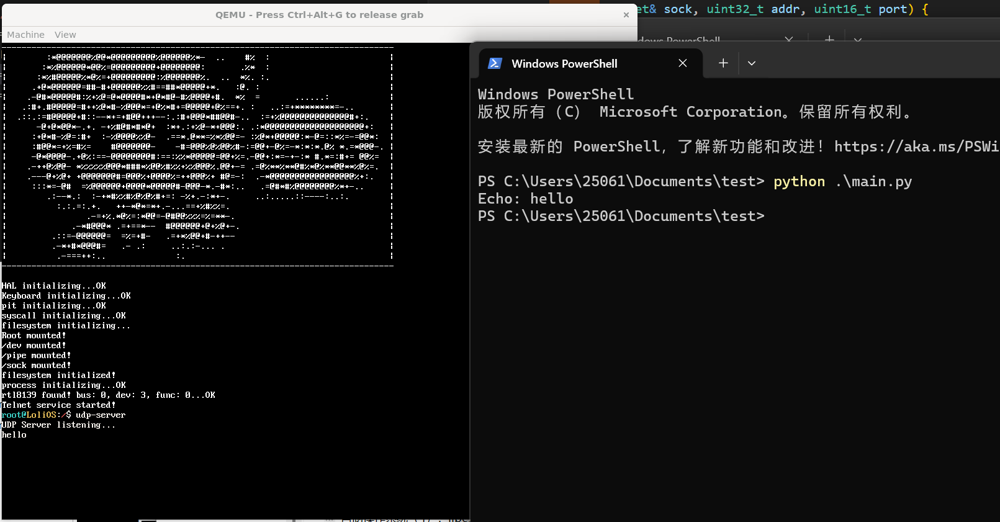

## 自制操作系统（29）：UDP

```
这篇文章并不完整...正在建设中。
```

今天我们来写UDP，并用UDP来适配DNS协议。

#### UDP

udp其实就是简化版的TCP，没有状态机，但还是会有一个哈希表。

#### 报文

```
        0              15 16             31
       +-----------------+-----------------+
       | Source Port     |Destination Port |
       +-----------------+-----------------+
       |                 |                 |
       |     Length      |    Checksum     |
       +-----------------+-----------------+
       |                                   |
       |          data octets ...          |
       +-----------------------------------+
```

UDP的报文，非常简单，简单得令人发指...

老规矩，我们从一个客户端开始：

```cpp
#include <net/net.hpp>
#include <net/socket.hpp>
#include <file.h>
#include <stdio.h>
#include <format.h>
#include <stdlib.h>
#include <poll.h>

int main(int argc, char** argv) {
    if (argc < 3) {
        printf("usage: udp-client <ip addr> <port>\n");
        return 0;
    }

    int conn = open("/sock/udp", O_CREATE);
    if (conn == -1) {
        printf("udp unsupported!\n");
        return 0;
    }
    sockaddr bindaddr;
    bindaddr.addr = SOCKADDR_BROADCAST_ADDR;
    bindaddr.port = 8080;
    if (ioctl(conn, "SOCK_IOC_BIND", &bindaddr) < 0) {
        printf("failed to bind %s:%d", bindaddr.addr, bindaddr.port);
        return 0;
    }

    pollfd fds[2] = {
        { .fd = 0, .events = POLLIN, .revents = 0}, // 标准输入
        { .fd = conn, .events = POLLIN, .revents = 0 }
    };

    char buff[256];
    while(1) {
        int ret = poll(fds, 2, -1);  // -1 = 无限等待
        if (ret < 0) { break; }

        if (fds[0].revents & POLLIN) {
            int n = read(0, buff, sizeof(buff));
            if (n <= 0) break;
            if (strncmp("/bye\n", buff, n) == 0) {
                break;
            }
            write(conn, buff, n);
        }

        // socket 有数据 → 读取并打印
        if (fds[1].revents & POLLIN) {
            int n = read(conn, buff, sizeof(buff));
            if (n < 0) {
                printf("connection has been closed\n");
                break;
            }
            if (n == 0) continue;
            buff[n] = '\0';
            printf("%s\n", buff);
        }
    }

    close(conn);
    return 0;
}
```

#### 接口

```cpp
int udp_init(socket& sock, uint16_t local_port);
int udp_read(socket& sock, char* buffer, uint32_t size);
int udp_write(socket& sock, char* buffer, uint32_t size);
int udp_ioctl(TCBPtr& tcb, const char* cmd, void* arg);
int udp_close(socket& sock);
```

接口拿着TCP的去改就可以了。

#### 实现

UDP也像TCP一样有两个哈希表，不同的是我们不需要TCB（因为没有连接状态这种东西），我们的值直接就是socket。

二元组哈希表+链表 VS 两张哈希表

我们不想把事情弄得太复杂，所以我们想把UDP做得尽可能像TCP。

#### echo server

```cpp
        if (fds[0].revents & POLLIN) {
            int n = read(0, buff, sizeof(buff));
            if (n <= 0) break;
            if (strncmp("/bye\n", buff, n) == 0) {
                break;
            }
            write(conn, buff, n);
        }
```

这里echo不回来，因为我们没拿到对方的连接信息！我们需要recvfrom接口去获取连接信息，还需要sendto去指定一个临时地址端口发送！

#### sendto, recvfrom

我们还需要做一个适配，0.0.0.0时给它改成网卡的IP地址。



---

我们的网络之旅告一段落！

下一节我们来实现信号。
