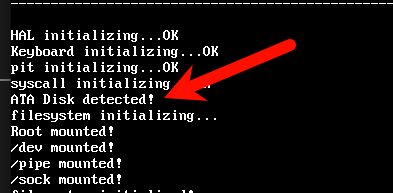
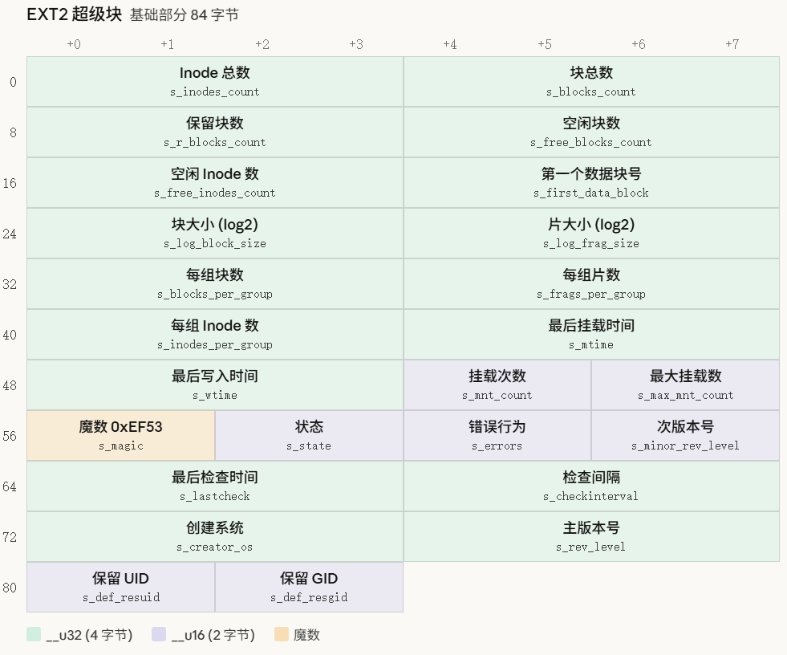
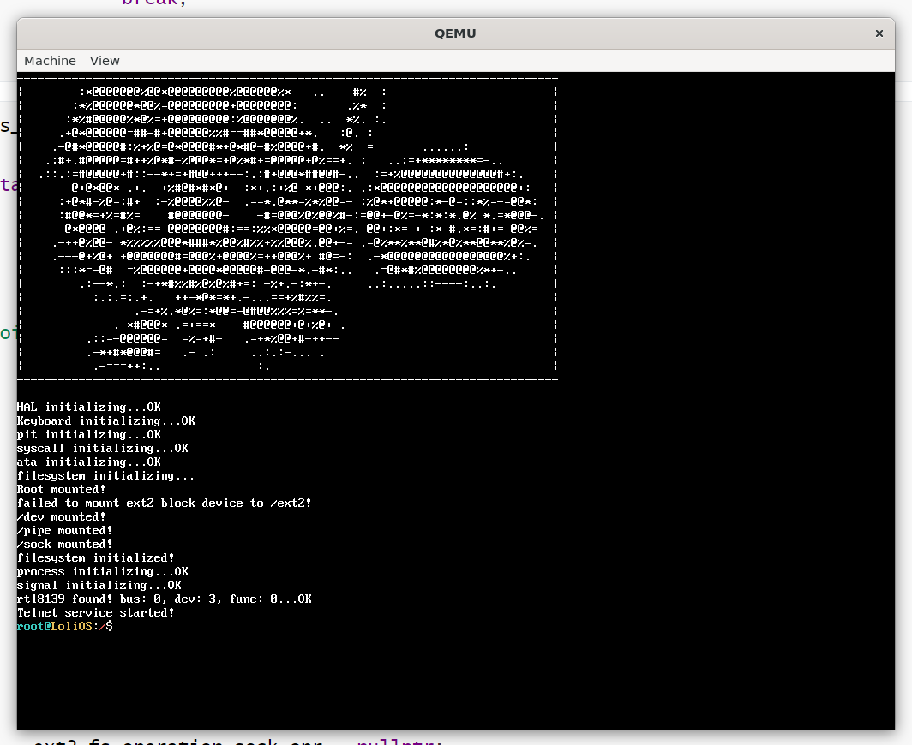

## 自制操作系统（31）：Ext2文件系统驱动——ATA PIO驱动读写扇区，块设备抽象

我们已经厌倦了只读的世界，是时候进入一个可以挂载可读写文件系统的世界了。

我选择了EXT2，是因为它比较亲近linux，而且不算简单也不算难，有很多与EXT4相近的地方，适合用来作为对现代文件系统的进一步理解。

首先我们来看看怎么识别设备，并从我们的设备读取一个指定的扇区。

### 创建并挂载镜像

我们制作一个4M的镜像，并把它格式化为EXT2，再挂载上我们的系统，把SYSROOT下面的文件复制到该镜像内，再卸载：

```shell
aoverb@BA:~/lolios$ dd if=/dev/zero of=disk.img bs=4M count=32
32+0 records in
32+0 records out
134217728 bytes (134 MB, 128 MiB) copied, 0.23078 s, 582 MB/s
aoverb@BA:~/lolios$ mkfs.ext2 disk.img
mke2fs 1.47.0 (5-Feb-2023)
Discarding device blocks: done
Creating filesystem with 32768 4k blocks and 32768 inodes

Allocating group tables: done
Writing inode tables: done
Writing superblocks and filesystem accounting information: done

aoverb@BA:~/lolios$ mkdir /tmp/mnt && sudo mount disk.img /tmp/mnt
[sudo] password for aoverb:
aoverb@BA:~/lolios$ cd SYSROOT/
aoverb@BA:~/lolios/SYSROOT$ sudo cp -rp * /tmp/mnt/
aoverb@BA:~/lolios$ sudo umount /tmp/mnt
```

**注意，我们现在不打算讨论磁盘分区和分区表，所以我们的镜像里面也没有分区表，我们目前聚焦于Ext2文件系统本身，分区表以后再讨论。**

然后我们在启动qemu时，可以用-drive参数指定挂载的镜像：（用-hda会产生格式不明确的警告）

```cpp
qemu-system-i386 -cdrom lolios.iso -drive file=disk.img,format=raw
```

### ATA PIO

ATA PIO是一种驱动磁盘的方式，ATA是一种磁盘驱动的接口标准，PIO是指编程输入输出，编程是指全程需要CPU的参与，IO是指我们通过IO端口经过CPU向磁盘驱动器发送命令，并读取数据，由于没有DMA，读取时会一直占用CPU。但是它的优点是实现简单——用我们之前用过的inx/outx io读写函数就能去识别磁盘设备状态、读写磁盘设备了，我们还在实现初期所以完全可以先用着，后面性能成为瓶颈了再采用如PCI MMIO这样的方式去读写磁盘扇区。

#### LBA

LBA是指逻辑块地址，把整个磁盘看成一个线性的数组，我们直接输入索引就能指定相应的扇区，取代了原有的CHS索引（即柱面、磁头、扇区）。

#### 读取磁盘状态

我们可以通过一系列的命令去看我们的master有没有挂载上一块ATA块设备：

```cpp
#include <kernel/io.h>
#include <stdio.h>
#include <driver/ata.hpp>

constexpr uint16_t REG_DATA = 0x1F0;
constexpr uint16_t REG_SECTOR_COUNT = 0x1F2;
constexpr uint16_t REG_LBA_LOW = 0x1F3;
constexpr uint16_t REG_LBA_MID = 0x1F4;
constexpr uint16_t REG_LBA_HIGH = 0x1F5;
constexpr uint16_t REG_DRIVE_SELECT = 0x1F6;
constexpr uint16_t REG_STAT_CMD = 0x1F7;

constexpr uint8_t CMD_IDENTIFY = 0xEC;

constexpr uint8_t DRIVE_MASTER = 0xA0;

constexpr uint8_t STAT_BUSY = 7;

void ata_init() {
    // 检测ATA设备，这里我们检测primary bus的master就够了
    outb(REG_DRIVE_SELECT, DRIVE_MASTER);
    outb(REG_SECTOR_COUNT, 0);
    outb(REG_LBA_LOW, 0);
    outb(REG_LBA_MID, 0);
    outb(REG_LBA_HIGH, 0);
    outb(REG_STAT_CMD, CMD_IDENTIFY);

    uint8_t master_stat = inb(REG_STAT_CMD);

    if (master_stat == 0) { // 没有设备
        return;
    }
    while((inb(REG_STAT_CMD) & (1 << STAT_BUSY)));


    uint8_t lba_mid = inb(REG_LBA_MID);
    uint8_t lba_high = inb(REG_LBA_HIGH);

    // 忽略其它类型的设备
    if (lba_mid != 0 || lba_high != 0) {
        return;
    }
    // 要把IDENTIFY的数据读走，否则设备状态会不正确
    uint16_t data;
    for (int i = 0; i < 256; ++i) {
        data = inw(REG_DATA);
    }
    // todo, 注册块设备
    return;
}
```

通过发送`CMD_IDENTIFY`命令，我们可以通过读状态寄存器初步判断上面有没有设备，再通过轮询status寄存器判断设备类型信息准备号之后，通过LBA中段和高段的寄存器值是否为0判断master上面是不是我们想要的ATA块设备：



现在我们的系统已经可以检测到master上挂载的ATA设备了。

#### 读写磁盘上的指定扇区

要读写ATA磁盘上的指定扇区，我们要指定三个数据：

1、哪个设备（master还是slave）；

2、从哪块逻辑扇区开始；

3、连续读多少个扇区

```cpp
#include <kernel/io.h>
#include <driver/ata.hpp>
#include <stdio.h>
#include <string.h>

constexpr uint16_t REG_DATA = 0x1F0;
constexpr uint16_t REG_SECTOR_COUNT = 0x1F2;
constexpr uint16_t REG_LBA_LOW = 0x1F3;
constexpr uint16_t REG_LBA_MID = 0x1F4;
constexpr uint16_t REG_LBA_HIGH = 0x1F5;
constexpr uint16_t REG_DRIVE_SELECT = 0x1F6;
constexpr uint16_t REG_STAT_CMD = 0x1F7;

constexpr uint8_t CMD_READ_SECTOR = 0x20;
constexpr uint8_t CMD_WRITE_SECTOR = 0x30;
constexpr uint8_t CMD_IDENTIFY = 0xEC;

constexpr uint8_t DRIVE_MASTER = 0xE0; // master选择 + LBA模式

constexpr uint8_t STAT_ERR = 0;
constexpr uint8_t STAT_DRQ = 3; // Dara Request
constexpr uint8_t STAT_DF = 5; //  Drive Fault
constexpr uint8_t STAT_BUSY = 7;

...

int ata_read_sectors(uint8_t drive, uint32_t lba, uint8_t count, void* buffer) {
    if (drive != DRIVE_MASTER) return -1; // 只有主设备，就偷懒了...
    // 等待设备空闲
    while((inb(REG_STAT_CMD) & (1 << STAT_BUSY)));
    // 选择设备
    outb(REG_DRIVE_SELECT, DRIVE_MASTER | ((lba >> 24) & 0xF));
    // 填入需要读取的扇区数
    outb(REG_SECTOR_COUNT, count);
    // 填入LBA
    outb(REG_LBA_LOW, (lba & 0xFF));
    outb(REG_LBA_MID, ((lba >> 8) & 0xFF));
    outb(REG_LBA_HIGH, ((lba >> 16) & 0xFF));
    // 发送读命令
    outb(REG_STAT_CMD, CMD_READ_SECTOR);
    uint16_t cnt = count == 0 ? 256 : count;
    for (int s = 0; s < cnt; ++s) {
        // 在扇区的边界执行检查即可
        uint8_t status;
        while ((status = inb(REG_STAT_CMD)) & (1 << STAT_BUSY));
        if (!(status & (1 << STAT_DRQ)) || (status & ((1 << STAT_DF) | (1 << STAT_ERR)))) {
            // 发生错误，直接return
            return -1;
        }
        // 一个扇区512字节，每次可以从数据寄存器读两个字节，所以一个扇区读256次
        for (int i = 0; i < 256; ++i) {
            *(reinterpret_cast<uint16_t*>(buffer) + i + 256 * s) = inw(REG_DATA);
        }
    }
    return 0;
}

int ata_write_sectors(uint8_t drive, uint32_t lba, uint8_t count, const void* buffer) {
    if (drive != DRIVE_MASTER) return -1; // 只有主设备，就偷懒了...
    // 等待设备空闲
    while((inb(REG_STAT_CMD) & (1 << STAT_BUSY)));
    // 选择设备
    outb(REG_DRIVE_SELECT, DRIVE_MASTER | ((lba >> 24) & 0xF));
    // 填入需要读取的扇区数
    outb(REG_SECTOR_COUNT, count);
    // 填入LBA
    outb(REG_LBA_LOW, (lba & 0xFF));
    outb(REG_LBA_MID, ((lba >> 8) & 0xFF));
    outb(REG_LBA_HIGH, ((lba >> 16) & 0xFF));
    // 发送写命令
    outb(REG_STAT_CMD, CMD_WRITE_SECTOR);
    uint16_t cnt = count == 0 ? 256 : count;
    for (int s = 0; s < cnt; ++s) {
        // 在扇区的边界执行检查即可
        uint8_t status;
        while ((status = inb(REG_STAT_CMD)) & (1 << STAT_BUSY));
        if (!(status & (1 << STAT_DRQ)) || (status & ((1 << STAT_DF) | (1 << STAT_ERR)))) {
            // 发生错误，直接return
            return -1;
        }
        // 一个扇区512字节，每次可以从数据寄存器读两个字节，所以一个扇区读256次
        for (int i = 0; i < 256; ++i) {
            outw(REG_DATA, *(reinterpret_cast<const uint16_t*>(buffer) + i + 256 * s));
        }
    }
    // 刷新缓存，保证写入的数据生效
    outb(REG_STAT_CMD, CMD_FLUSH_CACHE);
    while (inb(REG_STAT_CMD) & (1 << STAT_BUSY));
    return 0;
}
```

### 注册块设备

我们先构造一个块设备结构体：

```cpp
struct block_device {
    uint8_t device_id;
    void* data;

    int (*read)(block_device* dev, uint32_t lba, uint8_t cnt, void* buffer);
    int (*write)(block_device* dev, uint32_t lba, uint8_t cnt, const void* buffer);
};
```

定义一个注册函数：

```cpp
#include <driver/block.hpp>

constexpr size_t MAX_BLOCK_DEVICE_NUM = 256;
static block_device* bdev_list[MAX_BLOCK_DEVICE_NUM];
static size_t bdev_cnt = 0;

int register_block_device(block_device* bd) {
    if (bdev_cnt >= MAX_BLOCK_DEVICE_NUM) return -1;
    bdev_list[++bdev_cnt] = bd;
    return bdev_cnt;
}
```

然后我们在init的最后去构造这个结构体：

```cpp
    // 要把IDENTIFY的数据读走，否则设备状态会不正确
    uint16_t identify[256];
    for (int i = 0; i < 256; ++i) {
        identify[i] = inw(REG_DATA);
    }

    uint32_t total_sectors = (uint32_t)identify[61] << 16 | identify[60];

    block_device* bd = (block_device*)kmalloc(sizeof(block_device));

    bd->data = nullptr;
    bd->device_id = DRIVE_MASTER;
    bd->total_sectors = total_sectors;
    bd->sector_size = 512;
    bd->block_size = 0; // 这个我们只有在挂载后才知道
    // bd->read = ;

    int ret = register_block_device(bd);
    if (ret == -1) {
        printf("Failed to register master block device!");
    }
    return;
```

#### 将注册的块设备挂载上

我们先来介绍下ext2的超级块这一概念。



上面是一张结构图，我们关注“魔数”这一栏即可，我们就用它来判断我们的块设备文件系统是否为EXT2。

```cpp
void block_init() {
    for (int i = 0; i < bdev_cnt; ++i) {
        block_device* bd = bdev_list[i];

        // 这里直接先当成EXT2处理，其实这是不对的...如果后面要支持FAT，要先判断是不是FAT
        bd->block_size = SUPERBLOCK_SIZE; // 我们先把块大小调为1024，读取超级块的内容
        void* buffer = kmalloc(SUPERBLOCK_SIZE);
        bd->read(bd, 1, buffer);
        // 不是EXT2，直接放弃初始化
        ext2_super_block* ext2_sb = reinterpret_cast<ext2_super_block*>(buffer);
        if (ext2_sb->s_magic != 0xEF53) {
            bd->fs = file_system::UNKNOWN; // 用这个来标记未知的块设备
            kfree(buffer);
            continue;
        }
        bd->block_size = (1 << ext2_sb->s_log_block_size) * 1024;
        bd->fs = file_system::EXT2;
    }
}
```

然后我们就可以初始化我们的ext2fs驱动了：

```cpp
void fs_init(saved_module* saved, uint32_t mod_count) {
    printf("filesystem initializing...\n");
    init_vfs();
    init_tarfs();
    init_devfs();
    init_pipefs();
    init_sockfs();
    init_ext2fs();

    ...

    // 现在我们自己知道只有一块盘，可以强行指定挂载，后面有多块盘就得想办法适配了
    for (int i = 0; i < bdev_cnt; ++i) {
        if (bdev_list[i]->fs == file_system::EXT2) {
            mounting_point* ret = v_mount(FS_DRIVER::EXT2FS, "/ext2", bdev_list[i]);
            if (ret == nullptr) {
                printf("failed to mount ext2 block device to /ext2!\n");
            } else {
                printf("Root mounted!\n");
            }
            break;
        }
    }
```

```cpp
fs_operation ext2_fs_operation;

static int mount(mounting_point* mp) {
    // 千里之行，始于足下...
    return -1;
}

void init_ext2fs() {
    ext2_fs_operation.mount    = &mount;
    ext2_fs_operation.unmount  = nullptr;
    ext2_fs_operation.open     = nullptr;
    ext2_fs_operation.read     = nullptr;
    ext2_fs_operation.write    = nullptr;
    ext2_fs_operation.close    = nullptr;
    ext2_fs_operation.opendir  = nullptr;
    ext2_fs_operation.readdir  = nullptr;
    ext2_fs_operation.closedir = nullptr;
    ext2_fs_operation.stat     = nullptr;
    ext2_fs_operation.ioctl    = nullptr;
    ext2_fs_operation.set_poll = nullptr;
    ext2_fs_operation.peek     = nullptr;
    ext2_fs_operation.sock_opr = nullptr;
    register_fs_operation(FS_DRIVER::SOCKFS, &ext2_fs_operation);
}
```



虽然现在显示的是挂载失败，但是一切将从这里开始...

---

下一节，我们来实现ext2的mount！
