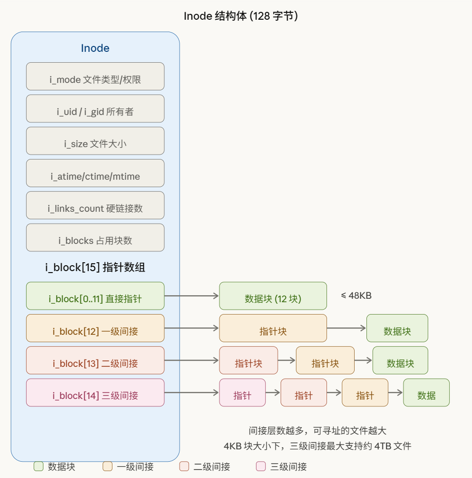
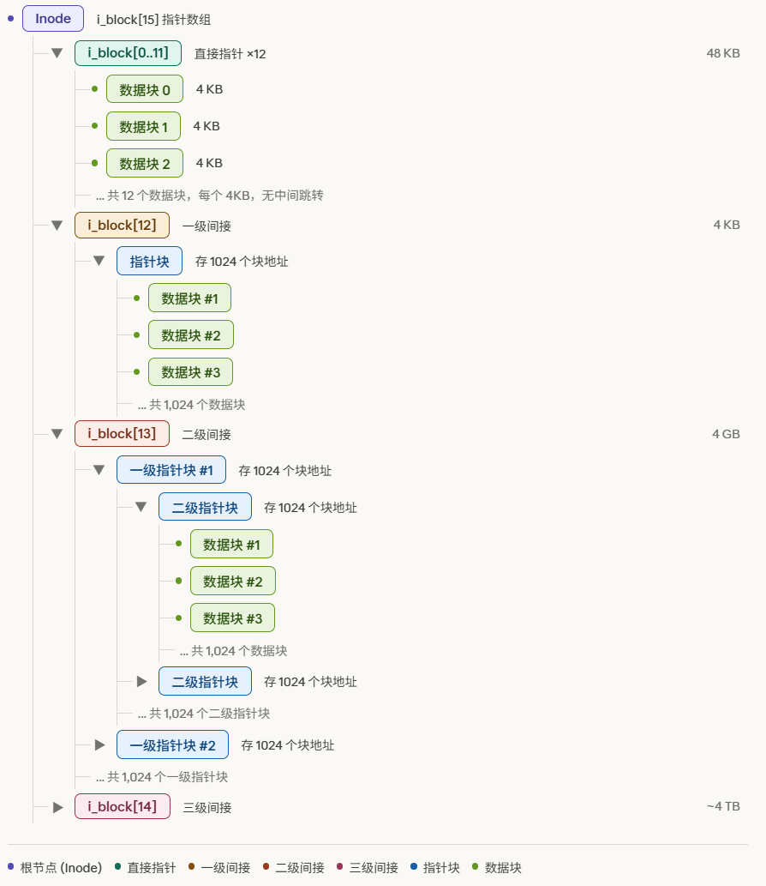
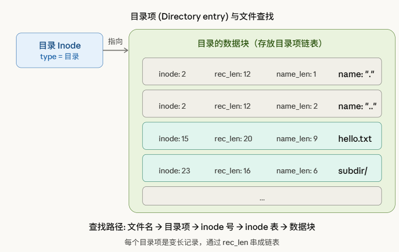

## 自制操作系统（32）：Ext2文件系统驱动——Ext2挂载，超级块解析

上一节我们直接把块设备的数据给了挂载点，其实这是不够的，我们应该多封装一层：

```cpp
struct ext2_data {
    block_device* dev;
    ext2_super_block sb;
};
```

然后我们用这样的方式去挂载包装：

```cpp
        if (bdev_list[i]->fs == file_system::EXT2) {
            ext2_data* data = (ext2_data*)kmalloc(sizeof(ext2_data));
            data->dev = bdev_list[i];
            mounting_point* ret = v_mount(FS_DRIVER::EXT2FS, "/ext2", data);
```

这里要另外提出一个ext2_super_block的原因是，超级块是一个比较频繁被访问的数据块，我们希望把这一段数据缓存到内存里面来。

我们在v_mount里读取出超级块并拷贝到sb去：

```cpp
// 读取超级块，超级块是在0号块之后偏移1024字节处
uint32_t sb_block_num = 1024 / data->dev->block_size;
uint32_t sb_offset = 1024 % data->dev->block_size;
// 获取块大小
void* buffer = kmalloc(data->dev->block_size);
int ret = data->dev->read(data->dev, sb_block_num, buffer);
if (ret < 0) {
    kfree(buffer);
    return -1; // 读取超级块失败
}
ext2_super_block* ext2_sb = reinterpret_cast<ext2_super_block*>((char*)buffer + sb_offset);
data->sb = *ext2_sb;
kfree(buffer);
```

**！！需要非常注意的一个点是；其实超级块的“块”跟“块大小”的“块”不是一个概念，前者是一个逻辑概念，是数据结构的意思，并不等同于后者的物理块的概念**

#### 文件的组织

在ext2文件系统，inode表示一个文件，你可以这么去想：块设备嘛，文件就是以各个小块的形式，像珠子一样落在这个磁盘的各个地方，而inode就是把这些小块串成一条项链的那根线。而且，构成文件的不仅有文件的数据本身，还有文件的“元数据”：文件名、创建日期、权限、创建者...等等。



可以看到，图中的上半部分就是我所说的元数据，而下面就是指向构成这个文件的数据块的数组，这个数组只有15个元素，一个数据块4KB，难道一个文件最多60KB？所以只有前12项会直接指向数据块，后面的三个项会指向指针块，称为一级、二级、三级间接指针：



还有，“项链”本身也是需要组织在一起的，这就是目录的作用，目录本身也是一种文件，只不过它的数据块记录的是它下面的包含着的许多的inode索引：



用这样的“目录包含目录、文件”的结构，整个文件系统的文件数据就会像一棵树一样被组织在一起。所以如果我们想去找到这个文件系统的任何文件，我们就先去找到它的树根目录，然后探索下去。那么“树根目录”怎么找到呢？噢，EXT2规定，inode编号为2的inode就是根目录inode。

```
拓展阅读：更多的特殊inode：
ext2 前几个 inode 的分配是固定的：

inode 0 — 不使用，表示"无效/空"
inode 1 — 坏块文件（bad blocks inode），记录磁盘上的坏扇区
inode 2 — 根目录 /，这是整个文件系统目录树的起点
inode 3 — ACL 索引（早期设计，后来基本未使用）
inode 4 — ACL 数据（同上）
inode 5 — 引导加载器 inode
inode 6 — 未删除目录（undelete directory）
inode 7–10 — 保留

从 inode 11 开始才是普通用户文件和目录可以使用的。超级块中的 s_first_ino 字段记录了第一个非保留 inode 的编号，ext2 中默认就是 11。
```

噢，那我们找到2号inode就好了...慢着，2号inode又存在哪呢？这个是个块设备，那么换句话说，这个inode放在哪个块，在那个块的哪个位置呢？

我们可以先想象一个数组，叫做inode_table，里面的0号索引指向inode1（因为inode0是无效inode，所以我们从1开始算），1号索引指向inode2，...，然后超级块会告诉我们inode的大小，以及我们inode_table是从k号块的最头头开始，比如说，第k号，那我们想知道inode2在哪不就很简单吗？

我们先把inode号减去1得出数组的索引：

idx = node_id - 1;

再把一个块可以存几个inode算出来：

inodes_count_in_each_block = block_size / inode_size;

那我们所在的块就是距离k号块的第floor(idx / inodes_count_in_each_block)个块，偏移量是这个块里面的第idx % inodes_count_in_each_block号inode。

伪代码大概就是下面这样：

```cpp
inode* get_inode_by_id (uint32_t id) {
    if (id == 0) return nullptr;
    uint32_t inode_table_block_id = sb.inode_table; // 这里拿到的是inode_table开始的块号

    size_t inode_size = sb.inode_size;
    size_t block_size = sb.block_size;
    uint32_t inodes_count_in_each_block = block_size / inode_size;

    uint32_t idx = id - 1;
    uint32_t block_idx = idx / inodes_count_in_each_block;
    uint32_t offset = idx % inodes_count_in_each_block;

    void* buffer = kmalloc(block_size);
    read_block(inode_table_block_id + block_idx,  buffer);

    return (static_cast<inode*>(buffer) + offset);
}
```

那么，我们inode_table，也就是存储inode数据的起始块地址就这么乖乖地放在超级块里面吗？这个文件系统的发明者还多想了一步。

以前还是机械硬盘、软盘称霸存储市场的年代，在这么些存储设备里面找文件是有一个物理的代价的，要切磁头，找柱面，要寻道，所以会有一个磁头或者是别的什么东西来回跑的开销，这个文件系统的发明者就想，如果把这个inode_table就做成一个在磁盘的逻辑开头的一系列的块，那对于离这个块比较远的一些文件，如果用户想按顺序打开它们（这是非常有可能的，用户在一段时间有更高的倾向会去访问一个文件附近的那些文件），那这个来回跑的开销就大了。（就好像你在广东的一个城市去走亲访友，要知道某一个人住在哪还得跑回北京去问他住在哪，那你肯定不会太好受）

考虑到这一点，这个发明者把磁盘上的块再组织为一个个“块组”，每个块组组成的块都是逻辑连续的一系列块，而且数量均等（对于最后一个块组，可能会少一些，但是也没有任何inode会指向那些不存在的块，所以无所谓）：


然后在每个块组的开头，会有一个组描述符，里面就存有描述这个块组和里面块的信息，其中就有我们刚刚所说的inode_table了，不过因为是在块组里面，就叫做bg_inode_table了，bg就是block group的意思：


注意：图 14-2 有问题。它把启动块画在块组 0 的外面，好像它是一个独立于块组体系的区域。但实际上：

当块大小是 1024 时，启动块占了第 0 号块，块组 0 从第 1 号块（超级块）开始，这时候说启动块在块组 0"外面"勉强说得通。

但当块大小是 2048 或 4096 时，块组 0 从第 0 号逻辑块就开始了，启动块的那 1024 字节是在块组 0 的第 0 号块里面的，超级块也在里面。这时候启动块是块组 0 的一部分，不是独立在外面的。

所以这张图只适用于块大小恰好是 1024 的情况，但它画成了好像是通用布局，容易让人以为启动块永远独立于块组之外。


我们可以注意到，每个块组的开头都有一个超级块，因为它太重要了，所以我们每个块组都存一份，当作超级块被损坏之后的备份；而且，还都会有一份包含了所有块组的描述符的表，叫做组描述符表，因为它也很重要。

超级块里面就会存着每个块组里面包含多少个inode，组描述表告诉你每个块组的bg_inode_table，于是我们可以这样子去找inode：

（伪代码）

```cpp
inode* get_inode_by_id (uint32_t id) {
    if (id == 0) return nullptr;
    uint32_t inodes_per_group = sb.s_inodes_per_group;
    // 先算算我在哪个组
    uint32_t idx = id - 1;
    
    uint32_t group_idx = idx / inodes_per_group;
    
    // 我们会再讨论怎么取到块组号对应的描述符
    group_description* gd = get_group_description_by_group_idx(group_idx);
    
    uint32_t inode_table_block_id = gd.bg_inode_table; // 这里拿到的是bg_inode_table开始的块号

    size_t inode_size = sb.inode_size;
    size_t block_size = sb.block_size;
    uint32_t inodes_count_in_each_block = block_size / inode_size;

    // 我们还得算一个相对的id，也就是在这个块组里面的id
    uint32_t idx_in_group = idx % inodes_per_group;

    uint32_t block_idx = idx_in_group / inodes_count_in_each_block;
    uint32_t offset = idx_in_group % inodes_count_in_each_block;

    void* buffer = kmalloc(block_size);
    read_block(inode_table_block_id + block_idx,  buffer);

    return (static_cast<inode*>(buffer) + offset);
}
```

关于get_group_description_by_group_idx，在描述符表里面找描述符，其实就是你知道描述符表开始的块id就紧跟在超级块后面，然后你知道每个组描述符的大小，所以？又是一次算块号和算偏移量的过程。这里不再赘述。

#### 说回挂载...

糟糕。差点忘了我们是来讲挂载的了。为什么讲着讲着挂载，这么一大段来讲文件的组织呢？

挂载其实无非就两件事，验证数据有效性，以及缓存一些会经常用到的，一般不会去修改的热点内容，免得我们要用的时候还得去IO端口读。经过上面的介绍，你大概对要缓存什么已经胸有成竹了，比如，最明显的组描述符表里面对于各个组的bg_inode_table，是不是就是一个需要经常读取，而且又不会修改的东西呢？有了这些背景知识，你就知道为什么要，以及怎么可以把它在我们挂载的时候在内存把它的内容缓存起来了。

在挂载的最后，我们最好把根目录的inode也读进内存，因为这个也不容易更改，且比较频繁读取。

```cpp

static int get_inode_by_id (ext2_data* data, uint32_t id, ext2_inode* out_inode) {
    if (id == 0) return -1;
    ext2_super_block& sb = data->sb;
    uint32_t inodes_per_group = sb.s_inodes_per_group;
    // 先算算我在哪个组
    uint32_t idx = id - 1;
    
    uint32_t group_idx = idx / inodes_per_group;
    
    ext2_group_desc& gd = data->gdt[group_idx];
    
    uint32_t inode_table_block_id = gd.bg_inode_table; // 这里拿到的是bg_inode_table开始的块号

    size_t inode_size = sizeof(ext2_inode);
    size_t block_size = data->dev->block_size;
    uint32_t inodes_count_in_each_block = block_size / inode_size;

    // 我们还得算一个相对的id，也就是在这个块组里面的id
    uint32_t idx_in_group = idx % inodes_per_group;

    uint32_t block_idx = idx_in_group / inodes_count_in_each_block;
    uint32_t offset = idx_in_group % inodes_count_in_each_block;

    void* buffer = kmalloc(block_size);
    data->dev->read(data->dev, inode_table_block_id + block_idx,  buffer);
    out_inode = (static_cast<ext2_inode*>(buffer) + offset);
    kfree(buffer);
    return 0;
}

static int mount(mounting_point* mp) {
    // 千里之行，始于足下...
    ext2_data* data = (ext2_data*)mp->data;

    // 读取超级块，超级块是在0号块之后偏移1024字节处
    uint32_t sb_block_num = 1024 / data->dev->block_size;
    uint32_t sb_offset = 1024 % data->dev->block_size;
    void* buffer = kmalloc(data->dev->block_size);
    int ret = data->dev->read(data->dev, sb_block_num, buffer);
    if (ret < 0) {
        kfree(buffer);
        return -1; // 读取超级块失败
    }
    ext2_super_block* ext2_sb = reinterpret_cast<ext2_super_block*>((char*)buffer + sb_offset);
    data->sb = *ext2_sb;
    kfree(buffer);

    ext2_super_block& sb = data->sb;

    // 检查魔数...
    if (sb.s_magic != 0xEF53) {
        return -1;
    }
    // 检查磁盘状态
    // 我们可以不做...
    // sb.s_state...

    // 缓存组描述符表
    data->bg_num = (sb.s_blocks_count + sb.s_blocks_per_group - 1) / sb.s_blocks_per_group;
    data->gdt = (ext2_group_desc*)kmalloc(sizeof(ext2_group_desc) * data->bg_num);

    // 读多少个块才能把所有的块组描述符读出来？
    uint32_t bg_block_num = (data->bg_num * sizeof(ext2_group_desc) + data->dev->block_size - 1) / data->dev->block_size;

    uint32_t gd_idx = 0;

    // 一个块最多可以读出 data->dev->block_size / sizeof(ext2_group_desc) 个组描述符
    uint32_t gd_per_block = (data->dev->block_size / sizeof(ext2_group_desc));
    for (int blk_idx = 0; blk_idx < bg_block_num; ++blk_idx) {
        void* gd_buffer = kmalloc(data->dev->block_size);
        data->dev->read(data->dev, sb_block_num + 1 + blk_idx, gd_buffer); // 组描述符表所在的块紧跟超级块所在的块
        
        for (int i = 0; i < gd_per_block; ++i) {
            data->gdt[gd_idx++] = ((ext2_group_desc*)gd_buffer)[i];
            if (gd_idx == data->bg_num) {
                break;
            }
        }

        kfree(gd_buffer);
    }

    get_inode_by_id(data, 2, &data->root_inode);
    return 0;
}
```

---

下节我们来讲inode解析和打开文件。

