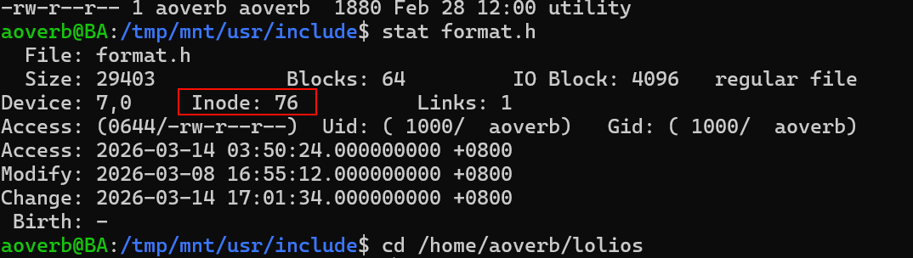
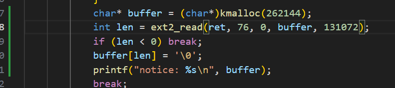
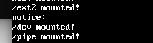
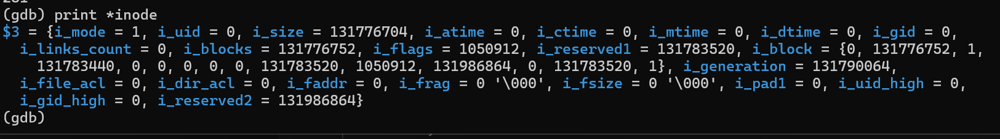
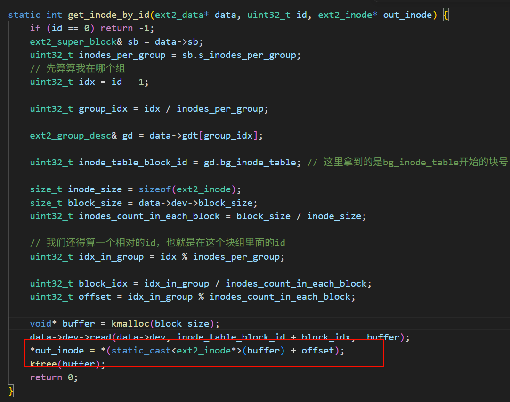
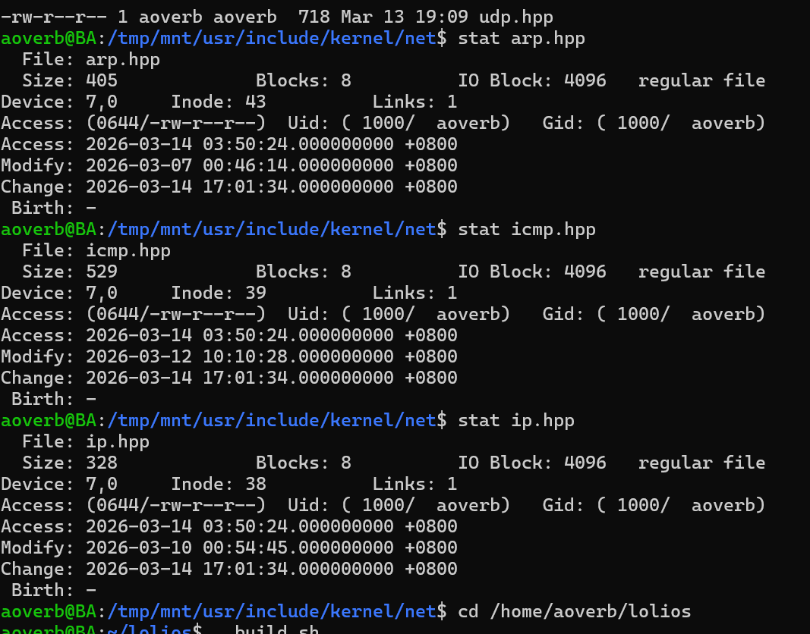
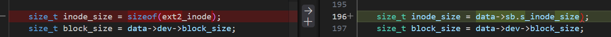
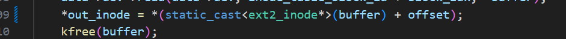
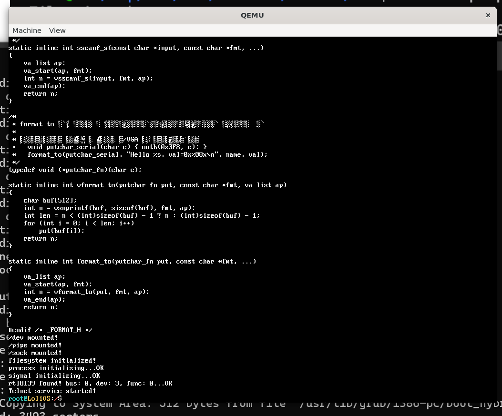

## 自制操作系统（33）：Ext2文件系统驱动——inode解析，打开、读取文件

我们来实现inode的解析和打开、读取文件。

### inode解析

上一节我们已经解析好inode了，这一节我们要实现一个把inode对应的数据块读出来的函数。

读取inode对应的数据内容是一件比较麻烦的事，因为会涉及到块对齐、偏移、多级指针、跨级读取这些事情...我们有必要细细想好，再来做这件事情。

#### 难题

读取这样的文件，以下是我能想到的最棘手的情况：用户给出了一个偏移，在二级指针的某块的中间，而用户给出的长度，又卡在了三级指针的某块的中间...

这个时候，我们不仅要先去定位这两个左右端点对应的是哪个具体的数据块，偏移是多少，还得因为偏移没有块对齐去做特殊处理，还得去找它的下一个数据块是什么，读取的时候还得小心不要超出文件的长度...真的是相当多的边界条件都要小心。

也许我们得先想一个对我们来说友好一点的版本，比如说，我们可以先把”必须满足块对齐“作为一个前提来讨论。

这样的话，我们就可以构建下面这么一个接口：

```cpp
static size_t read_block_in_inode(ext2_data* data, const ext2_inode* inode, uint32_t block_idx, uint32_t block_count, char* buffer);
```

这个接口支持往buffer里面读inode从索引为block_idx的连续block_count个块到buffer里面。这么一看，好像没那么头疼了吧。

接下来我们要采用分治的思想（把大象放进冰箱），来想想块跨越边界要怎么处理..

也许，我们可以把这个任务分成四份，交给专门处理直接、一级、二级、三级的指针块读取函数？这可能是个好主意噢，我们来看看怎么实现：

```cpp
static size_t read_block_in_inode(ext2_data* data, const ext2_inode* inode,
    uint32_t block_idx, uint32_t block_count, char* buffer) {
    uint32_t total_read_count = 0;
    size_t block_size = data->dev->block_size; 
    if (block_idx < 12) {
        uint32_t read_count = (12 - block_idx) < block_count ? (12 - block_idx) : block_count;
        read_direct_block(data, inode, block_idx, read_count, buffer);
        buffer += read_count * block_size;
        block_count -= read_count;
        total_read_count += read_count;
        block_idx = 0;
    } else {
        block_idx -= 12; // 这里重置block_idx，是为了让它成为下面判断的每一级指针的相对数据块
    }
    if (block_count == 0) return total_read_count; // 提高效率

    if (block_idx < data->blocks_in_first_class_pointer) {
        uint32_t read_count = (data->blocks_in_first_class_pointer - block_idx) < block_count ?
            (data->blocks_in_first_class_pointer - block_idx) : block_count;
        read_first_class_block(data, inode, block_idx, read_count, buffer);
        buffer += read_count * block_size;
        block_count -= read_count;
        total_read_count += read_count;
        block_idx = 0;
    } else {
        block_idx -= data->blocks_in_first_class_pointer;
    }
    if (block_count == 0) return total_read_count;

    if (block_idx < data->blocks_in_second_class_pointer) {
        uint32_t read_count = (data->blocks_in_second_class_pointer - block_idx) < block_count ?
            (data->blocks_in_second_class_pointer - block_idx) : block_count;
        read_second_class_block(data, inode, block_idx, read_count, buffer);
        buffer += read_count * block_size;
        block_count -= read_count;
        total_read_count += read_count;
        block_idx = 0;
    } else {
        block_idx -= data->blocks_in_second_class_pointer;
    }
    if (block_count == 0) return total_read_count;

    if (block_idx < data->blocks_in_third_class_pointer) {
        uint32_t read_count = (data->blocks_in_third_class_pointer - block_idx) < block_count ?
            (data->blocks_in_third_class_pointer - block_idx) : block_count;
        read_third_class_block(data, inode, block_idx, read_count, buffer);
        buffer += read_count * block_size;
        block_count -= read_count;
        total_read_count += read_count;
        block_idx = 0;
    } else {
        block_idx -= data->blocks_in_third_class_pointer;
    }
    return total_read_count;
}
```

并且我们在挂载时提前算出每类间接指针可以代表多少个块：

```
    data->blocks_in_first_class_pointer = data->dev->block_size / sizeof(uint32_t);
    data->blocks_in_second_class_pointer = data->dev->block_size / sizeof(uint32_t) * data->blocks_in_first_class_pointer;
    data->blocks_in_third_class_pointer = data->dev->block_size / sizeof(uint32_t) * data->blocks_in_second_class_pointer;
    
```

接下来我们看看怎么实现各级的读取。

#### 直接读

```cpp
void read_direct_block(ext2_data* data, const ext2_inode* inode, uint32_t block_idx,
    uint32_t block_count, char* buffer) {
    size_t block_size = data->dev->block_size;
    for (int i = 0; i < block_count; ++i) {
        uint32_t blk = inode->i_block[block_idx + i];
        if (blk == 0) { // 空洞块，清零即可
            memset(buffer + i * block_size, 0, block_size);
        } else {
            data->dev->read(data->dev, blk, buffer + i * block_size);
        }
    }
    return;
}
```

这里面唯一需要注意的是空洞块的问题。

#### 一级指针

```cpp
void read_first_class_block(ext2_data* data, const ext2_inode* inode, uint32_t block_idx,
    uint32_t block_count, char* buffer) {
    const size_t block_size = data->dev->block_size;
    uint32_t blk = inode->i_block[12]; // 一级指针块
    if (blk == 0) {
        memset(buffer, 0, block_count * block_size);
        return;
    }
    uint32_t* buf = (uint32_t*)kmalloc(block_size);
    if (data->dev->read(data->dev, blk, buf) < 0) {
        // 记录错误
        kfree(buf);
        return;
    }
    for (int j = 0; j < block_count; ++j) { // 读出来的是直接指针
        uint32_t blk = buf[block_idx + j];
        if (blk == 0) {
            memset(buffer + j * block_size, 0, block_size);
        } else {
            data->dev->read(data->dev, blk, buffer + j * block_size);
        }
    }
    kfree(buf);
    return;
}
```

跟直接读差不多，把inode->i_block[12]里面的直接指针读出来即可。

#### 二级指针

到了二级指针，情况突然变得复杂了！

```c++
// 太复杂了..需要用递归重写
void read_second_class_block(ext2_data* data, const ext2_inode* inode, uint32_t block_idx,
    uint32_t block_count, char* buffer) {
    const size_t block_size = data->dev->block_size;
    uint32_t blk = inode->i_block[13]; // 二级指针块
    if (blk == 0) {
        memset(buffer, 0, block_count * block_size);
        return;
    }
    uint32_t* buf = (uint32_t*)kmalloc(block_size);
    if (data->dev->read(data->dev, blk, buf) < 0) {
        // 记录错误
        kfree(buf);
        return;
    }

    uint32_t first_index = (block_idx / data->blocks_in_first_class_pointer); // 先看下开头落在第几个一级指针
    uint32_t first_index_offset = block_idx % data->blocks_in_first_class_pointer; // 再看看在这个指针块的偏移是多少
    uint32_t first_left_blk = buf[first_index]; // 最左端的一级指针
    if (first_left_blk != 0) {
        uint32_t* direct_in_left_blk = (uint32_t*)kmalloc(block_size);
        if (data->dev->read(data->dev, first_left_blk, direct_in_left_blk) < 0) { // 读出最左端一级指针的所有直接指针
            // 记录错误
            kfree(buf);
            kfree(direct_in_left_blk);
            return;
        }

        for (int i = first_index_offset; i < data->blocks_in_first_class_pointer && block_count > 0; ++i) {
            uint32_t drt_buf = direct_in_left_blk[i]; // 直接指针指向的数据块号
            if (drt_buf == 0) {
                memset(buffer, 0, block_size);
            } else if (data->dev->read(data->dev, drt_buf, buffer) < 0) {
                // 记录错误
                kfree(buf);
                kfree(direct_in_left_blk);
                return;
            }
            buffer += block_size;
            --block_count;
            ++block_idx;
        }

        kfree(direct_in_left_blk);
    } else {
        memset(buffer, 0, (data->blocks_in_first_class_pointer - first_index_offset) * block_size);
        buffer += (data->blocks_in_first_class_pointer - first_index_offset) * block_size;
        block_count -= (data->blocks_in_first_class_pointer - first_index_offset);
        block_idx += (data->blocks_in_first_class_pointer - first_index_offset);
    }


    // 再看中间有几个可以完整读取的一级指针块
    uint32_t* mid_blk_buf = (uint32_t*)kmalloc(block_size);
    uint32_t mid_first_num = block_count / data->blocks_in_first_class_pointer;
    for (int i = 0; i < mid_first_num; ++i) {
        uint32_t mid_blk = buf[first_index + 1 + i]; // 最左端的一级指针往右数i + i个块
        if (mid_blk == 0) {
            memset(buffer, 0, data->blocks_in_first_class_pointer * block_size);
            buffer += data->blocks_in_first_class_pointer * block_size;
            continue;
        }
        
        if (data->dev->read(data->dev, mid_blk, mid_blk_buf) < 0) { // 读出当前一级指针块的所有直接指针
            kfree(mid_blk_buf);
            kfree(buf);
            return;
        }
        for (int j = 0; j < data->blocks_in_first_class_pointer; ++j) {
            uint32_t blk = mid_blk_buf[j];
            if (blk == 0) {
                memset(buffer, 0, block_size);
            } else {
                if (data->dev->read(data->dev, blk, buffer) < 0) {
                    kfree(mid_blk_buf);
                    kfree(buf);
                    return;
                }
            }
            buffer += block_size;
        }
        
    }
    kfree(mid_blk_buf);

    block_count -= data->blocks_in_first_class_pointer * mid_first_num;

    // 还有要读的话再看下最右边的
    if (block_count > 0) {
        uint32_t right_index = first_index + mid_first_num + 1;
        uint32_t right_blk = buf[right_index];
        if (right_blk == 0) {
            memset(buffer, 0, block_count * block_size);
            kfree(buf);
            return;
        }
        uint32_t* right_blk_buf = (uint32_t*)kmalloc(block_size);
        if (data->dev->read(data->dev, right_blk, right_blk_buf) < 0) { // 读直接指针
            // 记录错误
            kfree(right_blk_buf);
            kfree(buf);
            return;
        }
        for (int i = 0; i < block_count; ++i) {
            uint32_t blk = right_blk_buf[i];
            if (blk == 0) {
                memset(buffer, 0, block_size);
            } else {
                if (data->dev->read(data->dev, blk, buffer) < 0) {
                    kfree(right_blk_buf);
                    kfree(buf);
                    return;
                }
            }
            buffer += block_size;
        }
        kfree(right_blk_buf);
    }

    kfree(buf);
    return;
}
```

已经写不动三级指针了。

#### 递归思路

这个递归一开始有点困住了我，因为我没注意到其实我往低一级的块传入的块粒度可以就是直接指针块的粒度，一直在钻怎么把子块拆成粒度不等同的左端点不对齐块-中间的大块-右端点不对齐块的牛角尖（写二级指针的后遗症...）。

把block_idx相对地传递到下层，是靠算出child_offset（子块的相对位置），后面读多少、怎么更新值其实都是围绕child_offset做文章。

```cpp
// block_idx是相对于这个块来说的其叶子块（即直接指针块）的索引，block_count粒度也是如此
void read_indirect_block(ext2_data* data, uint32_t cur_block, uint32_t depth, 
    uint32_t block_idx, uint32_t block_count, char* buffer) {
    const size_t block_size = data->dev->block_size;
    if (cur_block == 0) {
        memset(buffer, 0, block_count * block_size);
        return;
    }
    if (depth == 0) { // 直接指针
        data->dev->read(data->dev, cur_block, buffer);
        return;
    }

    uint32_t* buf = (uint32_t*)kmalloc(block_size);
    if (data->dev->read(data->dev, cur_block, buf) < 0) {
        // 记录错误
        kfree(buf);
        return;
    }
    uint32_t child_idx = block_idx / data->block_num[depth - 1];
    while (block_count > 0) { // 读出来的是下一级的指针
        uint32_t child_blk = buf[child_idx];
        uint32_t child_offset = block_idx % data->block_num[depth - 1];
        uint32_t child_readcount = data->block_num[depth - 1] - child_offset;
        child_readcount = child_readcount < block_count ? child_readcount : block_count;
        read_indirect_block(data, child_blk, depth - 1, child_offset, child_readcount, buffer);
        buffer += child_readcount * block_size;
        block_idx += child_readcount;
        block_count -= child_readcount;
        ++child_idx;
    }
    kfree(buf);
    return;
}
```

这样写的话会简洁很多。一开始的read_block_in_inode也做相应更新：

```cpp
static size_t read_block_in_inode(ext2_data* data, const ext2_inode* inode,
    uint32_t block_idx, uint32_t block_count, char* buffer) {
    uint32_t total_read_count = 0;
    const size_t block_size = data->dev->block_size; 
    if (block_idx < 12) {
        uint32_t read_count = (12 - block_idx) < block_count ? (12 - block_idx) : block_count;
        read_direct_block(data, inode, block_idx, read_count, buffer);
        buffer += read_count * block_size;
        block_count -= read_count;
        total_read_count += read_count;
        block_idx = 0;
    } else {
        block_idx -= 12; // 这里重置block_idx，是为了让它成为下面判断的每一级指针的相对数据块
    }
    if (block_count == 0) return total_read_count; // 提高效率

    if (block_idx < data->block_num[1]) {
        uint32_t read_count = (data->block_num[1] - block_idx) < block_count ?
            (data->block_num[1] - block_idx) : block_count;
        read_indirect_block(data, inode->i_block[12], 1, block_idx, read_count, buffer);
        buffer += read_count * block_size;
        block_count -= read_count;
        total_read_count += read_count;
        block_idx = 0;
    } else {
        block_idx -= data->block_num[1];
    }
    if (block_count == 0) return total_read_count;

    if (block_idx < data->block_num[2]) {
        uint32_t read_count = (data->block_num[2] - block_idx) < block_count ?
            (data->block_num[2] - block_idx) : block_count;
        read_indirect_block(data, inode->i_block[13], 2, block_idx, read_count, buffer);
        buffer += read_count * block_size;
        block_count -= read_count;
        total_read_count += read_count;
        block_idx = 0;
    } else {
        block_idx -= data->block_num[2];
    }
    if (block_count == 0) return total_read_count;

    if (block_idx < data->block_num[3]) {
        uint32_t read_count = (data->block_num[3] - block_idx) < block_count ?
            (data->block_num[3] - block_idx) : block_count;
        read_indirect_block(data, inode->i_block[14], 3, block_idx, read_count, buffer);;
        block_count -= read_count;
        total_read_count += read_count;
        block_idx = 0;
    } else {
        block_idx -= data->block_num[3];
    }
    return total_read_count;
}
```

#### 从块粒度到字节粒度的读取

现在我们可以看看怎么读取字节粒度的数据了。

思路是，把左边不对齐的块单独读出来写入buffer——增加偏移值——读完中间的完整块——把右边不对齐的块读出来写入buffer。

我们按这个思路来实现一个read函数吧。

```cpp
int read(mounting_point* mp, uint32_t inode_id, uint32_t offset, char* buffer, uint32_t size) {
    ext2_data* data = (ext2_data*)mp->data;
    const size_t block_size = data->dev->block_size; 
    ext2_inode* inode = static_cast<ext2_inode*>(kmalloc(sizeof(ext2_inode)));
    if (get_inode_by_id(data, inode_id, inode) < 0) {
        kfree(inode);
        return -1;
    }

    if (offset >= inode->i_size) {
        kfree(inode);
        return 0;
    }

    if (offset + size > inode->i_size) {
        size = inode->i_size - offset;
    }

    uint32_t read_size = size;

    char* tmp_block_buffer = static_cast<char*>(kmalloc(block_size));
    // 读左端点块
    if (offset % block_size != 0) {
        int left_block = offset / block_size;
        read_block_in_inode(data, inode, left_block, 1, tmp_block_buffer);
        int left_read_size = size < block_size - (offset % block_size) ? size : block_size - (offset % block_size);
        memcpy(buffer, tmp_block_buffer + (offset % block_size), left_read_size);
        offset += left_read_size;
        buffer += left_read_size;
        size -= left_read_size;
    }
    
    // 读中间的完整块
    int mid_block = offset / block_size;
    int mid_block_count = size / block_size;
    read_block_in_inode(data, inode, mid_block, mid_block_count, buffer);
    offset += mid_block_count * block_size;
    buffer += mid_block_count * block_size;
    size -= mid_block_count * block_size;

    // 读右端点块
    if (size != 0) {
        int right_block = mid_block + mid_block_count;
        read_block_in_inode(data, inode, right_block, 1, tmp_block_buffer);
        memcpy(buffer, tmp_block_buffer, size);
    }
    kfree(tmp_block_buffer);
    kfree(inode);
    return read_size;
}
```



拉出来溜溜：





...啥也没有？



inode数据不正常。



这里之前没有把值拷贝过去，现在是改好了的版本。

但是后面又发现我指定的文件读不出来，还会发生拿77拿到了39号,拿75拿到了38号的诡异情况，看了下这种可能就是inode大小没拿对导致的：





在ext2后面的更新版本中，inode的大小是会被动态调整的...要从超级块里面拿取。

修改后，又发生了现在读77读到的是71，读79读到的是72的问题...



噢，这里忘改了。这里的offset计算还是按我的结构体大小来的，要像上面那样改下。改完之后没问题了：



### 块缓存

我们可以用已有的哈希表+双向链表来把io读换成cache_read。

下面是一个使用LRU算法的示例：

```cpp

constexpr uint32_t CACHE_ENRTY_COUNT = 40;

struct cache_entry {
    int block_no;
    char* data; // 块数据
    cache_entry* prev;
    cache_entry* next;
};

struct cache_data {
    cache_entry entry[CACHE_ENRTY_COUNT];
    std::unordered_map<int, cache_entry*> map;
    ext2_data* mp_data;
    cache_entry* head;
    spinlock cacheLock;
};

void detach(cache_entry* item) {
    if (item->prev) item->prev->next = item->next;
    if (item->next) item->next->prev = item->prev;
}

void insert_into_head(cache_data& cache_data, cache_entry* recently_used) {
    if (recently_used == cache_data.head) return;
    detach(recently_used);
    cache_data.head->prev->next = recently_used;
    recently_used->prev = cache_data.head->prev;
    cache_data.head->prev = recently_used;
    recently_used->next = cache_data.head;
    cache_data.head = recently_used;
}

int cache_read(cache_data& cache_data, int block_no, void* block_buffer) {
    SpinlockGuard guard(cache_data.cacheLock);
    auto itr = cache_data.map.find(block_no);
    if (itr != cache_data.map.end()) {
        memcpy(block_buffer, itr->second->data, cache_data.mp_data->dev->block_size);
        insert_into_head(cache_data, itr->second);
        return 0;
    }

    if (cache_data.mp_data->dev->read(cache_data.mp_data->dev, block_no, block_buffer) < 0) {
        return -1;
    }

    // 把队列里面最近没使用的记录拿出来换成自己的
    cache_entry* least_rused = cache_data.head->prev;
    detach(least_rused);
    memcpy(least_rused->data, block_buffer, cache_data.mp_data->dev->block_size);
    cache_data.map.erase(least_rused->block_no);
    least_rused->block_no = block_no;
    cache_data.map[block_no] = least_rused;
    insert_into_head(cache_data, least_rused);
    return 0;
}

void init_cache(ext2_data* mp_data) {
    mp_data->cache_data = new (kmalloc(sizeof(cache_data))) cache_data();
    cache_data& cache_data = *(mp_data->cache_data);
    cache_data.mp_data = mp_data;
    cache_data.head = &(cache_data.entry[0]);
    for (int i = 0; i < CACHE_ENRTY_COUNT; ++i) {
        cache_data.entry[i].prev = &(cache_data.entry[(i - 1 + CACHE_ENRTY_COUNT) % CACHE_ENRTY_COUNT]);
        cache_data.entry[i].next = &(cache_data.entry[(i + 1) % CACHE_ENRTY_COUNT]);
        cache_data.entry[i].data = ((char*)kmalloc(mp_data->dev->block_size));
        cache_data.entry[i].block_no = -1;
    }
}
```

---

下节我们来解析路径。