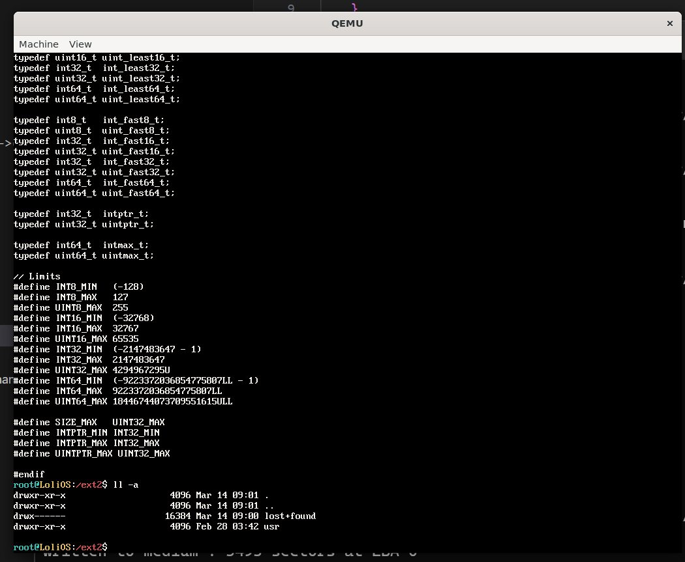

## 自制操作系统（34）：Ext2文件系统驱动——目录遍历，路径分量解析，块/inode分配器，缓存刷新

我们先来实现一个找到目录inode下指定文件名的inode的函数dir_lookup。

上一节说过，目录项也是以一定的不定长结构存储于目录文件的数据块的，其组织单元如下：

```cpp
struct ext2_dir_entry {
    uint32_t inode;
    uint16_t rec_len;
    uint8_t  name_len;
    uint8_t  file_type;   // 1=普通文件, 2=目录, 7=符号链接 ...
    char     name[];      // 不以 \0 结尾！
};
```

dir_lookup:

```cpp
int dir_lookup(ext2_data* data, uint32_t inode_id, const char* name, int insist_type = -1) {
    if (inode_id == 0) return -1;
    const size_t block_size = data->dev->block_size; 
    ext2_inode* inode = static_cast<ext2_inode*>(kmalloc(sizeof(ext2_inode)));
    if (get_inode_by_id(data, inode_id, inode) < 0) {
        kfree(inode);
        return -1;
    }

    uint32_t offset = 0;
    char* tmp_block_buffer = static_cast<char*>(kmalloc(block_size));
    while (offset < inode->i_size) {
        read_block_in_inode(data, inode, offset / block_size, 1, tmp_block_buffer);
        ext2_dir_entry* entry = reinterpret_cast<ext2_dir_entry*>(tmp_block_buffer + offset % block_size);
        if (entry->rec_len == 0) break;
        if (strlen(name) == entry->name_len && strncmp(name, entry->name, strlen(name)) == 0) {
            int inode_num = entry->inode;
            int inode_file_type = entry->file_type;
            kfree(inode);
            kfree(tmp_block_buffer);
            return (insist_type == -1 || insist_type == inode_file_type) ? inode_num : -2;
        }
        offset += entry->rec_len;
    }
    kfree(inode);
    kfree(tmp_block_buffer);
    return 0;
}
```

值得注意的是insist_type这个参数，是用来寻找调用者指定类型的文件的。这在后面我们实现路径解析的时候很有用：

```cpp
int relative_lookup(ext2_data* data, uint32_t inode_id, const char* path) {
    if (strlen(path) == 0 || inode_id == 0) return inode_id;
    const size_t block_size = data->dev->block_size; 
    if (path[0] == '/') ++path;
    int par_node = inode_id;
    char name[255];
    int name_len = 0;
    for (int i = 0; i < strlen(path) + 1; ++i) {
        if (path[i] == '/' || path[i] == '\0') {
            if (name_len == 0) break;
            name[name_len++] = '\0';
            par_node = dir_lookup(data, par_node, name, path[i] == '/' ? FILE_TYPE_DIR : -1);
            if (par_node <= 0) break;
            name_len = 0;
        } else {
            name[name_len++] = path[i];
        }
    }
    return par_node;
}
```

你真的不需要更多东西了。现在我们可以实现Ext2的只读版驱动了！

挑几个有趣的函数来讲。

#### stat

```cpp

int stat(mounting_point* mp, const char* path, file_stat* out) {
    ext2_data* data = (ext2_data*)mp->data;
    if (strcmp(path, "/") == 0) {
        out->group_id = (data->root_inode.i_gid_high << 16) | data->root_inode.i_gid;
        out->owner_id = (data->root_inode.i_uid_high << 16) | data->root_inode.i_uid;
        out->size = data->root_inode.i_fsize;
        out->mode = data->root_inode.i_mode;
        out->last_modified = data->root_inode.i_mtime;
        out->type = 0;
        return 0;
    }
    const size_t block_size = data->dev->block_size; 
    ext2_inode* inode = static_cast<ext2_inode*>(kmalloc(sizeof(ext2_inode)));
    int inode_id = relative_lookup(data, ROOT_INODE_NO, path);
    if (inode_id <= 0) return -1;
    if (get_inode_by_id(data, inode_id, inode) < 0) {
        kfree(inode);
        return -1;
    }
    out->group_id = (inode->i_gid_high << 16) | inode->i_gid;
    out->size = inode->i_size;
    out->mode = inode->i_mode;
    out->last_modified = inode->i_mtime;
    out->name[0] = '\0';
    out->owner_name[0] = '\0';
    out->group_name[0] = '\0';
    out->owner_id = (inode->i_uid_high << 16) | inode->i_uid;
    out->type = (inode->i_mode & 0xF000) >> 12 == MODE_FTYPE_DIR ? 0 : 1;
    kfree(inode);
    return 0;
}
```

stat里面的出参out，由于Linux没有像tarfs那样记录这么多的信息，很多项我们都只能先填空，或者说我们可以把gid, uid转成文字后天上去。

#### readdir

```cpp
int readdir(mounting_point* mp, uint32_t inode_id, uint32_t offset, dirent* out) {
    if (inode_id == 0) return -1;
    ext2_data* data = (ext2_data*)mp->data;
    const size_t block_size = data->dev->block_size; 
    ext2_inode* inode = static_cast<ext2_inode*>(kmalloc(sizeof(ext2_inode)));
    if (get_inode_by_id(data, inode_id, inode) < 0) {
        kfree(inode);
        return -1;
    }
    
    uint32_t read_offset = 0;
    char* tmp_block_buffer = static_cast<char*>(kmalloc(block_size));
    while (read_offset < inode->i_size) {
        read_block_in_inode(data, inode, read_offset / block_size, 1, tmp_block_buffer);
        ext2_dir_entry* entry = reinterpret_cast<ext2_dir_entry*>(tmp_block_buffer + read_offset % block_size);
        if (entry->rec_len == 0) break;
        if (entry->inode != 0 && offset-- == 0) {
            out->inode = entry->inode;
            strncpy(out->name, entry->name, entry->name_len);
            out->name[entry->name_len] = '\0';
            out->type = entry->file_type;
            kfree(inode);
            kfree(tmp_block_buffer);
            return 1;
        }
        read_offset += entry->rec_len;
    }
    kfree(inode);
    kfree(tmp_block_buffer);
    return 0;
}
```

还是一贯的n^2遍历，因为每次都要从头开始去到当前的offset，比没有强吧。

#### 效果



适配后的效果如上图。感觉不错！

至此，Ext2的只读部分已经完成。接下来我们来看看怎么让系统支持写入。

### 块与inode分配器

我们接着来写一个块和inode的分配器，这是我们支持写入的基础组件。

#### bitmap


在每个块组的组描述符后面都会紧跟着一个块的数据位图和inode位图，位图的作用就是，你把整个位图的数据用二进制表示，然后如果从左到右数第n位是1，就代表第n个块/inode已被占用，反之则没有，我们的分配器就是用于在位图里面找出空闲的块或inode，返回对应的块号或inode号码，还支持反过来根据块号或inode号码，去释放对应的位图标记。

位图还是相当能打的，假设一个块占1024字节，一个块的位图可以用来标记7个多G的空间，八百多万个inode，属于经典的花小钱办大事。

#### 找空闲块

找空闲块其实就是遍历各个块组，首先看看这个块组的组描述符，查看可用块或inode的计数，确认非0后就可以在这个组的数据位图找空闲块了；

找到之后，把对应的位标记1，并更新对应组描述符的空闲块计数，以及超级块也有一个空闲块计数，别忘了更新；


读位图的时候，如果用cache_read读，在把位图读进缓存后，会对缓存数据进行一次memcpy再返回给用户，不如直接修改缓存的数据高效，所以有必要再写一个直接返回缓存数据指针的函数：

```cpp
shared_ptr<char> get_cache_ptr(cache_data& cache_data, int block_no) {...}
```

```cpp
// 注意：每次单次、批量调用alloc/free之后，需要调用flush metadata刷新元数据里面的块计数/inode计数
int block_alloc(ext2_data* data) {
    const size_t block_size = data->dev->block_size; 
    for (int i = 0; i < data->bg_num; ++i) {
        ext2_group_desc& gd = data->gdt[i];
        if (gd.bg_free_blocks_count == 0) continue;
        shared_ptr<char> cache_ptr = get_cache_ptr(*data->cache_data, gd.bg_block_bitmap);
        for (int j = 0; j < block_size; ++j) {
            if (cache_ptr.get()[j] == 0xFF) continue;
            // 找到了空闲的块
            // 下面找到最低的0在哪个位置
            int pos =  __builtin_ctz(~cache_ptr.get()[j]);
            cache_ptr.get()[j] |= (1 << pos);
            taint(*data->cache_data, gd.bg_block_bitmap);
            --gd.bg_free_blocks_count;
            --data->sb.s_free_blocks_count;
            return (i * data->sb.s_blocks_per_group +
            j * 8 + pos +
            data->sb.s_first_data_block);
        }
    }
    return -1;
}

void block_free(ext2_data* data, int block_no) {
    // block_no反推所在组
    if (block_no == -1) return;
    block_no -= data->sb.s_first_data_block;
    int grp_no = block_no / data->sb.s_blocks_per_group;
    int offset = (block_no % data->sb.s_blocks_per_group) / 8;
    int bit_pos = (block_no % data->sb.s_blocks_per_group) % 8;
    ext2_group_desc& gd = data->gdt[grp_no];
    shared_ptr<char> cache_ptr = get_cache_ptr(*data->cache_data, gd.bg_block_bitmap);
    cache_ptr.get()[offset] &= ~(1 << bit_pos);
    ++gd.bg_free_blocks_count;
    ++data->sb.s_free_blocks_count;
    taint(*data->cache_data, gd.bg_block_bitmap);
}
```

#### 找空闲inode

与找空闲块大同小异，要记得我们给用户的inode号是比inode的索引多了1的。

#### 元数据刷新

```cpp
void flush_metadata(ext2_data* data) {
    // 写元数据不走缓存
    // 刷新超级块
    void* sb_buffer = kmalloc(data->dev->block_size);
    data->dev->read(data->dev, data->sb_block_num, sb_buffer);
    memcpy((char*)sb_buffer + data->sb_offset, &data->sb, sizeof(ext2_super_block));
    data->dev->write(data->dev, data->sb_block_num, sb_buffer);
    kfree(sb_buffer);
    // 刷新组描述符
    uint32_t bg_block_num = (data->bg_num * sizeof(ext2_group_desc) + data->dev->block_size - 1) / data->dev->block_size;

    // 一个块最多可以读出 data->dev->block_size / sizeof(ext2_group_desc) 个组描述符
    uint32_t gd_per_block = (data->dev->block_size / sizeof(ext2_group_desc));
    
    for (int blk_idx = 0; blk_idx < bg_block_num; ++blk_idx) {
        data->dev->write(data->dev, data->sb_block_num + 1 + blk_idx, (void*)&data->gdt[blk_idx * gd_per_block]); // 组描述符表所在的块紧跟超级块所在的块
    }
}
```

元数据刷新不走缓存，这样做会高效一点，因为我不想这些修改得并不频繁的元数据块占用缓存的槽位。

#### 脏位与缓存刷新

由于我们现在已经用上了块缓存，而且我们已经开始涉及修改数据，且修改的数据都是缓存的块，我们可以给缓存的块加上一个脏位来标记这个块的数据是否需要写回到磁盘。

```cpp
struct cache_entry {
    int block_no;
    char* data; // 块数据
    cache_entry* prev;
    cache_entry* next;
    bool dirty; // 是否需要写回
};
```

然后我们可以构造一个flush函数，把指定的缓存中的脏块写回到磁盘。这个函数可以在我们每次写入数据之后调用，也可以在块缓存要被顶替时调用，很有用的一个函数。

```cpp
void flush_block(cache_data& cache_data, cache_entry* cache) {
    if (cache->block_no == -1 || !cache->dirty) return;
    cache_data.mp_data->dev->write(cache_data.mp_data->dev, cache->block_no, cache->data);
}

...

// 把队列里面最近没使用的记录拿出来换成自己的
cache_entry* least_rused = cache_data.head->prev;
detach(least_rused);
// 写回到磁盘
flush_block(cache_data, least_rused);
memcpy(least_rused->data, block_buffer, cache_data.mp_data->dev->block_size);
cache_data.map.erase(least_rused->block_no);
```

还有一个用于标记脏位的函数：

```cpp
void taint(cache_data& cache_data, int block_no) {
    SpinlockGuard guard(cache_data.cacheLock);
    const auto& itr = cache_data.map.find(block_no);
    if (itr == cache_data.map.end()) {
        return;
    }
    itr->second->dirty = true;
}
```

#### 缓存写回策略

缓存何时写回到磁盘也是一件值得讨论的事情。目前而言，我们只在缓存被替换的时候写回到磁盘，而调用上面的alloc/free系列函数之后，是否要马上刷新块数据和元数据呢，我们将在下一篇结合实际实现去讨论。

---

下一节我们来实现一些文件修改相关的基础设施函数以及会用到它们的写入函数。
