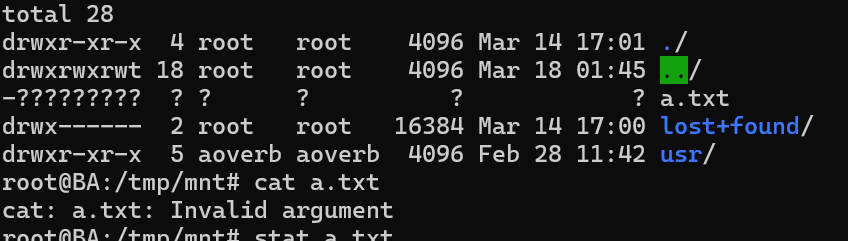
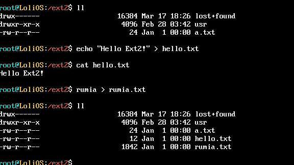
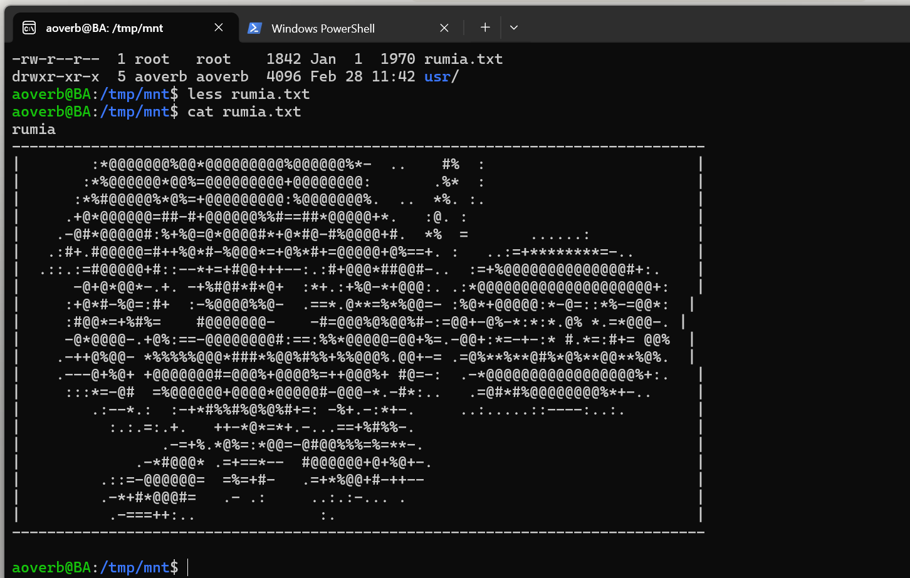

## 自制操作系统（35）：Ext2文件系统驱动——写入支持

```
这篇文章并不完整...正在建设中。
```

有了inode分配器之后，我们只是能找到新的写入空间，里面的内容（即inode）还需要我们写一个新的函数来初始化。

inode包含两部分，一部分是元数据，另一部分是数据块。

我们先来实现一个更新inode元数据的函数：

#### set_inode_by_id

其实就是get_inode_by_id的改版，把buffer里面指定的inode内容改下，把这个缓存标成脏的就可以了。

我们再来实现一个给指定inode追加一个数据块的函数：

#### static size_t append_block_in_inode(ext2_data* data, ext2_inode* inode,

  uint32_t block_no) 

一开始本来想写入追加块的函数的，后面发现，有一种文件叫稀疏文件，我去...


#### // 在insert_idx插入一个指定的物理块，如果这个地方已经有一个物理块，函数返回-1

static size_t insert_block_in_inode(ext2_data* data, ext2_inode* inode,

  uint32_t block_no, uint32_t insert_idx)

思想跟read_block_in_inode是一样的，只不过没有它复杂，找到你要插入的位置位于哪级指针，分情况处理。

代码又长又无聊...

#### 目录项插入

```cpp
struct ext2_dir_entry {
    uint32_t inode;
    uint16_t rec_len;
    uint8_t  name_len;
    uint8_t  file_type;   // 1=普通文件, 2=目录, 7=符号链接 ...
    char     name[];      // 不以 \0 结尾！
};
```

其实就是把这几项填好，填入一个inode的数据块里面。

实际上我们缺少一个获取inode指定逻辑块对应物理块的函数。

#### open

接下来我们可以来实现open了。

我们



诡异的现象...

后面发现是CHAR的问题。

#### 效果



成功实现了可写入的Ext2驱动！



#### unlink, mkdir

---

我们得Ext2文件系统之旅在此告一段落。下一节，让我们来移植一个文本编辑软件——kilo。