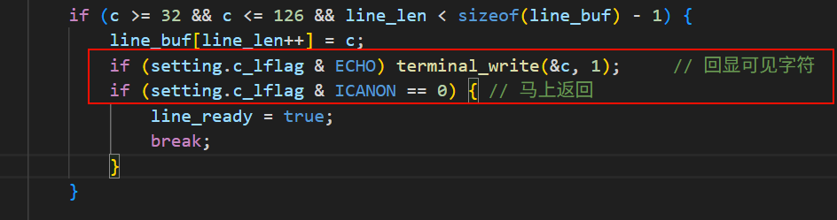

## 自制操作系统（36）：kilo移植，tty能力加强

```
这篇文章并不完整...正在建设中。
```

今天我们来给我们的操作系统移植一个文本编辑器，并借此加强我们的tty能力。

#### kilo移植

kilo项目地址：https://github.com/antirez/kilo

#### 补全缺少的头文件

kilo需要这个头文件来开关我们控制台的回显和逐字符响应功能。我们可以让AI帮我们写一个头文件，让我们自己去实现。

#### ioctl标准化

我们之前的ioctl是传fd, cmd 和args，标准的ioctl做法是（几乎是）把字符串形式的cmd换成数字表示的request。

#### truncate

kilo要求我们实现截断功能（其实早该实现了...）

#### ioctl实现与VT100状态机

#### termios

termios = **term**inal **i**nput/**o**utput **s**ettings，是POSIX标准的终端输入输出配置，是一套配置规范。

termios由四个flag组成：

```cpp
struct termios {
    tcflag_t c_iflag;     /* 输入模式 */
    tcflag_t c_oflag;     /* 输出模式 */
    tcflag_t c_cflag;     /* 控制模式 */
    tcflag_t c_lflag;     /* 本地模式 */
    cc_t     c_cc[NCCS];  /* 控制字符 */
};
```

`struct termios` 里的四个 flag 字段对应终端数据流的四个阶段：

- `c_iflag` — **i**nput，数据从键盘进来时怎么预处理（比如要不要把回车转成换行）
- `c_oflag` — **o**utput，数据往屏幕输出时怎么后处理（比如要不要在换行前自动加回车）
- `c_cflag` — **c**ontrol，硬件控制参数（波特率、数据位数，串口时代的遗产）
- `c_lflag` — **l**ocal，本地终端行为（要不要回显、要不要行缓冲、要不要响应 Ctrl+C）

而用户会通过用户接口`tcsetattr`和`tcgetattr`来修改或获取我们控制台的配置，配置会在我们console_read或write时派上用场。我们先来看看怎么去响应用户接口`tcsetattr`和`tcgetattr`。

#### tcsetattr, tcgetattr

```cpp
int tcgetattr(int fd, struct termios *t) {
    return ioctl(fd, TCGETS, t);
}

int tcsetattr(int fd, int action, const struct termios *t) {
    unsigned long req;
    switch (action) {
    case TCSANOW:   req = TCSETS;  break;
    case TCSADRAIN: req = TCSETSW; break;
    case TCSAFLUSH: req = TCSETSF; break;
    default:        return -1;
    }
    return ioctl(fd, req, (void*)t);
}
```

用户侧的调用很简单，本质上是在调用我们console（控制台设备文件）的ioctl接口。可以看到上面一些大写的字符串就是它的request。我们来到console_ioctl，来响应这些请求：

#### 输入配置

