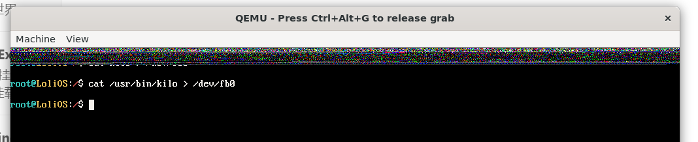
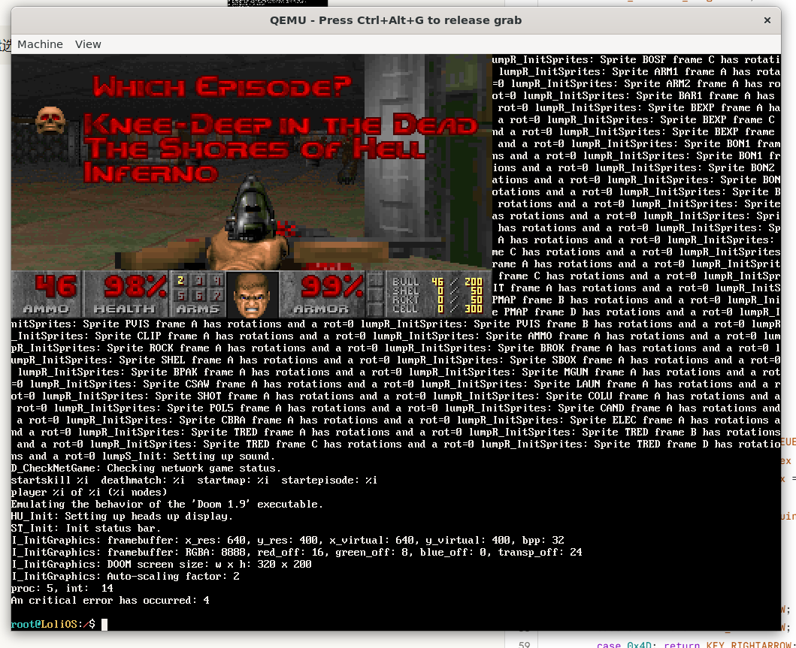
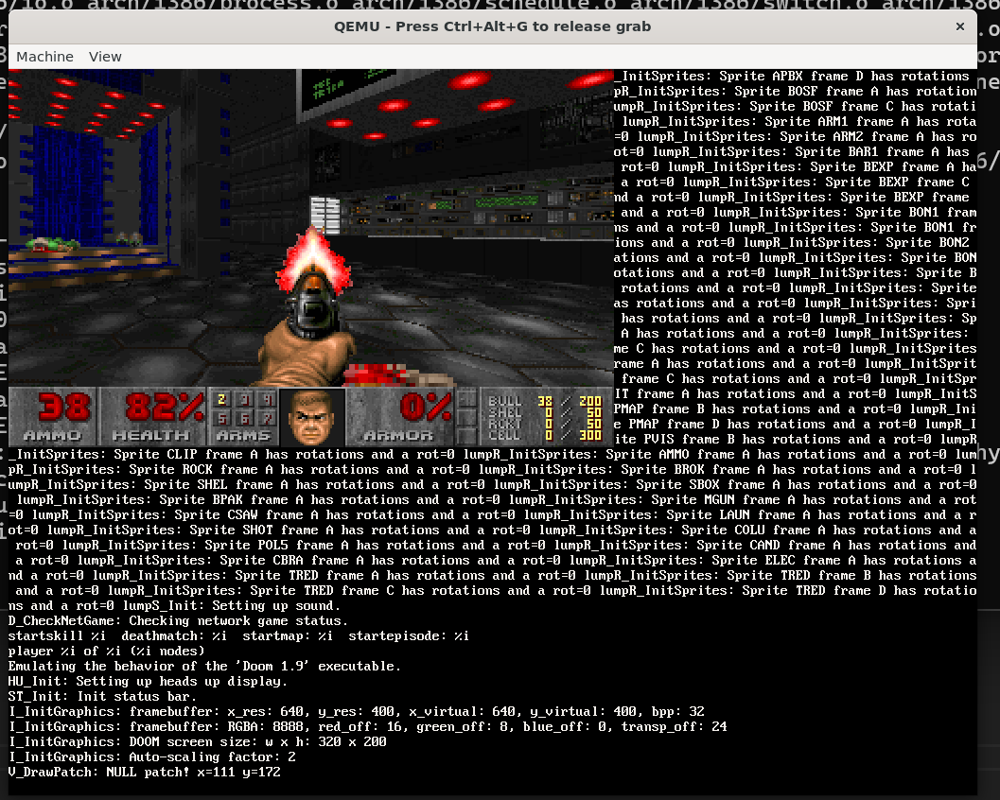

## 自制操作系统（38）：Doom

```
这篇文章并不完整...正在建设中。
```

#### 实现lseek

#### fb0设备文件

fb_addr注意要转成8位的。

可以看到顶部的像素发生了微妙的转变。



#### /dev/kbd 键盘设备文件


#### FILE缓冲区

#### 数学库

#### C兼容性



### And it runs doom!

